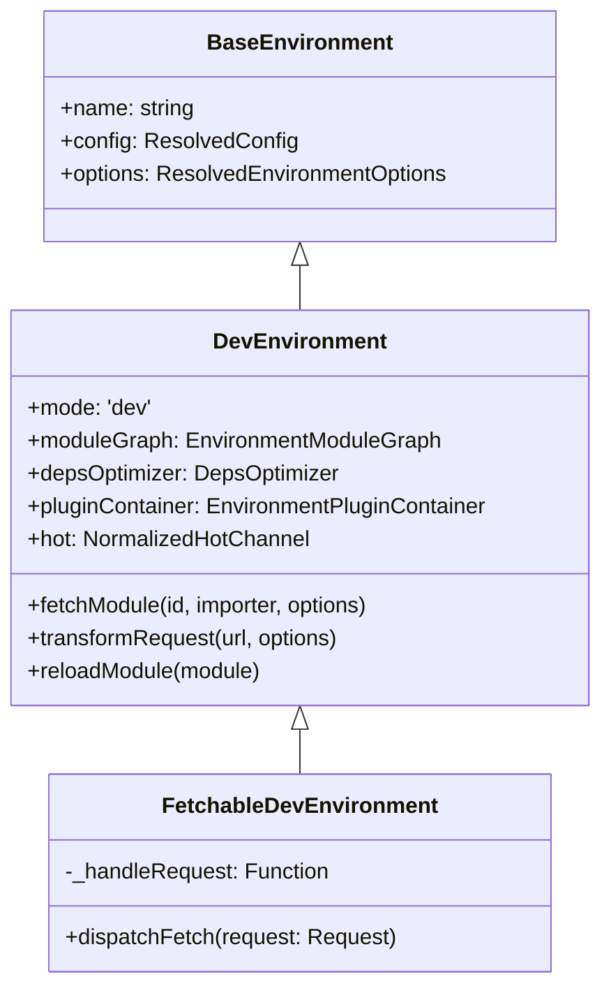
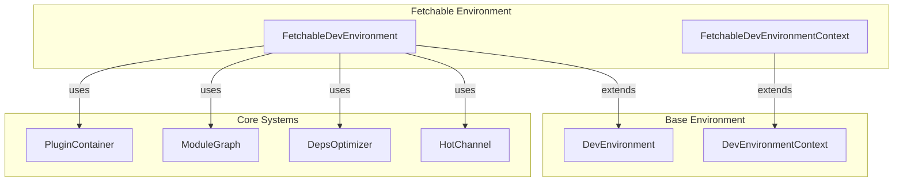
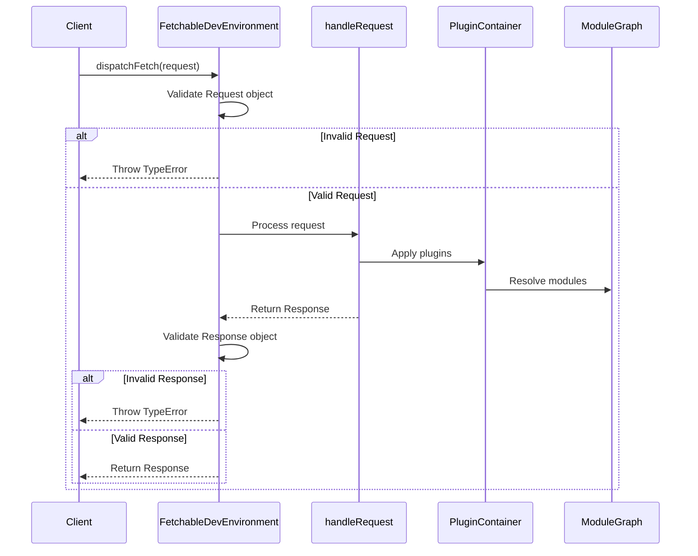

# Fetchable Environment Module

The fetchable-environment module provides a specialized development environment that enables HTTP request/response handling within Vite's development server. This module extends the base development environment to support fetch-based module loading and processing, making it suitable for environments that require HTTP-like communication patterns.

## Overview

The fetchable environment is designed to handle modules and resources through a request/response paradigm, similar to how web servers handle HTTP requests. This approach is particularly useful for:

- Server-side rendering (SSR) environments
- Edge computing platforms
- Custom module loading scenarios
- Environments that require HTTP-like request handling

## Core Components

### FetchableDevEnvironment

The main class that extends `DevEnvironment` to provide fetch-based request handling capabilities.

**Key Features:**
- Extends the base `DevEnvironment` with HTTP request/response handling
- Provides a `dispatchFetch` method for processing requests
- Validates Request/Response objects for type safety
- Integrates with the existing Vite plugin system and module graph

**Constructor Parameters:**
- `name`: Environment identifier
- `config`: Resolved Vite configuration
- `context`: Fetchable development environment context

### FetchableDevEnvironmentContext

Interface that extends `DevEnvironmentContext` with fetch-specific requirements.

**Key Properties:**
- `handleRequest`: Function that processes incoming requests and returns responses
- Inherits all properties from `DevEnvironmentContext`

## Architecture

### Class Hierarchy



### Module Integration



## Request Flow

### Dispatch Process



## Factory Functions

### createFetchableDevEnvironment

Creates a new fetchable development environment instance with validation.

**Validation Steps:**
1. Checks for global `Request` and `Response` objects
2. Validates that `handleRequest` function is provided
3. Returns configured `FetchableDevEnvironment` instance

### isFetchableDevEnvironment

Type guard function to check if an environment is a `FetchableDevEnvironment`.

## Error Handling

The module implements strict type validation for Request/Response objects:

- **Missing globals**: Throws `TypeError` if `Request`/`Response` are undefined
- **Missing handler**: Throws `TypeError` if `handleRequest` is not provided
- **Invalid request**: Throws `TypeError` if non-Request object is passed to `dispatchFetch`
- **Invalid response**: Throws `TypeError` if `handleRequest` doesn't return a Response

## Usage Patterns

### Basic Setup

```typescript
const environment = createFetchableDevEnvironment('ssr', config, {
  handleRequest: async (request) => {
    // Process the request
    const response = await processRequest(request)
    return new Response(response.body, {
      status: response.status,
      headers: response.headers
    })
  }
})
```

### Request Processing

```typescript
// Dispatch a request
const request = new Request('/api/data', {
  method: 'GET',
  headers: { 'Content-Type': 'application/json' }
})

const response = await environment.dispatchFetch(request)
const data = await response.json()
```

## Integration with Vite Ecosystem

### Plugin System Integration

The fetchable environment integrates with Vite's plugin system through the inherited `pluginContainer`, allowing plugins to:
- Intercept and transform requests
- Modify responses
- Add custom headers and metadata
- Implement authentication and authorization

### Module Graph Integration

Works with the `EnvironmentModuleGraph` to:
- Track module dependencies
- Handle HMR updates
- Resolve module URLs
- Manage module invalidation

### Hot Module Replacement

Supports HMR through the `hot` channel, enabling:
- Live updates during development
- Module reloading
- Error boundary handling
- Client-server communication

## Dependencies

### Direct Dependencies
- [dev-environment](dev-environment.md): Base development environment functionality
- [config](config.md): Configuration resolution and management
- [module-graph](module-graph.md): Module dependency tracking
- [hmr](hmr.md): Hot module replacement capabilities

### Indirect Dependencies
- [plugin-container](plugin-container.md): Plugin system integration
- [transform-request](transform-request.md): Request transformation pipeline
- [optimizer](optimizer.md): Dependency optimization

## Best Practices

### Request Handler Implementation

1. **Always return Response objects**: Ensure your `handleRequest` function returns valid Response instances
2. **Handle errors gracefully**: Use try-catch blocks and return appropriate HTTP status codes
3. **Set proper headers**: Include content-type and caching headers as needed
4. **Validate input**: Check request method, headers, and body before processing

### Performance Considerations

1. **Cache responses**: Implement caching strategies for frequently requested resources
2. **Stream large responses**: Use streaming for large payloads to reduce memory usage
3. **Optimize module resolution**: Leverage the module graph for efficient dependency resolution
4. **Use dependency optimization**: Enable the deps optimizer for faster development

### Security Considerations

1. **Validate request origins**: Check request sources in production environments
2. **Sanitize input**: Clean request paths and query parameters
3. **Implement rate limiting**: Prevent abuse through request throttling
4. **Use HTTPS**: Ensure secure communication in production

## Troubleshooting

### Common Issues

1. **"FetchableDevEnvironment requires a global `Request` and `Response` object"**
   - Ensure your runtime environment supports the Fetch API
   - Consider polyfills for older environments

2. **"FetchableDevEnvironment requires a `handleRequest` method"**
   - Provide a valid `handleRequest` function in the context
   - Check function signature matches expected type

3. **"dispatchFetch must receive a `Request` object"**
   - Pass only Request instances to `dispatchFetch`
   - Avoid passing plain objects or other types

### Debug Strategies

1. **Enable debug logging**: Use Vite's debug mode for detailed logs
2. **Check plugin order**: Ensure plugins are configured in the correct order
3. **Validate module resolution**: Use the module graph to debug resolution issues
4. **Monitor HMR**: Check HMR logs for update propagation issues