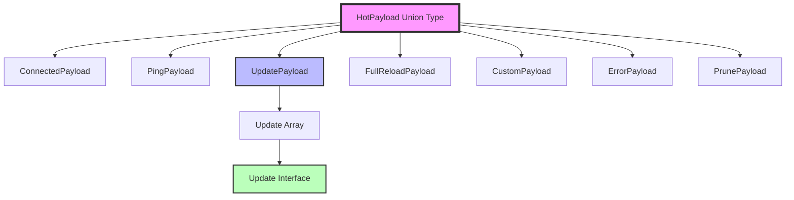
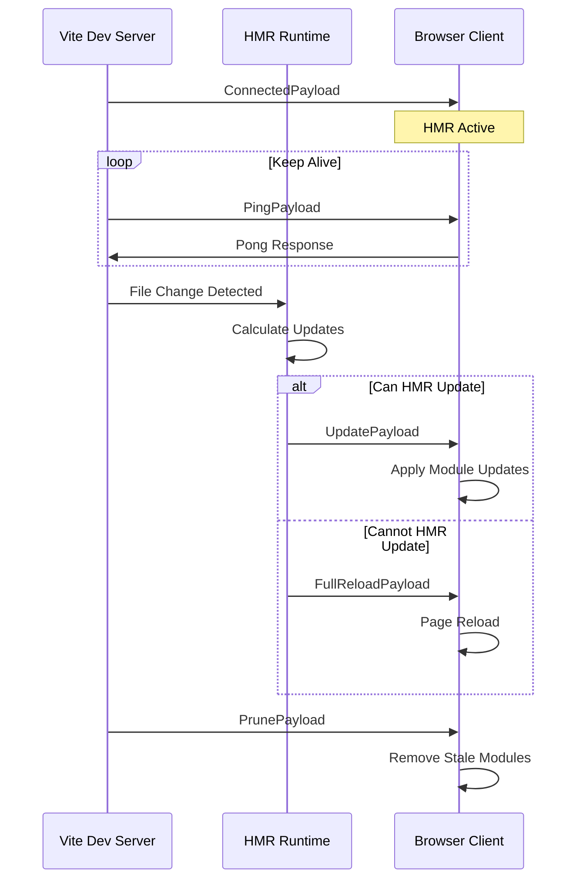
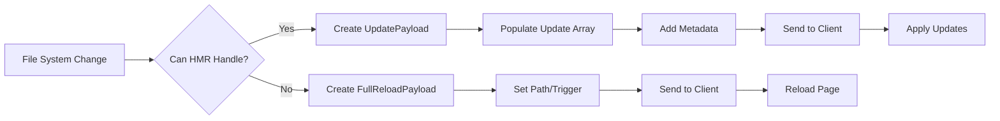

# HMR Payload Module Documentation

## Introduction

The hmr-payload module defines the TypeScript interfaces and type definitions for Hot Module Replacement (HMR) communication payloads in Vite. This module serves as the contract between the Vite development server and the client-side HMR runtime, establishing the structure of messages exchanged during the hot update process.

## Purpose and Core Functionality

The hmr-payload module provides type-safe definitions for all HMR-related message payloads that facilitate real-time module updates during development. These payloads enable the Vite development server to communicate various states and actions to the client, including module updates, connection status, error conditions, and custom events.

## Architecture and Component Relationships

### Core Payload Types

The module defines a discriminated union type `HotPayload` (formerly `HMRPayload`) that represents all possible HMR message types:

```typescript
HotPayload = 
  | ConnectedPayload  // Connection establishment
  | PingPayload       // Keep-alive mechanism
  | UpdatePayload     // Module update notifications
  | FullReloadPayload // Complete page reload requests
  | CustomPayload     // Plugin-specific messages
  | ErrorPayload      // Error reporting
  | PrunePayload      // Module cleanup notifications
```

### Component Hierarchy



## Detailed Component Specifications

### UpdatePayload
The primary payload for module updates containing an array of individual update instructions.

**Properties:**
- `type: 'update'` - Discriminant for payload type identification
- `updates: Update[]` - Array of update instructions

### Update
Represents a single module update operation with detailed metadata.

**Properties:**
- `type: 'js-update' | 'css-update'` - Update type classification
- `path: string` - Module path being updated
- `acceptedPath: string` - Path that accepted the update
- `timestamp: number` - Update timestamp for versioning
- `explicitImportRequired?: boolean` - Internal flag for import requirements
- `isWithinCircularImport?: boolean` - Internal flag for circular dependency handling
- `firstInvalidatedBy?: string` - Internal tracking for invalidation source
- `invalidates?: string[]` - Internal array of invalidated modules

### FullReloadPayload
Requests a complete page reload when HMR cannot handle the update.

**Properties:**
- `type: 'full-reload'` - Discriminant for full reload requests
- `path?: string` - Optional path that triggered the reload
- `triggeredBy?: string` - Internal identifier of the triggering change

### ConnectedPayload
Signals successful HMR connection establishment.

**Properties:**
- `type: 'connected'` - Connection confirmation discriminant

### PingPayload
Keep-alive mechanism for maintaining WebSocket connections.

**Properties:**
- `type: 'ping'` - Ping message discriminant

### PrunePayload
Notifies the client to remove stale modules from memory.

**Properties:**
- `type: 'prune'` - Prune operation discriminant
- `paths: string[]` - Array of module paths to remove

### CustomPayload
Enables plugins to send custom HMR messages.

**Properties:**
- `type: 'custom'` - Custom message discriminant
- `event: string` - Custom event name
- `data?: any` - Optional event data payload

## Data Flow Architecture

### HMR Message Flow



### Update Processing Flow



## Integration with HMR System

### Relationship to HMR Module

The hmr-payload module works in conjunction with the [hmr module](hmr.md) which provides the runtime implementation for handling these payloads. The hmr module contains the `HotChannel` and `HmrContext` components that process and transmit these payloads.

### WebSocket Communication

These payload types are serialized and transmitted via WebSocket connections managed by the [dev-server module](dev-server.md). The `WebSocketServer` and `WebSocketClient` components handle the low-level communication protocol.

### Module Graph Integration

The payloads reference module paths that are managed by the [module-graph module](module-graph.md). The `ModuleNode` and `EnvironmentModuleNode` components track module dependencies and determine which modules need updates.

## Usage Patterns

### Client-Side Processing

```typescript
// Example client-side payload handling
function handleHMRMessage(payload: HotPayload) {
  switch (payload.type) {
    case 'connected':
      console.log('HMR Connected');
      break;
    case 'update':
      handleUpdates(payload.updates);
      break;
    case 'full-reload':
      window.location.reload();
      break;
    case 'prune':
      removeStaleModules(payload.paths);
      break;
    case 'custom':
      handleCustomEvent(payload.event, payload.data);
      break;
  }
}
```

### Server-Side Construction

```typescript
// Example server-side payload creation
function createUpdatePayload(updates: Update[]): UpdatePayload {
  return {
    type: 'update',
    updates: updates.map(update => ({
      type: update.isCSS ? 'css-update' : 'js-update',
      path: update.path,
      acceptedPath: update.acceptedPath,
      timestamp: Date.now(),
      // Internal metadata
      explicitImportRequired: update.requiresImport,
      isWithinCircularImport: update.isCircular,
      firstInvalidatedBy: update.invalidatedBy,
      invalidates: update.invalidatedModules
    }))
  };
}
```

## Internal Implementation Details

### Type Discrimination

The module uses TypeScript's discriminated union pattern with the `type` property as the discriminant. This enables type-safe payload handling without additional runtime type checking.

### Internal Properties

Several properties are marked with `/** @internal */` comments, indicating they are intended for Vite's internal use and should not be relied upon by external consumers. These properties provide metadata for advanced HMR scenarios like circular dependency handling and invalidation tracking.

### Backward Compatibility

The module maintains backward compatibility through the deprecated `HMRPayload` type alias, which maps to the new `HotPayload` type. This ensures existing code continues to work while encouraging migration to the updated naming convention.

## Error Handling

The `ErrorPayload` interface (referenced but not detailed in the current module) provides comprehensive error reporting capabilities, including stack traces, plugin information, and source location data. This integrates with Vite's error overlay system for development-time error display.

## Performance Considerations

### Payload Size Optimization

- Minimal payload structure to reduce WebSocket transmission overhead
- Optional properties to avoid unnecessary data transmission
- Efficient array-based updates for batch processing

### Update Batching

Multiple file changes are batched into single `UpdatePayload` messages to reduce communication overhead and improve update performance.

## Security Considerations

The payload types include internal properties that should not be exposed to client-side code. The module design ensures that sensitive information remains server-side while providing necessary update instructions to the client.

## Future Extensibility

The discriminated union pattern and custom payload support provide extensibility for future HMR enhancements. New payload types can be added to the union without breaking existing implementations, and plugins can extend functionality through custom events.