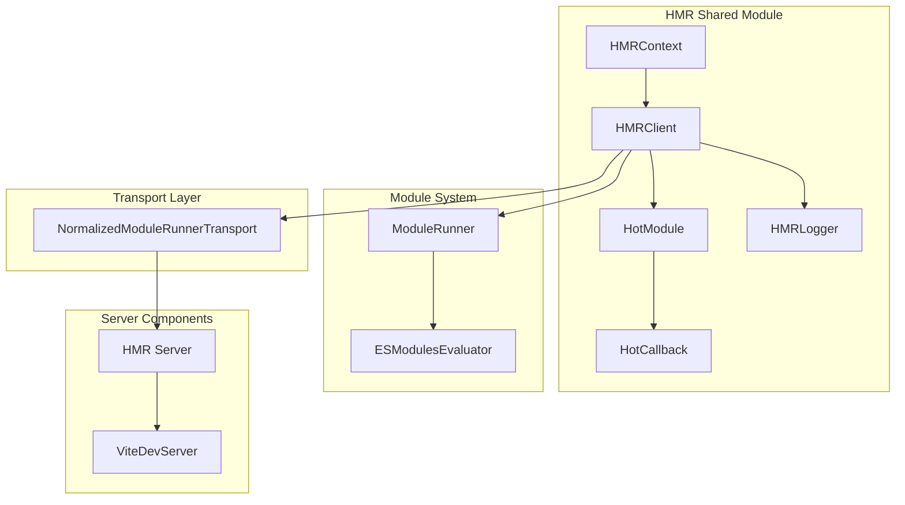
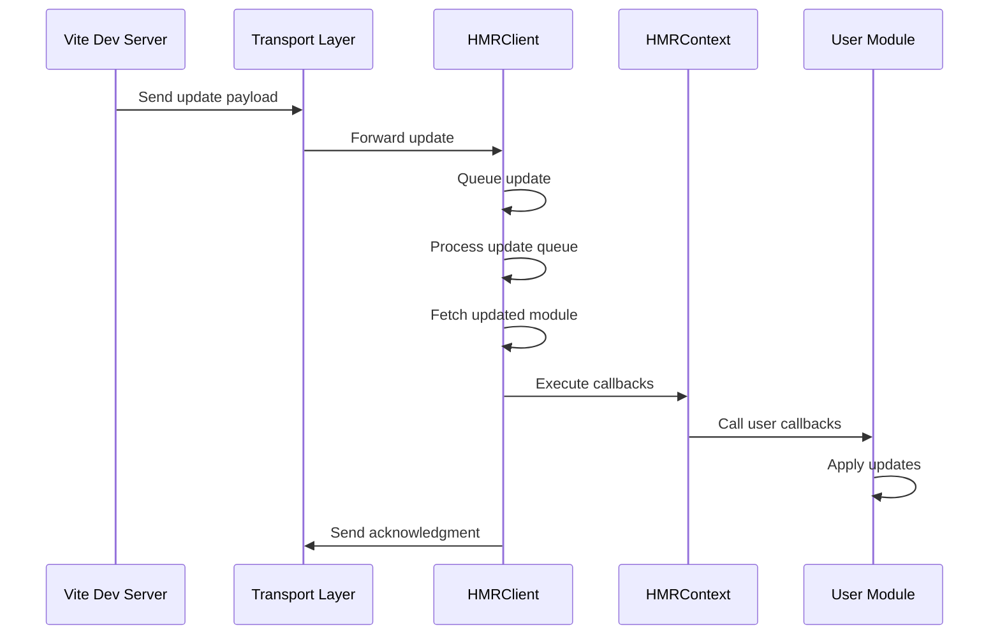

# HMR Shared Module Documentation

## Introduction

The `hmr-shared` module provides the core Hot Module Replacement (HMR) functionality that is shared between the client and server sides of Vite's development environment. This module implements the client-side HMR client, context management, and the communication protocol that enables seamless hot updates during development without full page reloads.

## Architecture Overview

The HMR shared module implements a client-server communication pattern where the HMR client running in the browser communicates with the Vite dev server to receive hot updates. The architecture consists of several key components that work together to provide a robust hot module replacement system.



## Core Components

### HMRClient

The `HMRClient` class is the central component that manages the hot module replacement process. It maintains state for hot modules, handles update queuing, and coordinates the update process with the module runner system.

**Key Responsibilities:**
- Manages hot module state and callbacks
- Handles update queuing and batching
- Coordinates with transport layer for server communication
- Manages module lifecycle (dispose, prune, data persistence)
- Provides logging and error handling

**State Management:**
```typescript
public hotModulesMap = new Map<string, HotModule>()
public disposeMap = new Map<string, (data: any) => void | Promise<void>>()
public pruneMap = new Map<string, (data: any) => void | Promise<void>>()
public dataMap = new Map<string, any>()
public customListenersMap: CustomListenersMap = new Map()
public ctxToListenersMap = new Map<string, CustomListenersMap>()
```

### HMRContext

The `HMRContext` class implements the `ViteHotContext` interface and provides the API that modules use to interact with the HMR system. Each module gets its own context instance that manages its specific hot update behavior.

**Key Features:**
- Module-specific HMR API implementation
- Callback management for hot updates
- Custom event handling
- Data persistence across updates
- Dependency tracking for hot updates

**HMR API Methods:**
- `accept()` - Accept hot updates for self or dependencies
- `acceptExports()` - Accept updates for specific exports
- `dispose()` - Register cleanup callbacks
- `prune()` - Register callbacks for when module is pruned
- `invalidate()` - Force invalidation of current module
- `on()/off()` - Custom event listeners
- `send()` - Send custom events to server

### HotModule and HotCallback

These interfaces define the structure for tracking hot module state and their associated update callbacks.

```typescript
interface HotModule {
  id: string
  callbacks: HotCallback[]
}

interface HotCallback {
  deps: string[]      // Dependencies that trigger this callback
  fn: (modules: Array<ModuleNamespace | undefined>) => void
}
```

### HMRLogger

Simple interface for HMR logging that provides consistent error and debug logging across the HMR system.

```typescript
export interface HMRLogger {
  error(msg: string | Error): void
  debug(...msg: unknown[]): void
}
```

## Data Flow

### Hot Update Process Flow



### Module Update Queue Management


## Integration with Other Modules

### Module Runner Integration

The HMR client integrates with the [module-runner](module-runner.md) system through the `importUpdatedModule` callback, which is responsible for fetching and evaluating updated modules.

```typescript
constructor(
  public logger: HMRLogger,
  private transport: NormalizedModuleRunnerTransport,
  private importUpdatedModule: (update: Update) => Promise<ModuleNamespace>,
) {}
```

### Transport Layer

Communication with the server is handled through the `NormalizedModuleRunnerTransport` interface, which abstracts the underlying communication mechanism (WebSocket, EventSource, etc.).

### Dev Server Integration

The HMR system connects to the [dev-server](dev-server.md) through the WebSocket server component, which handles the server-side HMR communication.

## Update Processing Algorithm

The HMR client implements a sophisticated update processing algorithm that handles multiple concurrent updates and ensures proper execution order:

1. **Update Queuing**: Updates are queued to handle multiple changes from the same source modification
2. **Dependency Resolution**: The system determines which callbacks are qualified based on updated dependencies
3. **Module Fetching**: Updated modules are fetched through the module runner
4. **Callback Execution**: Qualified callbacks are executed with the updated modules
5. **Error Handling**: Failed updates are logged and don't break the HMR system

## Error Handling and Recovery

The HMR system includes comprehensive error handling:

- **Failed Updates**: If module fetching fails, the system logs errors and continues
- **Network Errors**: Transport errors are caught and logged
- **Callback Errors**: Individual callback failures don't affect other callbacks
- **Fallback Mechanism**: Failed HMR updates can trigger full page reload

## Performance Considerations

- **Update Batching**: Multiple updates from the same source are batched
- **Callback Filtering**: Only qualified callbacks are executed
- **Memory Management**: Stale callbacks and listeners are cleaned up
- **Async Processing**: Updates are processed asynchronously to avoid blocking

## Usage Examples

### Basic HMR Usage

```typescript
if (import.meta.hot) {
  import.meta.hot.accept((newModule) => {
    // Handle module update
    console.log('Module updated:', newModule)
  })
}
```

### Dependency HMR

```typescript
if (import.meta.hot) {
  import.meta.hot.accept(['./dep.js'], ([dep]) => {
    // Handle dependency update
    console.log('Dependency updated:', dep)
  })
}
```

### Cleanup Handling

```typescript
if (import.meta.hot) {
  import.meta.hot.dispose((data) => {
    // Cleanup before module is replaced
    cleanupSideEffects()
  })
}
```

## Related Documentation

- [module-runner](module-runner.md) - Module execution and evaluation system
- [dev-server](dev-server.md) - Development server and WebSocket communication
- [hmr](hmr.md) - Server-side HMR implementation
- [core-types](core-types.md) - Type definitions for HMR payloads and contexts