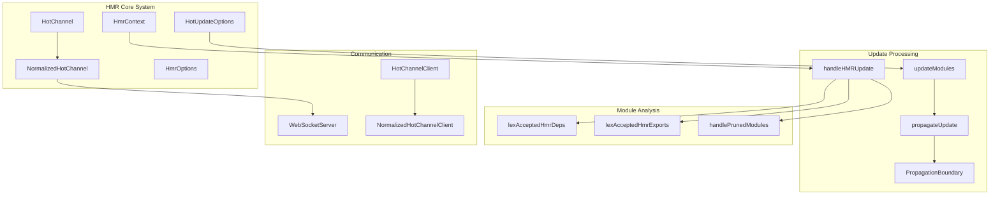
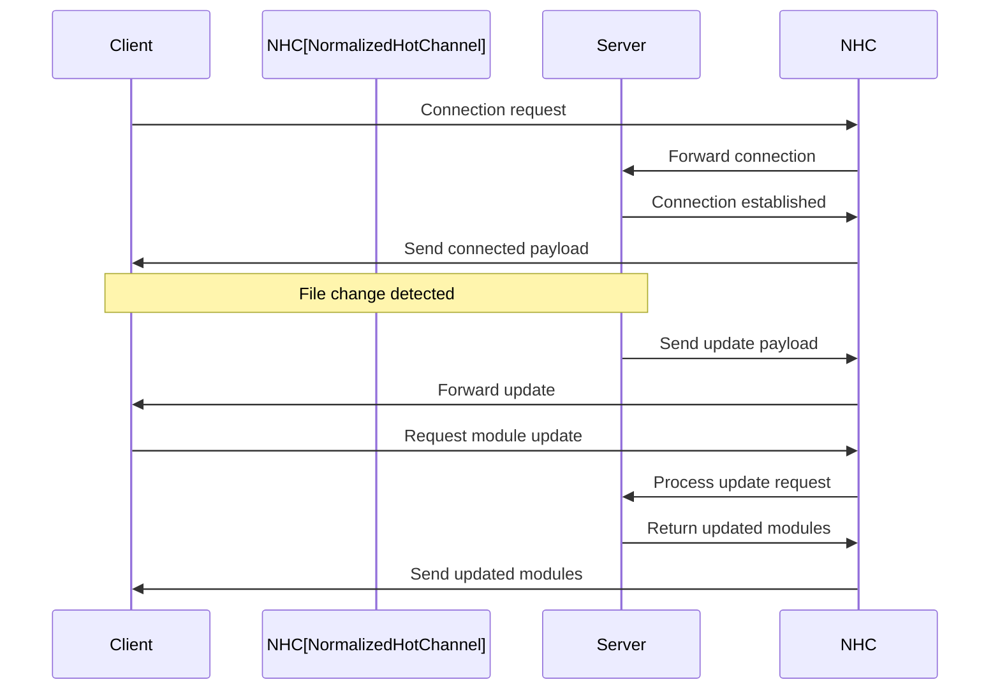
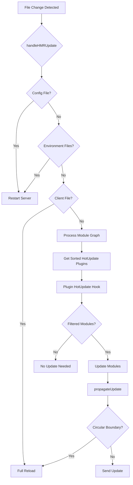
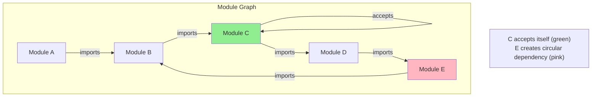
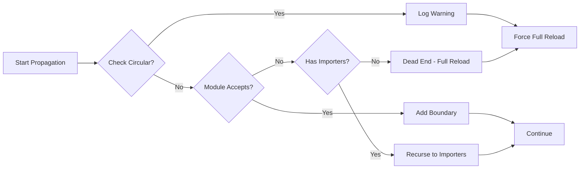
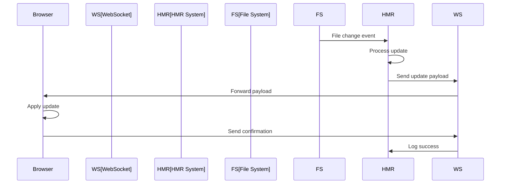

# HMR (Hot Module Replacement) Module

## Introduction

The HMR (Hot Module Replacement) module is a core component of Vite's development server that enables live module updates without full page reloads. It provides a sophisticated system for detecting file changes, calculating update boundaries, and propagating changes through the module graph while maintaining application state.

## Architecture Overview

The HMR module implements a multi-environment hot update system that supports both client-side and server-side rendering environments. It uses WebSocket communication for real-time updates and implements intelligent boundary detection to minimize the scope of updates.



## Core Components

### HotChannel & NormalizedHotChannel

The `HotChannel` interface defines the contract for HMR communication channels, while `NormalizedHotChannel` provides a standardized implementation with additional functionality:

- **Event handling**: Manages connection events and custom message types
- **Message normalization**: Converts between different message formats
- **Invoke handling**: Supports remote procedure calls between client and server
- **Client management**: Handles multiple client connections with proper cleanup



### HmrContext & HotUpdateOptions

These interfaces provide the context for HMR operations:

- **HmrContext**: Contains file information, affected modules, and server reference
- **HotUpdateOptions**: Extends context with environment-specific data and read functionality
- **PropagationBoundary**: Defines update boundaries and acceptance criteria

### Update Processing Pipeline

The HMR update processing follows a sophisticated pipeline to ensure minimal disruption:



## Module Propagation System

The `propagateUpdate` function implements intelligent boundary detection to determine which modules need updating:

### Boundary Detection Logic

1. **Self-accepting modules**: Modules that accept their own updates
2. **Export acceptance**: Modules that accept specific exports
3. **Dependency acceptance**: Modules that accept dependencies
4. **Circular import handling**: Detects and handles circular dependencies



### Circular Import Detection

The system includes sophisticated circular import detection to prevent infinite loops and ensure proper update ordering:



## Communication Protocol

The HMR system uses a structured communication protocol between server and clients:

### Message Types

- **Update**: Module content updates with boundary information
- **Full Reload**: Complete page reload when HMR is not possible
- **Prune**: Remove modules that are no longer needed
- **Error**: Report errors during update processing
- **Custom**: User-defined events and remote procedure calls

### WebSocket Integration

The system integrates with Vite's WebSocket server for real-time communication:



## Plugin Integration

The HMR system integrates with Vite's plugin system to allow custom update handling:

### Hot Update Hooks

Plugins can implement `hotUpdate` hooks to customize module update behavior:

- **Pre-order**: Execute before standard processing
- **Normal order**: Standard processing order
- **Post-order**: Execute after standard processing

### Module Filtering

Plugins can filter which modules should be included in updates, enabling sophisticated update strategies.

## Environment Support

The HMR system supports multiple environments with different update strategies:

### Client Environment
- Standard browser HMR with WebSocket communication
- CSS hot replacement without page reload
- JavaScript module updates with state preservation

### SSR Environment  
- Server-side module updates
- Coordinated updates between client and server
- Environment-specific plugin processing

## Error Handling

The system includes comprehensive error handling:

### Update Errors
- Graceful fallback to full reload
- Error reporting through WebSocket
- Module invalidation on errors

### Configuration Errors
- Automatic server restart for config changes
- Dependency tracking for config files
- Environment file change detection

## Performance Optimizations

### Caching Strategies
- Sorted plugin cache per environment
- Module boundary caching
- Update payload optimization

### Update Efficiency
- Minimal update scope calculation
- Intelligent boundary detection
- Parallel environment processing

## Integration with Other Modules

The HMR module integrates with several other Vite modules:

- **[dev-server.md](dev-server.md)**: Core development server functionality
- **[module-graph.md](module-graph.md)**: Module dependency tracking
- **[plugin-system.md](plugin-system.md)**: Plugin hook processing
- **[config.md](config.md)**: Configuration management
- **[ws.md](ws.md)**: WebSocket communication

## Usage Examples

### Basic HMR Setup
```javascript
// vite.config.js
export default {
  server: {
    hmr: {
      port: 24678,
      path: '/vite-hmr',
      timeout: 30000
    }
  }
}
```

### Custom Hot Channel
```javascript
// Custom WebSocket implementation
const customChannel = {
  send(payload) {
    // Custom send logic
  },
  on(event, listener) {
    // Custom event handling
  },
  close() {
    // Cleanup logic
  }
}
```

### Plugin Hot Update Hook
```javascript
// Custom plugin with HMR handling
const myPlugin = {
  name: 'my-plugin',
  hotUpdate({ modules, file, timestamp }) {
    // Custom update logic
    return filteredModules
  }
}
```

## API Reference

### HotChannel Interface
- `send(payload)`: Broadcast events to all clients
- `on(event, listener)`: Register event listeners
- `off(event, listener)`: Unregister event listeners
- `close()`: Disconnect all clients

### HmrOptions Interface
- `protocol`: WebSocket protocol
- `host`: WebSocket host
- `port`: WebSocket port
- `clientPort`: Client-side port
- `path`: WebSocket path
- `timeout`: Connection timeout
- `overlay`: Show error overlay

### Utility Functions
- `getShortName(file, root)`: Get relative file path
- `normalizeHmrUrl(url)`: Normalize HMR URLs
- `lexAcceptedHmrDeps(code, start, urls)`: Parse accepted dependencies
- `lexAcceptedHmrExports(code, start, exports)`: Parse accepted exports