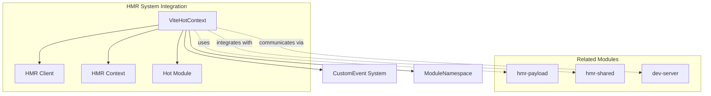
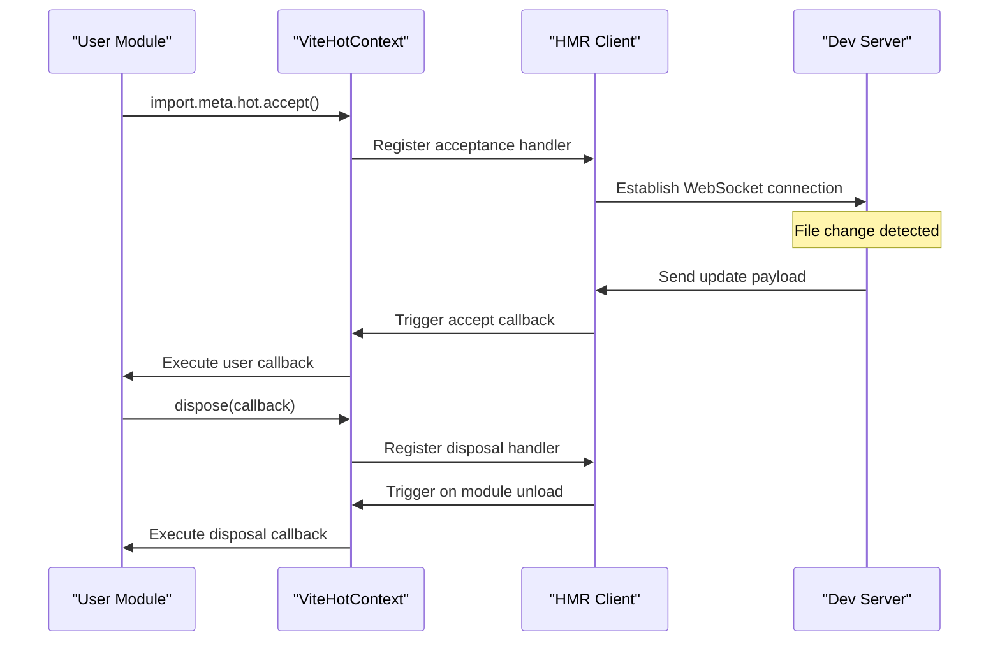
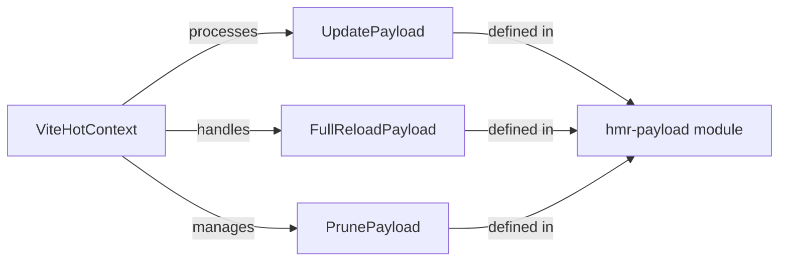

# Hot Context Module Documentation

## Introduction

The hot-context module provides the core TypeScript interface for Vite's Hot Module Replacement (HMR) system. It defines the `ViteHotContext` interface, which is the primary API that modules use to interact with Vite's HMR capabilities during development. This module serves as the foundation for enabling live code updates without full page refreshes, significantly improving the developer experience.

## Core Architecture

### ViteHotContext Interface

The `ViteHotContext` interface is the central component of this module, providing a comprehensive API for modules to manage their hot-reload behavior. It offers methods for accepting updates, handling disposal, managing dependencies, and communicating with the HMR system.

```typescript
interface ViteHotContext {
  readonly data: any
  
  // Module acceptance methods
  accept(): void
  accept(cb: (mod: ModuleNamespace | undefined) => void): void
  accept(dep: string, cb: (mod: ModuleNamespace | undefined) => void): void
  accept(deps: readonly string[], cb: (mods: Array<ModuleNamespace | undefined>) => void): void
  
  // Export-specific acceptance
  acceptExports(exportNames: string | readonly string[], cb?: (mod: ModuleNamespace | undefined) => void): void
  
  // Lifecycle management
  dispose(cb: (data: any) => void): void
  prune(cb: (data: any) => void): void
  invalidate(message?: string): void
  
  // Event system
  on<T extends CustomEventName>(event: T, cb: (payload: InferCustomEventPayload<T>) => void): void
  off<T extends CustomEventName>(event: T, cb: (payload: InferCustomEventPayload<T>) => void): void
  send<T extends CustomEventName>(event: T, data?: InferCustomEventPayload<T>): void
}
```

## Component Relationships

### Module Dependencies



### Data Flow Architecture



## Key Features

### 1. Module Acceptance API

The `accept()` method family provides flexible ways for modules to handle hot updates:

- **Self-acceptance**: `accept()` - Module accepts its own updates
- **Callback-based**: `accept(cb)` - Execute callback when module updates
- **Dependency tracking**: `accept(dep, cb)` - Accept updates from specific dependencies
- **Multiple dependencies**: `accept(deps, cb)` - Accept updates from multiple dependencies

### 2. Export-Specific Hot Reloading

The `acceptExports()` method enables fine-grained control over which exports trigger reloads:

```typescript
// Accept updates only to specific exports
import.meta.hot.acceptExports(['count', 'increment'], (newModule) => {
  // Handle specific export updates
})
```

### 3. Lifecycle Management

- **Disposal**: `dispose(cb)` - Cleanup before module replacement
- **Pruning**: `prune(cb)` - Handle module removal from graph
- **Invalidation**: `invalidate(message)` - Force module invalidation

### 4. Persistent Data

The `data` property provides a mechanism for preserving state across hot reloads:

```typescript
// Restore previous state
const state = import.meta.hot.data.state || initialState

// Save state for next reload
import.meta.hot.dispose((data) => {
  data.state = currentState
})
```

### 5. Custom Event System

The interface supports custom events for advanced HMR scenarios:

```typescript
// Listen for custom events
import.meta.hot.on('custom-event', (payload) => {
  console.log('Received:', payload)
})

// Send custom events
import.meta.hot.send('custom-event', { data: 'value' })
```

## Integration with Vite Ecosystem

### HMR Payload System

The hot-context module works closely with the [hmr-payload](hmr-payload.md) module, which defines the data structures for HMR updates:



### Dev Server Integration

The hot-context integrates with the [dev-server](dev-server.md) module through WebSocket connections:

- WebSocket messages trigger hot context methods
- Server-side changes propagate to client-side hot contexts
- Environment-specific handling through the dev server

### Module Runner Coordination

Works with the [module-runner](module-runner.md) for SSR and module evaluation:

- Coordinates module evaluation during hot updates
- Manages module namespace objects
- Handles import.meta augmentation

## Usage Patterns

### Basic Self-Acceptance

```typescript
if (import.meta.hot) {
  import.meta.hot.accept()
}
```

### Dependency Tracking

```typescript
if (import.meta.hot) {
  import.meta.hot.accept('./dependency', (newDep) => {
    // Handle dependency update
    console.log('Dependency updated:', newDep)
  })
}
```

### State Preservation

```typescript
let state = import.meta.hot?.data.state || { count: 0 }

function increment() {
  state.count++
  updateUI()
}

if (import.meta.hot) {
  import.meta.hot.dispose((data) => {
    data.state = state
  })
}
```

### Export-Specific Updates

```typescript
if (import.meta.hot) {
  import.meta.hot.acceptExports(['config', 'settings'], (newModule) => {
    // Only reload when config or settings exports change
    applyConfig(newModule.config)
  })
}
```

## Type Safety

The interface leverages TypeScript's type system for enhanced developer experience:

- `CustomEventName` and `InferCustomEventPayload` provide type-safe custom events
- `ModuleNamespace` ensures proper module type handling
- Generic constraints maintain type safety across the HMR system

## Performance Considerations

- Hot contexts are created per-module, minimizing overhead
- Event listeners are efficiently managed to prevent memory leaks
- Disposal handlers ensure proper cleanup
- The `data` property provides a lightweight state persistence mechanism

## Error Handling

The interface design includes error handling considerations:

- Module acceptance failures fall back to full page reload
- Invalidation can include error messages for debugging
- Disposal handlers run even if acceptance fails
- Event system provides error isolation

## Related Documentation

- [HMR Payload Types](hmr-payload.md) - Data structures for HMR updates
- [HMR Shared](hmr-shared.md) - Shared HMR utilities and types
- [Dev Server](dev-server.md) - Development server and WebSocket integration
- [Module Runner](module-runner.md) - Module evaluation and SSR coordination