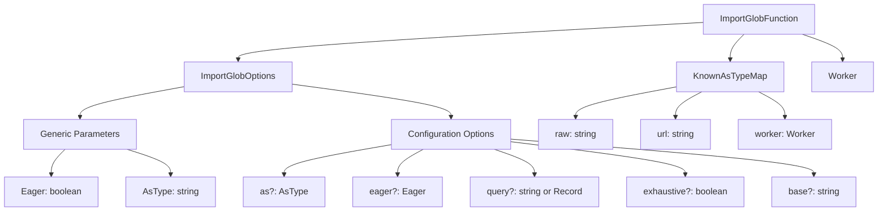
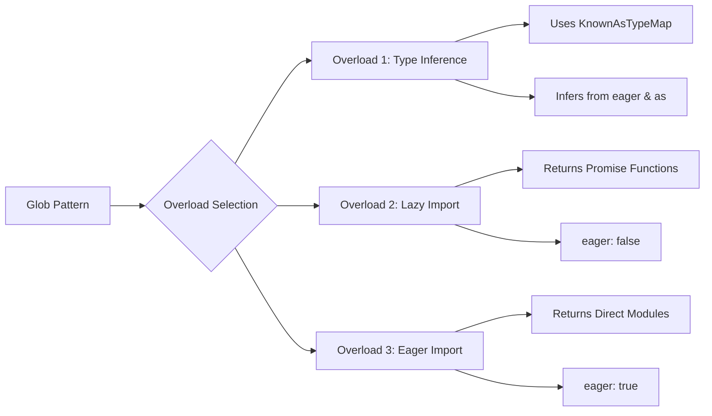
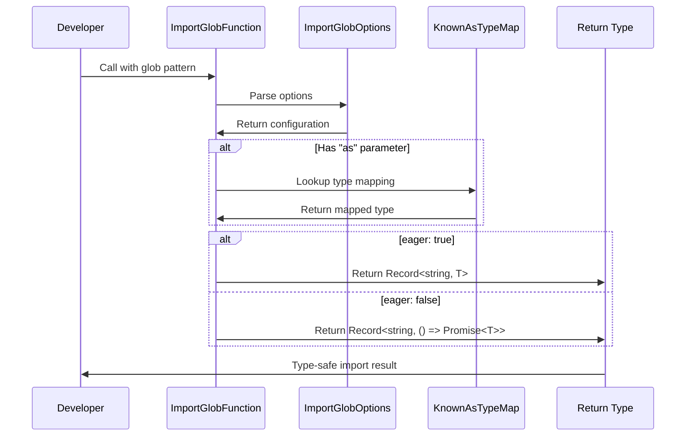
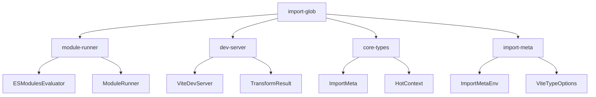
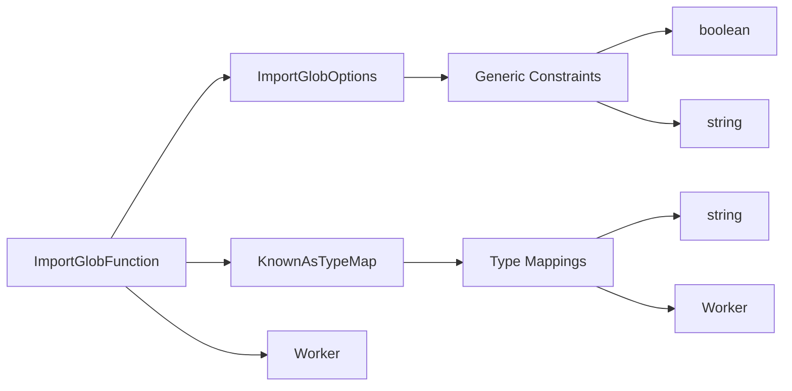
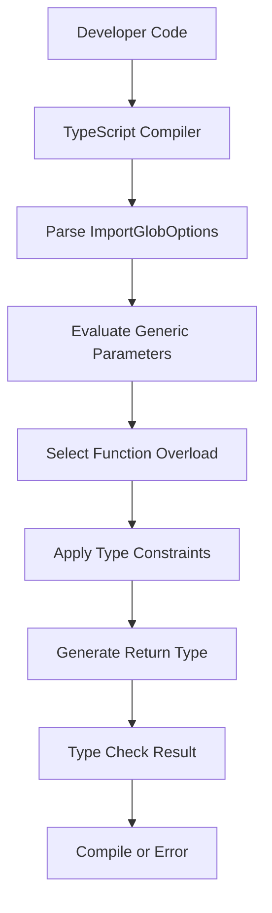
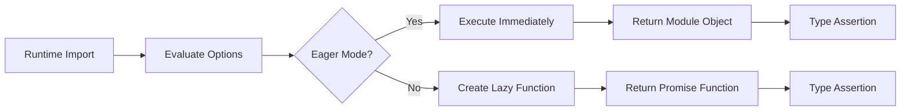

# Import Glob Module

The import-glob module provides TypeScript type definitions for Vite's glob import functionality, enabling developers to import multiple modules dynamically using glob patterns. This module serves as the type foundation for Vite's powerful file-based dynamic import system.

## Overview

The import-glob module defines the core interfaces and types that power Vite's `import.meta.glob()` functionality. It provides type-safe ways to import multiple files matching glob patterns, supporting both eager and lazy loading modes, various import formats, and custom query parameters.

## Core Components

### ImportGlobOptions

The `ImportGlobOptions` interface defines configuration options for glob imports with generic type parameters for type safety:

```typescript
interface ImportGlobOptions<Eager extends boolean, AsType extends string> {
  as?: AsType                    // Import type (deprecated, use query instead)
  eager?: Eager                  // Import as static or dynamic (default: false)
  import?: string               // Specific named export to import
  query?: string | Record<string, string | number | boolean>  // Custom queries
  exhaustive?: boolean          // Search in node_modules and hidden dirs (default: false)
  base?: string                 // Base path for relative path resolution
}
```

**Key Features:**
- **Type Safety**: Uses generic parameters `Eager` and `AsType` to ensure compile-time type checking
- **Flexible Import Modes**: Supports both eager (static) and lazy (dynamic) imports
- **Query Support**: Modern replacement for the deprecated `as` parameter
- **Performance Control**: `exhaustive` flag to control search scope

### KnownAsTypeMap

The `KnownAsTypeMap` interface maps known import types to their corresponding TypeScript types:

```typescript
interface KnownAsTypeMap {
  raw: string      // Raw file content as string
  url: string      // File URL as string
  worker: Worker   // Web Worker instance
}
```

This interface enables type-safe imports based on the import type specified in the query parameters.

### ImportGlobFunction

The `ImportGlobFunction` interface defines the main glob import function with three overloaded signatures:

```typescript
interface ImportGlobFunction {
  // Overload 1: Infer type from eager and as parameters
  <Eager extends boolean, As extends string, T = As extends keyof KnownAsTypeMap ? KnownAsTypeMap[As] : unknown>(
    glob: string | string[],
    options?: ImportGlobOptions<Eager, As>,
  ): (Eager extends true ? true : false) extends true ? Record<string, T> : Record<string, () => Promise<T>>
  
  // Overload 2: Module generic with eager: false
  <M>(glob: string | string[], options?: ImportGlobOptions<false, string>): Record<string, () => Promise<M>>
  
  // Overload 3: Module generic with eager: true
  <M>(glob: string | string[], options: ImportGlobOptions<true, string>): Record<string, M>
}
```

**Overload Strategy:**
1. **Type Inference Overload**: Infers return type from `eager` and `as` parameters using `KnownAsTypeMap`
2. **Lazy Import Overload**: Returns functions that return Promises when `eager: false`
3. **Eager Import Overload**: Returns direct module objects when `eager: true`

## Architecture

### Type System Architecture



### Function Overload Resolution



## Data Flow

### Import Resolution Flow



## Component Relationships

### Integration with Vite Ecosystem

The import-glob module integrates with several other Vite modules:



### Type Dependencies



## Usage Patterns

### Basic Glob Import

```typescript
// Lazy import all .vue files in src/components
const modules = import.meta.glob('./src/components/*.vue')
// Returns: Record<string, () => Promise<unknown>>
```

### Eager Import with Type

```typescript
// Eager import all .json files as raw strings
const jsonFiles = import.meta.glob('./data/*.json', {
  eager: true,
  as: 'raw'
})
// Returns: Record<string, string>
```

### Named Export Import

```typescript
// Import specific named export from modules
const utils = import.meta.glob('./utils/*.ts', {
  import: 'helperFunction'
})
// Returns: Record<string, () => Promise<helperFunction>>
```

### Custom Query Import

```typescript
// Import files with custom query parameters
const workers = import.meta.glob('./workers/*.js', {
  query: '?worker',
  import: 'default'
})
// Returns: Record<string, () => Promise<Worker>>
```

## Process Flow

### Compile-Time Type Resolution



### Runtime Behavior Mapping



## Key Features

### Type Safety
- **Generic Constraints**: Ensures compile-time type checking for import options
- **Conditional Types**: Returns appropriate types based on eager/lazy mode
- **Type Mapping**: Maps known import types to their corresponding TypeScript types

### Flexibility
- **Multiple Overloads**: Supports various usage patterns with different type requirements
- **Query Support**: Modern approach to specifying import behavior
- **Backward Compatibility**: Maintains support for deprecated `as` parameter

### Performance Considerations
- **Lazy Loading**: Default behavior promotes better performance through code splitting
- **Exhaustive Search**: Optional deep search with performance impact awareness
- **Type Inference**: Reduces runtime overhead through compile-time type resolution

## Related Documentation

- [module-runner.md](module-runner.md) - Module execution and evaluation system
- [dev-server.md](dev-server.md) - Development server that utilizes glob imports
- [core-types.md](core-types.md) - Core type definitions including ImportMeta
- [import-meta.md](import-meta.md) - Import meta functionality and extensions

## Migration Notes

### From `as` to `query`

The `as` parameter is deprecated in favor of `query`:

```typescript
// Deprecated
import.meta.glob('./files/*.txt', { as: 'raw' })

// Recommended
import.meta.glob('./files/*.txt', { query: '?raw', import: 'default' })
```

### Type Safety Improvements

The module provides enhanced type safety through:
- Generic parameter constraints
- Conditional return types
- Known type mappings
- Compile-time type inference

This ensures that developers get proper TypeScript support and IntelliSense when using glob imports, reducing runtime errors and improving development experience.