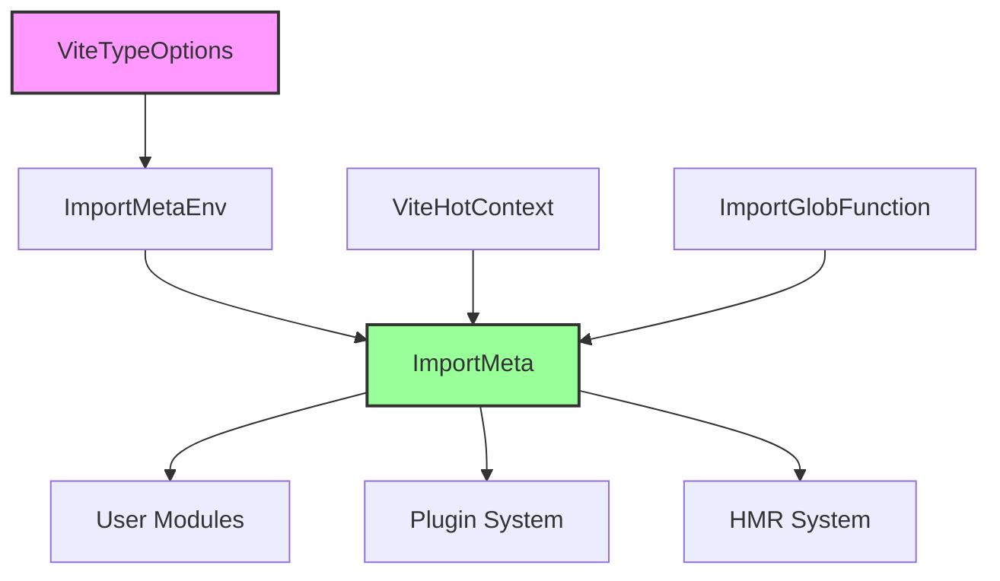
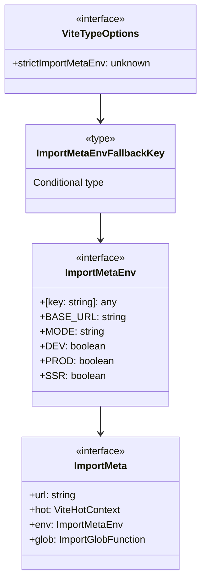
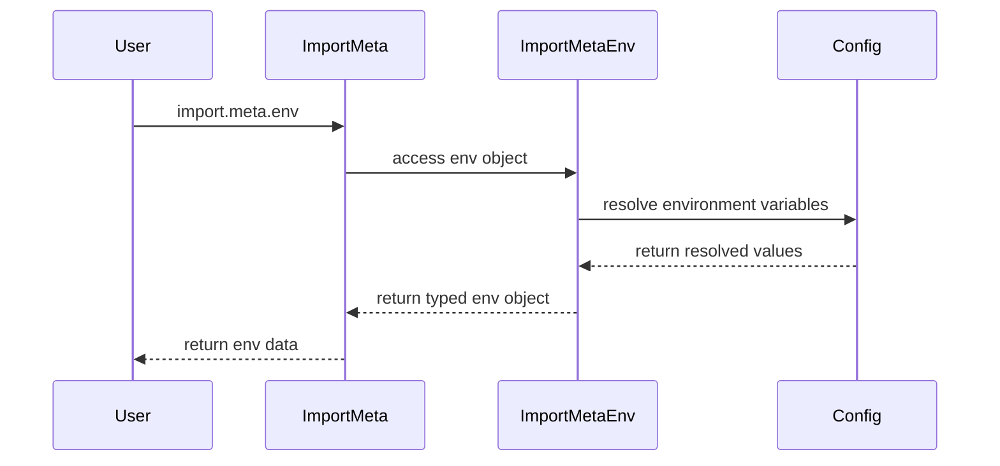
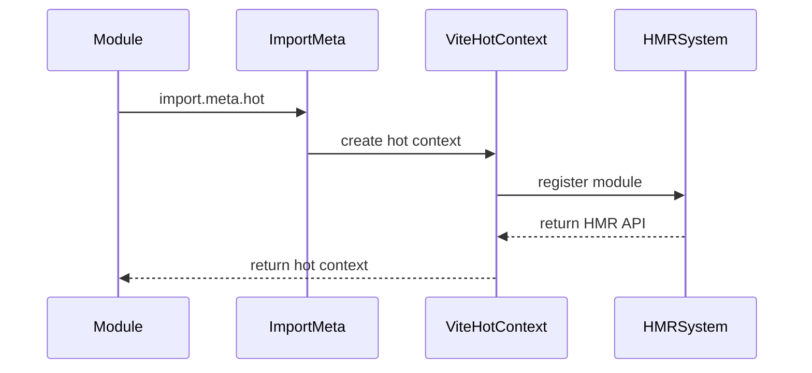
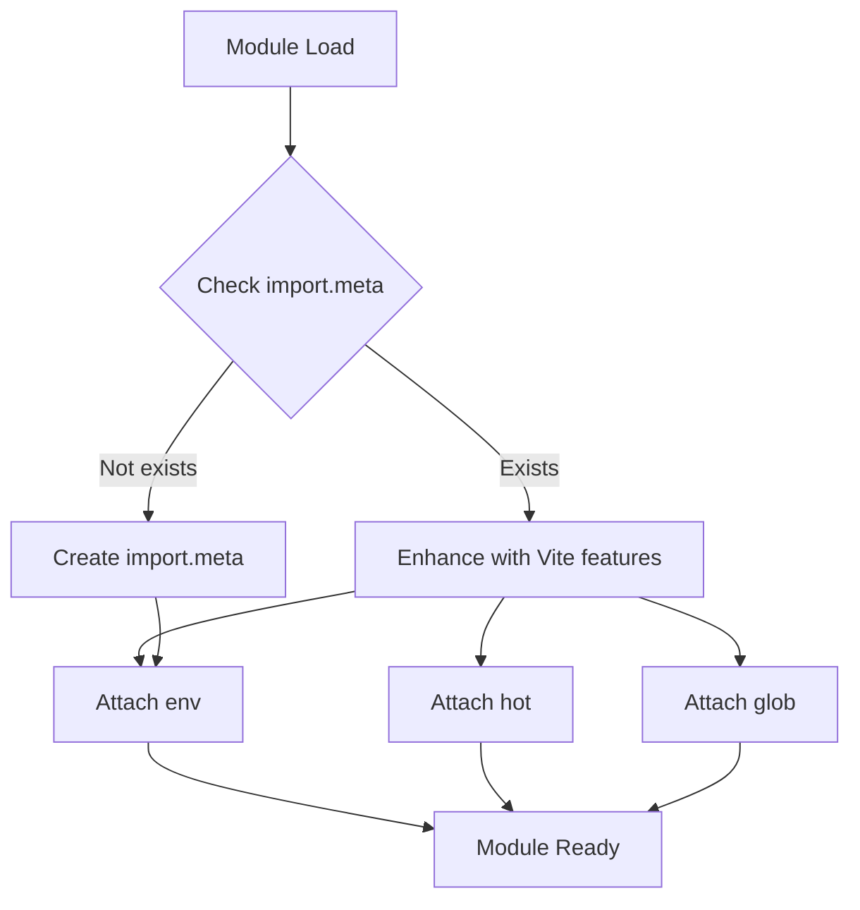
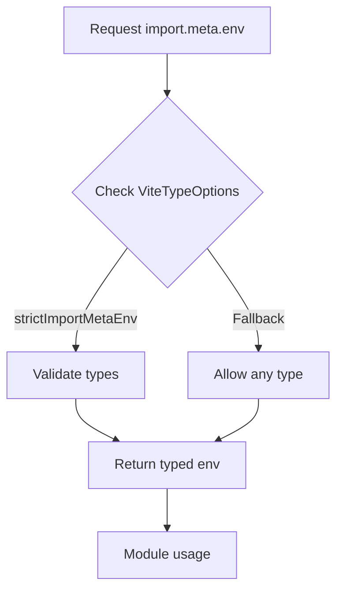

# Import Meta Module Documentation

## Overview

The import-meta module provides TypeScript type definitions and interfaces for Vite's enhanced `import.meta` functionality. This module extends the standard ES modules `import.meta` object with Vite-specific features including hot module replacement (HMR), environment variables, and dynamic import capabilities.

## Purpose and Core Functionality

The import-meta module serves as the foundation for Vite's module metadata system, providing:

1. **Type-safe environment variable access** through `ImportMetaEnv`
2. **Hot module replacement context** integration via `import.meta.hot`
3. **Dynamic import globbing** functionality through `import.meta.glob`
4. **Module URL information** via `import.meta.url`
5. **Extensible type system** through `ViteTypeOptions`

## Architecture

### Component Structure



### Type Hierarchy



## Core Components

### ViteTypeOptions

The `ViteTypeOptions` interface serves as an extension point for users to customize import meta behavior. Currently empty by design to allow future enhancements and user extensions through TypeScript's declaration merging.

**Key Features:**
- Provides a hook for strict type checking of environment variables
- Enables customization of import meta behavior
- Supports module augmentation patterns

### ImportMetaEnv

The `ImportMetaEnv` interface defines the structure of environment variables accessible through `import.meta.env`.

**Built-in Properties:**
- `BASE_URL`: The base URL for the application
- `MODE`: The current mode (development, production, etc.)
- `DEV`: Boolean indicating if running in development mode
- `PROD`: Boolean indicating if running in production mode
- `SSR`: Boolean indicating if running in server-side rendering mode

**Dynamic Properties:**
- Supports any custom environment variables through index signature
- Type safety controlled by `ViteTypeOptions` configuration

### ImportMeta

The main interface that extends the standard ES modules `import.meta` object with Vite-specific functionality.

**Core Properties:**
- `url`: Standard ES module URL (inherited)
- `hot`: Optional HMR context for hot module replacement
- `env`: Environment variables object
- `glob`: Function for dynamic import globbing

## Data Flow

### Environment Variable Flow



### HMR Integration Flow



## Integration with Other Modules

### HMR Module Integration

The import-meta module integrates with the [hmr module](hmr.md) through the `ViteHotContext` type:

- `import.meta.hot` provides access to HMR functionality
- Enables modules to accept hot updates
- Supports HMR boundary detection

### Import Glob Module Integration

The import-meta module integrates with the [import-glob module](import-glob.md) through the `ImportGlobFunction` type:

- `import.meta.glob()` enables dynamic imports
- Supports pattern-based module loading
- Provides type-safe glob imports

### Module Runner Integration

The import-meta module is used by the [module-runner module](module-runner.md):

- `ModuleRunnerImportMeta` extends base import meta functionality
- Provides module execution context
- Supports SSR and client-side module execution

## Usage Examples

### Basic Environment Access

```typescript
// Access environment variables
if (import.meta.env.DEV) {
  console.log('Running in development mode');
}

// Access custom environment variables
const apiUrl = import.meta.env.VITE_API_URL;
```

### HMR Integration

```typescript
// Accept hot module updates
if (import.meta.hot) {
  import.meta.hot.accept((newModule) => {
    // Handle module update
  });
}
```

### Dynamic Imports

```typescript
// Glob import modules
const modules = import.meta.glob('./modules/*.ts');

// Load modules dynamically
for (const path in modules) {
  const module = await modules[path]();
}
```

## Type Safety and Extensibility

### Declaration Merging

Users can extend the `ImportMeta` interface through TypeScript's declaration merging:

```typescript
// Custom augmentation
declare global {
  interface ImportMeta {
    readonly customProperty: string;
  }
}
```

### Strict Type Checking

The `ViteTypeOptions` interface allows for strict type checking of environment variables:

```typescript
// Enable strict mode
declare global {
  interface ViteTypeOptions {
    strictImportMetaEnv: true;
  }
}
```

## Process Flow

### Module Initialization



### Environment Resolution



## Best Practices

1. **Type Safety**: Use TypeScript's strict mode for better type checking
2. **Environment Variables**: Prefix custom env variables with `VITE_` for security
3. **HMR Usage**: Always check for `import.meta.hot` existence before using
4. **Glob Patterns**: Use specific patterns to avoid unnecessary module loading
5. **Performance**: Cache glob results when possible to avoid repeated scans

## Related Documentation

- [HMR Module](hmr.md) - Hot module replacement system
- [Import Glob Module](import-glob.md) - Dynamic import functionality
- [Module Runner Module](module-runner.md) - Module execution context
- [Core Types Module](core-types.md) - Base type definitions