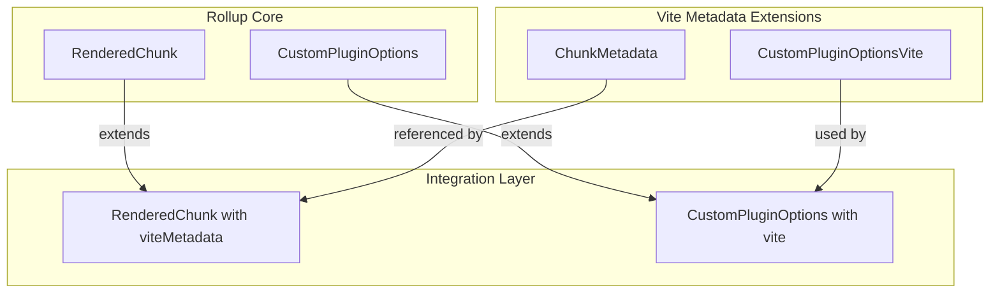
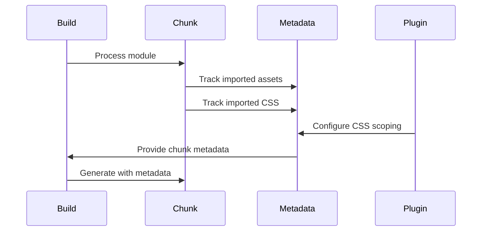
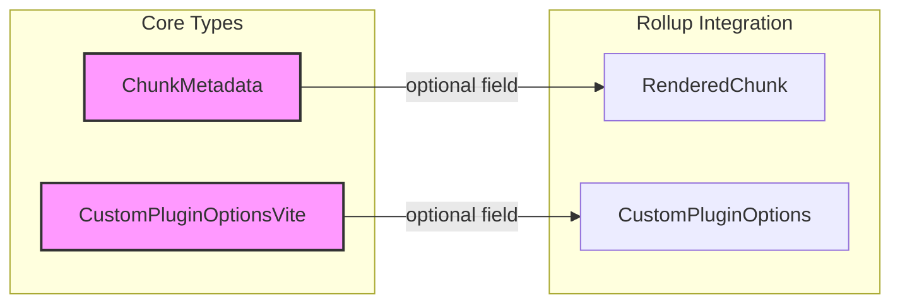
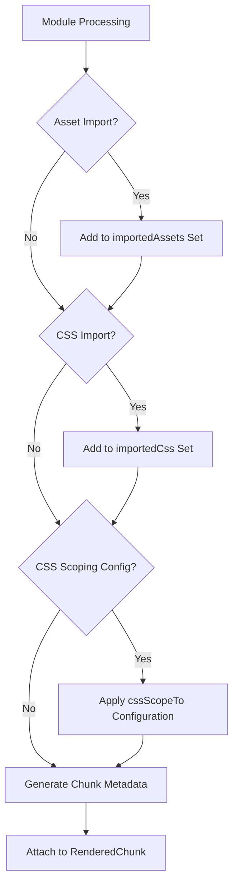

# Metadata Module Documentation

## Introduction

The metadata module provides type definitions and interfaces for managing build-time metadata in Vite. It extends Rollup's plugin system with Vite-specific metadata capabilities, enabling better asset tracking, CSS scoping, and chunk optimization during the build process.

## Core Components

### ChunkMetadata

The `ChunkMetadata` interface tracks assets and CSS files imported by each chunk during the build process.

```typescript
interface ChunkMetadata {
  importedAssets: Set<string>
  importedCss: Set<string>
}
```

**Purpose**: Maintains a record of all assets and CSS files that a particular chunk depends on, enabling efficient asset management and optimization.

**Key Features**:
- Tracks static assets (images, fonts, etc.) imported by the chunk
- Records CSS files that the chunk depends on
- Uses Sets for efficient duplicate prevention and fast lookups

### CustomPluginOptionsVite

Vite-specific plugin options that extend Rollup's plugin system with additional functionality.

```typescript
interface CustomPluginOptionsVite {
  cssScopeTo?: readonly [importerId: string, exportName: string | undefined]
  lang?: string // @deprecated
}
```

**Purpose**: Provides Vite-specific configuration options for plugins, particularly for CSS scoping and tree-shaking optimization.

**Key Features**:
- `cssScopeTo`: Enables CSS modules to be tree-shaken when their importer's exports are removed
- Supports CSS scoping to specific importer modules and their named exports
- Helps optimize bundle size by eliminating unused CSS

### RenderedChunk Extension

Extends Rollup's `RenderedChunk` interface to include Vite-specific metadata.

```typescript
interface RenderedChunk {
  viteMetadata?: ChunkMetadata
}
```

**Purpose**: Integrates Vite's metadata tracking into Rollup's chunk rendering process, allowing build tools to access asset and dependency information.

### CustomPluginOptions Extension

Extends Rollup's plugin options to include Vite-specific configuration.

```typescript
interface CustomPluginOptions {
  vite?: CustomPluginOptionsVite
}
```

**Purpose**: Provides a standardized way for Rollup plugins to access and configure Vite-specific features.

## Architecture



## Data Flow



## Component Relationships



## Process Flow



## Integration with Other Modules

### Build Module
The metadata module integrates closely with the [build](build.md) module to provide asset tracking during the build process. Chunk metadata is populated during module transformation and used for optimization decisions.

### Plugin System
Works in conjunction with the [plugin-system](plugin-system.md) to extend Rollup plugins with Vite-specific capabilities. Plugins can access and modify metadata through the extended interfaces.

### Module Graph
Coordinates with the [module-graph](module-graph.md) to track dependencies and ensure metadata accurately reflects the module dependency structure.

## Usage Examples

### CSS Scoping Configuration
```javascript
// In a Rollup plugin
return {
  name: 'my-plugin',
  transform(code, id) {
    if (id.endsWith('.css')) {
      return {
        code,
        map: null,
        meta: {
          vite: {
            cssScopeTo: ['/src/App.vue', 'default']
          }
        }
      }
    }
  }
}
```

### Accessing Chunk Metadata
```javascript
// In a build plugin
generateBundle(options, bundle) {
  for (const [fileName, chunk] of Object.entries(bundle)) {
    if (chunk.type === 'chunk' && chunk.viteMetadata) {
      console.log(`Assets in ${fileName}:`, chunk.viteMetadata.importedAssets)
      console.log(`CSS in ${fileName}:`, chunk.viteMetadata.importedCss)
    }
  }
}
```

## Best Practices

1. **Asset Tracking**: Always populate `importedAssets` and `importedCss` for accurate dependency tracking
2. **CSS Scoping**: Use `cssScopeTo` judiciously to optimize bundle size without breaking functionality
3. **Metadata Preservation**: Ensure metadata is preserved through the build pipeline for accurate optimization
4. **Type Safety**: Leverage TypeScript interfaces for compile-time validation of metadata structures

## Performance Considerations

- Uses Sets for O(1) lookup performance in asset tracking
- Metadata is optional, avoiding overhead when not needed
- CSS scoping can significantly reduce bundle size when properly configured
- Asset tracking enables better caching and optimization strategies

## Future Considerations

The metadata module is designed to be extensible. Future enhancements might include:
- Additional asset types beyond CSS and static assets
- More sophisticated scoping mechanisms
- Integration with advanced optimization techniques
- Enhanced debugging capabilities for build analysis