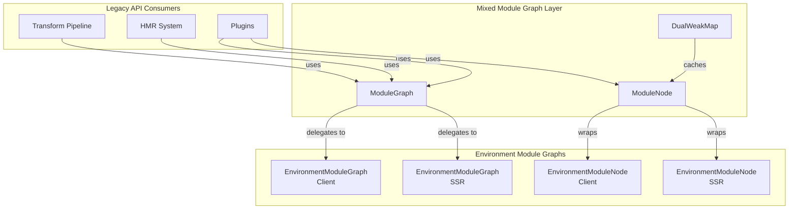
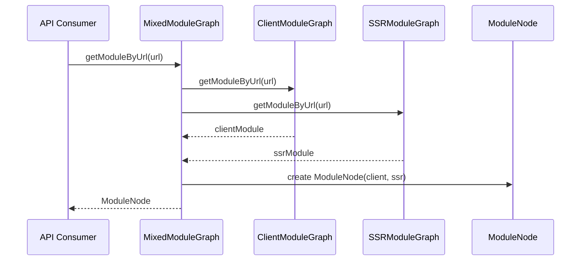
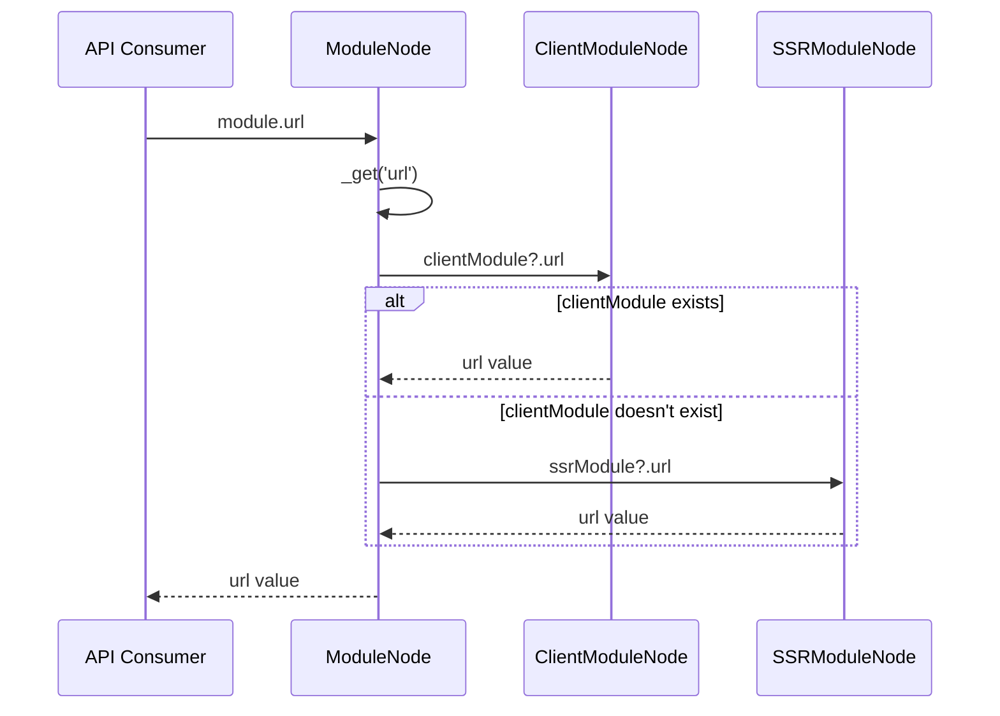
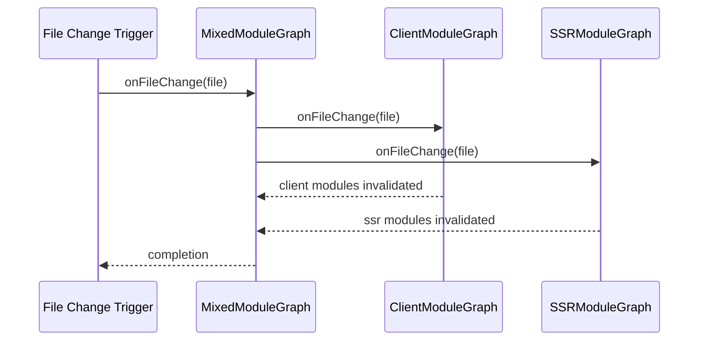
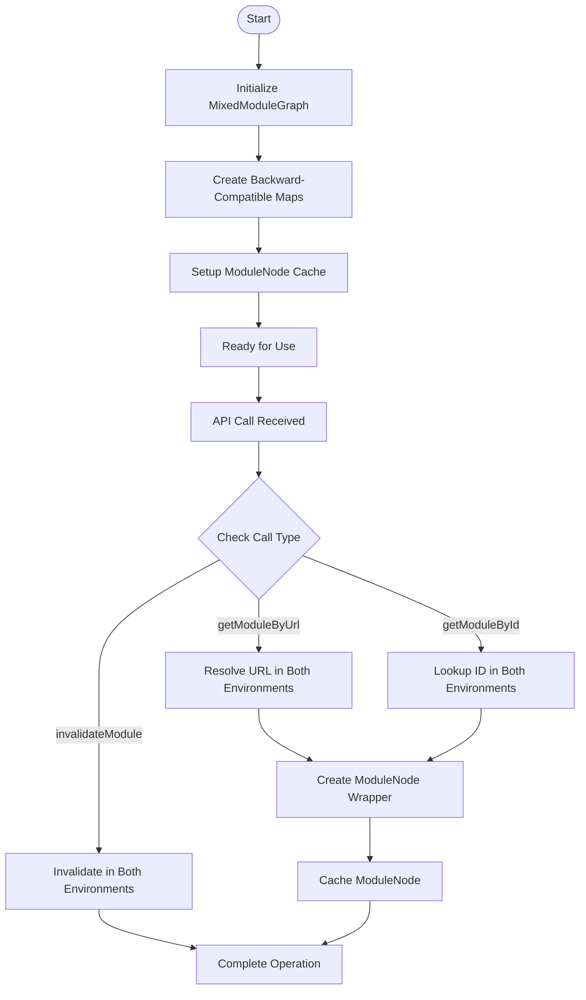
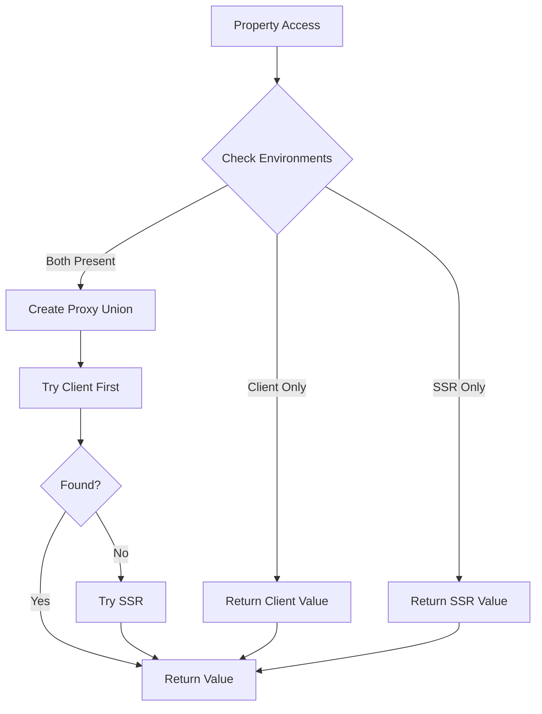

# Mixed Module Graph Module

## Introduction

The mixed-module-graph module provides backward compatibility for Vite's module graph system during the transition from a unified module graph to environment-specific module graphs. It acts as a compatibility layer that bridges the gap between the legacy unified module graph API and the new environment-specific module graph architecture.

## Purpose and Core Functionality

The primary purpose of this module is to maintain backward compatibility for the Vite ecosystem while enabling the new environment-specific module graph system. It creates a unified interface that aggregates module information from both client and SSR (Server-Side Rendering) environments, allowing existing code to continue working without breaking changes.

### Key Responsibilities

1. **Backward Compatibility**: Provides a unified `ModuleNode` and `ModuleGraph` interface that works with both client and SSR environments
2. **Environment Aggregation**: Combines module information from multiple environments into a single coherent view
3. **API Compatibility**: Maintains the existing module graph API while internally delegating to environment-specific implementations
4. **Transition Management**: Facilitates the gradual migration from unified to environment-specific module graphs

## Architecture and Component Relationships

### Core Components

#### ModuleNode Class
The `ModuleNode` class represents a module in the mixed module graph. It acts as a proxy that aggregates data from both client and SSR environment module nodes.

**Key Properties:**
- `_clientModule`: Reference to the client environment module node
- `_ssrModule`: Reference to the SSR environment module node
- `_moduleGraph`: Reference to the parent mixed module graph

**Key Methods:**
- `_get()`: Retrieves property values from either client or SSR module
- `_set()`: Sets property values on both client and SSR modules
- `_getModuleSetUnion()`: Combines module sets from both environments
- `_getModuleInfoUnion()`: Creates a proxy that merges module info from both environments

#### ModuleGraph Class
The `ModuleGraph` class manages the collection of module nodes and provides backward-compatible APIs for module graph operations.

**Key Properties:**
- `_moduleGraphs`: References to client and SSR environment module graphs
- `urlToModuleMap`: Combined URL to module mapping
- `idToModuleMap`: Combined ID to module mapping
- `fileToModulesMap`: Combined file to modules mapping
- `moduleNodeCache`: Cache for backward-compatible module nodes

#### DualWeakMap Class
A specialized map that uses weak references to cache module node relationships between client and SSR environments.

### Architecture Diagram

## Data Flow and Component Interactions

### Module Resolution Flow

### Property Access Flow

### Module Invalidation Flow

## Integration with Other Modules

### Relationship with Environment Module Graph
The mixed module graph depends on the [environment-module-graph](environment-module-graph.md) module, which provides the environment-specific module graph implementations. The mixed module graph acts as a facade that aggregates and proxies requests to these environment-specific graphs.

### Integration with HMR System
The mixed module graph integrates with the [hmr](hmr.md) system to provide module invalidation and hot update capabilities. When modules are invalidated, the mixed module graph ensures both client and SSR environments are properly updated.

### Integration with Transform Pipeline
The mixed module graph works with the [dev-server](dev-server.md) module's transform pipeline to cache and retrieve module transformation results for both environments.

## Process Flows

### Module Graph Construction

### Property Access Union Logic

## Key Design Patterns

### 1. Proxy Pattern
The `ModuleNode` class uses the proxy pattern to provide a unified interface over potentially different client and SSR module nodes. Property access is dynamically routed to the appropriate environment module.

### 2. Facade Pattern
The `ModuleGraph` class acts as a facade, providing a simplified interface that hides the complexity of managing multiple environment-specific module graphs.

### 3. Cache Pattern
The `DualWeakMap` implements a caching strategy using weak references to avoid memory leaks while providing efficient lookup of existing module node wrappers.

### 4. Union Pattern
For properties that exist in both environments, the module creates union objects or proxies that combine information from both client and SSR modules.

## Backward Compatibility Strategy

The mixed module graph implements several strategies to maintain backward compatibility:

1. **API Compatibility**: All existing methods and properties are preserved
2. **Behavior Compatibility**: Union operations maintain similar behavior to the original unified graph
3. **Type Compatibility**: Type definitions remain compatible with existing code
4. **Gradual Migration**: Allows ecosystem to migrate at its own pace

## Performance Considerations

1. **Lazy Evaluation**: Module nodes are created only when accessed
2. **Caching**: Module node wrappers are cached to avoid recreation
3. **Efficient Unions**: Set and map operations are optimized to avoid unnecessary iterations
4. **Weak References**: Cache uses weak references to prevent memory leaks

## Future Considerations

The mixed module graph is designed as a transitional solution. As the ecosystem migrates to environment-specific module graphs, this module may eventually be deprecated in favor of direct usage of environment-specific graphs.

## Related Documentation

- [Environment Module Graph](environment-module-graph.md) - Environment-specific module graph implementation
- [HMR System](hmr.md) - Hot module replacement system integration
- [Dev Server](dev-server.md) - Development server and transform pipeline integration