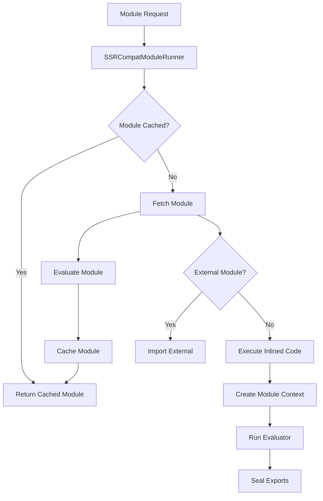
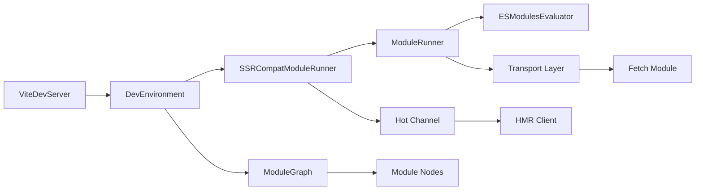
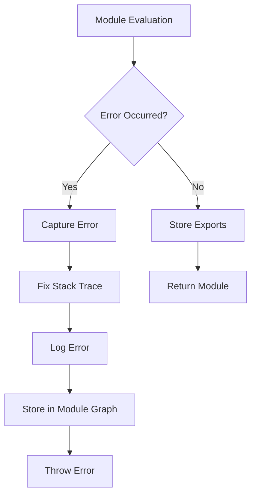

# Module Execution

The module-execution module is a core component of Vite's SSR (Server-Side Rendering) system, responsible for managing the runtime execution of JavaScript modules in server environments. It provides the infrastructure for loading, evaluating, and managing modules during SSR operations.

## Overview

The module-execution module serves as the bridge between Vite's development server and the actual execution of modules in Node.js environments. It handles the complexities of module loading, circular dependency detection, error handling, and hot module replacement (HMR) support for server-side rendering scenarios.

## Core Components

### SSRCompatModuleRunner

The `SSRCompatModuleRunner` is a specialized extension of the base `ModuleRunner` class that provides SSR-specific functionality. It integrates with Vite's development environment to handle server-side module execution with proper error handling and debugging support.

**Key Features:**
- Extends the base `ModuleRunner` with SSR-specific behavior
- Integrates with Vite's development environment and module graph
- Provides enhanced error handling with stack trace fixing
- Manages module caching and invalidation

### ServerModuleRunnerOptions

The `ServerModuleRunnerOptions` interface defines the configuration options for creating server-side module runners. It extends the base `ModuleRunnerOptions` with server-specific settings.

**Configuration Options:**
- `hmr`: Controls HMR behavior (disabled or with custom logger)
- `evaluator`: Custom module evaluator for code execution
- `sourcemapInterceptor`: Source map handling configuration

### RunnerImportResult

The `RunnerImportResult` interface represents the result of importing a module through the runner system, providing both the module exports and dependency information.

**Structure:**
- `module`: The imported module's exports
- `dependencies`: Array of file paths for the module's dependencies

## Architecture

### Module Execution Flow



### Integration with Vite Dev Server



### Error Handling Architecture



## Key Features

### 1. Module Loading and Evaluation

The module-execution system provides sophisticated module loading capabilities:

- **URL Resolution**: Handles various URL formats (file paths, server paths, relative paths)
- **Module Caching**: Implements intelligent caching to avoid redundant evaluations
- **Circular Dependency Detection**: Prevents infinite loops in module loading
- **External Module Support**: Seamlessly handles both inlined and external modules

### 2. Error Handling and Debugging

Comprehensive error handling ensures reliable SSR operations:

- **Stack Trace Fixing**: Corrects error stack traces for better debugging
- **Error Storage**: Persists errors in the module graph for inspection
- **Logging Integration**: Integrates with Vite's logging system for consistent error reporting
- **Graceful Degradation**: Handles module loading failures gracefully

### 3. Hot Module Replacement (HMR)

The system supports HMR for server-side modules:

- **Transport Layer**: Custom transport implementation for server environments
- **HMR Client**: Specialized HMR client for server-side operations
- **Module Invalidation**: Proper invalidation and re-evaluation of changed modules
- **State Preservation**: Maintains module state during hot updates

### 4. Source Map Support

Advanced source map handling for debugging:

- **Source Map Interception**: Intercepts and processes source maps
- **Stack Trace Enhancement**: Enhances error stack traces with original source information
- **Node.js Integration**: Leverages Node.js source map capabilities when available

## Usage Patterns

### Basic Module Loading

```typescript
// Load a module for SSR
const module = await ssrLoadModule('/src/app.js', server)
```

### Custom Module Runner Creation

```typescript
// Create a server module runner with custom options
const runner = createServerModuleRunner(environment, {
  hmr: { logger: customLogger },
  evaluator: customEvaluator
})
```

### Programmatic Module Import

```typescript
// Import modules programmatically
const { module, dependencies } = await runnerImport<ModuleType>(
  './path/to/module.js',
  config
)
```

## Integration Points

### With Module Runner

The module-execution module extends the [module-runner](module-runner.md) system with SSR-specific functionality. It leverages the base `ModuleRunner` class and `ESModulesEvaluator` for core module execution while adding server-side enhancements.

### With Dev Server

Integration with the [dev-server](dev-server.md) provides:
- Environment-specific module graphs
- Hot channel communication
- Module transformation and fetching
- Request handling and caching

### With HMR System

The [hmr](hmr.md) and [hmr-shared](hmr-shared.md) modules provide:
- Hot update propagation
- Module invalidation
- Client-server communication
- State management during updates

## Performance Considerations

### Caching Strategy

The module-execution system implements multiple levels of caching:

1. **Module Node Caching**: Caches evaluated module nodes to avoid re-evaluation
2. **Concurrent Request Handling**: Prevents duplicate requests for the same module
3. **Transport Caching**: Leverages transport-level caching for module fetching
4. **Dependency Tracking**: Tracks and caches module dependencies efficiently

### Memory Management

- **Module Graph Cleanup**: Proper cleanup of module references
- **Cache Invalidation**: Intelligent cache invalidation based on file changes
- **Resource Disposal**: Proper disposal of resources on environment shutdown

## Error Scenarios

### Common Error Types

1. **Module Not Found**: When requested modules cannot be resolved
2. **Evaluation Errors**: Syntax or runtime errors during module evaluation
3. **Circular Dependencies**: Detected circular import chains
4. **External Module Failures**: Failures in importing external modules
5. **Transport Errors**: Communication failures with the transport layer

### Error Recovery

The system implements several recovery mechanisms:
- **Retry Logic**: Automatic retry for transient failures
- **Fallback Strategies**: Fallback to alternative module resolution
- **Graceful Degradation**: Continue operation with reduced functionality
- **Error Propagation**: Proper error propagation to calling code

## Future Enhancements

### Planned Improvements

- **Enhanced Source Map Support**: Better integration with modern debugging tools
- **Performance Optimizations**: Improved caching and evaluation strategies
- **Error Recovery**: More sophisticated error recovery mechanisms
- **Monitoring**: Enhanced monitoring and diagnostics capabilities

### Experimental Features

Several features are marked as experimental and may evolve:
- **Server Module Runner**: The `createServerModuleRunner` function
- **Runner Import**: The `runnerImport` utility function
- **Custom Evaluators**: Support for custom module evaluators
- **Advanced HMR**: Enhanced HMR capabilities for server environments

## Best Practices

### Module Organization

- Keep modules focused and single-purpose
- Avoid deep circular dependencies
- Use proper error handling in module code
- Leverage module caching effectively

### Performance Optimization

- Minimize synchronous operations in module evaluation
- Use appropriate caching strategies
- Monitor memory usage in long-running processes
- Implement proper cleanup procedures

### Error Handling

- Always handle module loading errors gracefully
- Use appropriate logging levels for different error types
- Implement proper error recovery mechanisms
- Test error scenarios thoroughly

## Conclusion

The module-execution module is a critical component of Vite's SSR infrastructure, providing robust and efficient module execution capabilities for server-side rendering scenarios. Its sophisticated architecture handles the complexities of module loading, evaluation, and management while providing excellent developer experience through features like HMR and enhanced debugging capabilities.