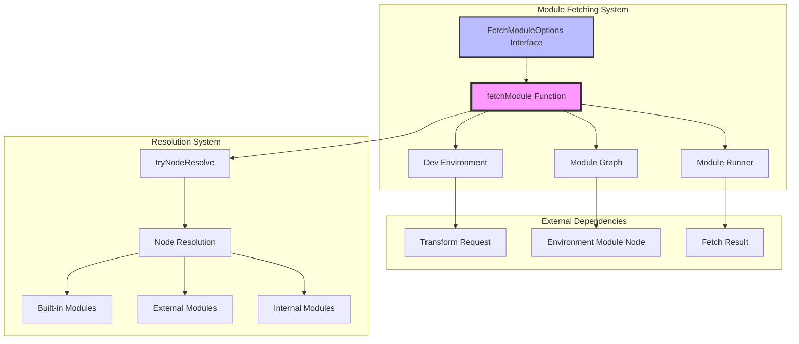
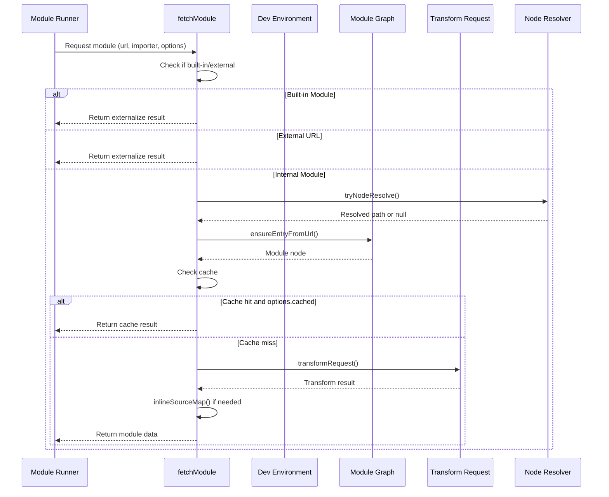
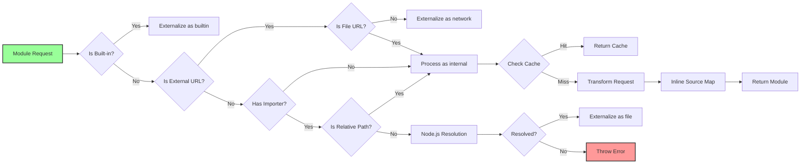

# Module Fetching Documentation

## Introduction

The module-fetching module is a core component of Vite's SSR (Server-Side Rendering) system responsible for fetching, transforming, and preparing JavaScript modules for execution in server environments. It acts as a bridge between the development environment and the module runner, handling module resolution, transformation, and source map management.

## Architecture Overview



## Core Components

### FetchModuleOptions Interface

The `FetchModuleOptions` interface defines configuration options for the module fetching process:

```typescript
export interface FetchModuleOptions {
  cached?: boolean              // Whether to use cached results
  inlineSourceMap?: boolean     // Whether to inline source maps
  startOffset?: number          // Line offset for source mapping
}
```

### fetchModule Function

The `fetchModule` function is the main entry point for module fetching operations. It handles:

1. **Module Type Detection**: Identifies built-in, external, and internal modules
2. **Module Resolution**: Resolves module paths using Node.js resolution algorithm
3. **Transformation**: Applies Vite transformations to modules
4. **Source Map Management**: Handles source map generation and inlining
5. **Caching**: Manages module cache validation

## Data Flow



## Module Resolution Process



## Source Map Handling

The module-fetching system includes sophisticated source map management:

1. **Inline Source Maps**: Automatically inlines source maps for better debugging
2. **Source Map URL Generation**: Generates proper source map URLs for module identification
3. **Offset Management**: Handles line offsets for accurate error reporting
4. **Map Cleanup**: Removes duplicate source map references to reduce payload size

## Integration with Other Modules

### Module Runner Integration
The fetchModule function integrates with the [module-runner](module-runner.md) system by:
- Providing `FetchResult` objects that the module runner can execute
- Handling module externalization for built-in and network modules
- Managing source maps for debugging support

### Dev Server Integration
Works closely with the [dev-server](dev-server.md) through:
- `DevEnvironment` for configuration and context
- `TransformRequest` for module transformation
- `ModuleGraph` for dependency tracking

### SSR System Integration
As part of the SSR subsystem, it coordinates with:
- [ssr-configuration](ssr-configuration.md) for SSR options
- [module-transformation](module-transformation.md) for code transforms
- [module-execution](module-execution.md) for module loading

## Error Handling

The module-fetching system implements comprehensive error handling:

1. **Module Not Found**: Throws `ERR_MODULE_NOT_FOUND` for unresolved modules
2. **Transform Failures**: Provides detailed error messages for transformation issues
3. **Invalid URLs**: Handles malformed URLs gracefully
4. **File System Errors**: Manages file system access issues

## Performance Considerations

1. **Caching Strategy**: Leverages module graph caching to avoid redundant transformations
2. **Lazy Resolution**: Only resolves modules when necessary
3. **Source Map Optimization**: Removes duplicate source maps to reduce payload size
4. **Conditional Processing**: Skips unnecessary steps based on module type

## Usage Examples

### Basic Module Fetching
```typescript
const result = await fetchModule(environment, '/src/main.js')
// Returns transformed module code with source maps
```

### Cached Module Fetching
```typescript
const result = await fetchModule(environment, '/src/utils.js', undefined, {
  cached: true
})
// Returns cache confirmation if module is cached
```

### External Module Handling
```typescript
const result = await fetchModule(environment, 'fs', '/src/main.js')
// Returns externalize result for built-in modules
```

## API Reference

### fetchModule(environment, url, importer?, options?)

**Parameters:**
- `environment`: DevEnvironment - The development environment context
- `url`: string - The module URL to fetch
- `importer`: string (optional) - The importing module path
- `options`: FetchModuleOptions (optional) - Fetch configuration options

**Returns:** Promise<FetchResult> - The fetched module result

**Throws:**
- Error with code `ERR_MODULE_NOT_FOUND` when module cannot be resolved
- Error when transformation fails

## Future Considerations

1. **ESM/CJS Detection**: Improved detection of module types for better compatibility
2. **Performance Monitoring**: Enhanced metrics for fetch performance
3. **Plugin Integration**: Potential plugin hooks for custom fetch behavior
4. **Bundle Analysis**: Integration with bundle analysis tools for optimization insights