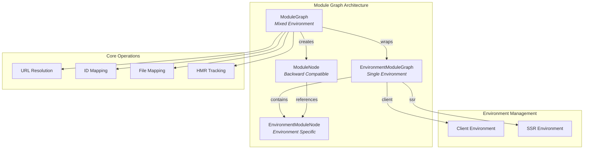
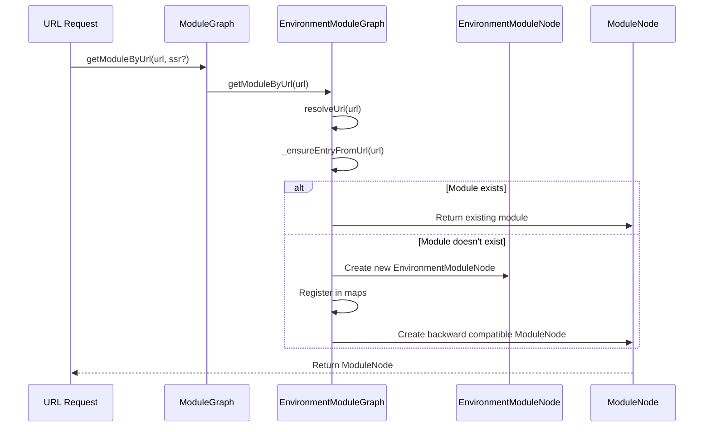

# Module Graph Documentation

## Overview

The module-graph module is a core component of Vite's development server that manages the dependency graph of modules in both client and server-side rendering (SSR) environments. It provides a unified interface for tracking module relationships, handling hot module replacement (HMR), and managing module invalidation across different execution environments.

## Purpose

The module graph serves as the central nervous system of Vite's module management system, enabling:

- **Dependency Tracking**: Maintains relationships between modules (imports, exports, HMR dependencies)
- **Environment Coordination**: Bridges client and SSR environments with backward compatibility
- **Hot Module Replacement**: Tracks HMR boundaries and accepted dependencies
- **Module Invalidation**: Manages soft and hard invalidation of modules during development
- **Transform Result Caching**: Coordinates transform results across environments

## Architecture



## Core Components

### 1. ModuleGraph (Mixed Environment)

The main entry point that provides backward compatibility by wrapping both client and SSR environment module graphs. It creates unified `ModuleNode` instances that bridge the gap between different environments.

**Key Responsibilities:**
- Maintains backward compatibility with pre-Vite 6.x APIs
- Creates unified module nodes that represent modules across environments
- Provides union operations for module relationships
- Coordinates invalidation across environments

**Detailed Documentation**: [Mixed Module Graph](mixed-module-graph.md)

### 2. EnvironmentModuleGraph (Single Environment)

Environment-specific module graph that manages modules for a single execution environment (client or SSR).

**Key Responsibilities:**
- URL-to-module resolution and caching
- ID-to-module mapping
- File-to-modules mapping (handling multiple modules per file with different queries)
- Module information updates and dependency tracking
- Transform result management

**Detailed Documentation**: [Environment Module Graph](environment-module-graph.md)

### 3. ModuleNode (Backward Compatible)

Wrapper node that provides a unified interface for accessing module information across environments.

**Key Responsibilities:**
- Property union between client and SSR modules
- Relationship management (imports, importers, HMR dependencies)
- Transform result access for both environments
- HMR state coordination

**Detailed Documentation**: [Mixed Module Graph](mixed-module-graph.md)

### 4. EnvironmentModuleNode (Environment Specific)

Core module node containing all module-specific information for a single environment.

**Key Responsibilities:**
- Module metadata storage (URL, ID, file, type)
- Dependency relationship tracking
- HMR acceptance and export tracking
- Transform result and invalidation state management
- Static import URL tracking for soft invalidation

**Detailed Documentation**: [Environment Module Graph](environment-module-graph.md)

## Data Flow



## Key Features

### 1. Backward Compatibility Layer

The module graph maintains backward compatibility with pre-Vite 6.x APIs by providing a mixed environment approach that was the standard before environment-specific module graphs were introduced.

### 2. Environment Coordination

Manages the relationship between client and SSR environments, ensuring that module changes are properly synchronized across both execution contexts.

### 3. Soft and Hard Invalidation

Implements a sophisticated invalidation system:
- **Soft Invalidation**: Only updates import timestamps, preserving transform results
- **Hard Invalidation**: Completely clears transform results and forces re-transformation

### 4. HMR Integration

Deep integration with Vite's HMR system, tracking:
- Accepted HMR dependencies
- Accepted HMR exports
- Self-accepting modules
- HMR timestamps and invalidation states

## Integration with Other Modules

The module graph integrates closely with several other Vite modules:

- **[dev-server](dev-server.md)**: Provides module resolution and transformation coordination
- **[hmr](hmr.md)**: Enables hot module replacement tracking and invalidation
- **[transform-request](transform-request.md)**: Manages transform results and caching
- **[plugin-container](plugin-container.md)**: Coordinates with plugin transformations

## Usage Examples

### Basic Module Retrieval

```typescript
// Get module by URL
const module = await moduleGraph.getModuleByUrl('/src/main.js')

// Get module by ID
const module = moduleGraph.getModuleById('/project/src/main.js')

// Get modules by file
const modules = moduleGraph.getModulesByFile('/project/src/main.js')
```

### Module Invalidation

```typescript
// Invalidate a single module
moduleGraph.invalidateModule(module)

// Invalidate all modules
moduleGraph.invalidateAll()

// Soft invalidate (preserve transform results)
moduleGraph.invalidateModule(module, new Set(), timestamp, false, true)
```

### Module Information Updates

```typescript
// Update module dependencies
await moduleGraph.updateModuleInfo(
  module,
  importedModules,
  importedBindings,
  acceptedModules,
  acceptedExports,
  isSelfAccepting,
  staticImportedUrls
)
```

## Performance Considerations

1. **Caching Strategy**: Uses multiple levels of caching (URL, ID, file mappings) to avoid repeated resolutions
2. **Lazy Resolution**: Modules are only resolved when actually requested
3. **Memory Management**: Automatically cleans up modules that are no longer imported
4. **Union Operations**: Optimized union operations for cross-environment access

## Future Considerations

The module graph is designed to be deprecated in favor of environment-specific module graphs, but maintains backward compatibility for the ecosystem. New development should prefer using `EnvironmentModuleGraph` directly when environment context is known.