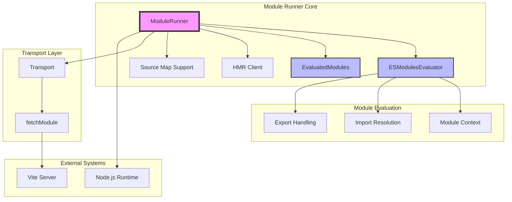
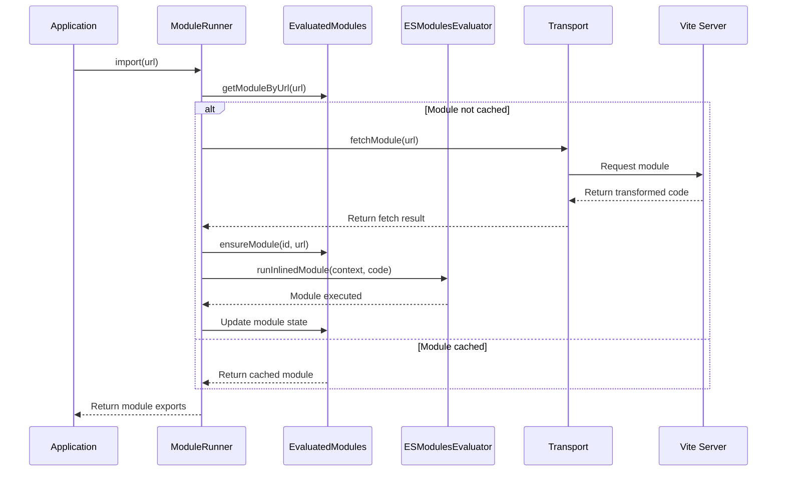

# Module Runner

The Module Runner is a core component of Vite that provides a runtime environment for executing JavaScript modules in various contexts, including server-side rendering (SSR), development environments, and build processes. It acts as a bridge between Vite's build system and the actual module execution, handling module loading, evaluation, caching, and hot module replacement (HMR).

## Overview

The Module Runner is designed to execute modules that have been transformed by Vite's build pipeline. It provides a sandboxed environment with proper module resolution, dependency management, and source map support. The runner supports both inline modules (transformed code) and external modules (native Node.js modules or external dependencies).

### Key Features

- **Module Evaluation**: Executes transformed JavaScript modules in a controlled environment
- **Module Caching**: Intelligent caching system to avoid re-evaluating unchanged modules
- **Hot Module Replacement**: Supports HMR for development workflows
- **Source Map Support**: Provides accurate stack traces and debugging information
- **Dependency Management**: Handles module imports, exports, and circular dependencies
- **Transport Abstraction**: Pluggable transport layer for communication with Vite server

## Architecture



## Core Components

### ModuleRunner

The main orchestrator that coordinates module loading, evaluation, and caching. It provides the public API for importing modules and manages the entire lifecycle of module execution.

**Key Responsibilities:**
- Module import resolution and caching
- HMR integration
- Source map support setup
- Transport layer management
- Error handling and debugging

For detailed implementation details, see [runner-core](runner-core.md).

### ESModulesEvaluator

Implements the `ModuleEvaluator` interface to execute ES modules using AsyncFunction constructor. This approach provides better compatibility across different JavaScript environments compared to VM modules.

**Key Features:**
- Uses AsyncFunction for module evaluation
- Supports both inline and external modules
- Provides source offset tracking for accurate error reporting

For detailed implementation details, see [esm-evaluator](esm-evaluator.md).

### EvaluatedModules

Manages the module graph and caching system. Tracks module dependencies, evaluation state, and provides efficient lookup mechanisms.

**Key Functions:**
- Module graph management
- Dependency tracking
- Module invalidation
- Source map extraction

For detailed implementation details, see [evaluated-modules](evaluated-modules.md).

### Source Map Support

Provides comprehensive source map support for accurate debugging and error reporting. Includes stack trace interception and original position mapping.

**Components:**
- `DecodedMap`: Handles source map decoding and resolution
- Stack trace interceptor: Overrides `Error.prepareStackTrace`
- Position mapping: Maps compiled positions to original source positions

For detailed implementation details, see [sourcemap-support](sourcemap-support.md).

## Module Evaluation Process



## Transport Layer

The Module Runner uses a pluggable transport system to communicate with the Vite server. This abstraction allows the runner to work in different environments (Node.js, browser, worker threads) with different communication mechanisms.

**Transport Responsibilities:**
- Module fetching from Vite server
- HMR message passing
- Error reporting and debugging information

## Hot Module Replacement (HMR)

The Module Runner integrates with Vite's HMR system to provide hot reloading capabilities. It maintains HMR contexts for each module and handles module updates without full page reloads.

**HMR Features:**
- Module-level hot reloading
- Dependency graph updates
- State preservation during updates
- Error boundary handling

## Error Handling and Debugging

The Module Runner provides comprehensive error handling and debugging support:

- **Source Map Integration**: Accurate stack traces pointing to original source code
- **Debug Mode**: Optional debug logging for module loading and evaluation
- **Error Context**: Rich error information including import chain and module context
- **Circular Dependency Detection**: Prevents infinite loops in module imports

## Integration with Other Modules

The Module Runner integrates with several other Vite modules:

- **[dev-server](dev-server.md)**: Provides the development server and transport layer
- **[hmr](hmr.md)**: Handles hot module replacement logic
- **[ssr](ssr.md)**: Server-side rendering integration
- **[config](config.md)**: Configuration and options management

## Type Definitions and Interfaces

The Module Runner defines comprehensive TypeScript interfaces and types for all its components. These types ensure type safety and provide clear contracts for module evaluation, context management, and configuration options.

For detailed type definitions, see [types-and-interfaces](types-and-interfaces.md).

## Usage Examples

### Basic Module Import

```javascript
const runner = new ModuleRunner({
  transport: createNodeTransport()
})

// Import a module
const module = await runner.import('./src/main.js')
```

### With HMR Support

```javascript
const runner = new ModuleRunner({
  transport: createNodeTransport(),
  hmr: {
    logger: console
  }
})
```

### Custom Module Evaluator

```javascript
const customEvaluator = {
  async runInlinedModule(context, code) {
    // Custom evaluation logic
  },
  async runExternalModule(filepath) {
    // Custom external module loading
  }
}

const runner = new ModuleRunner({
  transport: createNodeTransport(),
  evaluator: customEvaluator
})
```

## Performance Considerations

- **Module Caching**: Modules are cached after first evaluation to avoid re-execution
- **Concurrent Requests**: Multiple concurrent imports of the same module are deduplicated
- **Lazy Evaluation**: Modules are only evaluated when actually imported
- **Memory Management**: Proper cleanup of module caches and HMR listeners

## Security Considerations

- **Code Sandboxing**: Modules are executed in a controlled context
- **Import Validation**: All imports are validated and resolved through the transport layer
- **Source Map Validation**: Source maps are validated before use
- **Error Isolation**: Module errors are properly isolated and reported