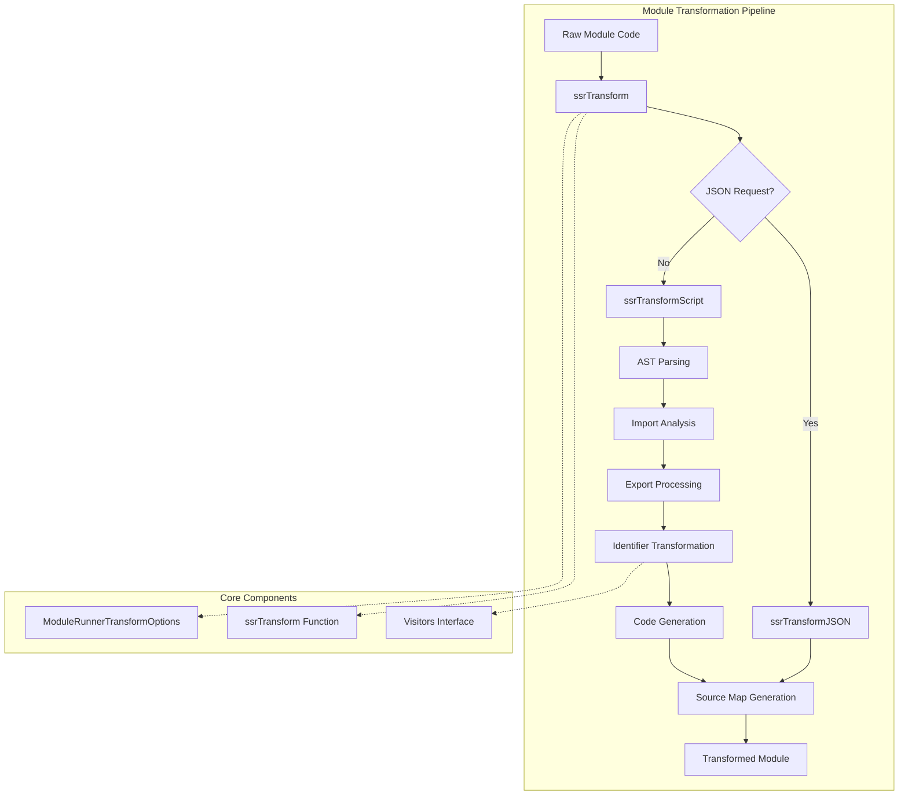
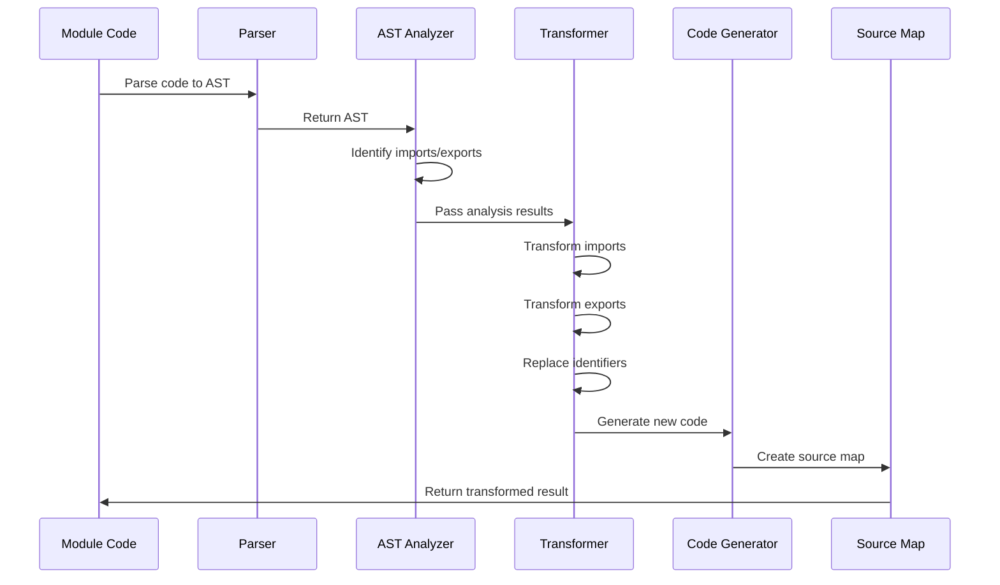
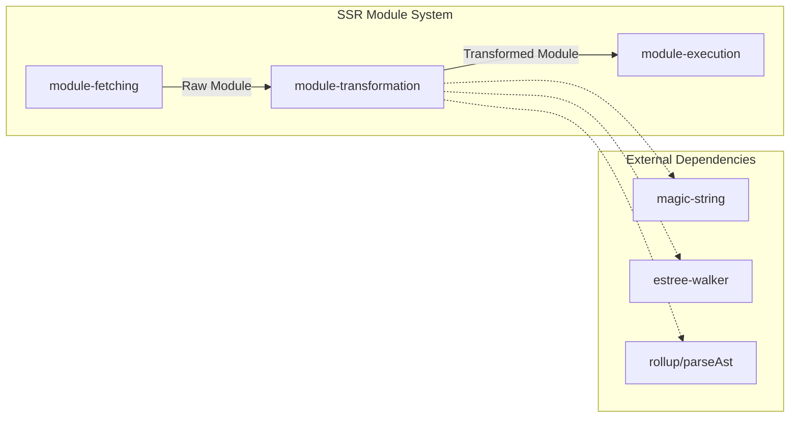

# Module Transformation Module

## Introduction

The module-transformation module is a critical component of Vite's SSR (Server-Side Rendering) system that transforms JavaScript/TypeScript modules to make them compatible with server-side execution. It converts ES modules into a format that can be safely executed in Node.js environments while preserving the original module semantics and maintaining source map support.

## Core Purpose

This module serves as the bridge between browser-oriented ES modules and server-compatible code by:
- Transforming ES module syntax (`import`/`export`) into CommonJS-compatible equivalents
- Hoisting imports to ensure proper execution order
- Converting dynamic imports and `import.meta` references
- Preserving source maps for debugging
- Handling various export patterns (named, default, re-exports)

## Architecture Overview



## Key Components

### 1. ssrTransform Function

The main transformation function that orchestrates the entire process:

```typescript
async function ssrTransform(
  code: string,
  inMap: SourceMap | { mappings: '' } | null,
  url: string,
  originalCode: string,
  options?: ModuleRunnerTransformOptions
): Promise<TransformResult | null>
```

**Responsibilities:**
- Route JSON requests to specialized transformer
- Parse AST using Rollup's parser
- Manage transformation state and dependencies
- Generate final transformed code and source maps

### 2. Visitors Interface

Defines the contract for AST traversal callbacks:

```typescript
interface Visitors {
  onIdentifier: (node: Identifier, parent: Node, parentStack: Node[]) => void
  onImportMeta: (node: Node) => void
  onDynamicImport: (node: Node) => void
  onStatements: (statements: Node[]) => void
}
```

**Purpose:**
- Handle identifier transformations
- Process `import.meta` references
- Transform dynamic imports
- Manage statement-level optimizations

### 3. ModuleRunnerTransformOptions

Configuration interface for transformation behavior:

```typescript
interface ModuleRunnerTransformOptions {
  json?: {
    stringify?: boolean
  }
}
```

## Transformation Process Flow



## Detailed Transformation Steps

### 1. Import Statement Processing

```javascript
// Original
import { foo, bar } from './utils'
import React from 'react'

// Transformed
const __vite_ssr_import_0__ = await __vite_ssr_import__("./utils", ["foo","bar"])
const __vite_ssr_import_1__ = await __vite_ssr_import__("react", ["default"])
```

**Key Features:**
- Hoists imports to top of module
- Creates unique import identifiers
- Preserves import metadata for proper binding

### 2. Export Statement Processing

```javascript
// Named exports
export const foo = 1
// Becomes: __vite_ssr_exportName__("foo", () => { try { return foo } catch {} })

// Default export
export default function() {}
// Becomes: const __vite_ssr_export_default__ = function() {}
//          __vite_ssr_exportName__("default", () => { try { return __vite_ssr_export_default__ } catch {} })
```

### 3. Identifier Replacement

```javascript
// Original
import { foo } from './utils'
console.log(foo)

// Transformed
const __vite_ssr_import_0__ = await __vite_ssr_import__("./utils", ["foo"])
console.log((0, __vite_ssr_import_0__.foo))
```

**Special Handling:**
- Wraps method calls to prevent `this` binding issues
- Preserves destructuring patterns
- Handles class and function declarations

### 4. Dynamic Import Transformation

```javascript
// Original
const mod = await import('./dynamic')

// Transformed
const mod = await __vite_ssr_dynamic_import__('./dynamic')
```

## Integration with SSR System



## Error Handling

The transformation process includes comprehensive error handling:

1. **Parse Error Enhancement**: Catches and enhances Rollup parsing errors with file location and code frames
2. **Scope Analysis**: Prevents incorrect identifier replacements through sophisticated scope tracking
3. **Fallback Mechanisms**: Provides safe fallbacks for export references that might throw errors

## Performance Considerations

- **Single Pass Transformation**: Uses efficient AST walking with minimal passes
- **Source Map Optimization**: Combines source maps only when necessary
- **Memory Management**: Uses WeakSets and Maps for efficient scope tracking
- **String Manipulation**: Leverages MagicString for efficient code transformations

## Dependencies

This module relies on several key dependencies:

- **[magic-string](module-runner.md)**: Efficient string manipulation with source map support
- **[estree-walker](module-runner.md)**: AST traversal utilities
- **[rollup/parseAst](build.md)**: JavaScript/TypeScript parsing
- **[periscopic](module-runner.md)**: Variable name extraction utilities

## Usage Context

The module-transformation is typically used within the SSR pipeline:

1. **[module-fetching](module-fetching.md)**: Retrieves raw module content
2. **module-transformation**: Transforms the module for SSR compatibility
3. **[module-execution](module-execution.md)**: Executes the transformed module

## Configuration Options

The transformation behavior can be customized through:

- **JSON Stringification**: Special handling for JSON modules
- **Source Map Preservation**: Maintains debugging information
- **Import Metadata**: Controls import transformation details

## Security Considerations

- **Code Isolation**: Transformed code runs in controlled SSR context
- **Import Validation**: All imports are validated and tracked
- **Scope Containment**: Prevents variable leakage between modules

This module is essential for enabling Vite's SSR capabilities, providing the necessary transformations to bridge the gap between browser and server module systems while maintaining performance and debugging capabilities.