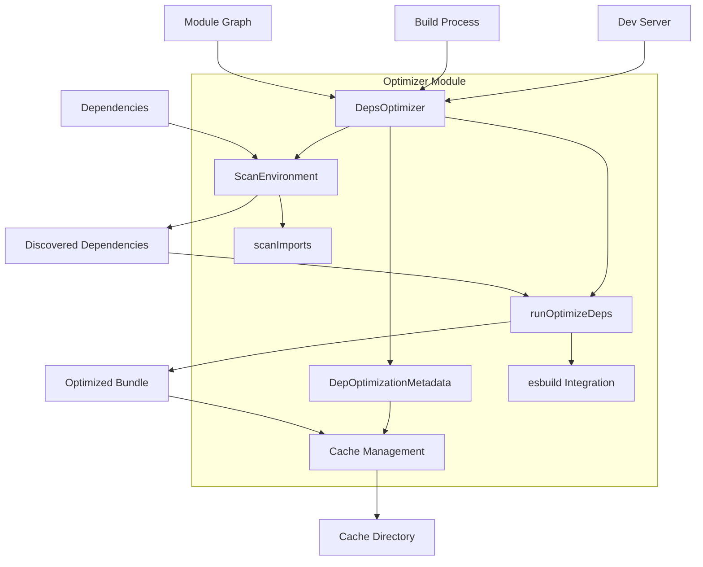

# Vite Optimizer Module

## Overview

The Vite Optimizer module is responsible for dependency optimization and pre-bundling in Vite. It analyzes project dependencies, optimizes them using esbuild, and manages a cache system to improve development server startup performance and build times.

## Purpose

The optimizer serves several critical functions:

1. **Dependency Pre-bundling**: Converts CommonJS and UMD dependencies to ESM format
2. **Performance Optimization**: Reduces the number of modules the browser needs to request
3. **Tree Shaking**: Enables better tree shaking by converting dependencies to ESM
4. **Cache Management**: Maintains a persistent cache of optimized dependencies
5. **Development Experience**: Speeds up cold start times in development

## Architecture



## Core Components

### DepsOptimizer
The main orchestrator that manages the entire optimization process. It coordinates scanning, optimization, and caching operations.

### DepOptimizationMetadata
Manages metadata about optimized dependencies including hashes, file paths, and optimization state. This is crucial for cache invalidation and dependency tracking.

### ScanEnvironment
A specialized environment for scanning dependencies without full server initialization. It provides a lightweight context for dependency discovery and analysis. See [scan-environment.md](scan-environment.md) for detailed documentation.

### DepOptimizationConfig
Configuration interface that defines optimization behavior, including include/exclude patterns, esbuild options, and discovery settings.

## Key Features

### Dependency Discovery
- Automatic scanning of project entry points
- Support for HTML files, JavaScript/TypeScript files, and framework-specific files
- Manual dependency inclusion through configuration
- Glob pattern support for entry point discovery

### Optimization Process
- Uses esbuild for fast bundling and transformation
- Converts CommonJS/UMD to ESM format
- Handles JSX/TSX transformation
- Supports custom file extensions
- Implements code splitting for dynamic imports

### Cache Management
- Persistent caching based on lockfile and configuration hashes
- Automatic cache invalidation when dependencies change
- Graceful handling of corrupted cache states
- Cleanup of stale temporary directories

### Browser Integration
- Generates browser-specific hashes for cache busting
- Manages optimized file URLs and paths
- Handles source map generation and optimization

## Integration Points

### Development Server
The optimizer integrates with the [dev-server](dev-server.md) to provide optimized dependencies during development. It works closely with the [module-graph](module-graph.md) to track dependency relationships.

### Build Process
During build, the optimizer ensures dependencies are properly optimized and included in the final bundle. It coordinates with the [build](build.md) module for production optimization.

### Plugin System
The optimizer uses the [plugin-system](plugin-system.md) and [plugin-container](plugin-container.md) to resolve and transform dependencies during the optimization process.

## Configuration

The optimizer is configured through the `optimizeDeps` option in Vite configuration:

```typescript
interface DepOptimizationOptions {
  include?: string[]
  exclude?: string[]
  needsInterop?: string[]
  esbuildOptions?: EsbuildBuildOptions
  extensions?: string[]
  noDiscovery?: boolean
  holdUntilCrawlEnd?: boolean
  entries?: string | string[]
  force?: boolean
}
```

## Performance Considerations

- **Cold Start**: The optimizer significantly improves cold start times by pre-bundling dependencies
- **Incremental Updates**: Only re-optimizes when dependencies actually change
- **Parallel Processing**: Uses esbuild's parallel processing capabilities
- **Memory Management**: Efficiently manages memory during large optimization runs

## Error Handling

The optimizer includes comprehensive error handling for:
- Missing dependencies
- Resolution failures
- Build errors during optimization
- Cache corruption
- File system operations

## Security

- Validates file paths to prevent directory traversal
- Uses safe file operations for cache management
- Implements proper cleanup of temporary files
- Handles symbolic links safely

## Future Considerations

The optimizer is designed to be extensible and can accommodate:
- Additional bundlers beyond esbuild
- Custom optimization strategies
- Enhanced caching mechanisms
- Support for new module formats