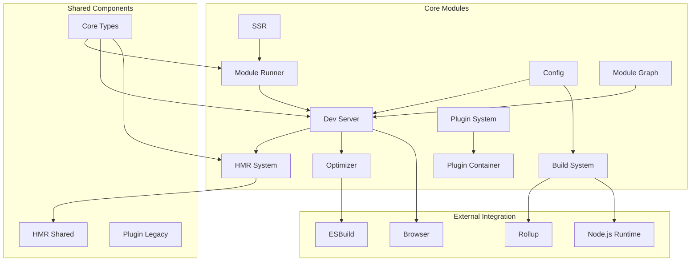

# Vite.js Repository Overview

Vite is a next-generation frontend tooling that provides a fast and lean development experience for modern web projects. It consists of a dev server with Hot Module Replacement (HMR) and a build command that bundles your code with Rollup, pre-configured to output highly optimized static assets.

## Purpose

Vite leverages native ES modules to provide instant server start and lightning-fast Hot Module Replacement (HMR). It offers:

- **Instant Server Start**: No bundling required, starts in milliseconds
- **Lightning Fast HMR**: Hot module replacement that stays fast regardless of app size
- **Rich Features**: TypeScript, JSX, CSS, and more support out of the box
- **Optimized Build**: Pre-configured Rollup build with multi-page and library mode support
- **Universal Plugin Interface**: Compatible with Rollup's plugin interface
- **Fully Typed APIs**: Flexible programmatic APIs with full TypeScript support

## Architecture

## Core Modules

### Module Runner (`packages/vite/src/module-runner`)
Provides runtime environment for executing JavaScript modules in various contexts including SSR, development, and build processes. Handles module loading, evaluation, caching, and HMR with sophisticated source map support and transport abstraction.

### Dev Server (`packages/vite/src/node/server`)
Core development server implementation providing HMR, module transformation, multi-environment support, and WebSocket communication. Manages middleware, file serving, and coordinates with the plugin system for request processing.

### Build System (`packages/vite/src/node/build.ts`)
Production build orchestrator using Rollup with multi-environment support. Handles asset optimization, code splitting, library mode, and generates optimized bundles for different output formats.

### Plugin System (`packages/vite/src/node/plugin.ts`)
Extensibility framework extending Rollup's plugin interface with Vite-specific functionality. Provides comprehensive hook system for config, dev, build, and HMR operations with environment-aware plugin contexts.

### Plugin Container (`packages/vite/src/node/server/pluginContainer.ts`)
Rollup-compatible plugin execution environment managing plugin lifecycle, context provision, and hook orchestration across different Vite environments with sophisticated source map handling.

### Config (`packages/vite/src/node/config.ts`)
Central configuration management supporting multi-environment setups, plugin integration, and backward compatibility. Handles configuration loading, validation, and resolution across client, SSR, and custom environments.

### HMR System (`packages/vite/src/node/server/hmr.ts`)
Hot Module Replacement implementation with multi-environment support, intelligent boundary detection, and WebSocket communication. Manages file change detection, update propagation, and error handling.

### Optimizer (`packages/vite/src/node/optimizer`)
Dependency optimization and pre-bundling using esbuild for improved development performance. Handles CommonJS/UMD to ESM conversion, caching, and browser-specific optimizations.

### Module Graph (`packages/vite/src/node/server`)
Dependency graph management tracking module relationships across client and SSR environments. Provides HMR integration, module invalidation, and transform result caching.

### SSR (`packages/vite/src/node/ssr`)
Server-side rendering support with module fetching, transformation, and execution capabilities. Provides both compatibility and modern runner-based execution environments with HMR integration.

## Shared Components

### HMR Shared (`packages/vite/src/shared/hmr.ts`)
Client-side HMR implementation providing the runtime API for module hot replacement, update queuing, and communication with the development server.

### Core Types (`packages/vite/types`)
Foundational TypeScript interfaces for HMR communication, import meta extensions, glob imports, and plugin metadata ensuring type safety across the ecosystem.

### Plugin Legacy (`packages/plugin-legacy`)
Backward compatibility plugin for legacy browser support with dual-bundle generation, polyfill management, and sophisticated transformation pipeline.

## Key Features

- **Multi-Environment Support**: Separate configurations and module graphs for client, SSR, and custom environments
- **Plugin Ecosystem**: Full Rollup plugin compatibility with Vite-specific enhancements
- **Performance Optimization**: Intelligent caching, dependency optimization, and parallel processing
- **Developer Experience**: Comprehensive error handling, source map support, and debugging tools
- **Type Safety**: Full TypeScript support with comprehensive type definitions
- **Extensibility**: Modular architecture allowing custom environments and plugins

## Integration Points

The repository modules integrate seamlessly to provide a complete development and build solution:

- **Development**: Dev Server → Plugin Container → Module Graph → HMR → Module Runner
- **Build**: Build System → Plugin System → Config → Optimizer → Rollup
- **SSR**: SSR → Module Runner → Dev Server → Transform Pipeline
- **HMR**: HMR System → HMR Shared → WebSocket → Module Graph

This architecture enables Vite to provide exceptional development experience while maintaining flexibility and extensibility for diverse project requirements.