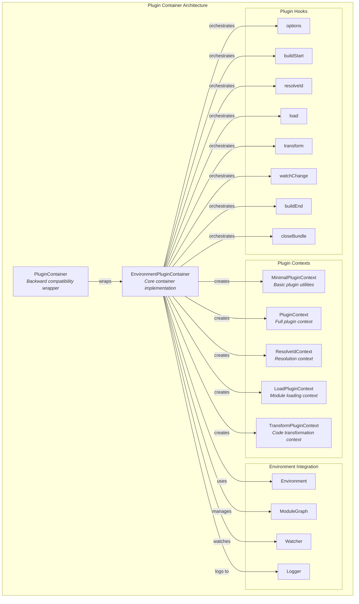
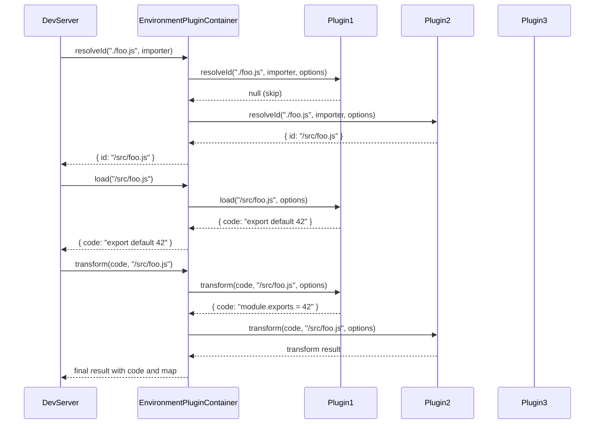
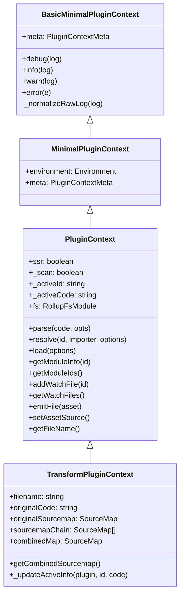
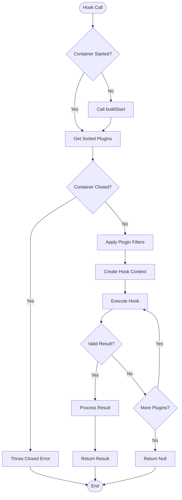
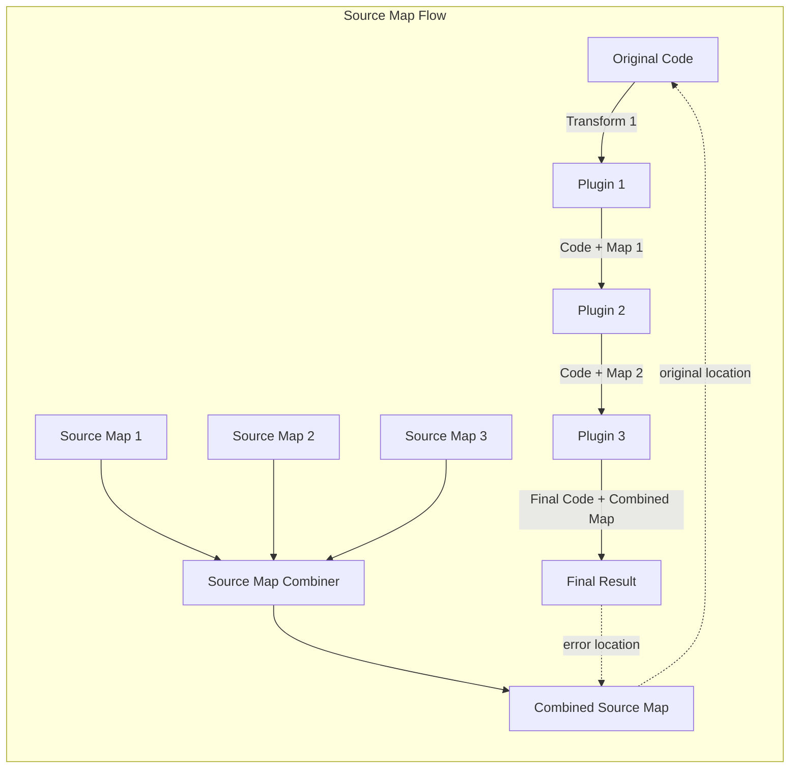
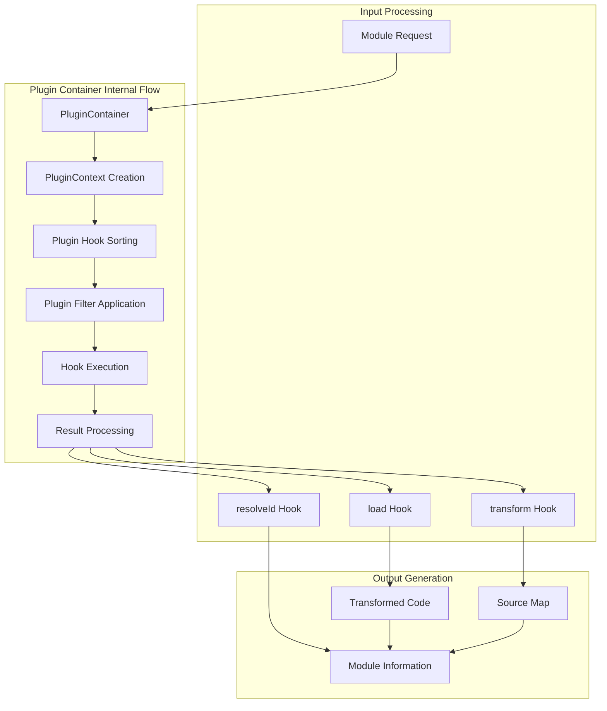
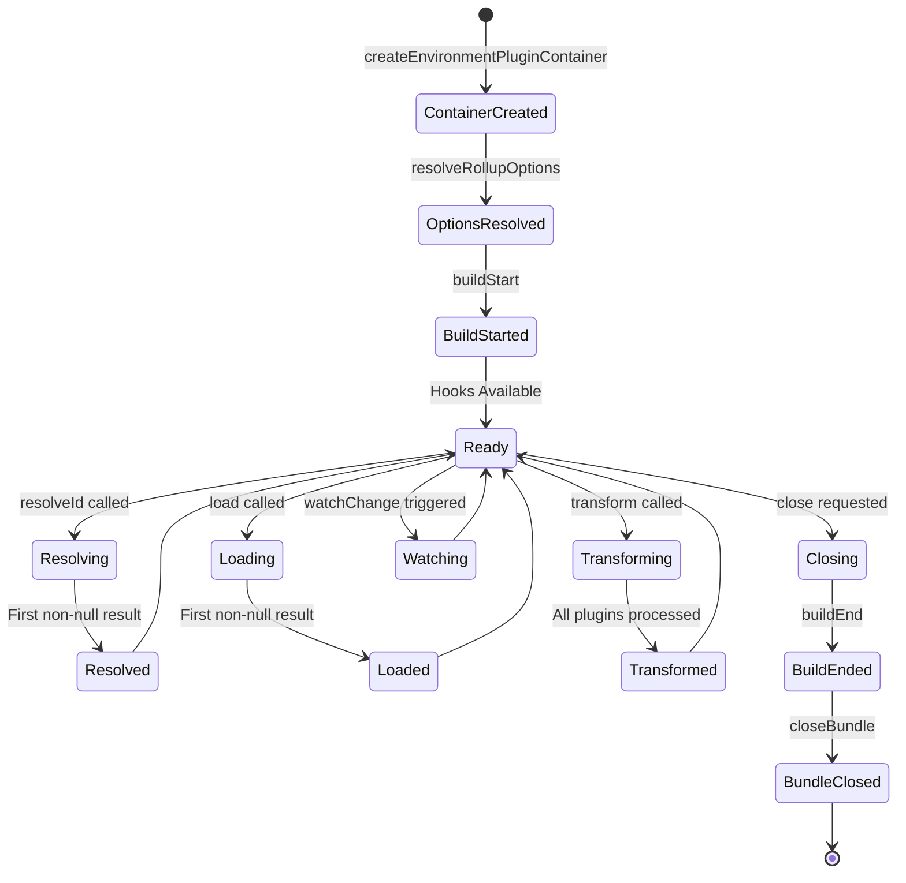
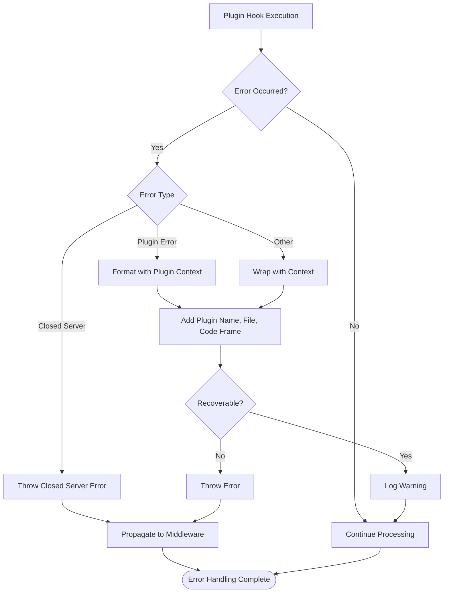

# Plugin Container Module

## Introduction

The plugin-container module is a core component of Vite's plugin system that provides a Rollup-compatible plugin execution environment. It acts as the bridge between Vite's plugin API and Rollup's plugin hooks, enabling Vite to leverage the extensive Rollup plugin ecosystem while adding its own development-specific functionality.

## Architecture Overview

The plugin-container module implements a sophisticated plugin execution pipeline that manages plugin lifecycle, context provision, and hook orchestration across different Vite environments (client, SSR, etc.). It provides Rollup-compatible plugin contexts while adding Vite-specific features like HMR support, environment awareness, and development optimizations.



## Core Components

### EnvironmentPluginContainer

The `EnvironmentPluginContainer` is the main implementation class that manages plugin execution for a specific environment. It provides the core functionality for:

- **Plugin Hook Orchestration**: Manages the execution order and lifecycle of plugin hooks
- **Context Management**: Creates and manages different plugin contexts for various operations
- **Module Resolution**: Handles module ID resolution through the plugin pipeline
- **Code Transformation**: Manages code transformation through the transform hook chain
- **Source Map Handling**: Combines and manages source maps from multiple transformation steps



### Plugin Context Hierarchy

The module implements a hierarchy of plugin contexts, each providing specific functionality:

#### BasicMinimalPluginContext
Provides fundamental logging and error handling capabilities:
- Debug, info, warn, and error logging methods
- Log normalization and formatting
- Error handling with proper stack traces

#### MinimalPluginContext
Extends the basic context with environment awareness:
- Environment reference for accessing configuration and utilities
- Rollup-compatible minimal plugin context implementation

#### PluginContext
The full plugin context providing comprehensive Rollup compatibility:
- Module resolution with skip logic
- Module information access
- File watching capabilities
- Source map support
- Error formatting with code frames

#### Specialized Contexts
- **ResolveIdContext**: Handles module resolution with skip logic
- **LoadPluginContext**: Manages module loading with import tracking
- **TransformPluginContext**: Provides code transformation with source map chaining



## Plugin Hook Execution Pipeline

The plugin container implements a sophisticated hook execution system that ensures proper plugin ordering and result handling:

### Hook Types
- **First**: Returns the first non-null result (e.g., resolveId, load)
- **Sequential**: Executes in order, each plugin receives the previous result (e.g., transform)
- **Parallel**: Executes all plugins concurrently, ignores results (e.g., buildStart, watchChange)

### Hook Execution Flow



## Source Map Management

The plugin container implements sophisticated source map handling to ensure accurate debugging information across multiple transformation steps:

### Source Map Chaining
- Each transform plugin can provide a source map
- Source maps are chained together to maintain the mapping from original to final code
- The combined source map is generated using `@jridgewell/remapping`

### Source Map Features
- **Automatic Combination**: Automatically combines source maps from multiple transformations
- **Debug Support**: Provides detailed debugging information for source map issues
- **Error Mapping**: Maps error locations back to original source positions
- **Content Inclusion**: Includes original source content for better debugging



## Environment Integration

The plugin container is designed to work seamlessly with Vite's environment system:

### Environment Awareness
- **Client Environment**: Standard browser-targeted plugin execution
- **SSR Environment**: Server-side rendering with Node.js compatibility
- **Custom Environments**: Support for custom target environments

### Environment-Specific Features
- **Module Graph Integration**: Each environment has its own module graph
- **Configuration Access**: Plugins can access environment-specific configuration
- **Logger Integration**: Environment-specific logging with proper prefixes
- **Watch Mode**: File watching integrated with the environment's watcher

## Error Handling and Recovery

The plugin container implements comprehensive error handling:

### Error Types
- **Plugin Errors**: Formatted with plugin name, file location, and code frames
- **Closed Server Errors**: Special handling for server restart scenarios
- **Hook Errors**: Proper error propagation with context information

### Error Recovery
- **Graceful Degradation**: Continues operation when possible
- **Error Context**: Provides detailed context for debugging
- **Recovery Mode**: Special handling for recoverable errors during development

## Performance Optimizations

The plugin container includes several performance optimizations:

### Caching
- **Plugin Filters**: Cached filter functions for hook applicability
- **Module Info**: Cached module information to avoid recomputation
- **Source Maps**: Efficient source map combination and caching

### Parallel Execution
- **Parallel Hooks**: Concurrent execution of compatible hooks
- **Promise Management**: Efficient promise tracking and cleanup
- **Hook Ordering**: Optimized plugin sorting for minimal overhead

## Integration with Other Modules

The plugin-container module integrates closely with several other Vite modules:

### [plugin-system.md](plugin-system.md)
- Uses plugin definitions and interfaces from the plugin system
- Provides the execution environment for plugin hooks
- Integrates with plugin context extensions

### [dev-server.md](dev-server.md)
- Used by the development server to process requests
- Integrates with the server's module graph
- Works with the server's file watcher

### [module-graph.md](module-graph.md)
- Updates and queries the module graph during plugin execution
- Maintains module information and dependencies
- Tracks module metadata and HMR boundaries

### [config.md](config.md)
- Accesses configuration through the environment
- Uses plugin hook utilities for sorting and filtering
- Integrates with configuration validation and normalization

## Data Flow Architecture



## Plugin Hook Lifecycle



## Error Handling Flow



## Key Implementation Details

### Plugin Context Creation

The plugin container creates different types of contexts based on the operation being performed:

```typescript
// Minimal context for basic operations
const minimalContext = new MinimalPluginContext(meta, environment)

// Full context for most plugin hooks
const pluginContext = new PluginContext(plugin, container)

// Specialized contexts for specific operations
const resolveContext = new ResolveIdContext(container, skip, skipCalls, scan)
const loadContext = new LoadPluginContext(container)
const transformContext = new TransformPluginContext(container, id, code, inMap)
```

### Hook Execution Order

Plugins are sorted and executed according to their hook priorities and the following rules:

1. **Hook-First**: First non-null result wins (resolveId, load)
2. **Sequential**: Each plugin receives the previous result (transform)
3. **Parallel**: All plugins execute concurrently (buildStart, watchChange)

### Source Map Combination

The plugin container uses sophisticated source map combination to maintain accurate debugging information:

```typescript
// Each transform can contribute a source map
const sourcemapChain: SourceMap[] = []

// Maps are combined using @jridgewell/remapping
const combinedMap = combineSourcemaps(filename, sourcemapChain)

// Error locations are mapped back to original positions
const originalLocation = originalPositionFor(combinedMap, errorLocation)
```

### Environment Isolation

Each environment gets its own plugin container instance, ensuring:

- **Separate Module Graphs**: Each environment tracks its own modules
- **Independent Configuration**: Environment-specific settings
- **Isolated Plugin State**: Plugins can't interfere across environments
- **Targeted Transformations**: Different transformations for different targets

## API Reference

### EnvironmentPluginContainer

#### Methods

##### `resolveId(rawId, importer?, options?)`
Resolves a module ID through the plugin pipeline.

**Parameters:**
- `rawId: string` - The ID to resolve
- `importer?: string` - The importing module path
- `options?: ResolveOptions` - Resolution options

**Returns:** `Promise<PartialResolvedId | null>`

##### `load(id)`
Loads a module through the plugin pipeline.

**Parameters:**
- `id: string` - The module ID to load

**Returns:** `Promise<LoadResult | null>`

##### `transform(code, id, options?)`
Transforms code through the plugin pipeline.

**Parameters:**
- `code: string` - The code to transform
- `id: string` - The module ID
- `options?: TransformOptions` - Transform options

**Returns:** `Promise<{ code: string; map: SourceMap | { mappings: '' } | null }>`

##### `buildStart(options?)`
Starts the build process by calling all buildStart hooks.

**Parameters:**
- `options?: InputOptions` - Rollup input options

**Returns:** `Promise<void>`

##### `close()`
Closes the container and calls cleanup hooks.

**Returns:** `Promise<void>`

### Plugin Context Methods

#### Logging Methods
- `debug(log)` - Log debug information
- `info(log)` - Log informational message
- `warn(log, position?)` - Log warning with optional position
- `error(error, position?)` - Throw formatted error

#### Module Methods
- `resolve(id, importer?, options?)` - Resolve module ID
- `load(options)` - Load and transform module
- `getModuleInfo(id)` - Get module information
- `getModuleIds()` - Get all module IDs
- `addWatchFile(id)` - Add file to watch list
- `getWatchFiles()` - Get watched files

#### Utility Methods
- `parse(code, opts)` - Parse code using Rollup's parser
- `emitFile(asset)` - Emit file (build-only, warns in serve)
- `setAssetSource()` - Set asset source (build-only, warns in serve)
- `getFileName()` - Get file name (build-only, warns in serve)

## Best Practices

### Plugin Development

1. **Use Filters**: Always use include/exclude filters for performance
2. **Handle Errors**: Properly handle and format errors with context
3. **Source Maps**: Provide accurate source maps when transforming code
4. **Skip Logic**: Respect skip parameters in resolveId hooks
5. **Environment Awareness**: Check environment configuration when needed

### Performance Optimization

1. **Hook Ordering**: Place frequently successful plugins earlier
2. **Filter Caching**: Use cached filters to avoid repeated checks
3. **Parallel Execution**: Use parallel hooks when possible
4. **Result Caching**: Cache expensive computations in plugin context

### Error Handling

1. **Contextual Errors**: Always include plugin name and file location
2. **Code Frames**: Provide code frames for syntax/transform errors
3. **Recovery**: Handle recoverable errors gracefully
4. **Logging**: Use appropriate log levels for different situations

## Migration Guide

### From Legacy PluginContainer

The new `EnvironmentPluginContainer` replaces the legacy `PluginContainer`. Key differences:

```typescript
// Old (legacy)
const container = createPluginContainer(environments)
const result = await container.resolveId(id, importer, { ssr: true })

// New (environment-aware)
const container = await createEnvironmentPluginContainer(
  environment,
  plugins,
  watcher
)
const result = await container.resolveId(id, importer, options)
```

### Environment-Specific Usage

```typescript
// Get environment-specific container
const clientContainer = (environments.client as DevEnvironment).pluginContainer
const ssrContainer = (environments.ssr as DevEnvironment).pluginContainer

// Use with specific environment
const clientResult = await clientContainer.resolveId(id, importer)
const ssrResult = await ssrContainer.resolveId(id, importer)
```

## Troubleshooting

### Common Issues

1. **Plugin Not Working**: Check if plugin is included in environment plugins array
2. **Hook Not Called**: Verify hook name and plugin sorting order
3. **Source Map Issues**: Enable debug mode with `DEBUG_VITE_SOURCEMAP_COMBINE_FILTER`
4. **Resolution Failures**: Check skip logic and resolveId hook order

### Debug Tools

```bash
# Enable plugin debugging
DEBUG=vite:plugin npm run dev

# Enable source map debugging
DEBUG_VITE_SOURCEMAP_COMBINE_FILTER=your-file.js npm run dev

# Enable resolve debugging
DEBUG=vite:resolve npm run dev
```

## Summary

The plugin-container module is a critical component of Vite's architecture that enables the powerful plugin system. It provides Rollup compatibility while adding Vite-specific features like environment awareness, HMR support, and development optimizations. The sophisticated hook execution system, comprehensive error handling, and performance optimizations make it suitable for both development and production use cases.

The module's design allows for:
- **Extensibility**: Easy integration of new plugins and hooks
- **Performance**: Efficient plugin execution with caching and parallelization
- **Compatibility**: Full Rollup plugin ecosystem compatibility
- **Flexibility**: Support for multiple environments and custom configurations
- **Reliability**: Comprehensive error handling and recovery mechanisms