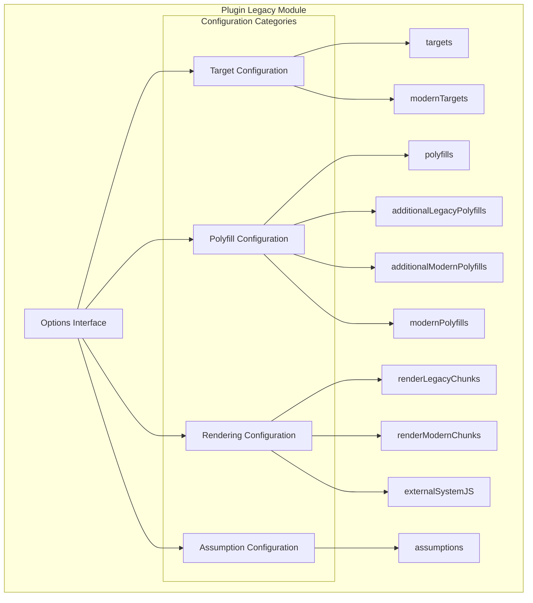
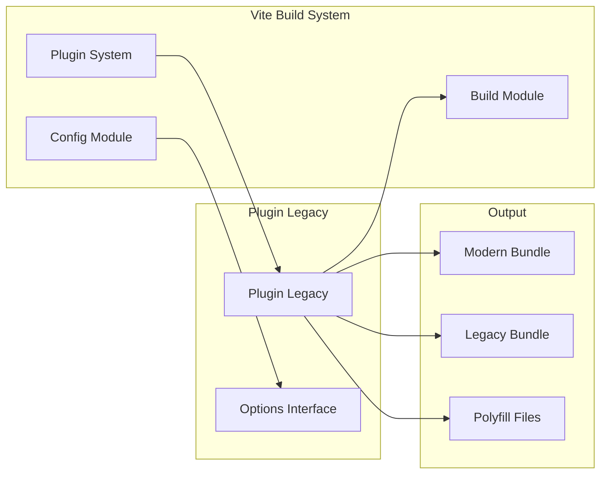
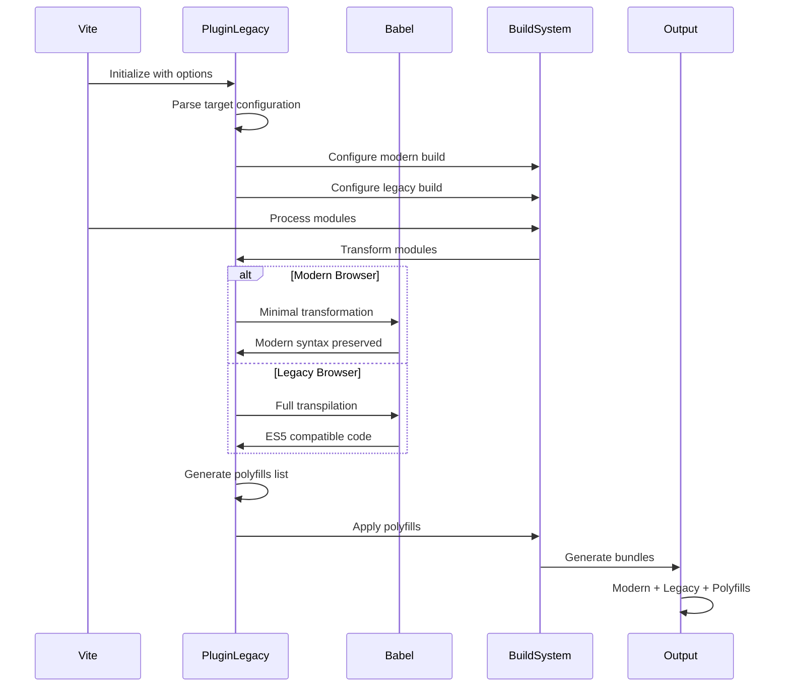
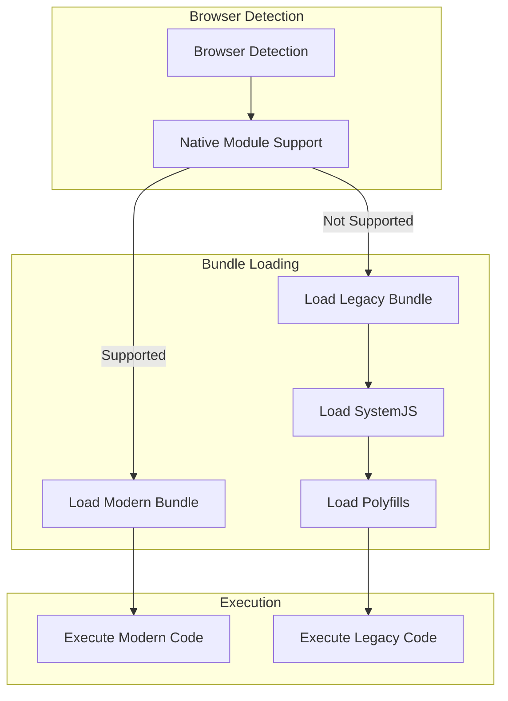

# Plugin Legacy Module

## Introduction

The plugin-legacy module is a Vite plugin that provides backward compatibility support for legacy browsers. It automatically generates separate bundles for modern and legacy browsers, applies necessary polyfills, and handles the complex transformation pipeline required to support older JavaScript environments while maintaining optimal performance for modern browsers.

## Overview

The plugin-legacy module addresses the challenge of supporting both modern browsers with native ES module support and legacy browsers that require transpilation and polyfills. It implements a dual-bundle strategy that serves optimized code to modern browsers while providing fully transpiled and polyfilled versions for legacy environments.

## Core Architecture

### Component Structure



### Integration with Vite Ecosystem



## Configuration Options

### Target Configuration

#### `targets`
- **Type**: `string | string[] | Record<string, string>`
- **Default**: `'defaults'`
- **Description**: Specifies the target browsers for the legacy bundle using Browserslist query syntax

#### `modernTargets`
- **Type**: `string | string[]`
- **Default**: `'edge>=79, firefox>=67, chrome>=64, safari>=12, chromeAndroid>=64, iOS>=12'`
- **Description**: Defines the minimum browser versions that support native ES modules

### Polyfill Configuration

#### `polyfills`
- **Type**: `boolean | string[]`
- **Default**: `true`
- **Description**: Controls which polyfills to include in the legacy bundle
  - `true`: Automatically detect and include required polyfills
  - `false`: No automatic polyfills
  - `string[]`: Specific polyfill packages to include

#### `additionalLegacyPolyfills`
- **Type**: `string[]`
- **Default**: `[]`
- **Description**: Additional polyfills to include specifically in the legacy bundle

#### `additionalModernPolyfills`
- **Type**: `string[]`
- **Default**: `[]`
- **Description**: Additional polyfills to include in the modern bundle

#### `modernPolyfills`
- **Type**: `boolean | string[]`
- **Default**: `false`
- **Description**: Controls polyfill inclusion in the modern bundle

### Rendering Configuration

#### `renderLegacyChunks`
- **Type**: `boolean`
- **Default**: `true`
- **Description**: Whether to generate and render legacy chunks

#### `renderModernChunks`
- **Type**: `boolean`
- **Default**: `true`
- **Description**: Whether to generate and render modern chunks

#### `externalSystemJS`
- **Type**: `boolean`
- **Default**: `false`
- **Description**: Whether to externalize SystemJS runtime, requiring manual inclusion

### Transformation Configuration

#### `assumptions`
- **Type**: `Record<string, boolean>`
- **Default**: `{}`
- **Description**: Babel transformation assumptions to optimize output
- **Reference**: [Babel Assumptions Documentation](https://babeljs.io/docs/assumptions)

## Data Flow Architecture

### Build Process Flow



### Runtime Loading Strategy



## Integration Points

### Plugin System Integration

The plugin-legacy module integrates with the [plugin-system](plugin-system.md) through:
- Plugin context management
- Hook registration for build processes
- Configuration resolution

### Build Process Integration

Integration with the [build](build.md) module includes:
- Dual bundle generation
- Asset processing
- Output optimization

### Configuration System Integration

Works with the [config](config.md) module for:
- Option validation
- Default value resolution
- Environment-specific settings

## Usage Patterns

### Basic Configuration

```typescript
// vite.config.ts
import legacy from '@vitejs/plugin-legacy'

export default {
  plugins: [
    legacy({
      targets: ['defaults', 'not IE 11']
    })
  ]
}
```

### Advanced Configuration

```typescript
// vite.config.ts
import legacy from '@vitejs/plugin-legacy'

export default {
  plugins: [
    legacy({
      targets: ['> 1%', 'last 2 versions'],
      modernTargets: 'edge>=79, firefox>=67, chrome>=64, safari>=12',
      polyfills: ['es.promise.finally', 'es.array.flat-map'],
      additionalLegacyPolyfills: ['custom-polyfill'],
      renderLegacyChunks: true,
      renderModernChunks: true,
      externalSystemJS: false,
      assumptions: {
        setPublicClassFields: true,
        privateFieldsAsSymbols: true
      }
    })
  ]
}
```

## Browser Support Strategy

### Modern Bundle
- **Target**: Browsers with native ES module support
- **Features**: Modern JavaScript syntax, ES modules, dynamic imports
- **Size**: Minimal transformation, smaller bundle size
- **Performance**: Optimal loading and execution

### Legacy Bundle
- **Target**: Older browsers without ES module support
- **Features**: Transpiled to ES5, SystemJS module system
- **Polyfills**: Comprehensive polyfill inclusion
- **Size**: Larger due to transpilation and polyfills

## Performance Considerations

### Bundle Size Optimization
- Separate modern and legacy bundles prevent unnecessary code delivery
- Conditional polyfill loading based on feature detection
- Tree shaking applied to both bundle types

### Loading Performance
- Modern browsers receive optimized code with minimal overhead
- Legacy browsers get fully compatible code with necessary polyfills
- Smart loading strategy prevents double downloads

### Build Performance
- Parallel processing of modern and legacy transformations
- Caching of transformation results
- Incremental builds for development

## Dependencies and References

### Related Modules
- [plugin-system](plugin-system.md) - Core plugin infrastructure
- [build](build.md) - Build process coordination
- [config](config.md) - Configuration management
- [core-types](core-types.md) - Type definitions

### External Dependencies
- Babel ecosystem for code transformation
- SystemJS for legacy module loading
- Browserslist for target resolution
- Core-js for polyfill management

## Best Practices

### Target Configuration
- Use specific browser versions rather than generic terms
- Regularly update targets based on analytics data
- Consider your application's user base requirements

### Polyfill Management
- Enable automatic polyfill detection for most cases
- Add specific polyfills only when needed
- Monitor polyfill bundle size impact

### Performance Optimization
- Test both modern and legacy bundles separately
- Monitor bundle sizes and loading performance
- Use performance budgets to prevent regression

## Troubleshooting

### Common Issues
- **Large bundle sizes**: Review polyfill configuration
- **Runtime errors**: Check browser target compatibility
- **Build failures**: Verify Babel configuration assumptions

### Debug Strategies
- Enable build analysis to inspect generated bundles
- Test in target browsers regularly
- Use source maps for debugging transformed code

## Migration and Compatibility

### Version Compatibility
- Compatible with Vite 4.x and later
- Requires Node.js 14.x or higher
- Supports TypeScript 4.x and later

### Migration Path
- Gradual adoption starting with basic configuration
- Progressive enhancement of browser support
- Performance monitoring during transition