# Plugin System Module

## Introduction

The plugin system module is the core extensibility framework of Vite, providing a powerful and flexible plugin architecture that extends Rollup's plugin interface with Vite-specific functionality. It enables developers to customize and extend Vite's behavior across development, build, and preview environments through a comprehensive hook system.

## Architecture Overview

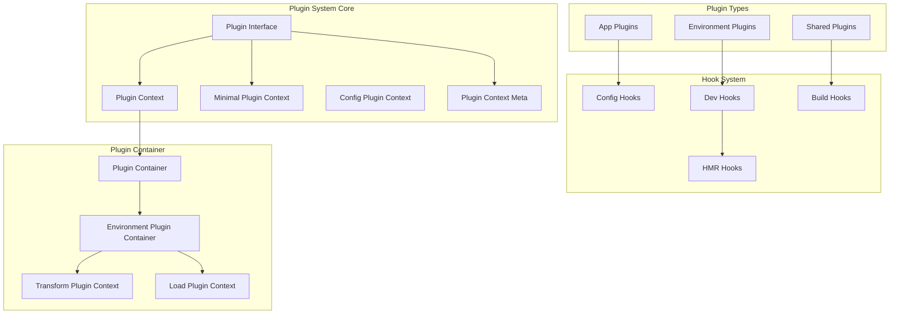

## Core Components

### Plugin Interface

The `Plugin` interface is the central abstraction that extends Rollup's plugin system with Vite-specific enhancements:

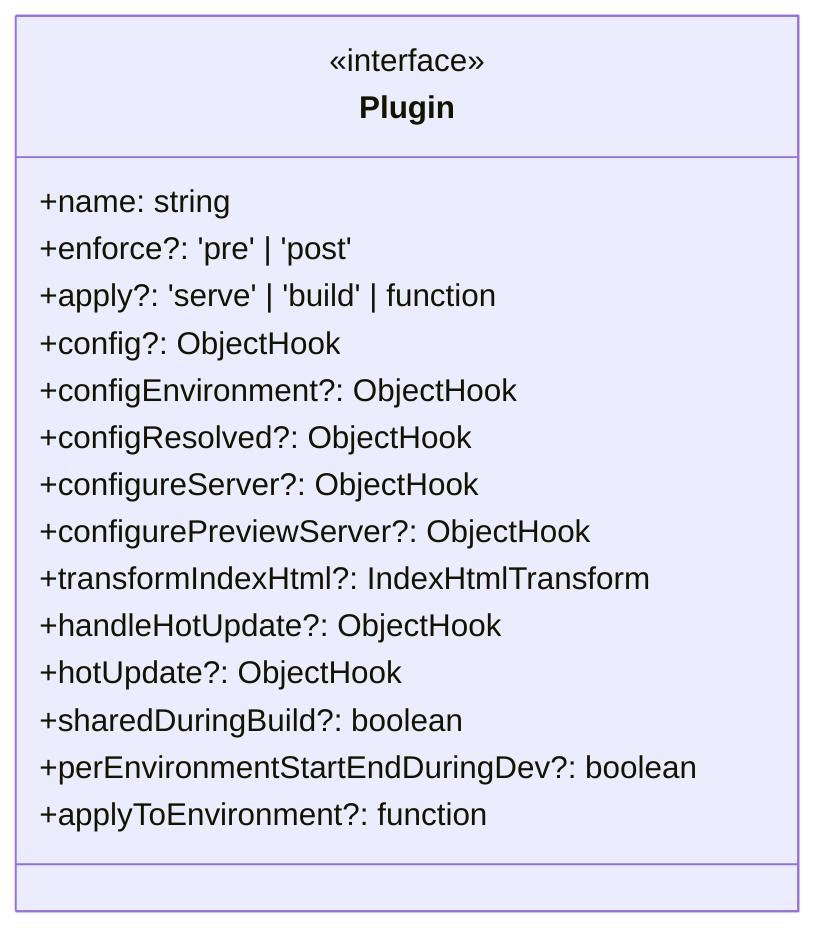

### Plugin Context System

The plugin context system provides different levels of context access depending on the plugin's scope:

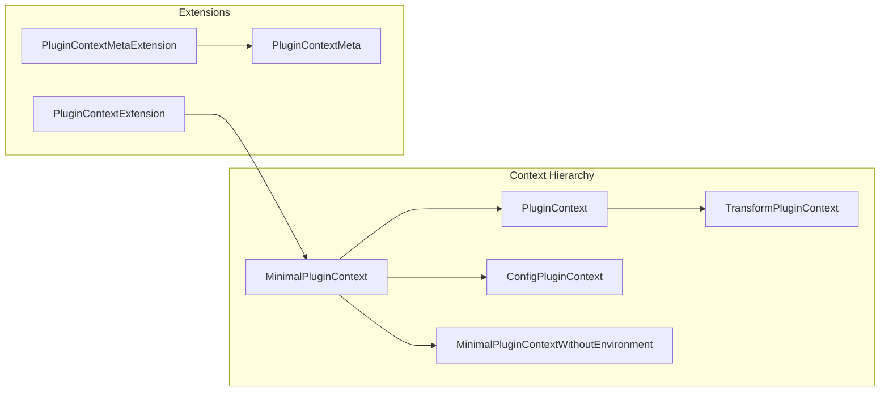

## Plugin Types and Lifecycle

### App Plugins vs Environment Plugins

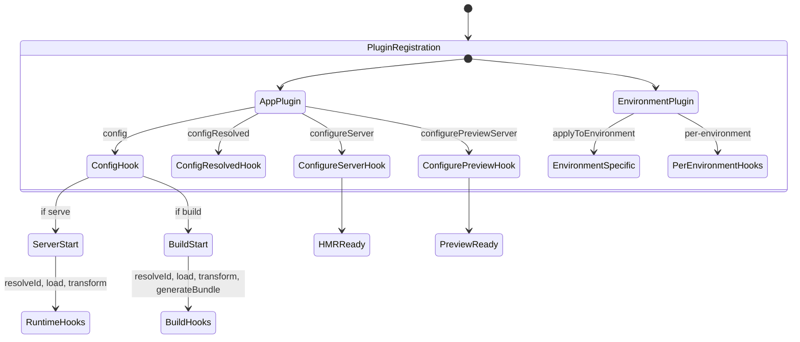

### Plugin Application Logic

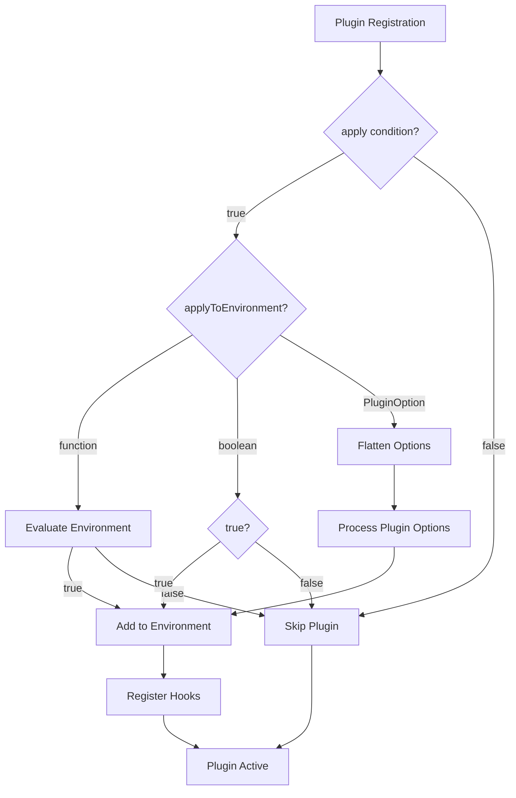

## Hook System Architecture

### Hook Types and Execution Order

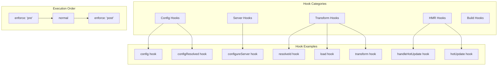

### Transform Pipeline Integration

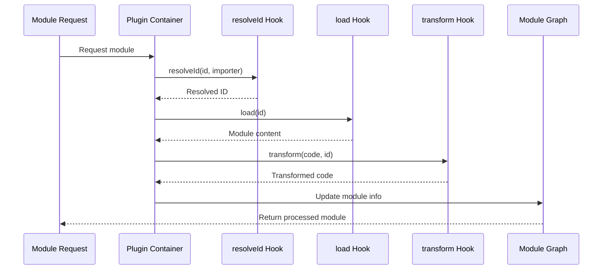

## Environment-Specific Plugin Behavior

### Plugin Environment Resolution

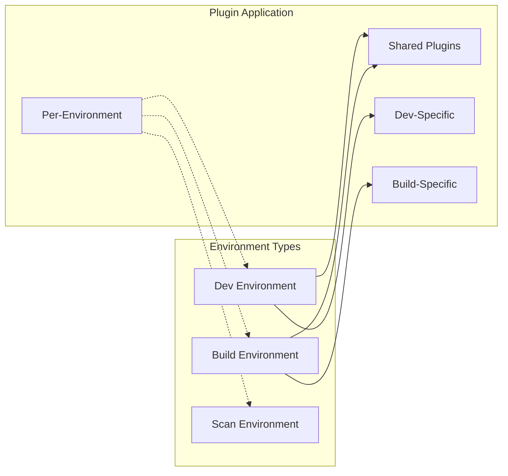

### Hot Module Replacement (HMR) Integration

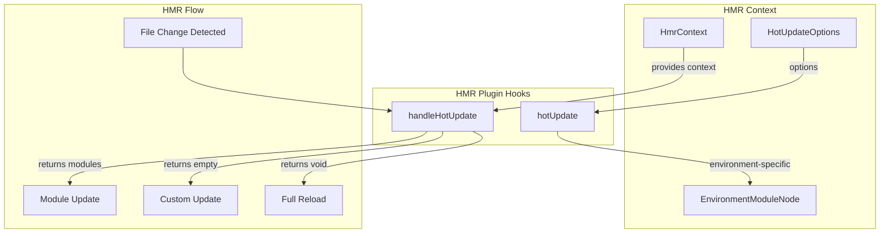

## Plugin Container Integration

The plugin system works closely with the [plugin-container](plugin-container.md) module to manage plugin execution:

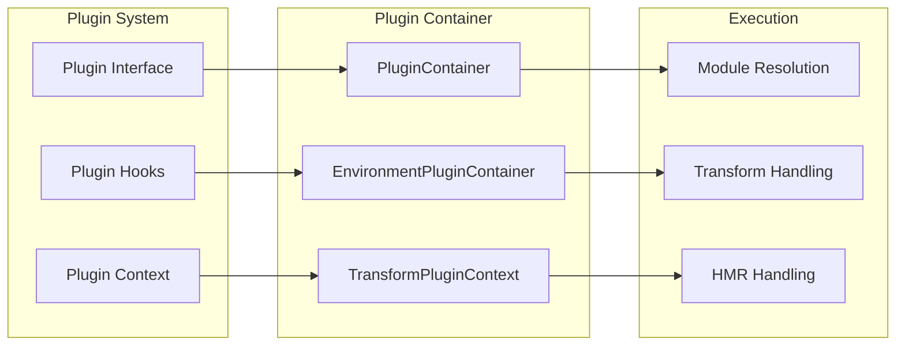

## Configuration and Lifecycle

### Plugin Configuration Flow

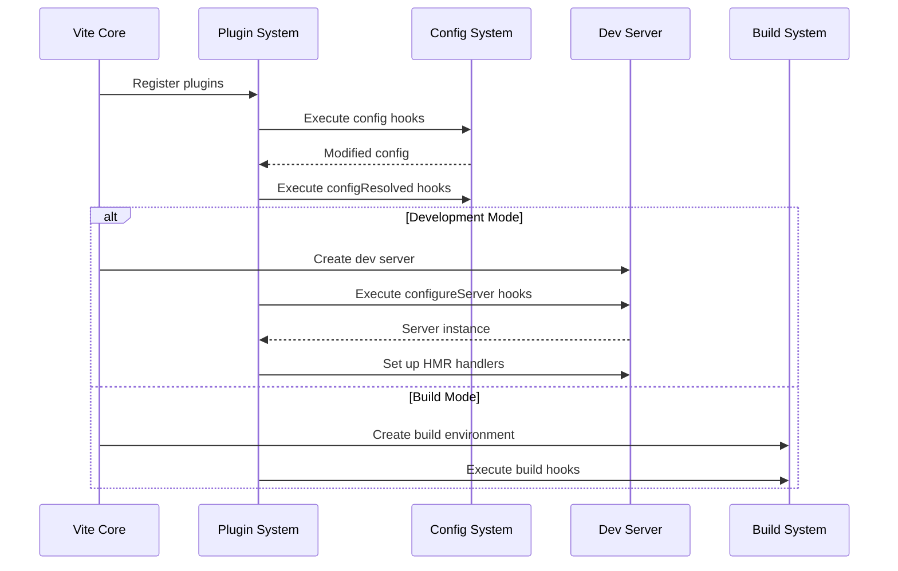

### Plugin Hook Execution Context

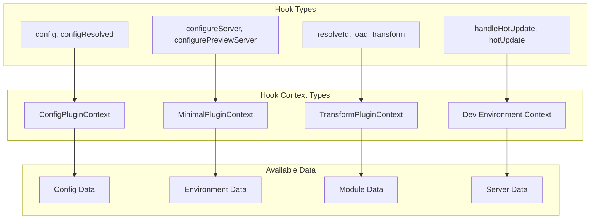

## Integration with Other Modules

### Module Dependencies

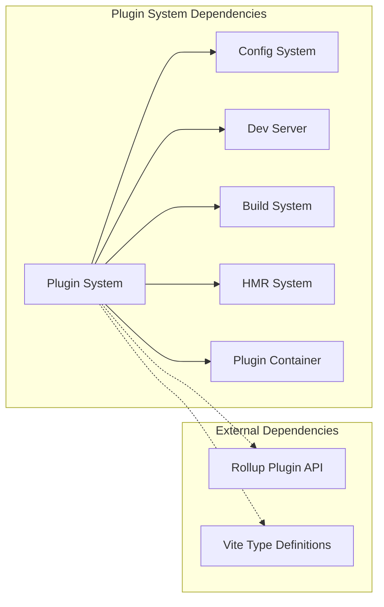

### Related Documentation

- [plugin-container](plugin-container.md) - Plugin execution and context management
- [config](config.md) - Configuration system that plugins can modify
- [dev-server](dev-server.md) - Development server that plugins can configure
- [build](build.md) - Build system that plugins integrate with
- [hmr](hmr.md) - Hot module replacement system with plugin hooks

## Best Practices and Guidelines

### Plugin Development

1. **Hook Selection**: Choose appropriate hooks based on your plugin's purpose
2. **Context Usage**: Use the correct context type for each hook
3. **Error Handling**: Implement proper error handling in async hooks
4. **Performance**: Consider the performance impact of transform hooks
5. **Compatibility**: Ensure compatibility with both dev and build modes

### Plugin Application

1. **Conditional Application**: Use `apply` property for environment-specific plugins
2. **Environment Filtering**: Use `applyToEnvironment` for fine-grained control
3. **Hook Ordering**: Use `enforce` property to control hook execution order
4. **Shared Plugins**: Consider `sharedDuringBuild` for build optimization
5. **Per-Environment Hooks**: Use `perEnvironmentStartEndDuringDev` for dev-specific behavior

## API Reference

### Core Interfaces

- `Plugin<A = any>` - Main plugin interface extending RollupPlugin
- `PluginContextExtension` - Vite-specific environment extension
- `PluginContextMetaExtension` - Vite version metadata
- `ConfigPluginContext` - Context for config hooks
- `MinimalPluginContextWithoutEnvironment` - Minimal context without environment access

### Utility Functions

- `resolveEnvironmentPlugins(environment)` - Resolves plugins for a specific environment
- `perEnvironmentPlugin(name, applyToEnvironment)` - Creates environment-specific plugins

### Hook Types

- `ObjectHook<T, O>` - Type for hooks with options
- `PluginOption` - Union type for plugin configuration
- `FalsyPlugin` - Type for falsy plugin values
- `PluginWithRequiredHook<K>` - Type for plugins with required hooks