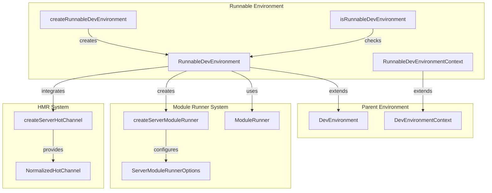
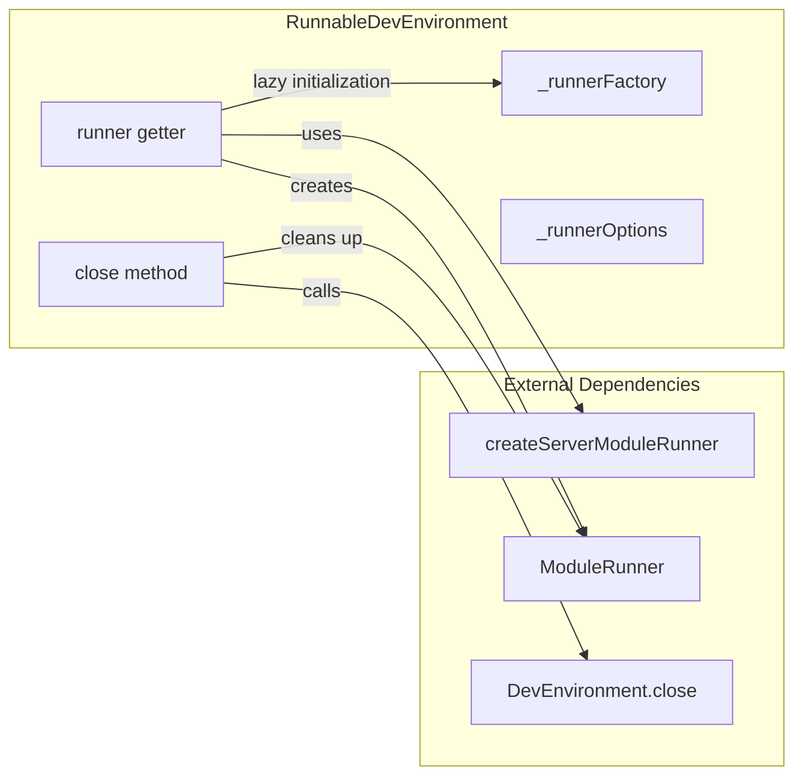
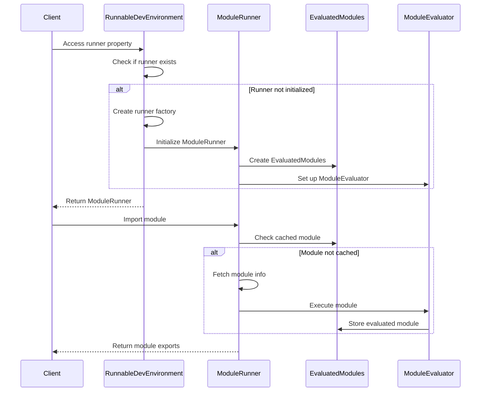
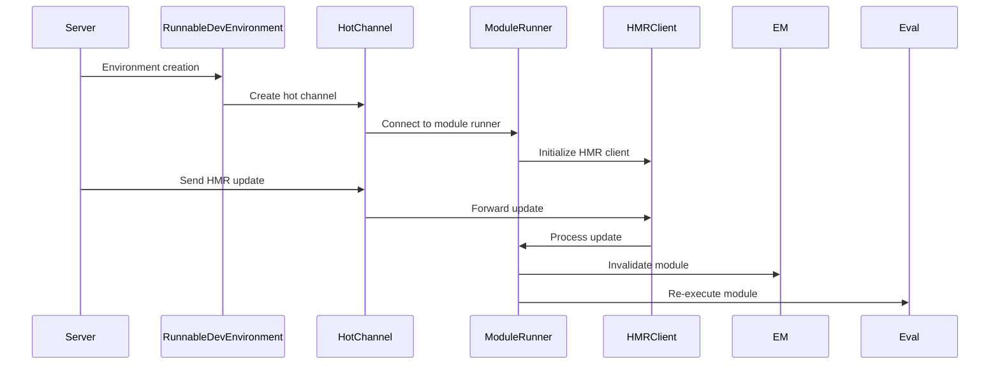

# Runnable Environment Module

The runnable-environment module provides a specialized development environment for Vite that enables server-side module execution and hot module replacement (HMR) during development. It extends the base development environment with module runner capabilities, making it essential for SSR (Server-Side Rendering) and other server-side execution scenarios.

## Overview

The RunnableDevEnvironment is a specialized development environment that integrates Vite's module runner system with the development server. It provides the infrastructure needed to execute JavaScript modules in a Node.js context while maintaining HMR capabilities and source map support.

## Architecture

### Core Components



### Component Relationships



## Key Features

### 1. Module Runner Integration

The RunnableDevEnvironment provides seamless integration with Vite's module runner system:

- **Lazy Initialization**: The module runner is created on-demand when first accessed
- **Factory Pattern**: Supports custom runner factories for specialized use cases
- **Configuration Options**: Accepts ServerModuleRunnerOptions for fine-tuned control

### 2. Hot Module Replacement (HMR)

Built-in HMR support with automatic channel creation:

- **Automatic Channel Setup**: Creates server hot channel if not provided
- **Transport Configuration**: Configurable transport mechanisms
- **Hot Flag**: Optional HMR enablement/disablement

### 3. Resource Management

Proper cleanup and lifecycle management:

- **Runner Cleanup**: Automatically closes the module runner when environment closes
- **Cache Clearing**: Clears evaluated modules and HMR state
- **Graceful Shutdown**: Properly handles environment shutdown sequence

## Data Flow

### Module Execution Flow



### HMR Message Flow



## API Reference

### RunnableDevEnvironment

The main environment class that extends DevEnvironment with module runner capabilities.

**Properties:**
- `runner: ModuleRunner` - The module runner instance (lazy-initialized)

**Methods:**
- `close(): Promise<void>` - Closes the environment and cleans up resources

### RunnableDevEnvironmentContext

Configuration interface for creating a runnable development environment.

```typescript
interface RunnableDevEnvironmentContext extends Omit<DevEnvironmentContext, 'hot'> {
  runner?: (environment: RunnableDevEnvironment, options?: ServerModuleRunnerOptions) => ModuleRunner
  runnerOptions?: ServerModuleRunnerOptions
  hot?: boolean
}
```

### Utility Functions

#### createRunnableDevEnvironment

Creates a new RunnableDevEnvironment instance with the provided configuration.

```typescript
function createRunnableDevEnvironment(
  name: string,
  config: ResolvedConfig,
  context?: RunnableDevEnvironmentContext
): RunnableDevEnvironment
```

#### isRunnableDevEnvironment

Type guard function to check if an environment is a RunnableDevEnvironment.

```typescript
function isRunnableDevEnvironment(environment: Environment): environment is RunnableDevEnvironment
```

## Integration with Other Modules

### Module Runner System

The runnable environment integrates closely with the [module-runner](module-runner.md) system:

- Uses `ModuleRunner` for module execution
- Leverages `EvaluatedModules` for module caching
- Integrates with `ESModulesEvaluator` for code evaluation
- Supports HMR through `HMRClient`

### Development Server

Part of the broader [dev-server](dev-server.md) architecture:

- Extends `DevEnvironment` base class
- Integrates with `DevEnvironmentContext`
- Uses `createServerHotChannel` for HMR communication
- Participates in server lifecycle management

### SSR Runtime

Connects to the [ssr](ssr.md) module for server-side rendering:

- Uses `createServerModuleRunner` as default factory
- Accepts `ServerModuleRunnerOptions` for configuration
- Supports SSR-specific module fetching and transformation

## Usage Examples

### Basic Usage

```typescript
import { createRunnableDevEnvironment } from 'vite'

const environment = createRunnableDevEnvironment('ssr', config, {
  hot: true,
  runnerOptions: {
    hmr: { logger: customLogger }
  }
})

// Access the module runner
const runner = environment.runner

// Import and execute modules
const module = await runner.import('/src/entry-server.js')
```

### Custom Runner Factory

```typescript
const environment = createRunnableDevEnvironment('custom', config, {
  runner: (env, options) => {
    // Custom runner implementation
    return createCustomModuleRunner(env, options)
  },
  runnerOptions: {
    // Custom options
  }
})
```

## Best Practices

1. **Resource Management**: Always ensure proper cleanup by calling `environment.close()` when done
2. **Error Handling**: Handle module execution errors gracefully
3. **HMR Configuration**: Configure appropriate HMR settings based on your use case
4. **Performance**: Leverage module caching to avoid unnecessary re-execution
5. **Debugging**: Use the built-in debugging capabilities for troubleshooting

## Troubleshooting

### Common Issues

1. **Runner Not Initialized**: Ensure you're accessing the `runner` property before using it
2. **HMR Connection Issues**: Check transport configuration and network settings
3. **Module Execution Errors**: Verify module paths and dependencies
4. **Memory Leaks**: Ensure proper cleanup of environments and runners

### Debug Information

The module runner provides debug logging capabilities:

- Module loading times and stack traces
- HMR event processing
- Source map resolution
- Cache hit/miss statistics

## Related Documentation

- [Module Runner](module-runner.md) - Core module execution system
- [Dev Server](dev-server.md) - Development server architecture
- [SSR](ssr.md) - Server-side rendering capabilities
- [HMR](hmr.md) - Hot module replacement system
- [Environment Configuration](config.md) - Environment-specific configuration options