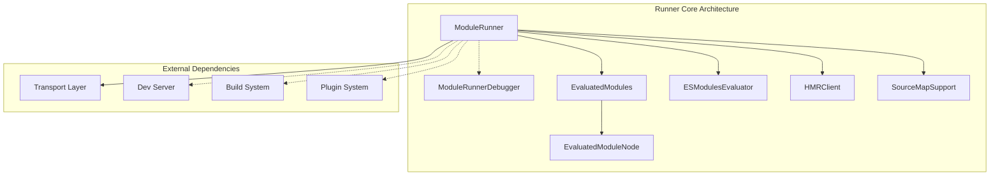
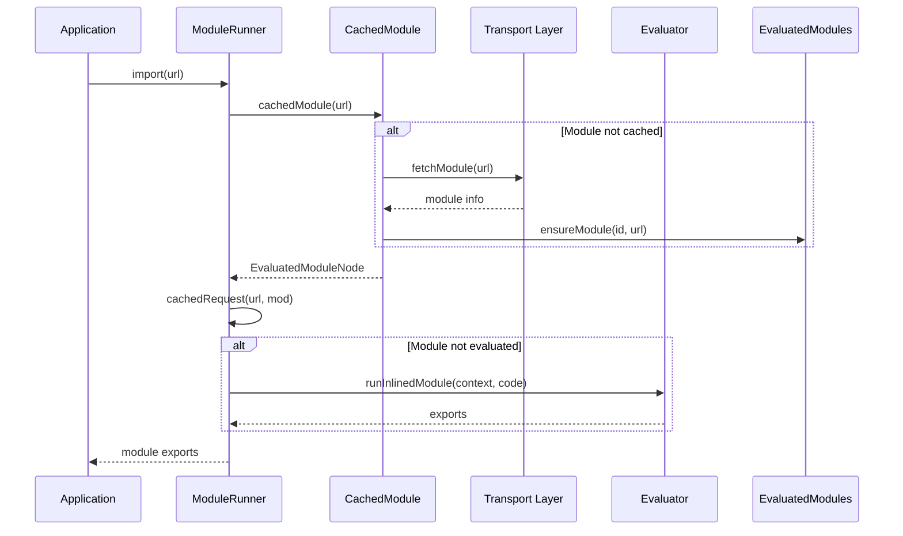
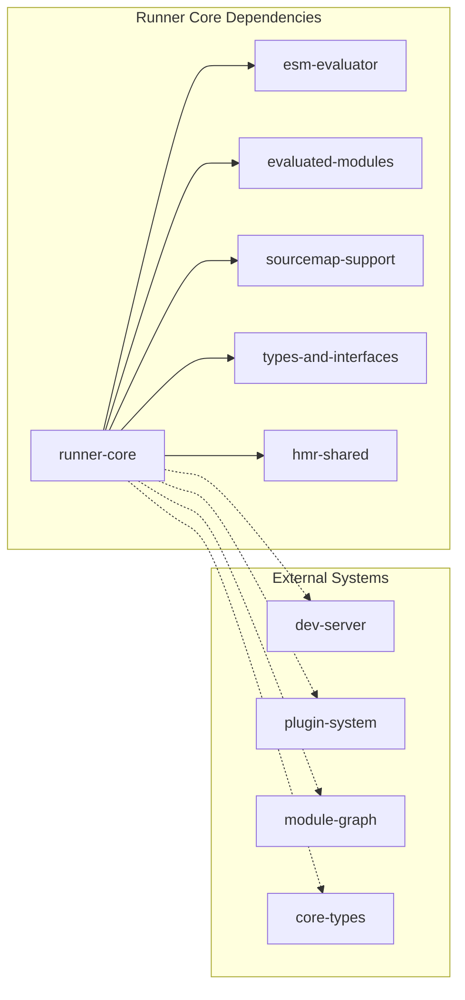
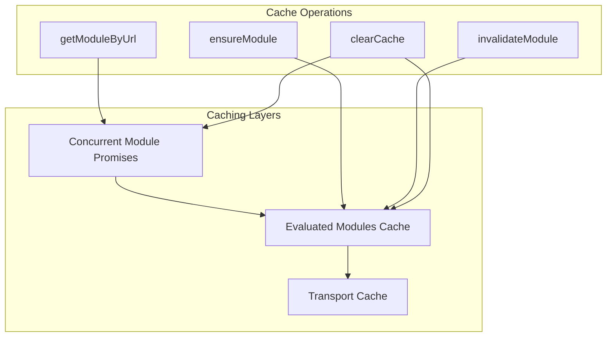
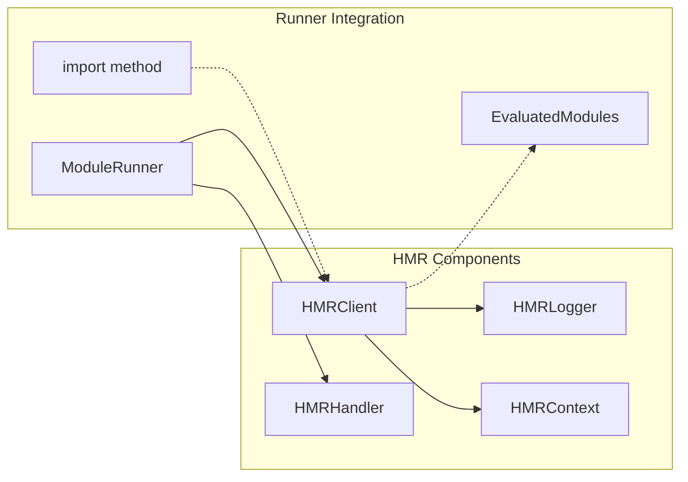
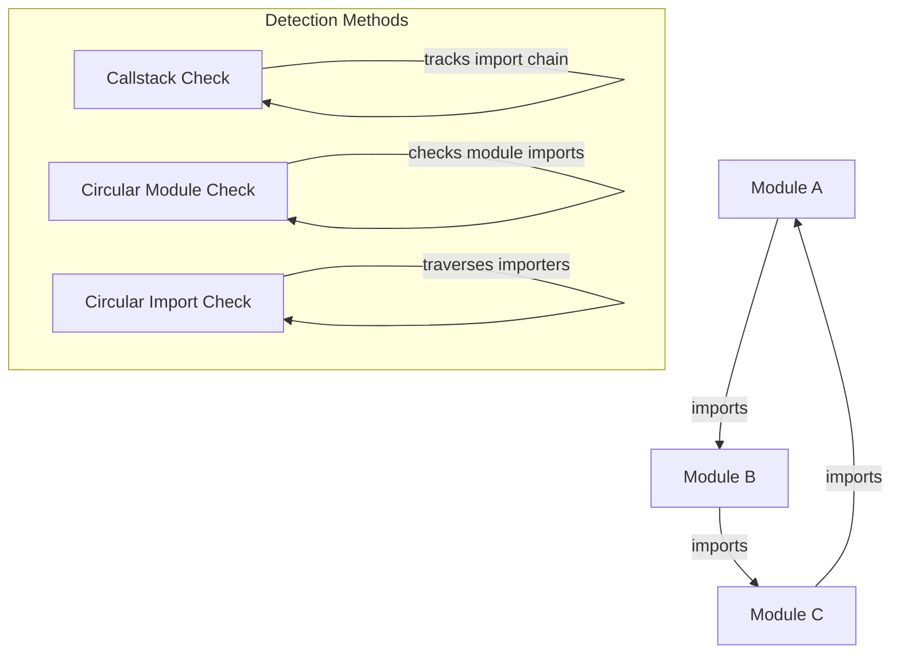
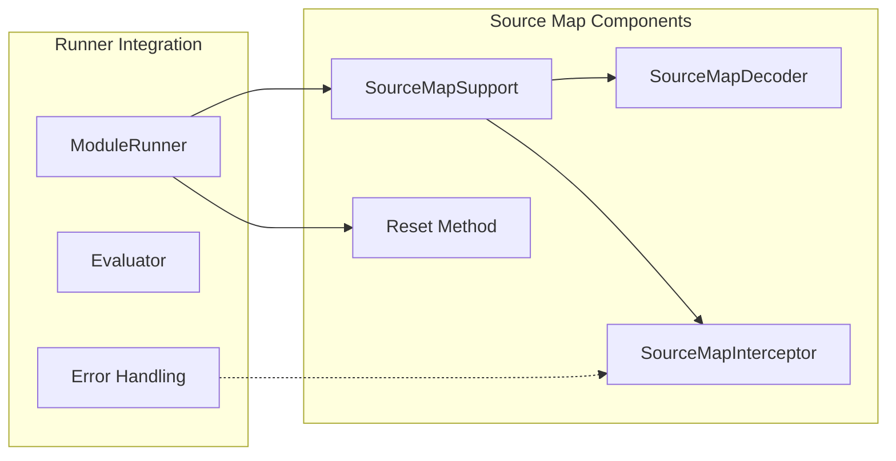
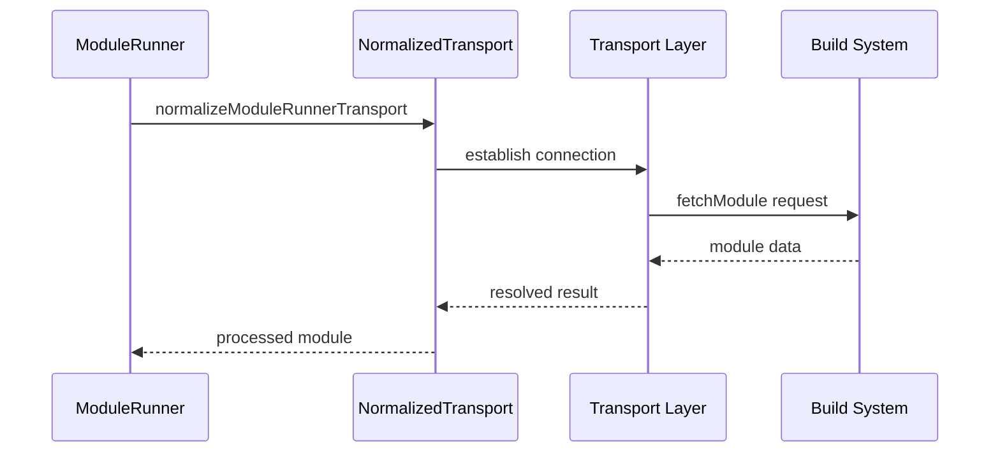

# Runner Core Module Documentation

## Introduction

The runner-core module is the central execution engine of Vite's module system, responsible for dynamically loading, evaluating, and managing JavaScript modules in both development and production environments. It provides the foundation for Vite's hot module replacement (HMR) system and serves as the bridge between Vite's build system and runtime execution.

## Architecture Overview

The runner-core module implements a sophisticated module execution system that handles:

- **Dynamic Module Loading**: Runtime module resolution and loading
- **Module Caching**: Intelligent caching with invalidation strategies
- **Hot Module Replacement**: Live module updates without page refresh
- **Source Map Support**: Debugging support for transformed code
- **Circular Dependency Detection**: Prevention of infinite loops
- **External Module Handling**: Integration with Node.js and browser modules

## Core Components

### ModuleRunner

The `ModuleRunner` class is the primary orchestrator that manages the entire module execution lifecycle. It coordinates between different subsystems including the evaluator, transport layer, HMR system, and source map support.

**Key Responsibilities:**
- Module import and execution coordination
- Cache management and invalidation
- HMR integration and handling
- Transport layer communication
- Error handling and debugging support

**Core Methods:**
- `import<T>(url: string): Promise<T>` - Main entry point for module loading
- `clearCache(): void` - Clears all module caches and HMR listeners
- `close(): Promise<void>` - Graceful shutdown with cleanup
- `isClosed(): boolean` - Runtime state checking

### ModuleRunnerDebugger

A debugging interface that provides runtime insights into module loading performance and execution flow. It helps identify bottlenecks and circular dependencies during development.

## Module Execution Flow

## Dependency Management

The runner-core module maintains complex relationships with other Vite subsystems:

## Module Caching Strategy

The runner-core implements a multi-layered caching system:

## Hot Module Replacement Integration

The HMR system is deeply integrated into the module runner:

## Circular Dependency Detection

The runner-core implements sophisticated circular dependency detection to prevent infinite loops:

## Source Map Support

Source map integration provides debugging capabilities for transformed code:

## Transport Layer Integration

The runner-core communicates with the build system through a transport layer:

## Error Handling and Debugging

The runner-core provides comprehensive error handling and debugging capabilities:

- **Module Loading Errors**: Detailed error messages with import chain information
- **Circular Dependency Warnings**: Early detection and reporting
- **Performance Monitoring**: Debug timers for slow-loading modules
- **Source Map Integration**: Accurate error stack traces
- **HMR Error Recovery**: Graceful handling of module update failures

## Configuration Options

The runner-core accepts various configuration options through `ModuleRunnerOptions`:

- **Transport**: Communication layer with build system
- **HMR**: Hot module replacement configuration
- **Source Maps**: Source map support settings
- **Evaluator**: Custom module evaluator implementation
- **Debug**: Debug logging and performance monitoring

## Performance Considerations

The runner-core is designed for optimal performance:

- **Concurrent Module Loading**: Parallel fetching of module information
- **Intelligent Caching**: Multi-layered cache with invalidation strategies
- **Lazy Evaluation**: Modules evaluated only when needed
- **Circular Dependency Optimization**: Early detection to prevent redundant work
- **Memory Management**: Proper cleanup and garbage collection

## Integration with Vite Ecosystem

The runner-core serves as the foundation for Vite's module system and integrates with:

- **[Dev Server](dev-server.md)**: Provides runtime module execution
- **[Build System](build.md)**: Consumes build artifacts and source maps
- **[Plugin System](plugin-system.md)**: Executes plugin-transformed modules
- **[HMR System](hmr-shared.md)**: Enables live module updates
- **[Module Graph](module-graph.md)**: Tracks module dependencies

## Best Practices

1. **Module Organization**: Structure modules to minimize circular dependencies
2. **Error Handling**: Implement proper error boundaries for dynamic imports
3. **Performance Monitoring**: Use debug mode to identify slow-loading modules
4. **Cache Management**: Understand cache invalidation patterns for optimal performance
5. **HMR Integration**: Design modules with HMR compatibility in mind

## Troubleshooting

Common issues and solutions:

- **Circular Dependencies**: Use the debug mode to identify and refactor
- **Module Loading Timeouts**: Check transport layer connectivity
- **HMR Failures**: Verify HMR configuration and transport support
- **Source Map Issues**: Ensure proper source map generation in build configuration
- **Memory Leaks**: Properly close the runner when finished

## API Reference

See [types-and-interfaces.md](types-and-interfaces.md) for detailed type definitions and interfaces used by the runner-core module.