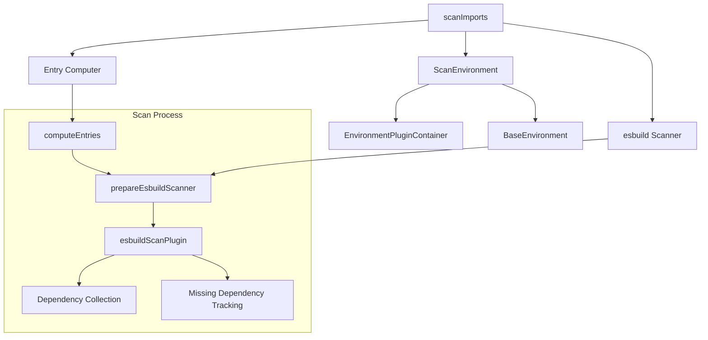
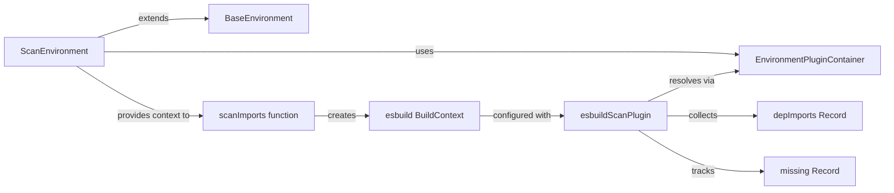
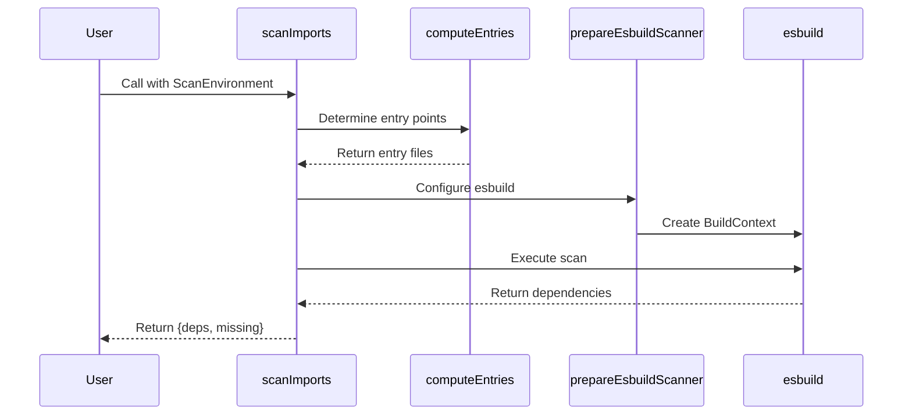
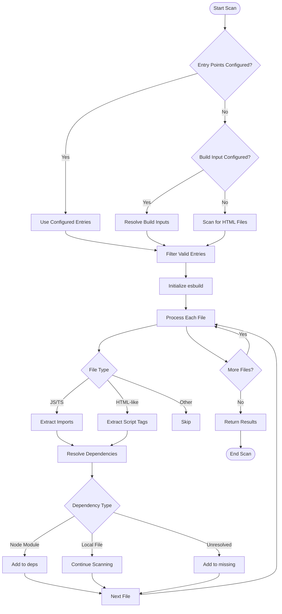
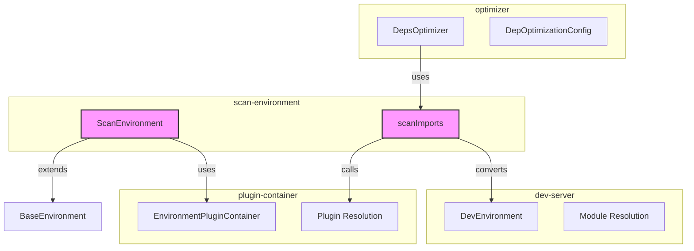

# scan-environment Module Documentation

## Overview

The `scan-environment` module is a specialized environment within Vite's dependency optimization system that performs static analysis of project files to identify and catalog dependencies that need to be pre-bundled. It operates as a lightweight, read-only environment optimized for fast dependency scanning without the overhead of a full development server.

## Purpose and Core Functionality

The primary purpose of the scan-environment is to:

1. **Dependency Discovery**: Analyze project entry points and source files to identify all import statements and dependencies
2. **Optimization Planning**: Determine which dependencies should be pre-bundled for better performance
3. **Entry Point Resolution**: Automatically discover or use configured entry points for scanning
4. **Missing Dependency Detection**: Identify dependencies that cannot be resolved and need user attention

This module is crucial for Vite's "optimize dependencies" feature, which pre-bundles third-party dependencies to improve cold start performance and reduce module request overhead.

## Architecture

### Core Components



### Component Relationships



## Key Components

### ScanEnvironment Class

The `ScanEnvironment` class extends `BaseEnvironment` and provides a specialized environment for dependency scanning:

- **Mode**: Operates in 'scan' mode, distinguishing it from development or build environments
- **Plugin Container**: Manages plugin execution during scanning without full server initialization
- **Lightweight**: Minimal initialization overhead compared to full development environments

### scanImports Function

The main entry point for dependency scanning that orchestrates the entire process:



### esbuildScanPlugin

A custom esbuild plugin that handles the actual dependency detection:

- **File Type Handling**: Processes JavaScript, TypeScript, and HTML-like files (Vue, Svelte, Astro)
- **Import Extraction**: Uses regex patterns to identify import statements
- **Resolution**: Leverages Vite's plugin container for module resolution
- **Optimization Logic**: Determines which dependencies should be pre-bundled

## Data Flow

### Dependency Scanning Process



### File Processing Logic

The scan plugin processes different file types with specialized logic:

1. **JavaScript/TypeScript Files**: Direct parsing and import extraction
2. **HTML-like Files**: Extraction of script content from Vue, Svelte, and Astro files
3. **Virtual Modules**: Creation of virtual modules for inline scripts
4. **Glob Imports**: Special handling for `import.meta.glob` patterns

## Integration with Vite Ecosystem

### Relationship to Other Modules



### Dependency Chain

The scan-environment module is used by:

1. **DepsOptimizer**: Initiates dependency scanning during optimization
2. **DevEnvironment**: Converts dev environment to scan environment for analysis
3. **PluginContainer**: Leverages plugin resolution capabilities

## Configuration and Options

### ScanEnvironment Configuration

The scan environment inherits configuration from the parent environment but operates with these characteristics:

- **Read-only**: No file transformations or modifications
- **Plugin Context**: Uses plugin container for resolution only
- **Minimal Overhead**: No HMR, module graph updates, or server features

### Entry Point Discovery

Entry points are determined in order of precedence:

1. **Explicit Entries**: `optimizeDeps.entries` configuration
2. **Build Inputs**: `build.rollupOptions.input` configuration  
3. **HTML Files**: Auto-discovery of `**/*.html` files
4. **Filtering**: Only scannable file types and existing files

### Supported File Types

```javascript
// JavaScript/TypeScript
JS_TYPES_RE = /\.(js|mjs|jsx|ts|tsx|mts|cts)$/

// HTML-like files
htmlTypesRE = /\.(html|vue|svelte|astro|imba)$/

// Configurable extensions
optimizeDeps.extensions?: string[]
```

## Performance Considerations

### Optimization Strategies

1. **esbuild Integration**: Uses esbuild for fast parsing and transformation
2. **Caching**: Implements seen cache for resolved modules
3. **Parallel Processing**: Leverages esbuild's parallel build capabilities
4. **Early Termination**: Supports cancellation for responsive user experience

### Memory Management

- **Context Disposal**: Proper cleanup of esbuild contexts
- **Selective Processing**: Only processes scannable file types
- **External Dependencies**: Excludes non-optimizable dependencies early

## Error Handling

### Scan Failures

The module handles various error scenarios:

1. **Resolution Failures**: Tracks missing dependencies for user notification
2. **Build Errors**: Provides detailed error messages with context
3. **Cancellation**: Graceful handling of user-initiated cancellation
4. **File System Errors**: Handles missing files and permission issues

### User Feedback

- **Warning Messages**: Notifies when no entry points are found
- **Debug Information**: Provides detailed scanning logs when debug mode is enabled
- **Error Context**: Includes file paths and import context in error messages

## Usage Examples

### Basic Usage

```typescript
// Create scan environment from dev environment
const scanEnv = devToScanEnvironment(devEnvironment)

// Perform dependency scan
const { cancel, result } = scanImports(scanEnv)

// Get results
const { deps, missing } = await result
```

### Integration with Optimizer

```typescript
// Used internally by the dependency optimizer
const scanResult = await scanImports(scanEnvironment)
const dependencies = Object.keys(scanResult.deps)
const missingDeps = Object.keys(scanResult.missing)
```

## Best Practices

1. **Entry Point Configuration**: Explicitly configure entry points for large projects
2. **Exclude Patterns**: Use `optimizeDeps.exclude` to skip problematic dependencies
3. **Extension Configuration**: Add custom file extensions for non-standard file types
4. **Monitoring**: Use debug mode to understand scanning behavior

## Related Documentation

- [optimizer](optimizer.md) - Parent module that uses scan-environment for dependency discovery
- [plugin-container](plugin-container.md) - Provides plugin resolution capabilities
- [dev-server](dev-server.md) - Source environment that can be converted to scan environment
- [config](config.md) - Configuration options for dependency optimization