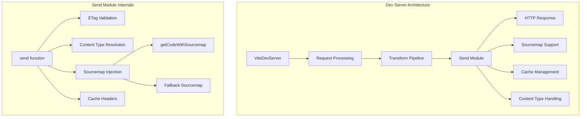
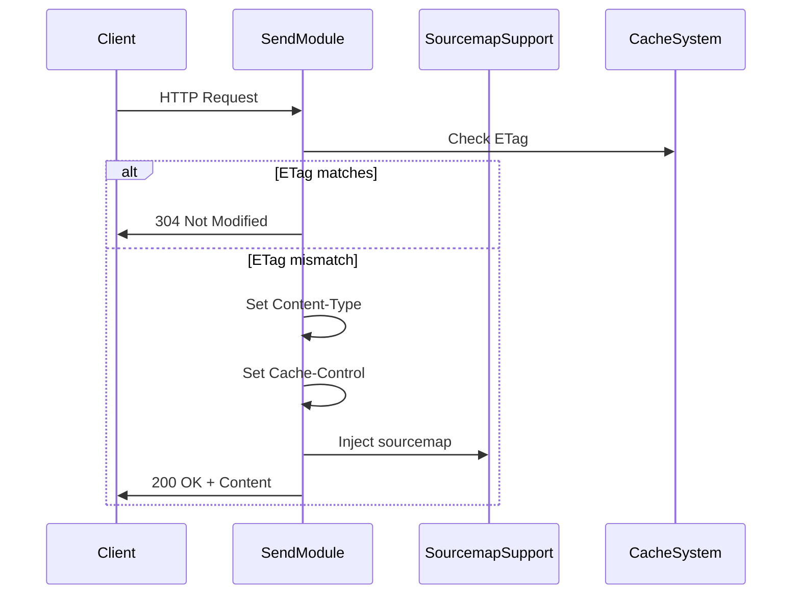
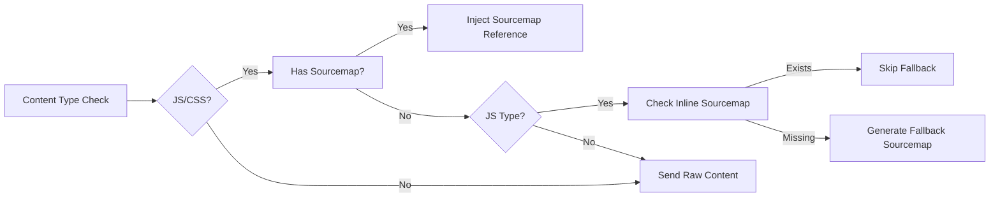
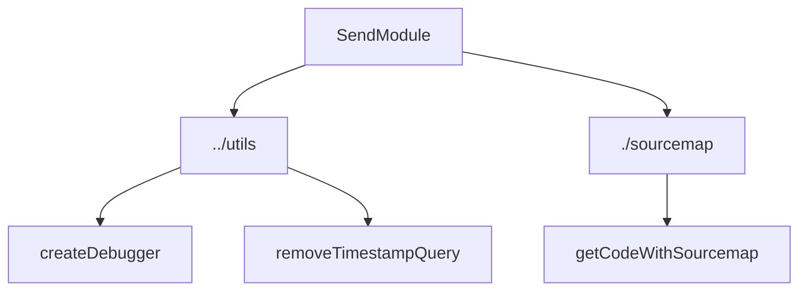

# Send Module Documentation

## Introduction

The send module is a core component of Vite's development server infrastructure, responsible for handling HTTP response delivery with intelligent content management, caching, and source map injection. It provides a streamlined API for sending various types of content (JavaScript, CSS, HTML, JSON) to clients while handling ETags, cache control, and source map integration.

## Architecture Overview

The send module operates as a utility layer within Vite's dev-server architecture, sitting between the request processing pipeline and the HTTP response mechanism. It integrates with multiple subsystems including sourcemap support, module transformation, and the broader dev-server environment.



## Core Components

### SendOptions Interface

The `SendOptions` interface defines the configuration object for the send function, providing fine-grained control over HTTP response behavior:

```typescript
interface SendOptions {
  etag?: string                    // Custom ETag for cache validation
  cacheControl?: string           // Cache-Control header value
  headers?: OutgoingHttpHeaders   // Additional HTTP headers
  map?: SourceMap | { mappings: '' } | null  // Source map data
}
```

### Send Function

The core `send()` function orchestrates the complete response delivery process:



## Key Features

### 1. Intelligent Content Type Handling

The module maintains a content type alias mapping for common web assets:

```javascript
const alias: Record<string, string | undefined> = {
  js: 'text/javascript',
  css: 'text/css', 
  html: 'text/html',
  json: 'application/json',
}
```

### 2. Advanced Sourcemap Integration

The send module provides sophisticated sourcemap handling with multiple strategies:



### 3. Cache Optimization

Implements HTTP cache validation using ETags:
- Automatic ETag generation using weak validation
- 304 Not Modified responses for unchanged content
- Configurable Cache-Control headers

## Dependencies and Integration

### Internal Dependencies

The send module integrates with several Vite subsystems:



### External Dependencies

- **convert-source-map**: Source map parsing and manipulation
- **etag**: HTTP ETag generation
- **magic-string**: Efficient string transformations for sourcemap generation
- **rollup**: SourceMap type definitions

## Usage Patterns

### Basic Usage

```typescript
// Simple file serving
send(req, res, fileContent, 'js', {
  cacheControl: 'max-age=3600'
})
```

### Advanced Usage with Sourcemap

```typescript
// Serve transformed code with sourcemap
send(req, res, transformedCode, 'js', {
  map: sourceMap,
  headers: {
    'X-SourceMap': 'true'
  }
})
```

## Error Handling and Edge Cases

### Response State Validation

The module includes defensive programming practices:
- Checks `res.writableEnded` to prevent double responses
- Handles HEAD requests appropriately
- Validates sourcemap structure before injection

### Fallback Mechanisms

When sourcemaps are unavailable for JavaScript content:
1. Checks for existing inline sourcemaps
2. Generates high-resolution fallback sourcemaps
3. Preserves original file names and content

## Performance Considerations

### Optimization Strategies

1. **ETag Caching**: Reduces bandwidth for unchanged content
2. **Conditional Sourcemap Injection**: Only processes sourcemaps for JS/CSS
3. **Lazy Sourcemap Generation**: Creates fallback maps only when necessary
4. **Efficient String Operations**: Uses MagicString for minimal memory overhead

### Debugging Support

Integrated debugging with focused logging:
```typescript
const debug = createDebugger('vite:send', {
  onlyWhenFocused: true,
})
```

## Integration with Dev-Server Pipeline

The send module serves as the final stage in Vite's request processing pipeline:


## Related Modules

- [dev-server.md](dev-server.md) - Parent dev-server implementation
- [sourcemap-support.md](sourcemap-support.md) - Sourcemap processing utilities
- [transform-request.md](transform-request.md) - Content transformation pipeline
- [module-runner.md](module-runner.md) - Module execution environment

## API Reference

### send(req, res, content, type, options)

Sends HTTP response with intelligent content handling.

**Parameters:**
- `req`: IncomingMessage - HTTP request object
- `res`: ServerResponse - HTTP response object  
- `content`: string | Buffer - Content to send
- `type`: string - Content type (js, css, html, json, or custom)
- `options`: SendOptions - Configuration options

**Returns:** void

**Behavior:**
- Validates request/response state
- Handles ETag-based caching
- Injects sourcemaps for JS/CSS content
- Sets appropriate HTTP headers
- Manages fallback sourcemap generation