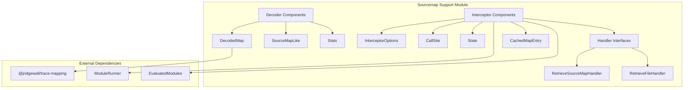
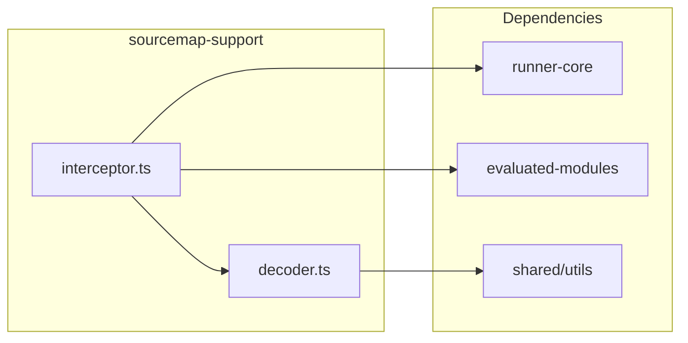
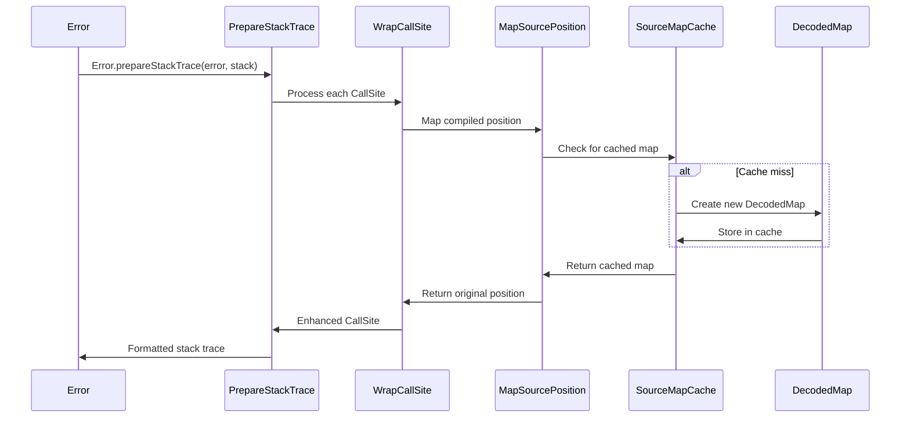
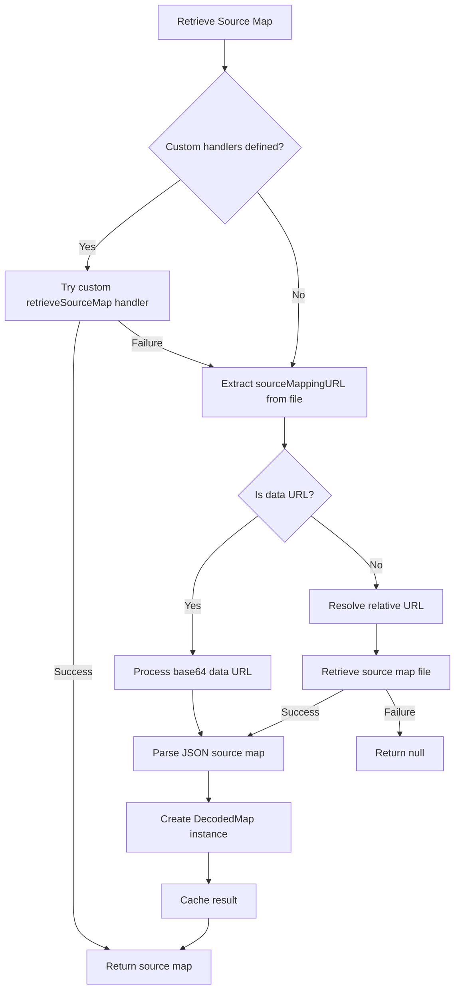
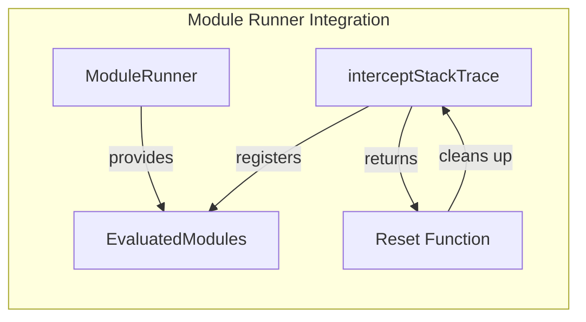
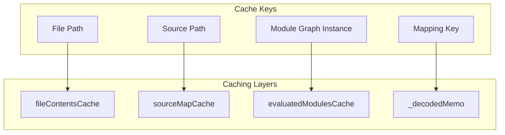

# Sourcemap Support Module

The sourcemap-support module provides comprehensive source map handling capabilities for Vite's module runner system. It enables accurate error stack traces and debugging information by mapping compiled code positions back to their original source locations.

## Overview

This module is a critical component of Vite's development experience, providing:
- Source map decoding and caching
- Stack trace interception and enhancement
- Original position mapping for compiled code
- Integration with Vite's module evaluation system

## Architecture

### Core Components



### Module Structure



## Component Details

### Decoder Components

#### DecodedMap
The `DecodedMap` class is the core data structure for handling source maps:

```typescript
class DecodedMap {
  _encoded: string              // Encoded mappings string
  _decoded: number[][][]       // Decoded mappings cache
  _decodedMemo: Stats          // Memoization state for performance
  url: string                  // Source map URL
  version: number              // Source map version
  names: string[]              // Symbol names from source map
  resolvedSources: string[]    // Resolved source file paths
}
```

**Key Features:**
- Lazily decodes source map mappings for performance
- Memoizes decoding state to avoid redundant operations
- Resolves source paths relative to the source map location
- Integrates with `@jridgewell/trace-mapping` for accurate position mapping

#### SourceMapLike Interface
Defines the minimal structure required for source map compatibility:

```typescript
interface SourceMapLike {
  version: number
  mappings?: string
  names?: string[]
  sources?: string[]
  sourcesContent?: string[]
}
```

#### Stats Interface
Performance optimization structure for memoization:

```typescript
interface Stats {
  lastKey: number      // Last accessed mapping key
  lastNeedle: number   // Last search position
  lastIndex: number    // Last array index
}
```

### Interceptor Components

#### InterceptorOptions
Configuration interface for stack trace interception:

```typescript
interface InterceptorOptions {
  retrieveFile?: RetrieveFileHandler        // Custom file retrieval
  retrieveSourceMap?: RetrieveSourceMapHandler  // Custom source map retrieval
}
```

#### CallSite Enhancement
Extended CallSite interface that provides additional debugging information:

```typescript
interface CallSite extends NodeJS.CallSite {
  getScriptNameOrSourceURL(): string
}
```

#### State Management
Tracks position mapping state during stack trace processing:

```typescript
interface State {
  nextPosition: null | OriginalMapping  // Next position to process
  curPosition: null | OriginalMapping   // Current mapped position
}
```

#### Handler Interfaces

**RetrieveFileHandler:**
```typescript
interface RetrieveFileHandler {
  (path: string): string | null | undefined | false
}
```

**RetrieveSourceMapHandler:**
```typescript
interface RetrieveSourceMapHandler {
  (path: string): null | { url: string; map: any }
}
```

#### CachedMapEntry
Source map caching structure:

```typescript
interface CachedMapEntry {
  url: string | null      // Source map URL
  map: DecodedMap | null  // Decoded source map
  vite?: boolean         // Vite-specific source map flag
}
```

## Data Flow

### Stack Trace Interception Process



### Source Map Retrieval Flow



## Integration with Module Runner

The sourcemap-support module integrates closely with the [runner-core](runner-core.md) module:



### Key Integration Points:

1. **Module Registration**: The interceptor registers with the ModuleRunner's EvaluatedModules instance
2. **Source Map Lookup**: Uses EvaluatedModules to find Vite-specific source maps
3. **Lifecycle Management**: Returns a cleanup function for proper resource management
4. **Error Handling**: Overrides Error.prepareStackTrace for enhanced debugging

## Performance Optimizations

### Caching Strategy



### Optimization Techniques:

1. **Lazy Decoding**: Source map mappings are only decoded when needed
2. **Memoization**: Decoding state is cached to avoid redundant operations
3. **Multi-level Caching**: File contents, source maps, and module graphs are cached separately
4. **Handler Chaining**: Custom handlers are tried in sequence until one succeeds

## Error Handling

### Stack Trace Enhancement

The module enhances error stack traces by:

1. **Position Mapping**: Maps compiled positions to original source positions
2. **Function Name Resolution**: Preserves original function names from source maps
3. **Eval Origin Mapping**: Handles nested eval() calls correctly
4. **Vite-specific Handling**: Identifies and marks Vite-processed source maps

### Fallback Behavior

When source mapping fails:
- Returns original compiled position for accuracy
- Preserves all available debugging information
- Continues processing remaining stack frames
- Logs no errors to avoid disrupting the debugging experience

## Usage Patterns

### Basic Integration

```typescript
// Register stack trace interceptor
const cleanup = interceptStackTrace(moduleRunner, {
  retrieveFile: (path) => {
    // Custom file retrieval logic
    return customFileSystem.readFile(path)
  },
  retrieveSourceMap: (path) => {
    // Custom source map retrieval logic
    return customSourceMapProvider.getMap(path)
  }
})

// Later, cleanup when done
cleanup()
```

### Custom Handler Implementation

Handlers should follow these patterns:
- Return `null` or `undefined` to indicate "not handled, try next"
- Return `false` to indicate "not found, stop trying"
- Return valid data to indicate success
- Handle errors gracefully without throwing

## Related Modules

- [runner-core](runner-core.md) - Module runner core functionality
- [evaluated-modules](evaluated-modules.md) - Module evaluation and caching
- [dev-server](dev-server.md) - Development server with source map support

## Dependencies

### External Dependencies
- `@jridgewell/trace-mapping` - Source map position mapping
- Node.js `Error.prepareStackTrace` - Stack trace customization

### Internal Dependencies
- `../utils` - Path resolution utilities
- `../../shared/utils` - Shared utility functions
- `../evaluatedModules` - Module evaluation tracking
- `../runner` - Module runner integration

## Future Considerations

1. **Performance**: Consider implementing async source map loading for large applications
2. **Memory**: Implement cache size limits to prevent memory growth in long-running processes
3. **Source Map v4**: Prepare for upcoming source map specification changes
4. **WebAssembly**: Consider WASM implementation for performance-critical decoding operations