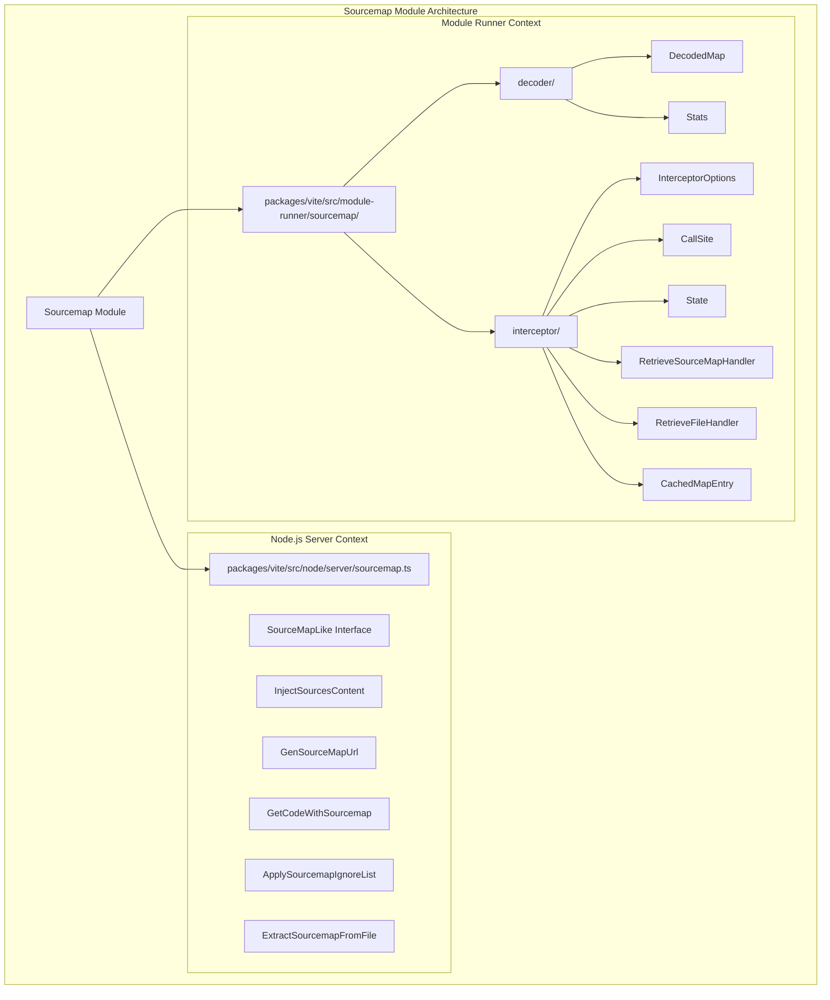
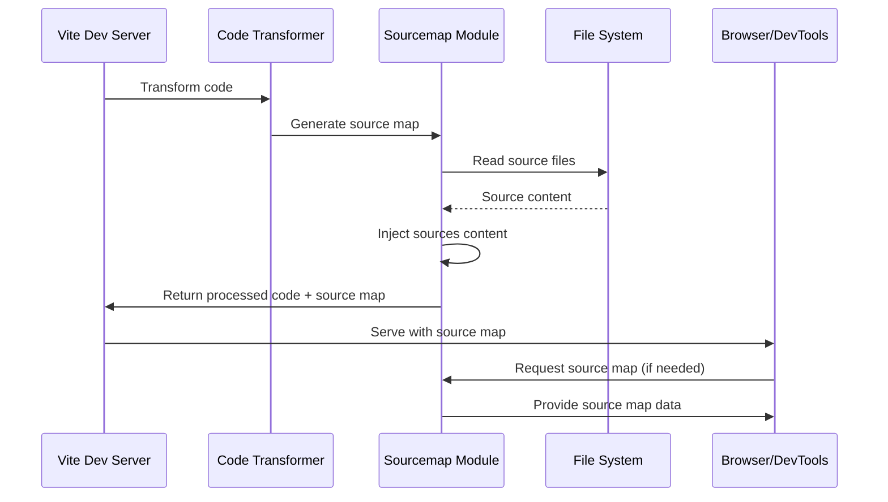
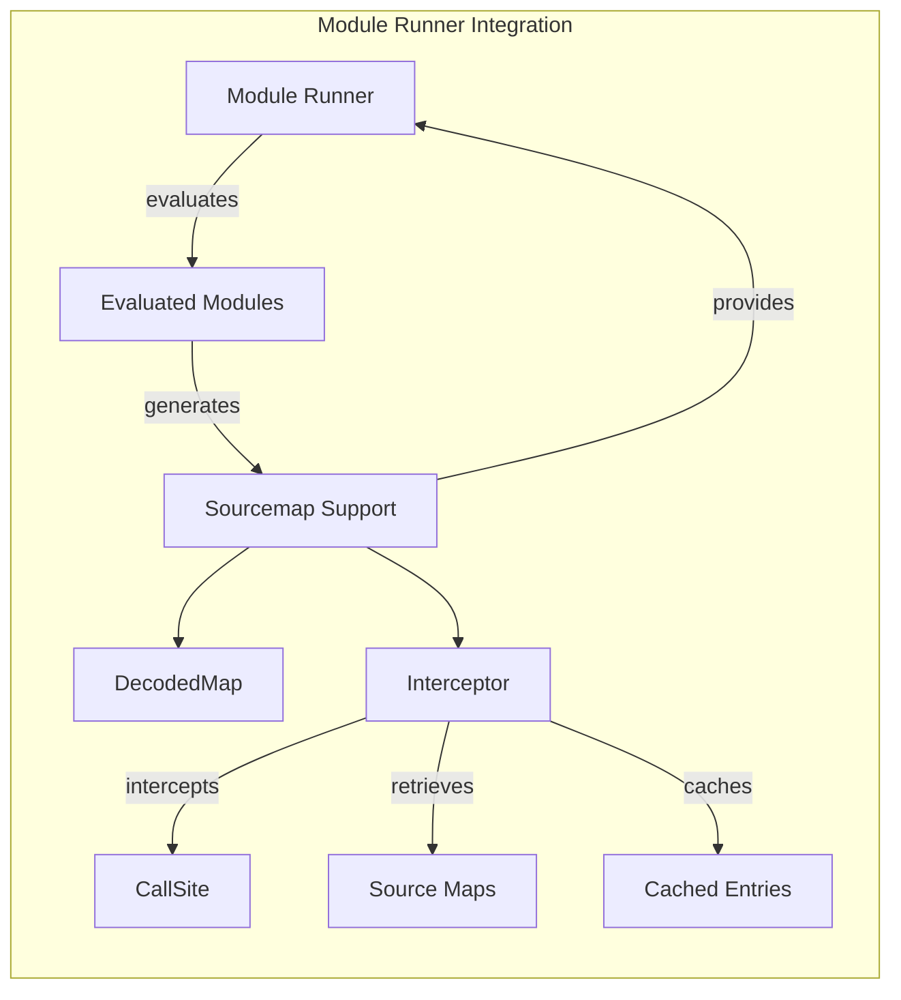
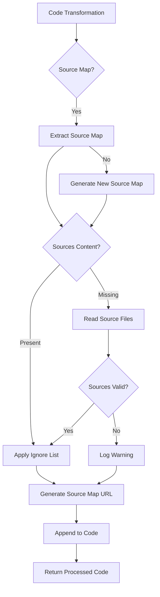
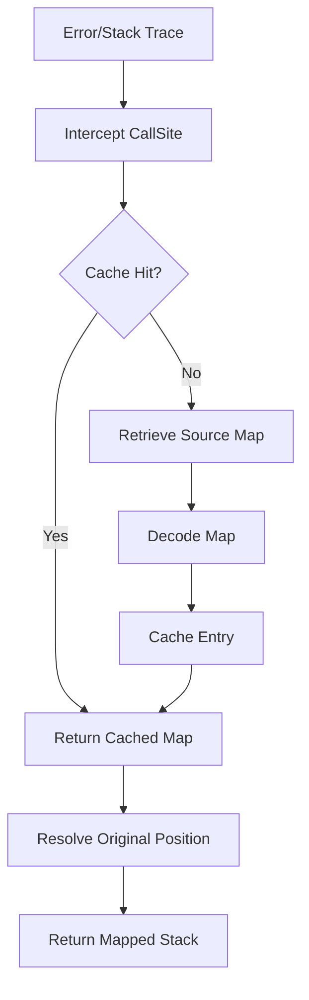

# Sourcemap Module Documentation

## Introduction

The sourcemap module is a critical component of Vite's development infrastructure, providing comprehensive source map support for both the development server and module runner. This module handles the generation, processing, and management of source maps to enable accurate debugging and error tracking in development environments.

The sourcemap functionality is distributed across two main contexts:
- **Node.js server context**: Handles source map processing for the development server
- **Module runner context**: Provides source map support for runtime module evaluation

## Architecture Overview



## Core Components

### Node.js Server Sourcemap Support

#### SourceMapLike Interface
The fundamental interface that defines the structure of source maps within Vite's server context:

```typescript
interface SourceMapLike {
  sources: string[]
  sourcesContent?: (string | null)[]
  sourceRoot?: string
}
```

#### Key Functions

**injectSourcesContent()**
- Injects source content into source maps when missing
- Handles virtual modules and file system resolution
- Provides error handling for missing source files
- Supports source root resolution for relative paths

**genSourceMapUrl()**
- Generates base64-encoded data URLs for source maps
- Handles both string and object source map formats
- Used for inline source map generation

**getCodeWithSourcemap()**
- Appends source map references to generated code
- Supports both JavaScript and CSS file types
- Includes debug information when enabled

**applySourcemapIgnoreList()**
- Applies Google's ignore list specification to source maps
- Filters out vendor or third-party code from debugging
- Configurable through the `sourcemapIgnoreList` option

**extractSourcemapFromFile()**
- Extracts source maps from file content
- Supports both inline and external source map references
- Handles convert-source-map integration

### Module Runner Sourcemap Support

#### Decoder Components

**DecodedMap Class**
- Decodes and caches source map mappings
- Provides efficient source position resolution
- Manages resolved source paths
- Implements memoization for performance optimization

**Stats Interface**
- Tracks decoding state and performance metrics
- Manages memoization cache state
- Optimizes repeated source map queries

#### Interceptor Components

**InterceptorOptions Interface**
- Configures source map retrieval handlers
- Supports custom file and source map resolution
- Enables environment-specific source map handling

**CallSite Interface**
- Extends Node.js CallSite for source map integration
- Provides script name and source URL resolution
- Enables accurate stack trace mapping

**State Interface**
- Manages current and next position state during interception
- Tracks original mapping information
- Supports iterative source map resolution

**Handler Interfaces**
- `RetrieveSourceMapHandler`: Custom source map retrieval logic
- `RetrieveFileHandler`: Custom file content resolution
- `CachedMapEntry`: Cached source map entries with Vite-specific metadata

## Data Flow Architecture



## Integration with Module Runner



## Process Flow

### Source Map Generation Process



### Runtime Source Map Resolution



## Dependencies and Integration

### Internal Dependencies
- **Module Runner**: Provides runtime source map support for evaluated modules
- **Dev Server**: Integrates source map processing into the development workflow
- **Transformer**: Generates source maps during code transformation

### External Dependencies
- **convert-source-map**: Handles source map conversion and extraction
- **Node.js fs/promises**: File system operations for source content injection
- **Rollup**: Source map type definitions and processing

### Related Modules
- [module-runner](module-runner.md): Runtime module evaluation with source map support
- [dev-server](dev-server.md): Development server integration
- [build](build.md): Production build source map handling

## Configuration and Usage

### Development Server Configuration
```typescript
interface SourceMapOptions {
  sourcemap?: boolean | 'inline' | 'hidden'
  sourcemapIgnoreList?: (sourcePath: string, sourcemapPath: string) => boolean
}
```

### Module Runner Configuration
```typescript
interface InterceptorOptions {
  retrieveFile?: RetrieveFileHandler
  retrieveSourceMap?: RetrieveSourceMapHandler
}
```

## Performance Considerations

### Caching Strategy
- Source maps are cached at multiple levels (file system, memory, decoded mappings)
- Decoded mappings use memoization to avoid repeated parsing
- Virtual modules are handled efficiently to avoid unnecessary file system operations

### Memory Management
- Lazy loading of source content to minimize memory usage
- Selective caching based on access patterns
- Cleanup of unused cached entries

### Optimization Techniques
- Parallel processing of multiple source files
- Efficient source path resolution
- Minimal overhead for virtual modules

## Error Handling

### Source Map Validation
- Validation of source map structure and version compatibility
- Graceful handling of corrupted or invalid source maps
- Fallback strategies when source maps are unavailable

### File System Errors
- Permission error handling for source file access
- Missing source file warnings with detailed logging
- Virtual module detection to avoid false positives

### Runtime Error Mapping
- Accurate stack trace mapping even with incomplete source maps
- Fallback to original positions when mapping fails
- Debug information preservation for troubleshooting

## Best Practices

### Development Workflow
1. Enable source maps in development for accurate debugging
2. Configure appropriate ignore lists to filter vendor code
3. Use inline source maps for faster development builds
4. Implement proper error handling for missing source files

### Production Considerations
1. Generate separate source map files for production builds
2. Implement proper source map hosting and access controls
3. Consider source map security implications
4. Optimize source map size and loading performance

### Debugging Tips
1. Use `DEBUG="vite:sourcemap"` for detailed source map logging
2. Check source map validity with external tools
3. Verify source file accessibility and permissions
4. Monitor source map performance impact on build times