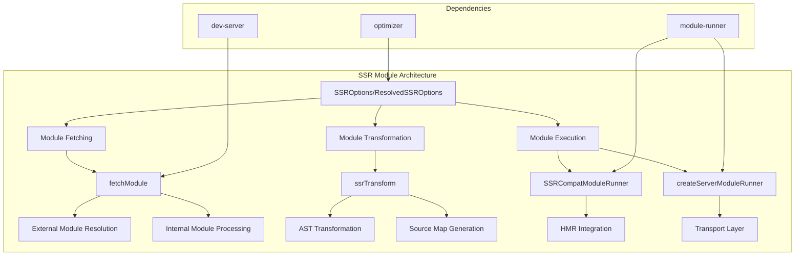

# SSR (Server-Side Rendering) Module Documentation

## Overview

The SSR module provides comprehensive server-side rendering capabilities for Vite applications. It enables the execution and transformation of JavaScript modules in a server environment, supporting both development and production scenarios with features like module fetching, transformation, and hot module replacement (HMR) integration.

## Architecture



## Core Functionality

### 1. Configuration Management ([configuration.md](./configuration.md))

The SSR module provides flexible configuration options through `SSROptions` and `ResolvedSSROptions` interfaces, allowing developers to control:

- **External dependencies**: Define which modules should be externalized vs. bundled
- **Target environment**: Specify 'node' or 'webworker' targets
- **Dependency optimization**: Configure esbuild options for SSR dependencies
- **Resolution conditions**: Control module resolution conditions for SSR imports

### 2. Module Fetching ([module-fetching.md](./module-fetching.md))

The `fetchModule` function handles the retrieval and processing of modules for SSR execution:

- **External module resolution**: Resolves and externalizes Node.js built-ins and external dependencies
- **Internal module transformation**: Processes modules through Vite's transform pipeline
- **Source map handling**: Manages source map generation and inlining for debugging
- **Caching**: Implements intelligent caching to avoid redundant transformations

### 3. Module Transformation ([module-transformation.md](./module-transformation.md))

The transformation engine converts ES modules into SSR-compatible code:

- **AST-based transformation**: Uses Rollup's AST parser for accurate code analysis
- **Import/export handling**: Transforms ES module syntax to SSR-compatible equivalents
- **Scope analysis**: Implements sophisticated scope tracking to avoid variable conflicts
- **Source map generation**: Creates accurate source maps for debugging transformed code

### 4. Module Execution ([module-execution.md](./module-execution.md))

Two primary execution environments are provided:

#### SSR Compatibility Runner
- Legacy-compatible SSR module execution
- Integrates with Vite's module graph
- Handles error tracking and stack trace fixing

#### Server Module Runner
- Modern SSR execution environment
- Full HMR support
- Configurable transport layer for communication

## Key Features

### Hot Module Replacement (HMR)
The SSR module integrates with Vite's HMR system, allowing for:
- Real-time module updates during development
- Preservation of application state during updates
- Custom HMR logging and configuration

### Source Map Support
Comprehensive source map handling includes:
- Automatic source map generation during transformation
- Stack trace enhancement for better debugging
- Multiple source map format support

### Dependency Optimization
Integration with Vite's optimizer enables:
- Selective dependency optimization for SSR
- Configurable esbuild options
- External dependency management

## Usage Patterns

### Basic SSR Module Loading
```typescript
import { ssrLoadModule } from 'vite/ssr'

const module = await ssrLoadModule('/src/app.js', server)
```

### Advanced Configuration
```typescript
const ssrOptions: SSROptions = {
  target: 'node',
  noExternal: ['some-dependency'],
  optimizeDeps: {
    include: ['optimized-dep']
  }
}
```

### Runner-based Execution
```typescript
const runner = createServerModuleRunner(environment, {
  hmr: { logger: customLogger },
  evaluator: customEvaluator
})
```

## Integration Points

### With Module Runner
The SSR module leverages Vite's [module-runner](module-runner.md) for core execution capabilities, including:
- Module evaluation and caching
- Import meta handling
- Transport layer management

### With Dev Server
Integration with [dev-server](dev-server.md) provides:
- Environment-based module processing
- Transform request handling
- WebSocket communication for HMR

### With Optimizer
Connection to [optimizer](optimizer.md) enables:
- Dependency optimization configuration
- Build-time optimizations
- External dependency handling

## Performance Considerations

### Caching Strategy
- Module transformation results are cached to avoid redundant processing
- External module resolution is cached for performance
- Source maps are generated only when necessary

### Memory Management
- Module runners are designed to be reusable across requests
- Proper cleanup mechanisms prevent memory leaks
- Configurable HMR logging reduces overhead

## Error Handling

### Module Resolution Errors
- Clear error messages for missing modules
- Stack trace enhancement for better debugging
- Graceful handling of external module failures

### Transformation Errors
- Detailed parse error reporting with location information
- Source map integration for accurate error positioning
- Fallback mechanisms for unsupported syntax

## Future Considerations

The SSR module is marked as experimental and may evolve to include:
- Enhanced webworker target support
- Improved performance optimizations
- Additional transformation options
- Better integration with edge runtime environments