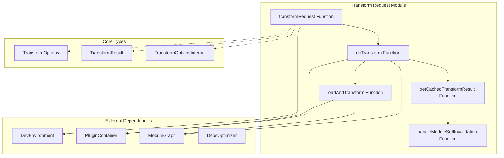
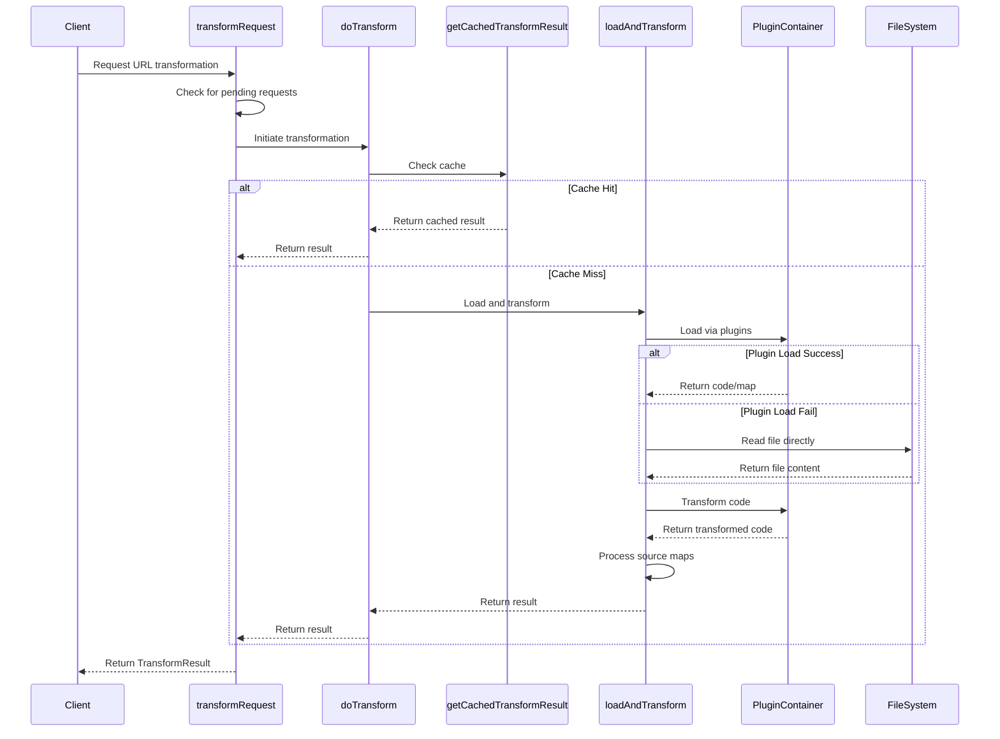
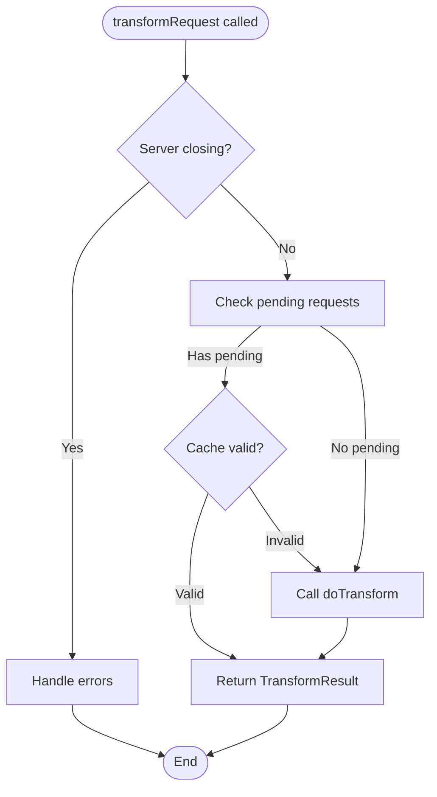
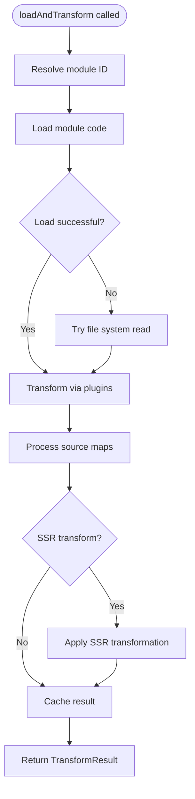
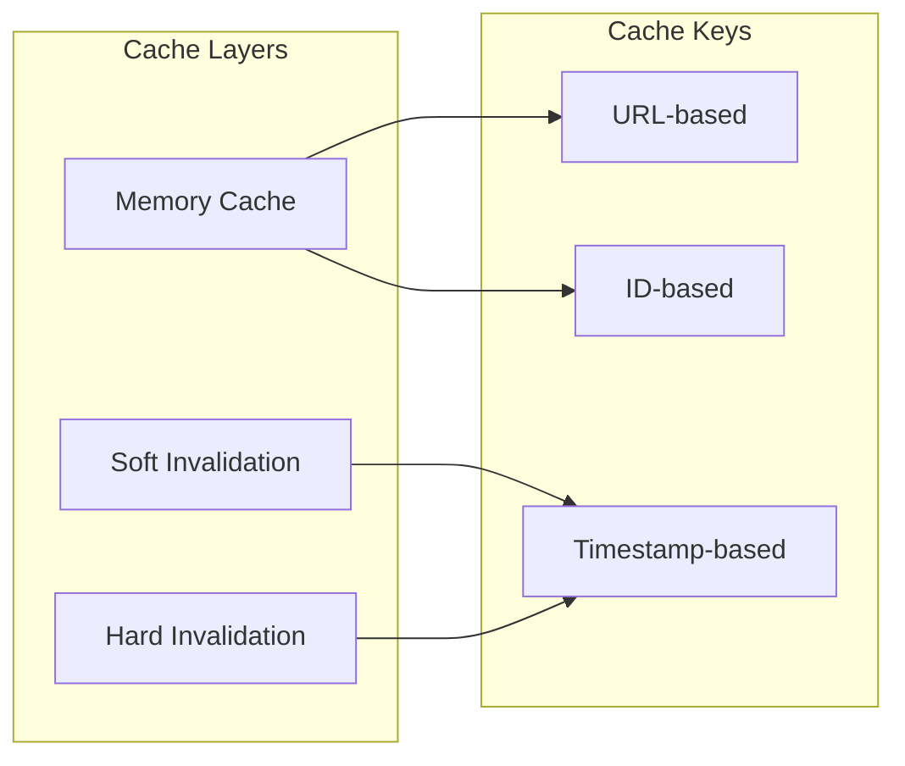

# Transform Request Module

## Introduction

The transform-request module is a core component of Vite's development server that handles the transformation of modules during the development process. It serves as the central processing unit that takes raw source files, applies various transformations through the plugin system, and produces optimized code ready for browser consumption or server-side rendering.

This module sits at the heart of Vite's development workflow, orchestrating the load-transform pipeline that enables features like hot module replacement (HMR), source map generation, and plugin-based code transformations. It bridges the gap between the raw source code and the processed modules that are served to the browser.

## Architecture Overview



## Core Components

### TransformOptions

The `TransformOptions` interface defines the public configuration options for the transformation process. Currently, it primarily handles SSR (Server-Side Rendering) configuration, though this is deprecated in favor of environment-based inference.

```typescript
export interface TransformOptions {
  /**
   * @deprecated inferred from environment
   */
  ssr?: boolean
}
```

### TransformResult

The `TransformResult` interface represents the output of the transformation process, containing the transformed code, source maps, and metadata about dependencies.

```typescript
export interface TransformResult {
  code: string
  map: SourceMap | { mappings: '' } | null
  ssr?: boolean
  etag?: string
  deps?: string[]
  dynamicDeps?: string[]
}
```

### TransformOptionsInternal

Internal options used within the transform request pipeline, providing additional control over the transformation process.

```typescript
export interface TransformOptionsInternal {
  /**
   * @internal
   */
  allowId?: (id: string) => boolean
}
```

## Data Flow



## Process Flow

### Main Transformation Pipeline



### Load and Transform Process



## Key Features

### Request Deduplication

The module implements sophisticated request deduplication to prevent redundant transformations:

- **Pending Request Tracking**: Maintains a map of ongoing transformations to avoid duplicate processing
- **Timestamp-based Invalidation**: Uses timestamps to determine if cached results are still valid
- **Abort Mechanism**: Provides ability to abort stale requests when modules are invalidated

### Caching Strategy



### Source Map Processing

The module handles source map generation and processing:

- **Extraction**: Extracts source maps from loaded files
- **Injection**: Injects source content into source maps
- **Normalization**: Normalizes source map formats
- **Path Resolution**: Rewrites absolute paths to relative paths for better debugger support

### Error Handling

Comprehensive error handling for various scenarios:

- **File Not Found**: Graceful handling of missing files
- **Permission Denied**: Proper error reporting for restricted files
- **Public File Access**: Special handling for files in public directory
- **Server Closure**: Proper cleanup when server is shutting down

## Integration Points

### DevEnvironment Integration

The module integrates closely with the [dev-environment](dev-environment.md) system:

- Uses `DevEnvironment` for configuration and state management
- Leverages the module graph for dependency tracking
- Integrates with the plugin container for transformations
- Coordinates with the dependency optimizer

### Plugin System Integration

Works with the [plugin-container](plugin-container.md) to:

- Resolve module IDs through plugins
- Load module content via plugins
- Apply transformations through the plugin pipeline
- Handle plugin-specific configurations

### Module Graph Integration

Integrates with the [module-graph](module-graph.md) to:

- Track module dependencies
- Manage module invalidation states
- Update module transformation results
- Handle HMR-related transformations

## Performance Considerations

### Optimization Strategies

1. **Caching**: Multi-layered caching prevents redundant transformations
2. **Request Deduplication**: Avoids duplicate processing of the same module
3. **Lazy Loading**: Defers expensive operations until necessary
4. **Incremental Processing**: Only reprocesses changed modules

### Memory Management

- **Cache Invalidation**: Proper cleanup of stale cache entries
- **Request Cleanup**: Automatic cleanup of completed requests
- **Resource Management**: Efficient handling of file system resources

## Error Codes

The module defines specific error codes for different failure scenarios:

- `ERR_LOAD_URL`: Failed to load a URL
- `ERR_LOAD_PUBLIC_URL`: Attempted to import from public directory
- `ERR_DENIED_ID`: ID was denied by the allowId function

## Dependencies

### Internal Dependencies

- [dev-environment](dev-environment.md): Core development environment
- [plugin-container](plugin-container.md): Plugin system integration
- [module-graph](module-graph.md): Module dependency tracking
- [ssr](ssr.md): Server-side rendering transformations

### External Dependencies

- `es-module-lexer`: ES module parsing
- `magic-string`: String manipulation for transformations
- `etag`: ETag generation for caching
- Node.js file system and path utilities

## Usage Examples

### Basic Transformation

```typescript
const result = await transformRequest(environment, '/src/main.js')
console.log(result.code) // Transformed code
console.log(result.map)  // Source map
```

### With Internal Options

```typescript
const result = await transformRequest(environment, '/src/app.js', {
  allowId: (id) => !id.includes('node_modules')
})
```

### Error Handling

```typescript
try {
  const result = await transformRequest(environment, '/src/missing.js')
} catch (error) {
  if (error.code === 'ERR_LOAD_URL') {
    console.error('Failed to load module')
  }
}
```

## Future Considerations

The module is designed with extensibility in mind:

- **Environment-based Processing**: Moving towards environment-specific transformation logic
- **Plugin Integration**: Enhanced plugin system integration
- **Performance Optimization**: Continued optimization of transformation pipeline
- **Source Map Enhancement**: Improved source map handling and debugging support