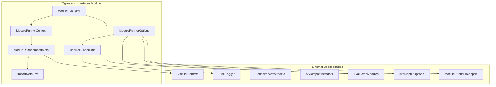
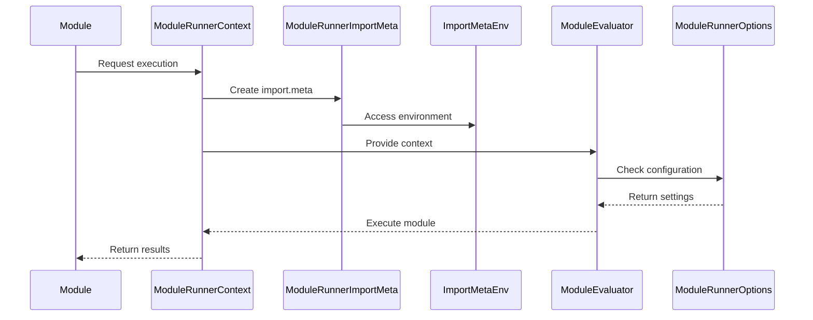
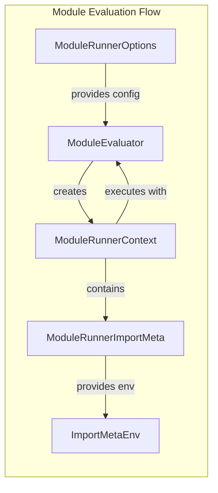

# Types and Interfaces Module

## Introduction

The types-and-interfaces module serves as the foundational type system for Vite's module runner functionality. It defines the core interfaces and type definitions that enable type-safe module evaluation, hot module replacement (HMR), and context management within Vite's development environment. This module provides the contract specifications that other components in the module-runner system implement and depend upon.

## Architecture Overview



## Core Components

### ModuleRunnerImportMeta

The `ModuleRunnerImportMeta` interface extends the standard `ImportMeta` interface to provide Vite-specific metadata for modules running in the module runner environment.

```typescript
export interface ModuleRunnerImportMeta extends ImportMeta {
  url: string
  env: ImportMetaEnv
  hot?: ViteHotContext
  [key: string]: any
}
```

**Key Features:**
- Extends the browser's native `ImportMeta` interface
- Provides access to environment variables through `env` property
- Optional HMR context through `hot` property
- Flexible extension through index signature

**Dependencies:**
- [alt text](hot.md) - ViteHotContext for HMR functionality
- ImportMetaEnv for environment variable access

### ImportMetaEnv

Defines the structure of environment variables available through `import.meta.env`.

```typescript
export interface ImportMetaEnv {
  [key: string]: any
  BASE_URL: string
  MODE: string
  DEV: boolean
  PROD: boolean
  SSR: boolean
}
```

**Key Features:**
- Standard Vite environment variables (BASE_URL, MODE, DEV, PROD, SSR)
- Extensible through index signature for custom environment variables
- Provides runtime environment information to modules

### ModuleRunnerContext

Defines the execution context provided to modules during evaluation, containing essential module runtime utilities.

```typescript
export interface ModuleRunnerContext {
  [ssrModuleExportsKey]: Record<string, any>
  [ssrImportKey]: (id: string, metadata?: DefineImportMetadata) => Promise<any>
  [ssrDynamicImportKey]: (
    id: string,
    options?: ImportCallOptions,
  ) => Promise<any>
  [ssrExportAllKey]: (obj: any) => void
  [ssrExportNameKey]: (name: string, getter: () => unknown) => void
  [ssrImportMetaKey]: ModuleRunnerImportMeta
}
```

**Key Features:**
- Module exports management through `ssrModuleExportsKey`
- Synchronous and dynamic import capabilities
- Export utilities for named and namespace exports
- Access to import meta information

**Dependencies:**
- ModuleRunnerImportMeta for import.meta object
- DefineImportMetadata for import metadata

### ModuleEvaluator

Abstract interface for module evaluation strategies, allowing different evaluation approaches (inline, external).

```typescript
export interface ModuleEvaluator {
  startOffset?: number
  runInlinedModule(
    context: ModuleRunnerContext,
    code: string,
    module: Readonly<EvaluatedModuleNode>,
  ): Promise<any>
  runExternalModule(file: string): Promise<any>
}
```

**Key Features:**
- Support for both inlined and external module evaluation
- Configurable line offset for transformed code
- Asynchronous module execution
- Integration with module cache through EvaluatedModuleNode

**Dependencies:**
- ModuleRunnerContext for execution context
- [alt text](evaluated-modules.md) - EvaluatedModuleNode for module state

### ModuleRunnerHmr

Configuration interface for Hot Module Replacement functionality within the module runner.

```typescript
export interface ModuleRunnerHmr {
  logger?: false | HMRLogger
}
```

**Key Features:**
- Configurable HMR logging
- Can disable HMR logging by setting logger to false
- Integration with shared HMR logging system

**Dependencies:**
- [alt text](hmr-shared.md) - HMRLogger for logging functionality

### ModuleRunnerOptions

Comprehensive configuration interface for the module runner, encompassing all runtime options.

```typescript
export interface ModuleRunnerOptions {
  transport: ModuleRunnerTransport
  sourcemapInterceptor?: false | 'node' | 'prepareStackTrace' | InterceptorOptions
  hmr?: boolean | ModuleRunnerHmr
  createImportMeta?: (modulePath: string) => ModuleRunnerImportMeta | Promise<ModuleRunnerImportMeta>
  evaluatedModules?: EvaluatedModules
}
```

**Key Features:**
- Transport layer configuration for server communication
- Flexible source map interception options
- HMR configuration with boolean or detailed options
- Custom import.meta creation
- Optional module cache sharing

**Dependencies:**
- ModuleRunnerTransport for communication
- [alt text](sourcemap-support.md) - InterceptorOptions for source map handling
- ModuleRunnerHmr for HMR configuration
- ModuleRunnerImportMeta for import.meta creation
- [alt text](evaluated-modules.md) - EvaluatedModules for module caching

## Data Flow



## Component Interactions



## Integration with Module System

The types-and-interfaces module serves as the contract layer that enables seamless integration between different parts of Vite's module system:

1. **Configuration Layer**: ModuleRunnerOptions provides the central configuration point
2. **Execution Layer**: ModuleEvaluator and ModuleRunnerContext define how modules execute
3. **Environment Layer**: ModuleRunnerImportMeta and ImportMetaEnv provide runtime environment access
4. **HMR Layer**: ModuleRunnerHmr enables hot module replacement capabilities

## Usage Patterns

### Basic Module Context Setup
```typescript
const context: ModuleRunnerContext = {
  [ssrModuleExportsKey]: {},
  [ssrImportKey]: async (id, metadata) => {
    // Import resolution logic
  },
  [ssrImportMetaKey]: {
    url: moduleUrl,
    env: { DEV: true, PROD: false, SSR: true, BASE_URL: '/', MODE: 'development' }
  }
}
```

### Module Evaluator Implementation
```typescript
const evaluator: ModuleEvaluator = {
  async runInlinedModule(context, code, module) {
    // Module evaluation logic
  },
  async runExternalModule(file) {
    // External module loading logic
  }
}
```

## Related Documentation

- [alt text](runner-core.md) - Core module runner implementation
- [alt text](evaluated-modules.md) - Module caching and state management
- [alt text](sourcemap-support.md) - Source map handling and interception
- [alt text](hmr-shared.md) - Shared HMR types and utilities
- [alt text](hot.md) - Hot module replacement context