# WebSocket Module Documentation

## Introduction

The WebSocket module in Vite provides real-time bidirectional communication between the development server and connected clients. It serves as the backbone for Hot Module Replacement (HMR), enabling instant updates to modules without full page reloads during development. The module implements a secure, token-based authentication system and supports both standalone and integrated server modes.

## Architecture Overview

The WebSocket module is built around two core components that work together to provide a robust communication infrastructure:

- **WebSocketServer**: The main server component that manages client connections, handles authentication, and coordinates message broadcasting
- **WebSocketClient**: Represents individual client connections with methods for sending and receiving messages

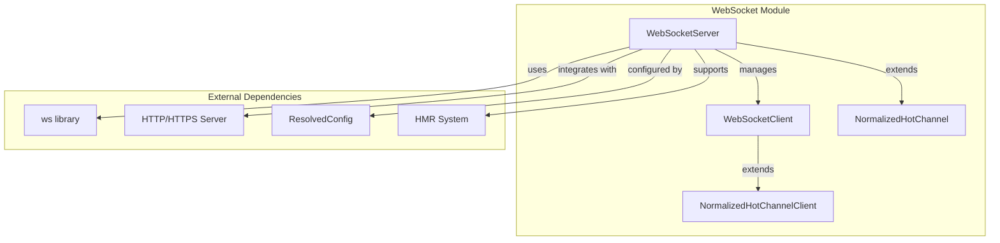

## Core Components

### WebSocketServer

The `WebSocketServer` interface extends `NormalizedHotChannel` and provides the main server functionality:

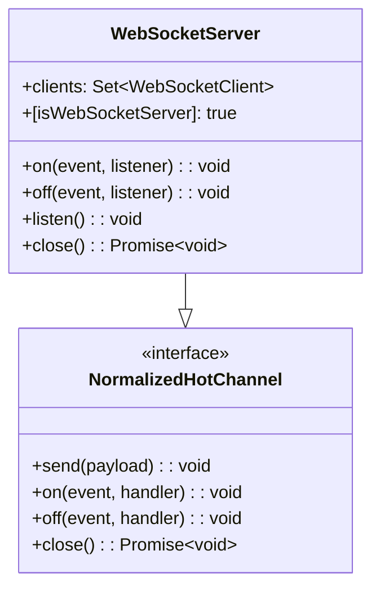

**Key Features:**
- **Client Management**: Maintains a set of connected `WebSocketClient` instances
- **Event Handling**: Supports both standard WebSocket events and custom event listeners
- **Security**: Implements token-based authentication to prevent unauthorized access
- **Lifecycle Management**: Provides methods for starting and stopping the server

### WebSocketClient

The `WebSocketClient` interface represents individual client connections:

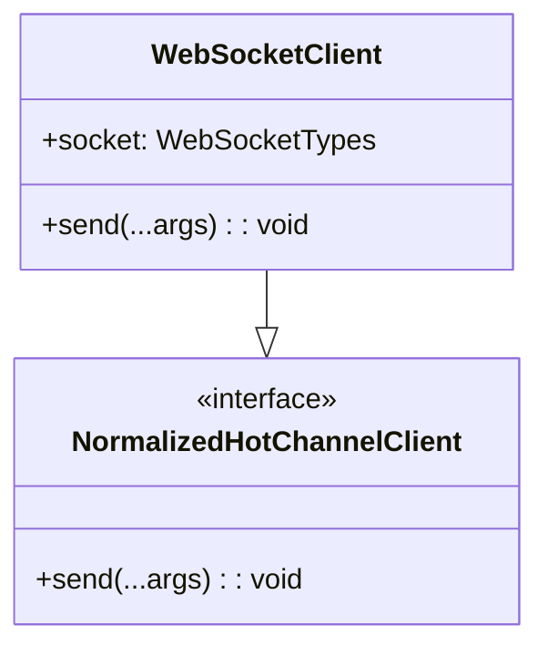

**Key Features:**
- **Raw Socket Access**: Provides access to the underlying WebSocket instance
- **Message Sending**: Supports both custom events and HMR payloads
- **Client Identification**: Each client is uniquely identified and managed

## Security Implementation

The WebSocket module implements multiple security layers to prevent unauthorized access:

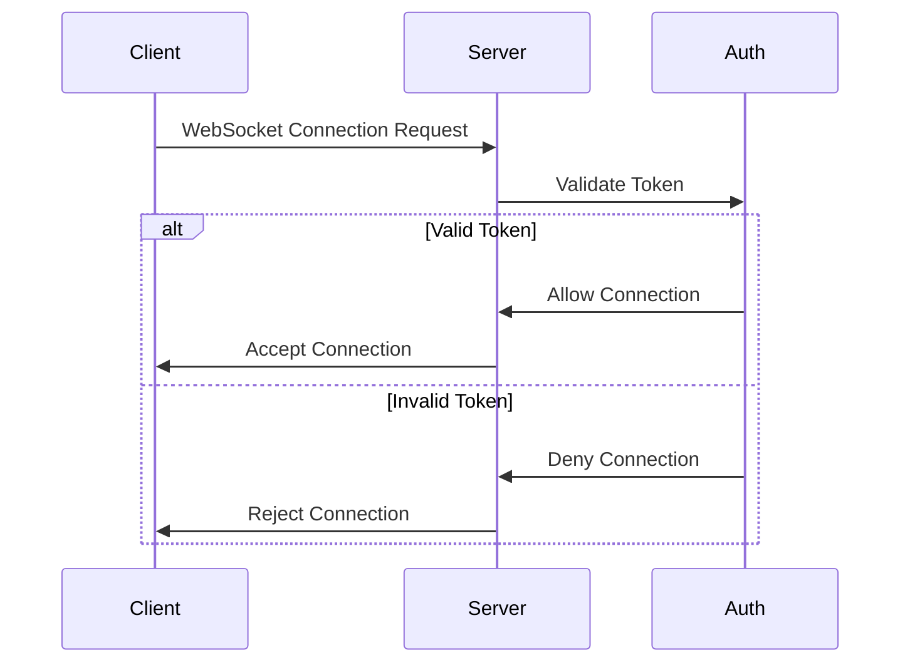

### Token-Based Authentication

- **Token Generation**: Uses `config.webSocketToken` for authentication
- **Timing-Safe Comparison**: Employs `crypto.timingSafeEqual()` to prevent timing attacks
- **Origin Validation**: Checks `Origin` header for browser-based connections
- **Host Allowlist**: Validates requests against configured allowed hosts

### Special Protocol Handling

- **vite-ping Protocol**: Allows connections without authentication for server availability checks
- **vite-hmr Protocol**: Standard HMR communication with full authentication
- **Legacy Support**: Optional token check skipping for backward compatibility

## Server Modes

The WebSocket module supports two operational modes:

### Integrated Mode

When the WebSocket server integrates with an existing HTTP/HTTPS server:

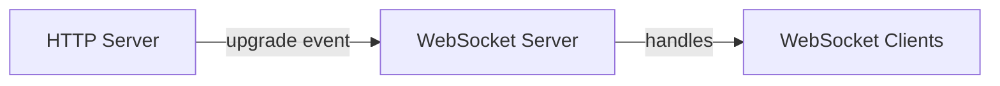

**Characteristics:**
- Shares port with main development server
- Uses existing server infrastructure
- Automatic path resolution with base URL

### Standalone Mode

When running as an independent server:

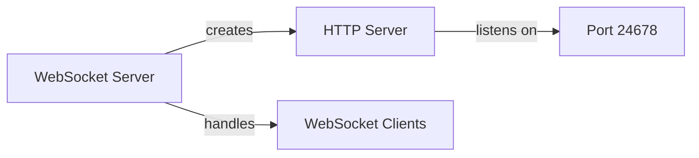

**Characteristics:**
- Dedicated port (default: 24678)
- Independent server lifecycle
- Custom HTTP/HTTPS configuration support

## Message Flow and Event Handling

### HMR Message Flow

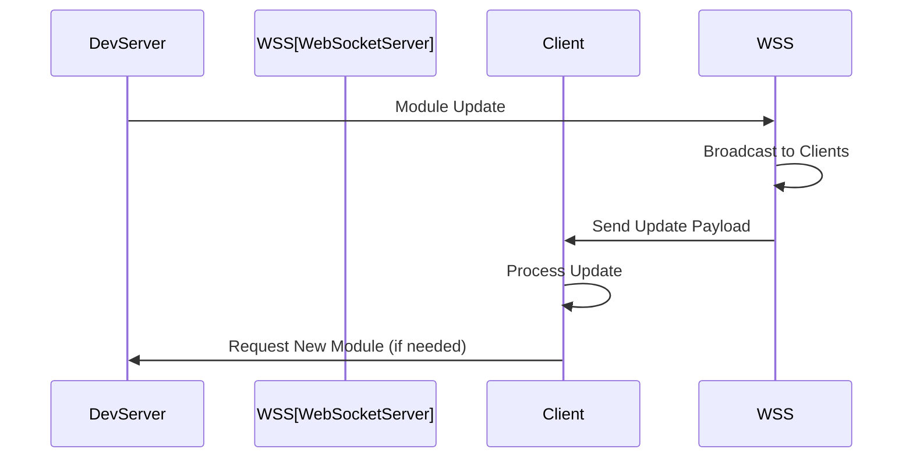

### Custom Event Handling

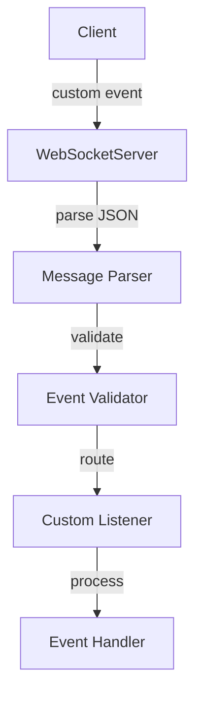

## Integration with HMR System

The WebSocket module integrates closely with Vite's HMR system:

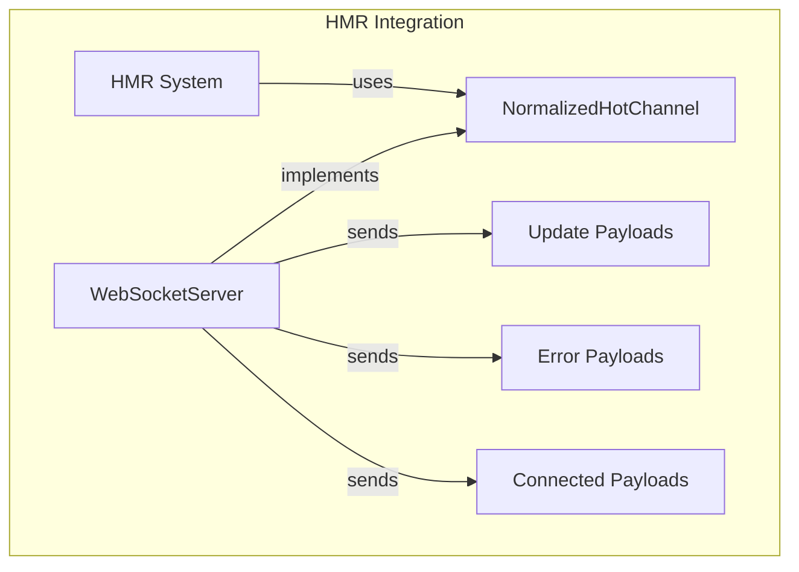

### HMR Payload Types

- **Update Payload**: Contains module changes for hot replacement
- **Error Payload**: Compilation or runtime errors
- **Connected Payload**: Connection establishment confirmation
- **Custom Payload**: Application-specific events

## Error Handling and Resilience

### Connection Error Handling

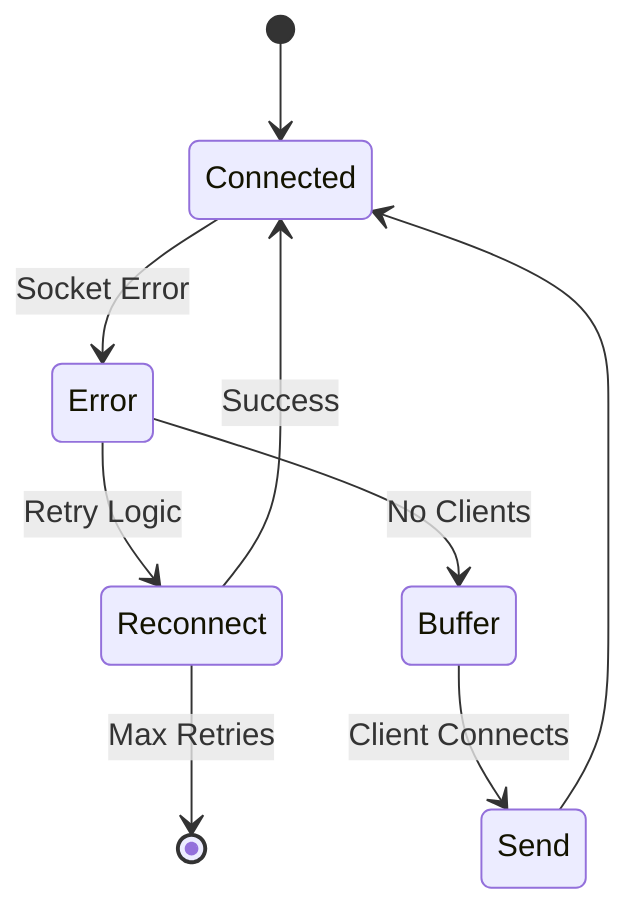

### Port Conflict Resolution

- **Detection**: Monitors for `EADDRINUSE` errors
- **Logging**: Provides clear error messages with port information
- **Graceful Degradation**: Allows server to continue without WebSocket support

## Configuration and Options

### Server Configuration

The WebSocket server behavior is controlled through several configuration options:

- **server.ws**: Enable/disable WebSocket support
- **server.hmr**: HMR-specific settings (port, host, path)
- **server.allowedHosts**: Host validation for security
- **webSocketToken**: Authentication token
- **legacy.skipWebSocketTokenCheck**: Optional token bypass

### Runtime Behavior

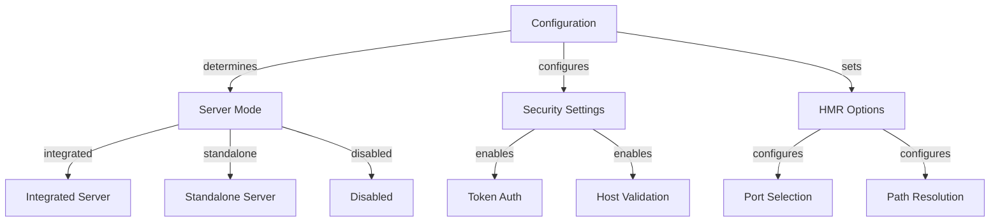

## Dependencies and Relationships

### Internal Dependencies

- **[hmr](hmr.md)**: Hot Module Replacement system integration
- **[dev-server](dev-server.md)**: Development server integration
- **[config](config.md)**: Configuration management

### External Dependencies

- **ws library**: Core WebSocket implementation
- **Node.js crypto**: Token generation and validation
- **picocolors**: Terminal output formatting

## Performance Considerations

### Connection Management

- **WeakMap Usage**: Efficient client socket mapping with automatic garbage collection
- **Client Set**: O(1) client lookup and iteration
- **Message Buffering**: Prevents memory leaks with proper cleanup

### Message Broadcasting

- **JSON Serialization**: Single serialization for all clients
- **Ready State Check**: Prevents sending to closed connections
- **Error Buffering**: Holds error messages until clients connect

## Best Practices

### Security

1. **Always validate tokens** in production environments
2. **Configure allowed hosts** appropriately for your deployment
3. **Monitor connection logs** for suspicious activity
4. **Use HTTPS** in production for encrypted communication

### Performance

1. **Limit custom event listeners** to prevent memory leaks
2. **Clean up event handlers** when components unmount
3. **Use connection pooling** for high-traffic applications
4. **Monitor client count** to prevent resource exhaustion

### Development

1. **Test with multiple clients** to ensure proper broadcasting
2. **Verify error handling** with simulated network failures
3. **Check security headers** in browser developer tools
4. **Use vite-ping** for server availability checks

## Troubleshooting

### Common Issues

**Connection Refused**
- Check if WebSocket server is enabled in configuration
- Verify port availability and firewall settings
- Review allowed hosts configuration

**Authentication Failures**
- Ensure token parameter is included in connection URL
- Check token generation and comparison logic
- Verify Origin header for browser connections

**HMR Not Working**
- Confirm WebSocket connection is established
- Check browser console for connection errors
- Verify HMR configuration in Vite config

### Debug Information

The WebSocket module provides detailed logging for:
- Connection establishment and termination
- Authentication attempts and results
- Error conditions and stack traces
- Server lifecycle events

## Future Enhancements

Potential improvements to the WebSocket module include:

- **Compression Support**: Message compression for large payloads
- **Binary Protocol**: Support for binary data transmission
- **Rate Limiting**: Connection and message rate limiting
- **Metrics Collection**: Performance and usage analytics
- **Cluster Support**: Multi-process WebSocket server support