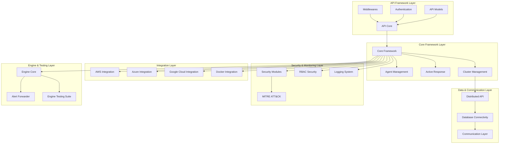
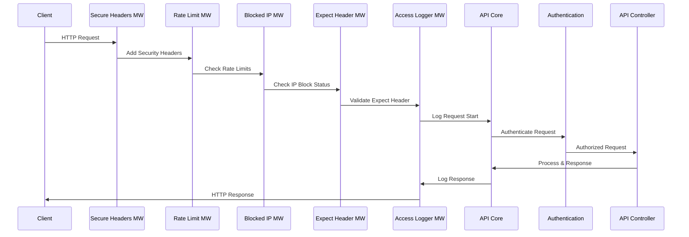
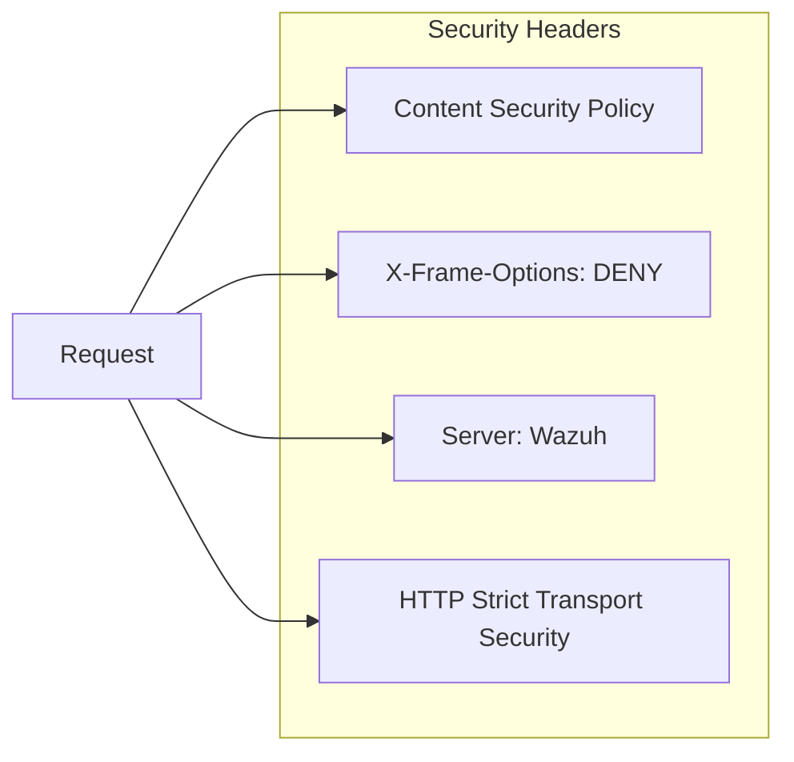
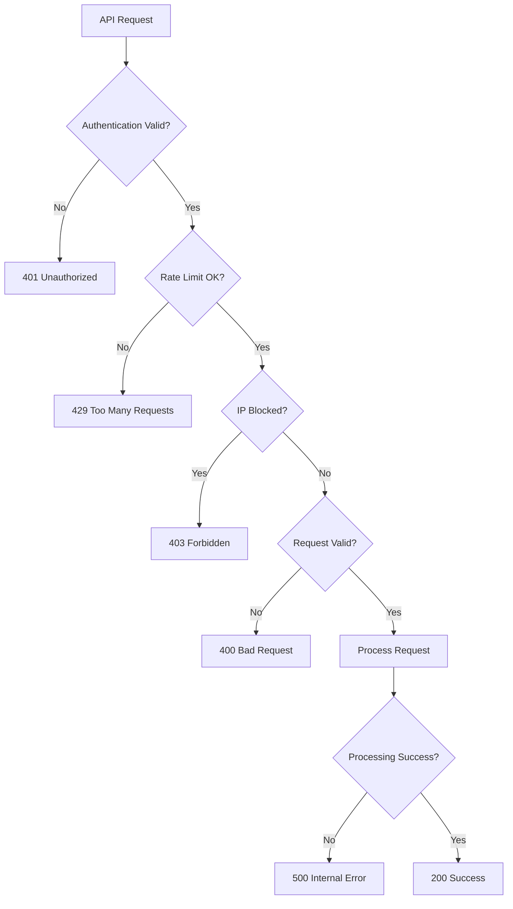

# API Framework Documentation

## Overview

The API Framework is the core HTTP API layer of the Wazuh security platform, providing a comprehensive RESTful interface for managing security operations, agent communications, and system configurations. Built on modern Python frameworks (FastAPI/Starlette with Connexion), it serves as the primary entry point for all external interactions with the Wazuh ecosystem.

## Purpose

The API Framework enables:
- **Secure Authentication & Authorization**: JWT-based authentication with RBAC (Role-Based Access Control)
- **Agent Management**: Complete lifecycle management of Wazuh agents
- **Security Operations**: Real-time security monitoring, alerting, and response capabilities
- **Cloud Integration**: Native support for AWS, Azure, and Google Cloud platforms
- **Distributed Architecture**: Cluster-aware operations with master-worker coordination
- **Compliance & Reporting**: MITRE ATT&CK framework integration and comprehensive audit trails

## Architecture Overview

## Core Components

### API Layer Components

The API Framework consists of several critical components that handle HTTP request processing, security, and data formatting:

#### Logging & Monitoring (`api.api.alogging`)
- **APILoggerSize**: Manages log file size configurations with support for K/M units
- **WazuhJsonFormatter**: Custom JSON formatter for structured logging with request/error/informative message types

#### Data Encoding (`api.api.encoder`)
- **WazuhAPIJSONEncoder**: Custom JSON encoder handling Wazuh-specific data types and API models

#### Security Middlewares (`api.api.middlewares`)
- **SecureHeadersMiddleware**: Implements security headers (CSP, X-Frame-Options, Server headers)
- **CheckExpectHeaderMiddleware**: Handles HTTP Expect header validation and content-length checks
- **CheckBlockedIP**: IP-based blocking mechanism for failed authentication attempts
- **CheckRateLimitsMiddleware**: Request rate limiting with separate limits for general and events endpoints
- **WazuhAccessLoggerMiddleware**: Comprehensive access logging with request/response details

#### URI Processing (`api.api.uri_parser`)
- **APIUriParser**: Parameter sanitization and lowercase conversion for specific fields

### Request Processing Flow

## Sub-Module Integration

The API Framework integrates with multiple specialized modules:

### Core Framework Integration
- **[Core Framework](Core%20Framework.md)**: Provides foundational classes and utilities
- **Input Validation**: Comprehensive parameter validation and sanitization
- **Result Handling**: Standardized response formatting through WazuhResult classes

### Agent Management Integration
- **[Agent Management](Agent%20Management.md)**: Complete agent lifecycle operations
- **Agent Registration**: Secure agent enrollment and key management
- **Agent Monitoring**: Real-time status tracking and health monitoring

### Security Integration
- **[RBAC Security](RBAC%20Security.md)**: Role-based access control implementation
- **[Security Modules](Security%20Modules.md)**: Rootcheck, SCA, and Syscheck integration
- **[MITRE ATT&CK Integration](MITRE%20ATT%26CK%20Integration.md)**: Threat intelligence framework

### Cluster & Distribution
- **[Cluster Management](Cluster%20Management.md)**: Master-worker cluster coordination
- **[Distributed API](Distributed%20API.md)**: Request distribution across cluster nodes
- **[Database Connectivity](Database%20Connectivity.md)**: Centralized data access layer

### Cloud Integrations
- **[AWS Integration](AWS%20Integration.md)**: Complete AWS security services integration
- **[Azure Integration](Azure%20Integration.md)**: Microsoft Azure cloud security
- **[Google Cloud Integration](Google%20Cloud%20Integration.md)**: GCP security monitoring

## Security Features

### Authentication & Authorization
- **JWT Token Management**: Secure token generation, validation, and refresh
- **Multi-factor Authentication**: Support for enhanced security mechanisms
- **Run-as Functionality**: Delegated authentication for service accounts
- **Token Blacklisting**: Immediate token revocation capabilities

### Rate Limiting & Protection
- **IP-based Rate Limiting**: Configurable request limits per minute
- **Event Endpoint Protection**: Special rate limiting for high-volume event ingestion
- **Automatic IP Blocking**: Failed authentication attempt protection
- **Request Size Validation**: Content-length and upload size restrictions

### Secure Headers Implementation

## Configuration Management

### Logging Configuration
- **Multi-format Support**: JSON and plain text logging formats
- **Size-based Rotation**: Configurable log file size limits
- **Time-based Rotation**: Daily log rotation capabilities
- **Level-based Filtering**: Granular log level control

### Access Control Configuration
- **Block Time Settings**: Configurable IP blocking duration
- **Request Limits**: Customizable rate limiting thresholds
- **Authentication Timeouts**: Token expiration management
- **Upload Size Limits**: File upload restrictions

## Performance & Scalability

### Asynchronous Processing
- **Async Middleware Stack**: Non-blocking request processing
- **Connection Pooling**: Efficient database connection management
- **Request Queuing**: Load balancing and request distribution

### Monitoring & Metrics
- **Request Tracking**: Comprehensive request/response logging
- **Performance Metrics**: Response time and throughput monitoring
- **Error Tracking**: Detailed error logging and analysis
- **Health Checks**: System status and availability monitoring

## Error Handling

### Exception Management
- **Custom Exception Classes**: Specialized error types for different scenarios
- **Error Code Standardization**: Consistent error response format
- **Detailed Error Messages**: Comprehensive error information for debugging
- **Security-aware Logging**: Sensitive data protection in error logs

### Common Error Scenarios

## Development Guidelines

### Adding New Endpoints
1. **Model Definition**: Create appropriate data models in [API Models](API%20Models.md)
2. **Controller Implementation**: Implement business logic with proper error handling
3. **Authentication**: Apply appropriate RBAC permissions
4. **Documentation**: Update OpenAPI specifications
5. **Testing**: Implement comprehensive test coverage

### Middleware Development
1. **Inherit from BaseHTTPMiddleware**: Follow established patterns
2. **Async Implementation**: Ensure non-blocking operations
3. **Error Handling**: Implement proper exception management
4. **Logging Integration**: Use structured logging for monitoring
5. **Configuration Support**: Make middleware configurable

## Deployment Considerations

### Production Setup
- **HTTPS Configuration**: SSL/TLS certificate management
- **Load Balancing**: Multi-instance deployment strategies
- **Database Optimization**: Connection pooling and query optimization
- **Monitoring Setup**: Comprehensive logging and metrics collection

### Security Hardening
- **Header Security**: Implement all recommended security headers
- **Input Validation**: Comprehensive parameter sanitization
- **Rate Limiting**: Appropriate limits for production workloads
- **Access Logging**: Complete audit trail maintenance

This API Framework serves as the foundation for all Wazuh security operations, providing a robust, scalable, and secure interface for managing enterprise security infrastructure.