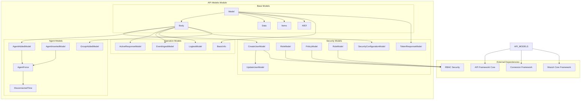
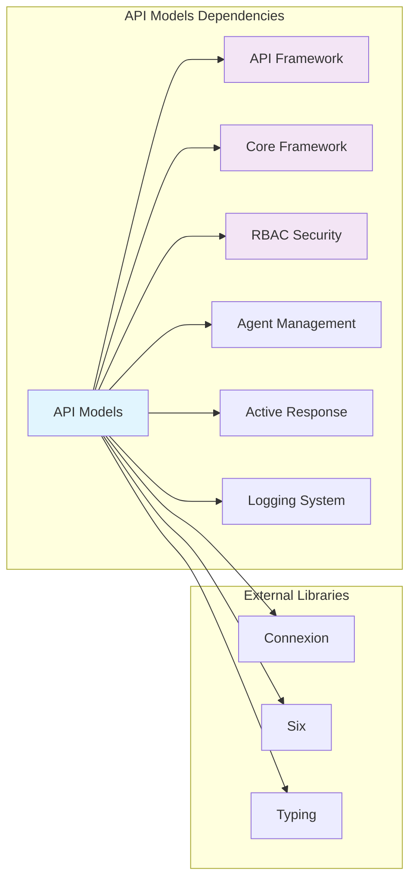
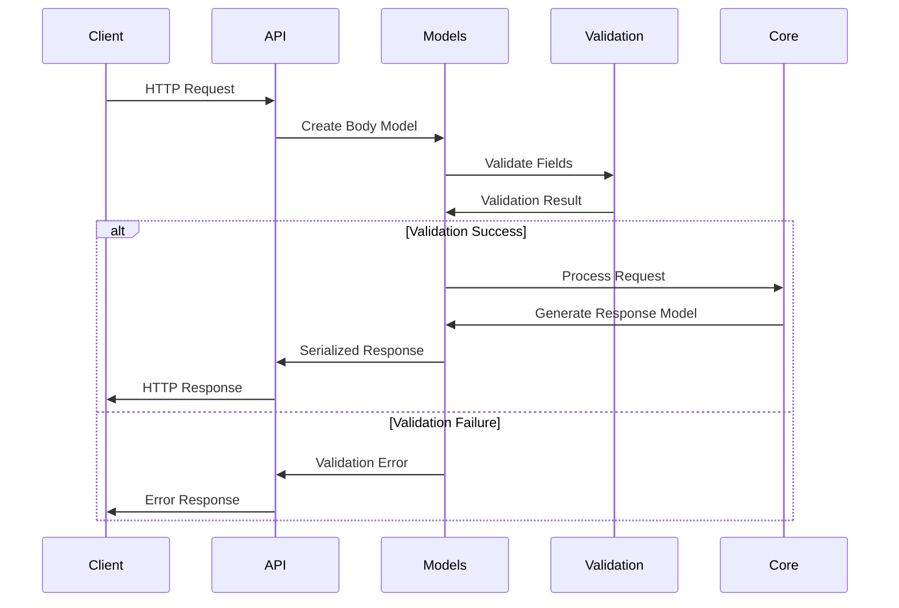
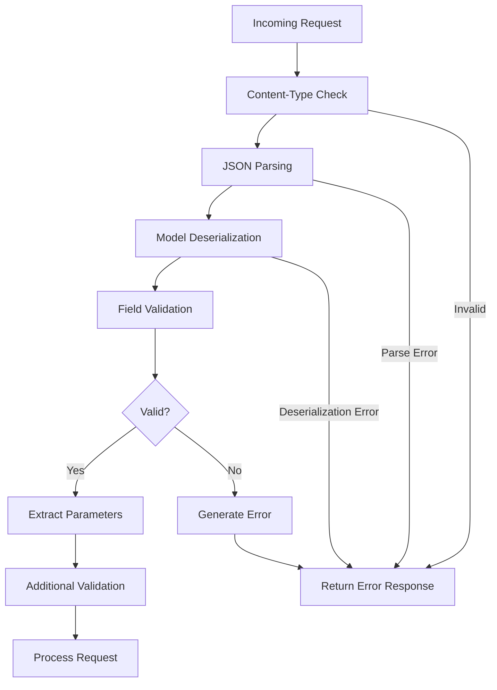

# API Models Module

The API Models module provides a comprehensive set of data models and validation classes that define the structure and behavior of API request/response objects in the Wazuh security platform. This module serves as the foundation for API data serialization, validation, and type safety across all API endpoints.

## Overview

The API Models module is a critical component of the [API Framework](API%20Framework.md) that standardizes data structures for REST API operations. It provides base model classes, specialized models for different functional areas, and validation mechanisms to ensure data integrity and consistency across the Wazuh API ecosystem.

### Key Features

- **Type-safe data models** with automatic serialization/deserialization
- **Swagger/OpenAPI integration** for API documentation and validation
- **Hierarchical model structure** with base classes and specialized implementations
- **Request body validation** with error handling and field validation
- **Security-focused models** for authentication, authorization, and RBAC operations
- **Agent management models** for device registration and configuration
- **Event processing models** for log ingestion and analysis

## Architecture



## Component Dependencies



## Core Components

### Base Model Classes

#### Model
The foundational base class that provides core functionality for all API models:

```python
class Model(object):
    swagger_types = {}      # Type definitions for Swagger/OpenAPI
    attribute_map = {}      # JSON key mappings
    
    # Core methods:
    # - from_dict(): Deserialize from dictionary
    # - to_dict(): Serialize to dictionary  
    # - to_str(): String representation
    # - __eq__(), __ne__(): Equality comparison
```

**Key Features:**
- Automatic serialization/deserialization
- Swagger/OpenAPI type integration
- Consistent object comparison
- Pretty-print formatting

#### Body
Specialized base class for request body models with validation:

```python
class Body(Model):
    # Key methods:
    # - get_kwargs(): Extract and validate request parameters
    # - decode_body(): Handle body encoding/decoding
    # - validate_content_type(): Content-type validation
```

**Key Features:**
- Asynchronous request processing
- JSON validation and error handling
- Content-type verification
- Invalid field detection

#### Utility Classes

- **AllOf**: Combines multiple models into a single response
- **Data**: Generic wrapper for single data objects
- **Items**: Generic wrapper for collections/arrays

### Security Models

#### User Management Models

**CreateUserModel**
```python
class CreateUserModel(Body):
    # Fields: username, password
    # Used for: User registration and creation
```

**UpdateUserModel**
```python
class UpdateUserModel(CreateUserModel):
    # Fields: password (username excluded)
    # Used for: User profile updates
```

#### RBAC Models

**RoleModel**
```python
class RoleModel(Body):
    # Fields: name
    # Used for: Role definition and management
```

**PolicyModel**
```python
class PolicyModel(Body):
    # Fields: name, policy (dict)
    # Used for: Security policy configuration
```

**RuleModel**
```python
class RuleModel(Body):
    # Fields: name, rule (dict)
    # Used for: Access control rule definition
```

#### Authentication Models

**TokenResponseModel**
```python
class TokenResponseModel(Model):
    # Fields: token
    # Used for: JWT token responses
```

**SecurityConfigurationModel**
```python
class SecurityConfigurationModel(Body):
    # Fields: auth_token_exp_timeout, rbac_mode
    # Used for: Security system configuration
```

### Agent Management Models

#### Agent Registration Models

**AgentAddedModel**
```python
class AgentAddedModel(Body):
    # Fields: name, ip, force
    # Used for: New agent registration
```

**AgentInsertedModel**
```python
class AgentInsertedModel(Body):
    # Fields: id, name, ip, agent_id, key, force
    # Used for: Agent insertion with full configuration
```

**GroupAddedModel**
```python
class GroupAddedModel(Body):
    # Fields: group_id
    # Used for: Agent group creation
```

#### Agent Configuration Models

**AgentForce**
```python
class AgentForce(Model):
    # Fields: enabled, disconnected_time, after_registration_time
    # Used for: Force replacement policies
```

**DisconnectedTime**
```python
class DisconnectedTime(Model):
    # Fields: enabled, value
    # Used for: Disconnection timeout configuration
```

### Operational Models

#### Active Response Model

**ActiveResponseModel**
```python
class ActiveResponseModel(Body):
    # Fields: command, arguments, alert
    # Used for: Remote command execution on agents
```

#### Event Processing Models

**EventIngestModel**
```python
class EventIngestModel(Body):
    # Fields: events (list)
    # Constraints: MAX_EVENTS_PER_REQUEST = 100
    # Used for: Bulk event ingestion
```

**LogtestModel**
```python
class LogtestModel(Body):
    # Fields: token, log_format, location, event
    # Used for: Log analysis and rule testing
```

#### System Information Model

**BasicInfo**
```python
class BasicInfo(Model):
    # Fields: title, api_version, revision, license_name, 
    #         license_url, hostname, timestamp
    # Used for: System information responses
```

## Data Flow



## Model Validation Process



## Integration Points

### API Framework Integration
- **Middleware Integration**: Models work with [API Framework](API%20Framework.md) middlewares for request processing
- **URI Parser Integration**: Models support parameter extraction from parsed URIs
- **JSON Encoding**: Custom JSON encoding through WazuhAPIJSONEncoder

### Core Framework Integration
- **Input Validation**: Integration with [Core Framework](Core%20Framework.md) InputValidator
- **Result Models**: Compatible with WazuhResult and AffectedItemsWazuhResult
- **Exception Handling**: Proper integration with Wazuh exception hierarchy

### Security Integration
- **RBAC Models**: Direct integration with [RBAC Security](RBAC%20Security.md) system
- **Authentication**: Token models for JWT-based authentication
- **Authorization**: Policy and rule models for access control

### Agent Management Integration
- **Agent Models**: Integration with [Agent Management](Agent%20Management.md) system
- **Group Management**: Models for agent group operations
- **Force Policies**: Configuration models for agent replacement policies

## Usage Examples

### Creating a User
```python
# Request body validation
user_data = await CreateUserModel.get_kwargs(request)
# Result: {'username': 'john_doe', 'password': 'secure_pass'}
```

### Agent Registration
```python
# Agent registration with force policy
agent_model = AgentAddedModel(
    name="web-server-01",
    ip="192.168.1.100"
)
agent_dict = agent_model.to_dict()
```

### Event Ingestion
```python
# Bulk event processing
events_model = EventIngestModel(events=event_list)
# Automatic validation of event count limits
```

### Security Configuration
```python
# RBAC configuration
config_model = SecurityConfigurationModel(
    auth_token_exp_timeout=3600,
    rbac_mode="white"
)
```

## Error Handling

The module provides comprehensive error handling:

- **Validation Errors**: Field validation with detailed error messages
- **Content-Type Errors**: Proper handling of unsupported content types
- **JSON Parsing Errors**: Graceful handling of malformed JSON
- **Size Limit Errors**: Enforcement of bulk operation limits
- **Unicode Errors**: Proper encoding/decoding error handling

## Best Practices

### Model Design
1. **Inherit from appropriate base classes** (Model vs Body)
2. **Define swagger_types and attribute_map** for all fields
3. **Implement proper property getters/setters**
4. **Use type hints** for better code documentation

### Validation
1. **Validate at model level** before processing
2. **Use async methods** for request processing
3. **Handle encoding issues** gracefully
4. **Implement size limits** for bulk operations

### Security
1. **Validate all input fields** before processing
2. **Use proper content-type validation**
3. **Implement rate limiting** through model constraints
4. **Sanitize sensitive data** in string representations

## Performance Considerations

- **Lazy Loading**: Models support lazy initialization
- **Bulk Operations**: Optimized for batch processing with limits
- **Memory Efficiency**: Efficient serialization/deserialization
- **Validation Caching**: Reusable validation patterns

## Future Enhancements

- **Schema Evolution**: Support for API versioning
- **Advanced Validation**: Custom validation rules
- **Performance Optimization**: Faster serialization methods
- **Extended Security**: Enhanced security model features

## Related Documentation

- [API Framework](API%20Framework.md) - Parent framework and middleware integration
- [Core Framework](Core%20Framework.md) - Core utilities and validation
- [RBAC Security](RBAC%20Security.md) - Security model implementation
- [Agent Management](Agent%20Management.md) - Agent-related model usage
- [Database Connectivity](Database%20Connectivity.md) - Data persistence integration