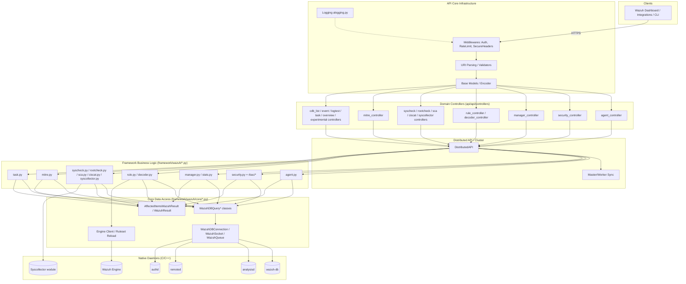
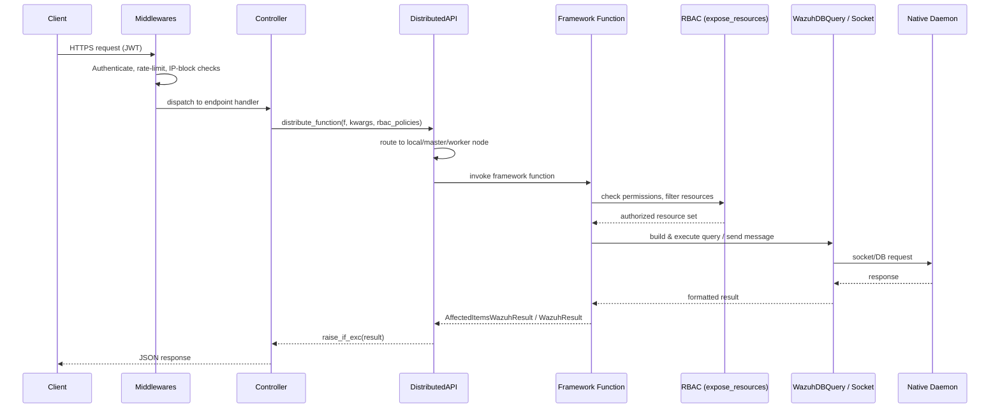

# API & Management Framework (Python) Module

## 1. Introduction and Purpose

The **API & Management Framework (Python)** module is the complete Python-based control plane of Wazuh. It implements the RESTful API exposed by `wazuh-apid`, the underlying `wazuh` Python framework consumed by that API (and by CLI scripts and the cluster daemon), and all the domain-specific business logic that manages agents, security rules, decoders, syscheck/rootcheck/SCA scan data, MITRE ATT&CK metadata, manager configuration/statistics, RBAC-based security, tasks, and syscollector inventory.

Architecturally, this module sits between:

- **API consumers** (Wazuh Dashboard, integrations, CLI tools, third-party scripts) that speak HTTP/REST, and
- **The native C/C++ daemons** (`wazuh-db`, `analysisd`, `remoted`, `execd`, `authd`, Syscollector, the Wazuh Engine) that hold the actual runtime state and perform detection.

It follows a consistent, layered design across virtually every functional area:

```
API Controller (Connexion/aiohttp)  →  Framework Business Logic (RBAC-enforced)  →  Core Data Access (WazuhDBQuery / sockets)
```

This module also owns the **Distributed API (DAPI)** and **cluster** machinery that lets any of these operations run transparently on a single manager or be routed across a Wazuh cluster (master/worker), as well as the **Security & RBAC** subsystem that authorizes every operation.

## 2. Architecture Overview



### Request Lifecycle (typical read/write operation)



## 3. Sub-modules

The module is organized into many cohesive sub-modules, each documented separately. They fall into a few broad categories:

### 3.1 API & Framework Foundations
| Sub-module | Description |
|---|---|
| [api_core_infrastructure](api_core_infrastructure.md) | Server lifecycle, auth/config, middlewares, logging, request-parsing utilities, base models — the foundation every other API sub-module builds on. |
| [framework_core_utils](framework_core_utils.md) | Path/config resolution, the `WazuhDBQuery` engine, result-wrapping classes (`AffectedItemsWazuhResult`, `WazuhResult`), daemon/process helpers, the `Wazuh` info class. |
| [framework_core_communication](framework_core_communication.md) | Low-level socket/queue clients (`WazuhQueue`, `WazuhSocket`, `WazuhDBConnection`, `WazuhDBHTTPClient`) and logging infra used to talk to native daemons. |
| [engine_module](engine_module.md) | Async HTTP client for the Wazuh Engine (C++) and the ruleset-reload integration with `analysisd`. |

### 3.2 Cluster & Distribution
| Sub-module | Description |
|---|---|
| [cluster_module](cluster_module.md) | `DistributedAPI`, master/worker synchronization, cluster CLI (`wazuh-clusterd`, `cluster_control`), HAProxy helper, and all cluster protocol primitives. |

### 3.3 Security
| Sub-module | Description |
|---|---|
| [security_rbac_module](security_rbac_module.md) | Users/Roles/Rules/Policies management, JWT auth, RBAC engine (`expose_resources`, `RBAChecker`), ORM/persistence, and CLI (`rbac_control`). |

### 3.4 Agent & Configuration Management
| Sub-module | Description |
|---|---|
| [agent_module](agent_module.md) | Full agent lifecycle: registration, grouping, config distribution, upgrades, stats; includes CLI scripts (`agent_groups`, `agent_upgrade`). |
| [manager_module](manager_module.md) | Manager status/info, `ossec.conf` read/update, logs, daemon stats, update-check (CTI) integration. |
| [active_response_module](active_response_module.md) | Dispatch of active-response commands to agents via the AR socket, with legacy/JSON message format support. |
| [event_module](event_module.md) | Generic event-ingestion bridge (`PUT /events`) forwarding external events into `analysisd`. |

### 3.5 Ruleset & Detection Content
| Sub-module | Description |
|---|---|
| [rule_module](rule_module.md) | Rule listing, file upload/delete, groups/requirements, ruleset-reload integration. |
| [decoder_module](decoder_module.md) | Decoder listing, file upload/delete, parent-decoder discovery. |
| [cdb_list_module](cdb_list_module.md) | CDB (key:value) list management with backup/restore and reload safety. |
| [mitre_module](mitre_module.md) | Read-only MITRE ATT&CK catalog (tactics, techniques, mitigations, groups, software, references). |

### 3.6 Scan/Inventory Data
| Sub-module | Description |
|---|---|
| [syscheck_module](syscheck_module.md) | FIM scan trigger, result querying, last-scan status, legacy DB clearing. |
| [rootcheck_module](rootcheck_module.md) | Rootcheck scan trigger, findings query, last-scan status. |
| [sca_module](sca_module.md) | Security Configuration Assessment policy/check results. |
| [ciscat_module](ciscat_module.md) | CIS-CAT compliance scan results retrieval. |
| [syscollector_module](syscollector_module.md) | Hardware/OS/packages/ports/processes/network inventory API + native C++ Syscollector engine. |
| [task_module](task_module.md) | Generic task-status tracking (e.g., agent upgrade tasks) backed by `wazuh-db`. |
| [stats_module](stats_module.md) | Hourly/weekly/daemon statistics from log files and daemon sockets. |
| [logtest_module](logtest_module.md) | Bridge to the manager's rule/decoder test engine (logtest sessions). |
| [overview_module](overview_module.md) | Consolidated agents overview (nodes, groups, OS, versions, status). |
| [experimental_controller](experimental_controller.md) | Feature-flagged staging area for evolving endpoints (rootcheck/syscheck clearing, syscollector/ciscat queries). |

## 4. Key Design Principles

- **Layered separation**: Controllers never talk to daemons directly — they always go through the Distributed API and framework layer, keeping HTTP concerns, business rules, and low-level protocol details cleanly separated.
- **RBAC-first**: Nearly every business function is decorated with `@expose_resources`, ensuring per-resource authorization is enforced consistently regardless of entry point (API, CLI, or cluster-forwarded call).
- **Cluster transparency**: The same framework function can serve a standalone manager or be transparently routed to the correct node in a cluster via `DistributedAPI`, with no controller-level branching.
- **Uniform result contracts**: `AffectedItemsWazuhResult` / `WazuhResult` standardize partial-success reporting (e.g., bulk operations across many agents) across the entire API surface.
- **Safety on writes**: File-modifying operations (rules, decoders, CDB lists, `ossec.conf`) use backup-and-restore patterns and trigger ruleset/config reloads, with automatic rollback on validation failure.

## 5. Core Components Reference

For detailed documentation of each area, see the sub-module pages linked in Section 3 above. Key cross-cutting components referenced throughout the module:

- `api/api/authentication.py`, `api/api/middlewares.py`, `api/api/uri_parser.py`, `api/api/validator.py` — API request handling infrastructure.
- `framework/wazuh/core/utils.py::WazuhDBQuery`, `framework/wazuh/core/results.py::AffectedItemsWazuhResult` — shared query/result primitives.
- `framework/wazuh/core/wdb.py::WazuhDBConnection`, `framework/wazuh/core/wazuh_socket.py`, `framework/wazuh/core/wazuh_queue.py` — daemon communication primitives.
- `framework/wazuh/core/cluster/dapi/dapi.py::DistributedAPI` — the distributed execution engine used by every controller.
- `framework/wazuh/rbac/decorators.py::expose_resources`, `framework/wazuh/rbac/orm.py` — RBAC enforcement and persistence.