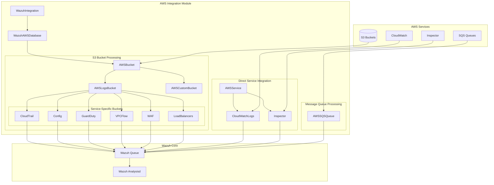
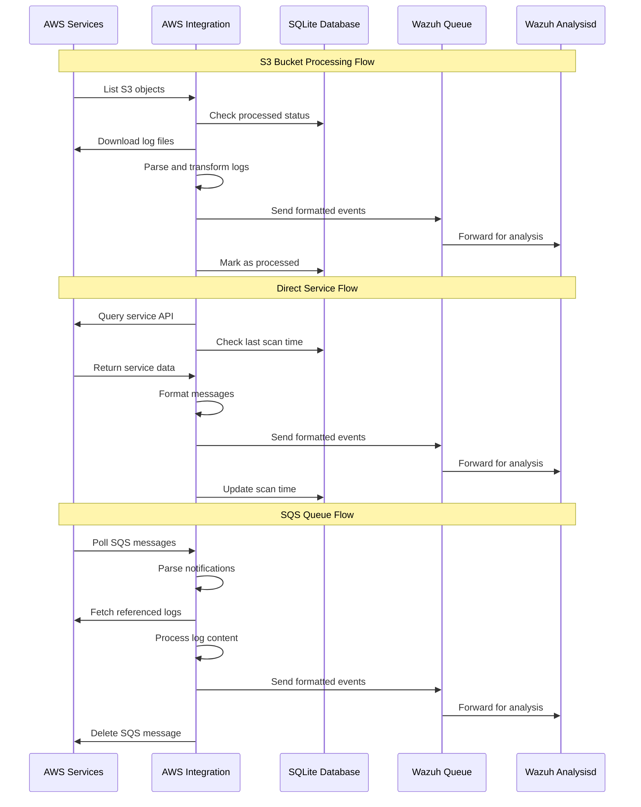

# AWS Integration Module

## Overview

The AWS Integration module is a comprehensive system within the Wazuh security platform that enables seamless integration with Amazon Web Services (AWS) for log collection, processing, and security monitoring. This module provides robust capabilities for ingesting logs from various AWS services including S3 buckets, CloudWatch Logs, Inspector, and SQS queues, transforming them into actionable security intelligence.

## Purpose

The AWS Integration module serves as a critical bridge between AWS cloud infrastructure and Wazuh's security monitoring capabilities. It enables organizations to:

- **Centralized Log Collection**: Aggregate logs from multiple AWS services into a unified security monitoring platform
- **Real-time Security Monitoring**: Process AWS security events and findings in real-time for immediate threat detection
- **Compliance Support**: Collect and analyze AWS logs to support compliance requirements and audit trails
- **Automated Processing**: Provide automated log parsing, transformation, and forwarding to Wazuh's analysis engine

## Architecture Overview

The AWS Integration module follows a modular architecture designed for scalability, reliability, and extensibility:

## Sub-modules

The AWS Integration module is organized into several specialized sub-modules, each handling specific aspects of AWS integration:

### [S3 Bucket Processing](S3%20Bucket%20Processing.md)
Handles log collection and processing from various AWS services that store logs in S3 buckets. This sub-module provides comprehensive support for processing logs from CloudTrail, Config, GuardDuty, VPC Flow Logs, WAF, and various Load Balancers. It includes sophisticated parsing, transformation, and filtering capabilities tailored to each AWS service's log format.

**Key Features:**
- Multi-service S3 bucket support with service-specific parsers
- Incremental processing with SQLite-based state tracking
- Automatic decompression and format detection
- Robust error handling and retry mechanisms

### [Direct Service Integration](Direct%20Service%20Integration.md)
Provides direct API-based integration with AWS services, enabling real-time log collection without requiring S3 intermediate storage. This sub-module focuses on services like CloudWatch Logs and Inspector that offer direct API access to their data.

**Key Features:**
- Real-time log streaming from CloudWatch Logs
- Inspector findings collection from both v1 and v2 APIs
- Token-based pagination for large datasets
- Configurable date filtering and log group selection

### [Message Queue Processing](Message%20Queue%20Processing.md)
Implements event-driven log processing through AWS SQS queues, enabling near real-time processing of log events as they are generated. This sub-module is particularly useful for high-volume environments where immediate log processing is critical.

**Key Features:**
- SQS message polling and processing
- Automatic message deletion after successful processing
- Integration with S3 log handlers for queue-triggered processing
- Support for batch message processing

### [Core Integration Framework](Core Integration Framework.md)
Provides the foundational infrastructure that supports all AWS integration functionality. This sub-module includes base classes, authentication mechanisms, database management, and core utilities used throughout the AWS Integration module.

**Key Features:**
- Unified authentication and credential management
- SQLite database abstraction for state persistence
- Configurable retry mechanisms and error handling
- Message formatting and Wazuh queue integration

## Data Flow

The AWS Integration module processes data through several distinct flows depending on the source:

## Key Features

### Multi-Service Support
- **S3 Bucket Integration**: Comprehensive support for AWS services that store logs in S3
- **Direct API Integration**: Real-time access to services like CloudWatch Logs and Inspector
- **Queue-Based Processing**: Event-driven processing through SQS integration

### Robust Error Handling
- **Retry Mechanisms**: Configurable retry logic for handling transient failures
- **Skip-on-Error**: Optional continuation of processing when encountering errors
- **Comprehensive Logging**: Detailed debug and error logging for troubleshooting

### Performance Optimization
- **Database Tracking**: SQLite-based tracking to avoid reprocessing logs
- **Incremental Processing**: Only process new or updated logs
- **Batch Processing**: Efficient handling of large log volumes

### Security and Authentication
- **Multiple Auth Methods**: Support for access keys, profiles, and IAM roles
- **Cross-Account Access**: IAM role assumption for multi-account environments
- **Secure Credential Handling**: Best practices for credential management

## Configuration

The AWS Integration module supports flexible configuration through various parameters:

### Authentication Options
- **Access Keys**: Direct AWS access key and secret key
- **AWS Profiles**: Named profiles from AWS credentials file
- **IAM Roles**: Role assumption for enhanced security
- **External ID**: Additional security for cross-account access

### Processing Options
- **Reparse Mode**: Option to reprocess previously handled logs
- **Date Filtering**: Process only logs after specified dates
- **Field Filtering**: Skip events based on regex patterns
- **Custom Endpoints**: Support for VPC endpoints and custom regions

## Integration Points

The AWS Integration module integrates with several other Wazuh components and external systems:

### Wazuh Framework Dependencies
- **Core Framework**: Utilizes base Wazuh classes and utilities for foundational functionality
- **Database Connectivity**: Leverages database connections for state management and persistence
- **Communication Layer**: Uses Wazuh queue system for secure message passing to analysisd
- **Logging System**: Integrates with Wazuh's logging infrastructure for comprehensive audit trails

### External Dependencies
- **boto3**: AWS SDK for Python providing all AWS API interactions
- **SQLite**: Embedded database for tracking processing state and metadata
- **Standard Libraries**: Comprehensive use of Python standard libraries including:
  - `json` and `csv` for data parsing and formatting
  - `gzip` and `zipfile` for log decompression
  - `re` for pattern matching and filtering
  - `datetime` for timestamp handling and date filtering

### Cross-Module Interactions
The AWS Integration module serves as a bridge between AWS cloud services and the broader Wazuh ecosystem, ensuring seamless data flow and processing integration.

## Monitoring and Maintenance

The module includes comprehensive monitoring and maintenance capabilities:

### Database Maintenance
- **Automatic Cleanup**: Removes old tracking records to prevent database bloat
- **Version Management**: Handles database schema updates across Wazuh versions
- **Integrity Checks**: Validates database consistency and handles corruption

### Performance Monitoring
- **Processing Statistics**: Tracks number of events processed and sent
- **Error Reporting**: Comprehensive error logging and reporting
- **Debug Modes**: Multiple levels of debug output for troubleshooting

## Best Practices

When implementing the AWS Integration module:

1. **Use IAM Roles**: Prefer IAM role assumption over access keys for enhanced security
2. **Configure Retry Logic**: Implement appropriate retry configurations to handle AWS API throttling
3. **Monitor Database Size**: Regularly monitor and maintain SQLite databases
4. **Implement Filtering**: Use field filtering to reduce noise and focus on relevant events
5. **Test Incrementally**: Start with small log volumes and gradually scale up

## Troubleshooting

Common issues and solutions:

### Authentication Errors
- Verify AWS credentials and permissions
- Check IAM role trust relationships
- Validate external ID configuration

### Processing Delays
- Review retry configuration settings
- Check AWS API rate limits
- Monitor database performance

### Missing Events
- Verify date filtering configuration
- Check skip-on-error settings
- Review field filtering patterns

## Future Enhancements

The AWS Integration module is designed for extensibility and future enhancements:

- **Additional Service Support**: Easy addition of new AWS services through the modular architecture
- **Enhanced Filtering**: More sophisticated event filtering capabilities with advanced pattern matching
- **Performance Improvements**: Continued optimization for large-scale deployments and high-volume processing
- **Cloud-Native Features**: Enhanced support for serverless and containerized deployments
- **Multi-Region Support**: Improved capabilities for cross-region log aggregation and processing

## Summary

The AWS Integration module represents a comprehensive solution for integrating AWS cloud services with Wazuh's security monitoring platform. Through its modular architecture, robust error handling, and extensive service support, it enables organizations to achieve:

- **Comprehensive Visibility**: Complete coverage of AWS security events and logs across multiple services
- **Real-Time Monitoring**: Near real-time processing of security events for immediate threat detection
- **Scalable Processing**: Efficient handling of large-scale AWS environments with thousands of resources
- **Reliable Operation**: Robust error handling and retry mechanisms ensure consistent log collection
- **Flexible Configuration**: Extensive configuration options to meet diverse organizational requirements

The module's design emphasizes maintainability, extensibility, and performance, making it a critical component of modern cloud security monitoring strategies. For detailed implementation guidance, refer to the individual sub-module documentation linked throughout this document.