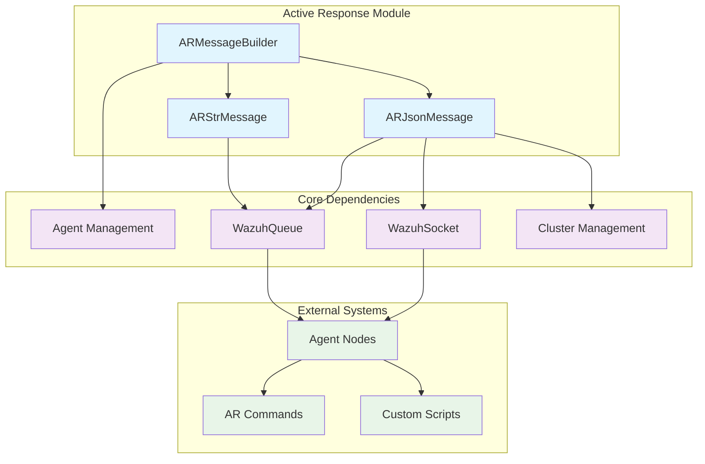
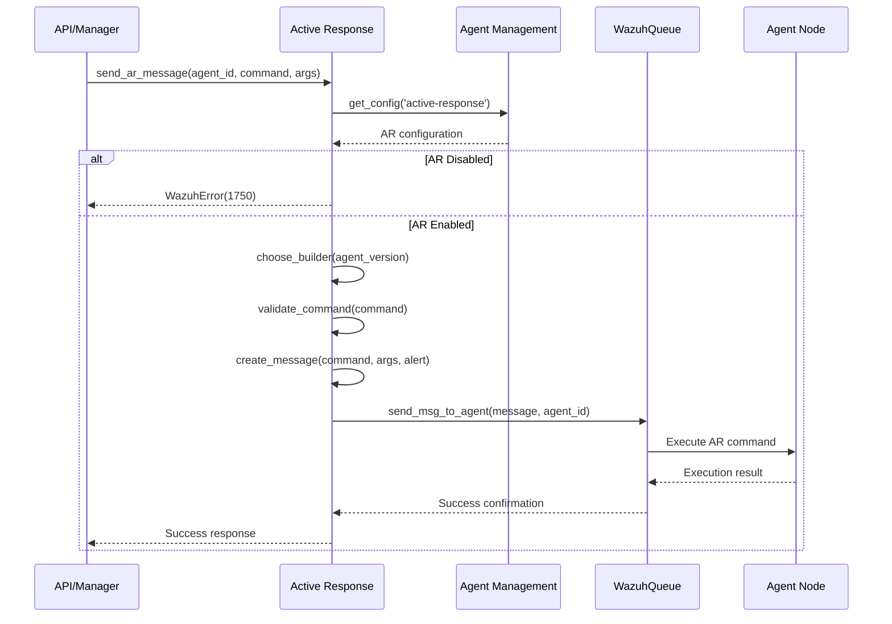
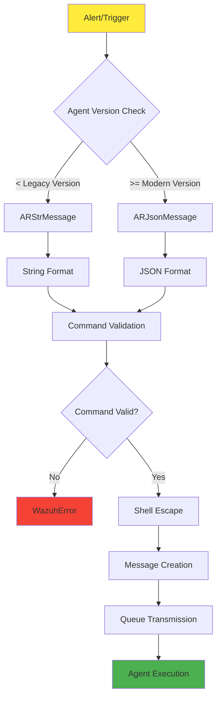
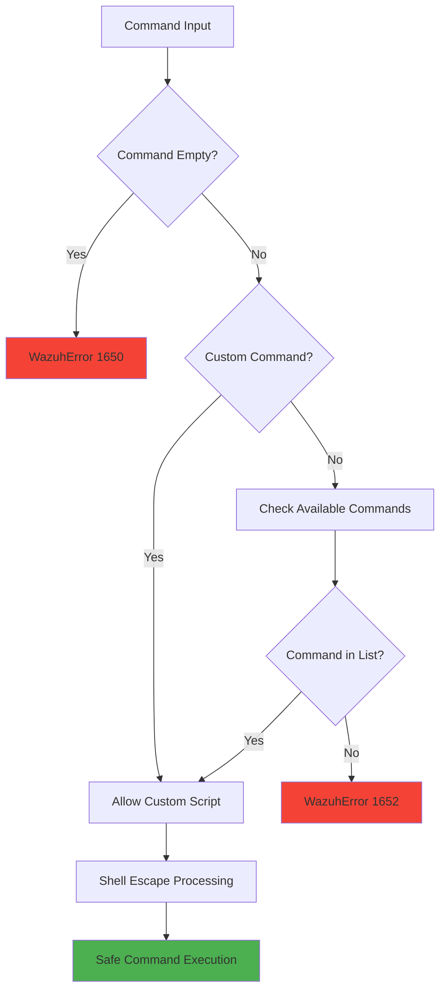
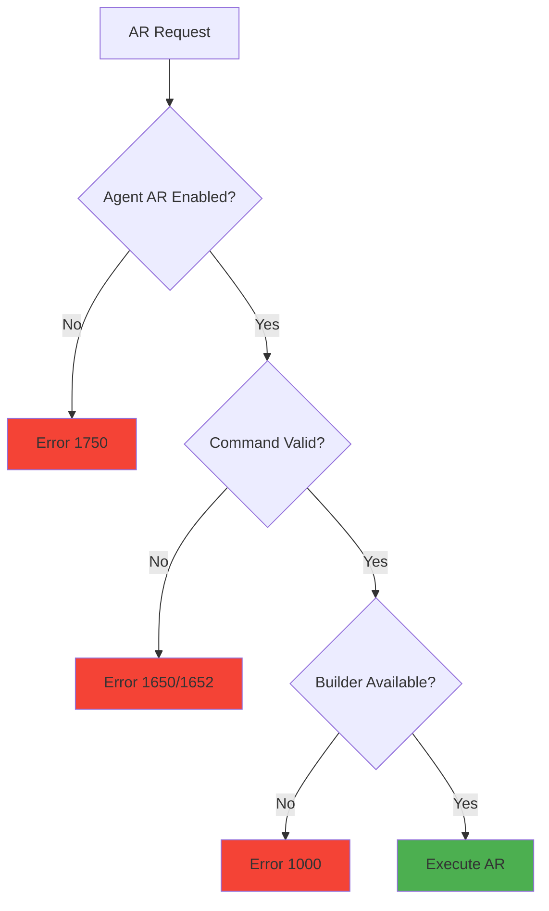

# Active Response Module

The Active Response module is a critical security component within the Wazuh framework that enables automated response actions to security threats and events. It provides the capability to execute predefined commands or custom scripts on agents in response to specific alerts, enabling real-time threat mitigation and incident response.

## Overview

Active Response serves as the automated defense mechanism that allows Wazuh to take immediate action when security threats are detected. The module supports both legacy string-based messaging for older agents and modern JSON-based communication for newer agent versions, ensuring backward compatibility while leveraging enhanced features.

### Key Features

- **Automated Threat Response**: Execute commands automatically based on alert triggers
- **Version-Aware Messaging**: Supports both legacy and modern agent communication protocols
- **Command Validation**: Ensures only authorized commands are executed
- **Cluster Integration**: Works seamlessly in clustered environments
- **Security Controls**: Built-in validation and escape mechanisms for command safety

## Architecture



## Core Components

### ARMessageBuilder (Abstract Base Class)

The `ARMessageBuilder` serves as the abstract factory for creating Active Response messages. It implements the factory pattern to select the appropriate message format based on agent version compatibility.

**Key Responsibilities:**
- Version compatibility checking
- Message builder selection
- Command validation
- Factory method implementation

**Methods:**
- `can_handle(agent_version)`: Abstract method for version compatibility
- `create_message(command, arguments, alert)`: Abstract method for message creation
- `choose_builder(agent_version)`: Factory method for builder selection
- `validate_command(command)`: Command validation logic

### ARStrMessage (Legacy Message Format)

Handles Active Response messaging for older agent versions using string-based format. This ensures compatibility with agents running versions prior to the JSON protocol introduction.

**Compatibility:**
- Agent versions < `AR_LEGACY_VERSION`
- String-based message format
- Simple command and argument structure

**Message Format:**
```
command arg1 arg2 arg3
```

### ARJsonMessage (Modern Message Format)

Implements JSON-based Active Response messaging for modern agents, providing enhanced functionality and structured data transmission.

**Compatibility:**
- Agent versions >= `AR_LEGACY_VERSION`
- JSON-based message format
- Rich metadata and alert context

**Message Structure:**
```json
{
  "version": "protocol_version",
  "origin": {
    "name": "node_name",
    "module": "active_response"
  },
  "command": "command_name",
  "parameters": {
    "extra_args": ["arg1", "arg2"],
    "alert": {alert_data}
  }
}
```

## Message Flow



## Data Flow



## Integration Points

### Agent Management Integration

The Active Response module integrates closely with the [Agent Management](Agent Management.md) module to:

- Retrieve agent configuration for Active Response settings
- Validate agent status and connectivity
- Access agent version information for protocol selection

### Communication Layer Integration

Leverages the [Communication Layer](Communication Layer.md) components:

- **WazuhQueue**: For message transmission to agents
- **WazuhSocket**: For JSON message formatting and cluster communication
- **Message Protocol**: Standardized communication format

### Cluster Management Integration

Integrates with [Cluster Management](Cluster Management.md) for:

- Node identification in clustered environments
- Distributed command execution
- Cluster-aware message routing

## Security Features

### Command Validation



### Shell Escape Mechanism

The module implements comprehensive shell escape functionality to prevent command injection:

**Escaped Characters:**
- Quote characters: `"`, `'`
- Control characters: `\t`, `;`, `|`
- Redirection: `>`, `<`
- Wildcards: `*`, `[`, `]`, `{`, `}`
- Special operators: `&`, `$`, `!`, `:`, `(`, `)`

## Configuration

### Active Response Configuration

Active Response behavior is controlled through agent configuration:

```xml
<active-response>
  <disabled>no</disabled>
  <ca_store>/var/ossec/etc/wpk_root.pem</ca_store>
</active-response>
```

### Command Configuration

Available commands are defined in the Active Response configuration file (`AR_CONF`):

```
command1 - Description of command 1
command2 - Description of command 2
!custom_script - Custom script execution
```

## Error Handling

### Exception Types

| Error Code | Exception | Description |
|------------|-----------|-------------|
| 1000 | WazuhError | No suitable message builder found |
| 1650 | WazuhError | Command not specified |
| 1652 | WazuhError | Invalid command (not in available commands) |
| 1750 | WazuhError | Active Response disabled on agent |

### Error Flow



## Usage Examples

### Basic Active Response Execution

```python
from wazuh.core.active_response import send_ar_message
from wazuh.core.wazuh_queue import WazuhQueue

# Initialize queue
wq = WazuhQueue()

# Send restart command to agent
send_ar_message(
    agent_id="001",
    agent_version="4.5.0",
    wq=wq,
    command="restart-ossec",
    arguments=[],
    alert={}
)
```

### Custom Script Execution

```python
# Execute custom script with arguments
send_ar_message(
    agent_id="002",
    agent_version="4.5.0",
    wq=wq,
    command="!block_ip.sh",
    arguments=["192.168.1.100", "3600"],
    alert=alert_data
)
```

### Version-Specific Message Creation

```python
from wazuh.core.active_response import ARMessageBuilder

# Choose appropriate builder
builder = ARMessageBuilder.choose_builder("4.3.0")

# Create message
message = builder.create_message(
    command="firewall-block",
    arguments=["192.168.1.100"],
    alert=alert_context
)
```

## Performance Considerations

### Message Format Selection

- **Legacy Format**: Lower overhead, faster processing for simple commands
- **JSON Format**: Higher overhead but supports rich metadata and alert context

### Queue Management

- Utilizes efficient queue mechanisms for message delivery
- Supports batch processing for multiple agent commands
- Implements proper error handling and retry mechanisms

## Monitoring and Logging

### Active Response Events

The module generates events for:
- Command execution requests
- Validation failures
- Agent communication errors
- Successful command delivery

### Integration with Logging System

Leverages the [Logging System](Logging System.md) for:
- Structured log output
- Error tracking and debugging
- Performance monitoring
- Audit trail maintenance

## Best Practices

### Security Guidelines

1. **Command Validation**: Always validate commands against allowed lists
2. **Input Sanitization**: Use built-in shell escape mechanisms
3. **Agent Verification**: Verify agent status before command execution
4. **Audit Logging**: Maintain comprehensive logs of all AR activities

### Performance Optimization

1. **Version Caching**: Cache agent version information to avoid repeated lookups
2. **Batch Operations**: Group multiple commands when possible
3. **Queue Management**: Monitor queue performance and implement appropriate limits
4. **Error Handling**: Implement proper retry mechanisms with exponential backoff

### Operational Considerations

1. **Testing**: Thoroughly test custom scripts in isolated environments
2. **Monitoring**: Implement monitoring for AR command success/failure rates
3. **Documentation**: Maintain clear documentation of available commands and their purposes
4. **Change Management**: Implement proper change control for AR command modifications

## Related Modules

- [Agent Management](Agent Management.md): Agent lifecycle and configuration management
- [Communication Layer](Communication Layer.md): Message transmission and protocol handling
- [Cluster Management](Cluster Management.md): Distributed environment support
- [API Framework](API Framework.md): REST API endpoints for Active Response
- [Core Framework](Core Framework.md): Base utilities and common functionality