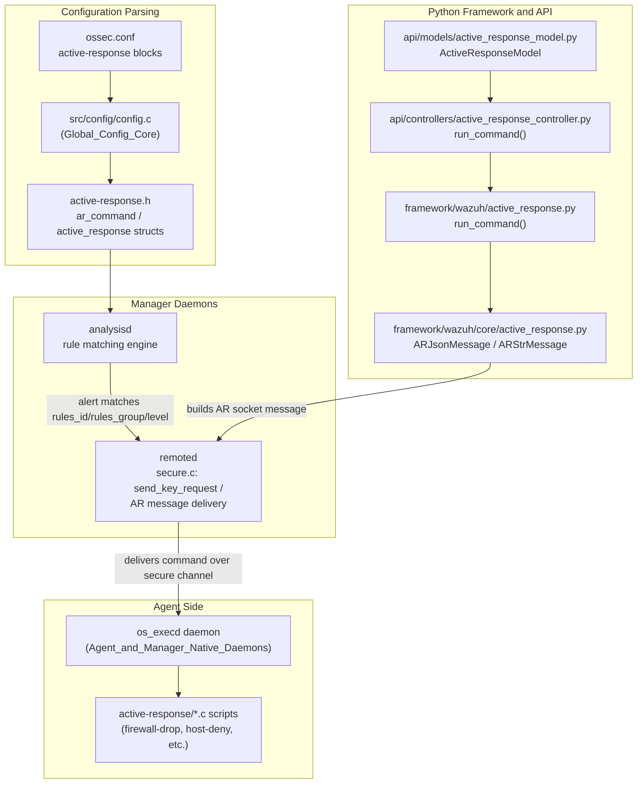
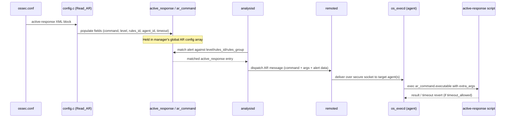
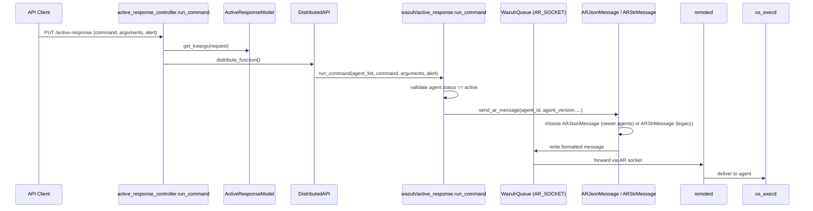
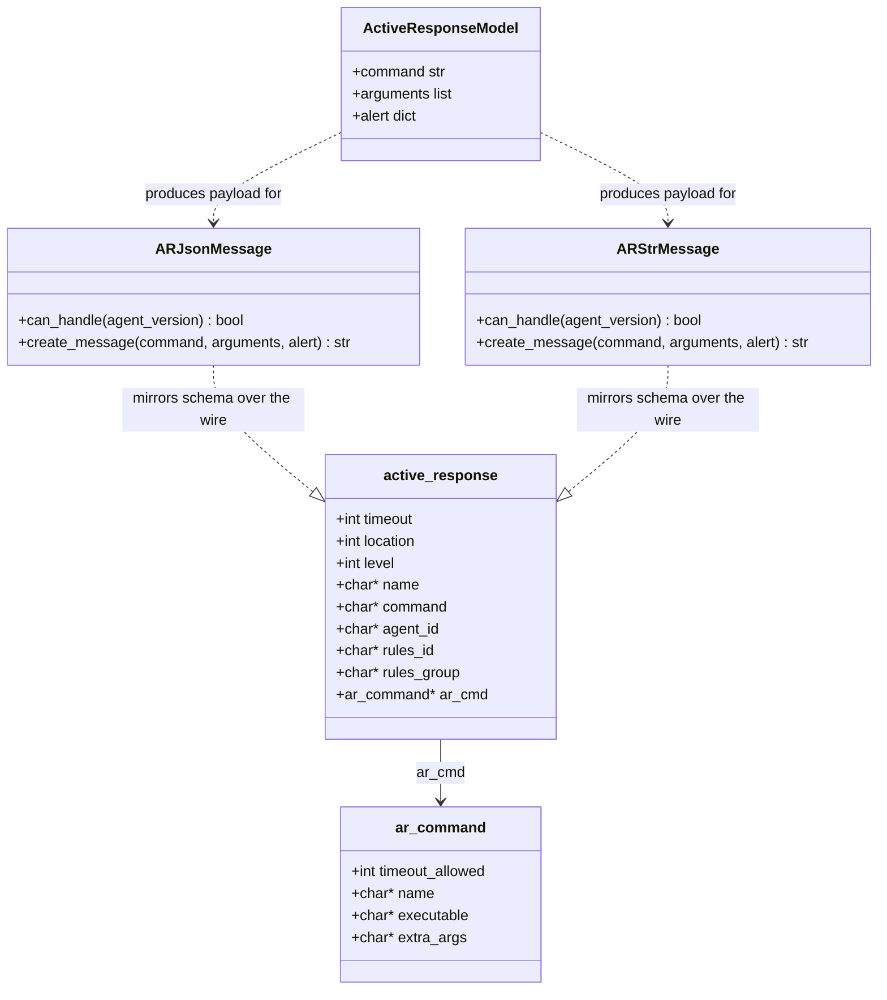

# Active Response Config

## Introduction

The **Active Response Config** module defines the core C data structures used by the Wazuh manager to represent **Active Response** configuration blocks parsed from `ossec.conf`. It is a small, foundational header (`src/config/active-response.h`) that models an `<active-response>` stanza — the command to run, the location/level/rule filters that trigger it, the agent it targets, and the timeout behavior of the associated command.

Although the module itself contains only type definitions (no executable logic), it is the shared contract between:

- The **configuration parser** (`src/config/config.c`, part of [Global_Config_Core](Global_Config_Core.md)) that reads `<active-response>` XML blocks into `active_response` structures.
- **Analysisd**, which evaluates rule matches against the `active_response.level`, `rules_id`, `rules_group`, and `location` fields to decide when to trigger a response.
- **Remoted**, which delivers the resulting Active Response command to the target agent(s) over the secure channel (see [Agent_&_Manager_Native_Daemons_(C)](Agent_%26_Manager_Native_Daemons_(C).md), `remoted` component).
- **execd** (`src/os_execd`), the agent/manager daemon that receives the command over the `execq`/`arq` sockets and actually spawns the configured `ar_command.executable`.
- The **native active-response scripts** (`src/active-response/*`) that implement the actual response actions (firewall drop, account disable, etc.).
- The **Python Framework/API layer** ([active_response_module](active_response_module.md)), which allows administrators/integrators to trigger Active Response commands on demand through the REST API (`PUT /active-response`), independent of rule-based triggering.

This document focuses on the C struct definitions themselves, their fields, and how they flow through the broader Active Response subsystem, linking out to the modules that implement the surrounding behavior.

## Purpose and Core Functionality

The module declares two structures:

### `ar_command`
Represents a single **command definition** registered under `<command>` in `ossec.conf` (referenced by name from an `<active-response>` block):

| Field | Type | Description |
|---|---|---|
| `timeout_allowed` | `int` | Whether this command supports being run with a timeout (auto-revert after N seconds). |
| `name` | `char *` | Unique command name, referenced by `active_response.command`. |
| `executable` | `char *` | Name of the executable/script to run (resolved under `active-response/bin`). |
| `extra_args` | `char *` | Extra arguments appended when the command executes. |

### `active_response` (aliased as `ar`)
Represents a single **active response rule binding** — i.e., an `<active-response>` block that ties a command to trigger conditions:

| Field | Type | Description |
|---|---|---|
| `timeout` | `int` | Number of seconds after which the response is automatically reverted (0 = no timeout). |
| `location` | `int` | Bitmask describing where the command should run (local, all agents, defined agent, server). |
| `level` | `int` | Minimum alert level required to trigger this response. |
| `name` | `char *` | Name of the active response block/command being invoked. |
| `command` | `char *` | Name of the referenced `ar_command`. |
| `agent_id` | `char *` | Specific agent ID to target (if `location` is agent-scoped). |
| `rules_id` | `char *` | Comma-separated list of rule IDs that can trigger this response. |
| `rules_group` | `char *` | Comma-separated list of rule groups that can trigger this response. |
| `ar_cmd` | `ar_command *` | Pointer to the resolved command definition. |

Additionally, the module exposes a global flag:

```c
extern int ar_flag;
```

used across the manager codebase to indicate whether Active Response is globally enabled/parsed.

## Architecture and Component Relationships

The Active Response Config structures sit at the intersection of configuration parsing, rule evaluation, network delivery, and command execution. The diagram below shows how the struct flows through the system end-to-end.



### Dual trigger paths

Active Response commands can be triggered by two independent paths that both converge on the same wire format sent to the agent:

1. **Rule-based (automatic)**: Analysisd matches an incoming alert against the `level`, `rules_id`, and `rules_group` fields of a parsed `active_response` struct, then hands off to Remoted for delivery.
2. **API-based (manual)**: A user calls the `PUT /active-response` REST endpoint, handled by [active_response_module](active_response_module.md) (`active_response_controller.py` → `wazuh/active_response.py` → `wazuh/core/active_response.py`), which builds an equivalent message via `ARJsonMessage`/`ARStrMessage` and writes it to the `AR_SOCKET` queue.

Both paths ultimately produce a command message compatible with what `execd` expects on the agent side, keeping the C-side `ar_command`/`active_response` schema and the Python-side message builders in sync.

## Data Flow: From Configuration to Execution



## API-Triggered Active Response Flow

For manually-triggered commands via the REST API, the flow bypasses rule matching but still respects the `ar_command` definitions known to the target agent:



## Component Interaction Summary



## Field-Level Notes and Usage Considerations

- **`location`** is a bitmask; typical values distinguish `AS_ONLY` (agentless server), `ALL_AGENTS`, `SPECIFIC_AGENT`, and `REMOTE_AGENT`, determining routing behavior in `remoted`.
- **`rules_id`** and **`rules_group`** are stored as raw comma-separated strings in the struct; analysisd is responsible for splitting/matching them at runtime — the header itself imposes no parsing logic.
- **`ar_cmd`** is resolved at configuration-load time by looking up `active_response.command` against the list of parsed `ar_command` entries; a dangling/unresolved reference is treated as a configuration error.
- **`timeout` vs `ar_command.timeout_allowed`**: a non-zero `timeout` on `active_response` is only honored if the referenced command declares `timeout_allowed = 1`; otherwise the manager logs a warning and runs the command without automatic reversion.
- The global `ar_flag` is a lightweight enablement flag checked by daemons before attempting to process Active Response messages at all, avoiding unnecessary socket/queue setup when the feature is unused.

## Relationship to Other Modules

| Related Module | Relationship |
|---|---|
| [Global_Config_Core](Global_Config_Core.md) | Hosts the top-level configuration structure (`_Config`) that aggregates active response settings alongside other manager config sections. |
| [Client_Config](Client_Config.md) | Agent-side configuration counterpart; agents need corresponding settings to accept/execute AR commands from the manager. |
| [active_response_module](active_response_module.md) | Python Framework/API layer (`ARJsonMessage`, `ARStrMessage`, `run_command`) that mirrors this struct's semantics for API-triggered commands. |
| [Agent_&_Manager_Native_Daemons_(C)](Agent_%26_Manager_Native_Daemons_(C).md) | Contains `os_execd` (executes AR commands), `remoted` (delivers AR messages), and the native `active-response/*` scripts that perform the actual response actions. |
| [Authd_Config](Authd_Config.md), [Rootcheck_Config](Rootcheck_Config.md), [Syscheck_Config](Syscheck_Config.md) | Sibling configuration header modules under [Configuration_Data_Structures_(C_Headers)](Configuration_Data_Structures_(C_Headers).md), following the same "plain C struct + parser" pattern. |

## Summary

The Active Response Config module is intentionally minimal: it defines the vocabulary (`ar_command`, `active_response`) that the rest of the Active Response subsystem — configuration parsing, rule-based triggering in analysisd, message delivery in remoted, command execution in execd, and API-driven invocation through the Python framework — all agree upon. Understanding these two structs is the starting point for tracing how an `<active-response>` block in `ossec.conf` ultimately results in a script being executed on an agent, whether triggered automatically by a rule match or manually via the REST API.
