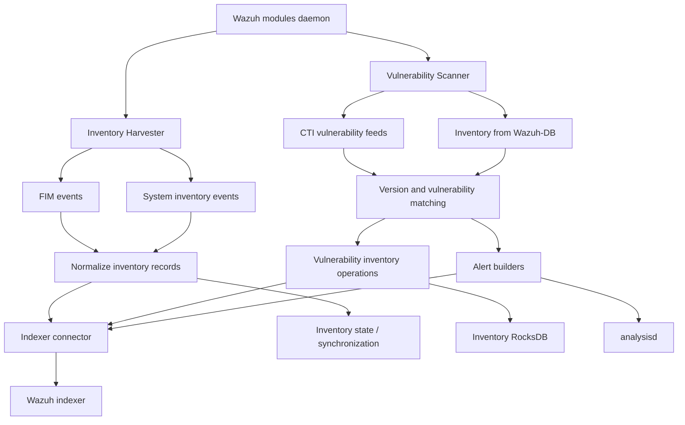
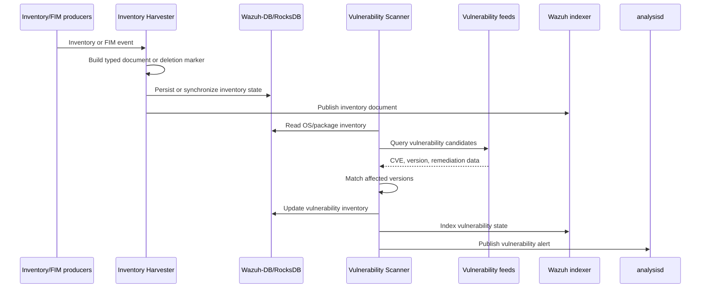

# Advanced Security Modules (C++ Inventory & Vulnerability)

## Purpose

The `Advanced_Security_Modules_(C++_Inventory_&_Vulnerability)` module provides Wazuh’s native inventory processing and vulnerability-detection capabilities.

It:

- Converts system inventory and FIM events into normalized documents for indexing.
- Collects and maintains inventory state through Wazuh-DB, RocksDB, and the indexer.
- Ingests vulnerability feeds and matches installed operating systems and packages against CVE data.
- Tracks active, solved, and cleared vulnerabilities.
- Publishes vulnerability alerts to analysisd and indexed results to the Wazuh indexer.

## Architecture



The inventory harvester acts as the normalization and publication layer. The vulnerability scanner consumes that inventory, evaluates it against vulnerability-feed data, updates vulnerability state, and emits alerts.



## Module structure

```text
src/wazuh_modules/
├── inventory_harvester/
│   ├── common orchestration and lifecycle
│   ├── FIM pipeline
│   ├── system inventory pipeline
│   └── data models
└── vulnerability_scanner/
    ├── facade
    ├── database feed manager
    ├── version matcher
    ├── scan pipeline
    ├── OS and package scanners
    ├── inventory operations
    ├── alert builders
    └── data caches
```

## Core component documentation

### Inventory Harvester

- [Inventory Harvester overview](inventory_harvester_module.md)
- [Common orchestration and lifecycle](inventory_harvester_common_orchestration.md)
- [FIM pipeline](inventory_harvester_fim_pipeline.md)
- [System pipeline](inventory_harvester_system_pipeline.md)
- [System elements and orchestration](inventory_harvester_system_pipeline_elements_and_orchestration.md)
- [Data models](inventory_harvester_data_models_inventory_harvester_data_models.md)

### Vulnerability Scanner

- [Vulnerability Scanner facade](vulnerability_scanner_facade.md)
- [Database feed manager](database_feed_manager.md)
- [Version matcher](version_matcher.md)
- [Scan orchestrator pipeline](scan_orchestrator_pipeline.md)
- [OS and package scanners](scan_orchestrator_scanners.md)
- [Inventory operations](scan_orchestrator_inventory_ops.md)
- [Alert builders](scan_orchestrator_alert_builders.md)
- [Data caches](scan_orchestrator_data_caches.md)