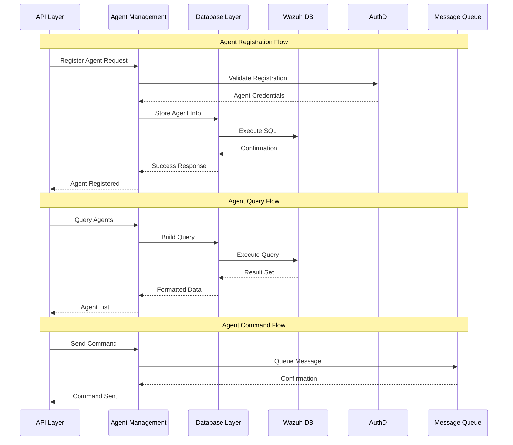
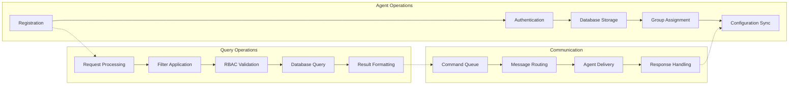

# Agent Management Module

The Agent Management module is a core component of the Wazuh security platform that provides comprehensive functionality for managing Wazuh agents throughout their lifecycle. This module handles agent registration, configuration, monitoring, grouping, and communication within the Wazuh ecosystem.

## Overview

The Agent Management module serves as the central hub for all agent-related operations in Wazuh. It provides a robust framework for:

- **Agent Lifecycle Management**: Registration, authentication, monitoring, and removal of agents
- **Group Management**: Organization of agents into logical groups for configuration and policy management
- **Database Operations**: Efficient querying and data retrieval for agent information
- **Communication**: Secure messaging and command execution between manager and agents
- **RBAC Integration**: Role-based access control for agent operations

## Architecture

```mermaid
graph TB
    subgraph "Agent Management Module"
        A[Agent Class] --> B[WazuhDBQueryAgents]
        A --> C[WazuhDBQueryGroup]
        A --> D[WazuhDBQueryMultigroups]
        
        B --> E[WazuhDBQueryDistinctAgents]
        B --> F[WazuhDBQueryGroupByAgents]
        
        G[Database Layer] --> H[WazuhDBConnection]
        G --> I[WazuhDBBackend]
        
        J[Communication Layer] --> K[WazuhQueue]
        J --> L[WazuhSocket]
        
        M[Authentication] --> N[AuthD Socket]
        
        O[RBAC Integration] --> P[Resource Cache]
        O --> Q[Permission Filters]
    end
    
    subgraph "External Dependencies"
        R[Core Framework] --> S[WazuhDBQuery]
        R --> T[InputValidator]
        R --> U[Results Framework]
        
        V[Database Connectivity] --> W[WDB HTTP Client]
        V --> X[Async WDB Connection]
        
        Y[Communication Layer] --> Z[Socket Protocols]
        Y --> AA[Queue Management]
        
        BB[RBAC Security] --> CC[Auth Context]
        BB --> DD[ORM Managers]
    end
    
    A -.-> R
    G -.-> V
    J -.-> Y
    O -.-> BB
```



## Core Components

### 1. Agent Class

The `Agent` class is the primary entity representing a Wazuh agent with comprehensive lifecycle management capabilities.

**Key Features:**
- Agent registration and authentication
- Configuration management
- Status monitoring and reporting
- Group assignment and management
- Key generation and validation

**Core Methods:**
- `__init__()`: Initialize agent with optional auto-registration
- `load_info_from_db()`: Load agent information from database
- `get_basic_information()`: Retrieve public agent attributes
- `get_key()`: Generate and retrieve agent authentication key
- `reconnect()`: Force agent reconnection
- `remove()`: Delete agent with optional purge
- `get_config()`: Read agent's active configuration
- `get_stats()`: Retrieve agent component statistics

### 2. Database Query Classes

#### WazuhDBQueryAgents
Specialized query class for agent database operations with advanced filtering and search capabilities.

**Features:**
- Complex filtering with RBAC integration
- Date-based queries with timezone handling
- Group-based filtering with multigroup support
- Version format unification
- Pagination and sorting

#### WazuhDBQueryGroup
Handles group-specific database queries with agent count aggregation.

**Features:**
- Group listing with agent counts
- RBAC-aware group filtering
- Search and pagination support
- Group membership validation

#### WazuhDBQueryMultigroups
Manages queries for agents with multiple group assignments.

**Features:**
- Multi-group relationship handling
- Complex JOIN operations
- Group-specific agent filtering

#### WazuhDBQueryDistinctAgents
Provides distinct value queries for agent fields.

#### WazuhDBQueryGroupByAgents
Enables grouping and aggregation operations on agent data.

## Data Flow



## Component Interactions



## Key Features

### Agent Lifecycle Management

**Registration Process:**
1. Agent authentication via AuthD socket
2. Unique ID and key generation
3. Database record creation
4. Initial group assignment
5. Configuration synchronization

**Monitoring Capabilities:**
- Real-time status tracking
- Last keep-alive timestamps
- Connection status monitoring
- Version compatibility checking
- Performance statistics collection

### Group Management

**Multi-group Support:**
- Agents can belong to multiple groups
- Hierarchical group inheritance
- Group-specific configurations
- Dynamic group assignment

**Group Operations:**
- Create and delete groups
- Assign/unassign agents
- Group configuration management
- Bulk operations support

### Database Integration

**Query Optimization:**
- Efficient pagination mechanisms
- Complex filtering capabilities
- Index-aware query construction
- Connection pooling support

**RBAC Integration:**
- Permission-based filtering
- Resource-level access control
- Dynamic query modification
- Audit trail support

### Communication Framework

**Message Types:**
- Active response commands
- Configuration updates
- Restart notifications
- Custom commands

**Delivery Mechanisms:**
- Queue-based messaging
- Socket communication
- Asynchronous processing
- Retry mechanisms

## Security Features

### Authentication
- Secure key generation using cryptographic standards
- Agent identity validation
- Certificate-based authentication
- Key rotation support

### Authorization
- RBAC integration for all operations
- Resource-level permissions
- Dynamic access control
- Audit logging

### Communication Security
- Encrypted agent-manager communication
- Message integrity verification
- Secure socket connections
- Protocol version negotiation

## Performance Considerations

### Database Optimization
- Efficient query construction
- Pagination for large datasets
- Index utilization
- Connection management

### Memory Management
- Lazy loading of agent data
- Efficient caching mechanisms
- Resource cleanup
- Memory pool utilization

### Scalability
- Horizontal scaling support
- Load balancing capabilities
- Distributed query processing
- Asynchronous operations

## Error Handling

The module implements comprehensive error handling with specific error codes:

- **1701**: Agent does not exist
- **1703**: Action not available for manager
- **1705**: Agent with same name exists
- **1706**: Invalid IP address or agent with same IP exists
- **1707**: Agent not active for reconnection
- **1708**: Agent with same ID exists
- **1709**: Key size too short
- **1710**: Group not found
- **1722**: Incorrect group ID format
- **1725**: Error registering agent
- **1726**: AuthD not running
- **1734**: Error removing agent from group
- **1735**: Agent version incompatible
- **1737**: Maximum groups per agent reached
- **1745**: Cannot unassign from default group
- **1751**: Agent already belongs to group
- **1752**: Cannot force single group

## Integration Points

### Core Framework Integration
- Utilizes [Core Framework](Core Framework.md) for base functionality
- Inherits from `WazuhDBQuery` for database operations
- Uses `InputValidator` for data validation
- Implements `WazuhResult` for response formatting

### Database Connectivity
- Leverages [Database Connectivity](Database Connectivity.md) for WDB access
- Uses `WazuhDBConnection` for synchronous operations
- Integrates with `AsyncWazuhDBConnection` for async operations
- Utilizes `WazuhDBHTTPClient` for HTTP-based database access

### Communication Layer
- Integrates with [Communication Layer](Communication Layer.md) for messaging
- Uses `WazuhQueue` for command queuing
- Leverages `WazuhSocket` for direct communication
- Implements protocol-specific message formatting

### RBAC Security
- Integrates with [RBAC Security](RBAC Security.md) for access control
- Uses `RBAChecker` for permission validation
- Implements resource-based filtering
- Supports dynamic permission evaluation

### Cluster Management
- Coordinates with [Cluster Management](Cluster Management.md) for distributed operations
- Supports agent synchronization across cluster nodes
- Implements distributed query processing
- Handles cluster-wide agent management

## Usage Examples

### Basic Agent Operations

```python
# Create and register a new agent
agent = Agent(name="web-server-01", ip="192.168.1.100")

# Load existing agent information
agent = Agent(id="001")
agent.load_info_from_db()

# Get agent key for deployment
key = agent.get_key()

# Force agent reconnection
with WazuhQueue() as wq:
    result = agent.reconnect(wq)
```

### Agent Queries

```python
# Query all agents with filtering
agents = Agent.get_agents_overview(
    offset=0,
    limit=50,
    sort={"fields": ["name"], "order": "asc"},
    filters={"status": "active", "group": "web-servers"}
)

# Query agents by group
with WazuhDBQueryMultigroups(group_id="web-servers") as query:
    result = query.run()
```

### Group Management

```python
# Add agent to group
await Agent.add_group_to_agent(
    group_id="database-servers",
    agent_id="002",
    replace=False
)

# Remove agent from group
await Agent.unset_single_group_agent(
    agent_id="002",
    group_id="database-servers"
)
```

## Configuration

The module supports various configuration options:

- **Database connection settings**: Connection pooling, timeouts, retry policies
- **Authentication parameters**: Key length, validation rules, expiration
- **Group management**: Maximum groups per agent, default group behavior
- **Communication settings**: Queue sizes, timeout values, retry attempts
- **Performance tuning**: Query limits, pagination sizes, cache settings

## Monitoring and Diagnostics

### Health Checks
- Agent connectivity status
- Database connection health
- AuthD service availability
- Queue processing status

### Metrics Collection
- Agent registration rates
- Query performance statistics
- Error rates and types
- Resource utilization

### Logging
- Comprehensive audit trails
- Debug information for troubleshooting
- Performance metrics logging
- Security event logging

## Best Practices

### Agent Management
1. Use meaningful agent names and proper IP addressing
2. Implement proper group hierarchies for configuration management
3. Regular monitoring of agent status and connectivity
4. Proper key management and rotation policies

### Performance Optimization
1. Use appropriate pagination for large agent lists
2. Implement efficient filtering to reduce database load
3. Cache frequently accessed agent information
4. Monitor and optimize database query performance

### Security
1. Implement proper RBAC policies for agent operations
2. Regular security audits of agent access patterns
3. Secure communication channels for all agent operations
4. Proper key management and rotation procedures

## Future Enhancements

- Enhanced auto-discovery capabilities
- Improved scalability for large deployments
- Advanced analytics and reporting features
- Enhanced integration with cloud platforms
- Improved performance monitoring and optimization tools

---

*This documentation provides a comprehensive overview of the Agent Management module. For specific implementation details, refer to the source code and related module documentation.*