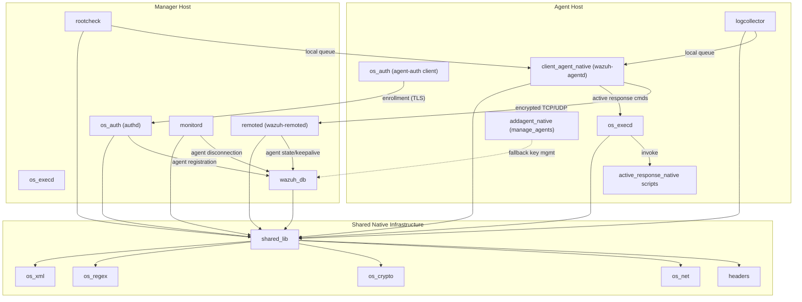
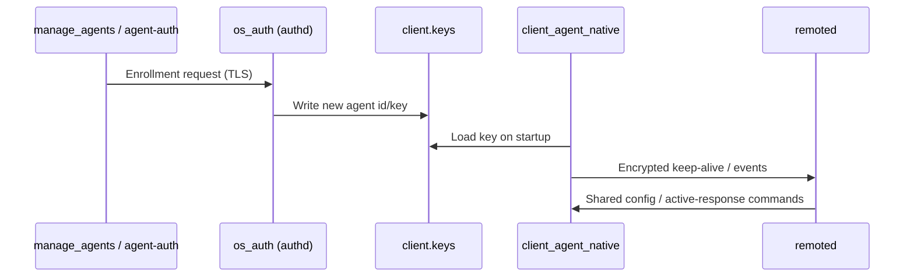
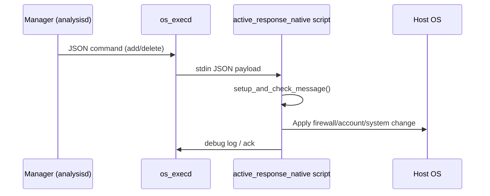

# Agent & Manager Native Daemons (C)

## 1. Purpose

The **Agent & Manager Native Daemons (C)** module is the core native C codebase that implements the actual running processes of Wazuh — the low-level, always-on daemons that execute on both the **agent** (endpoint) and the **manager** (server). While higher-level modules (API/Framework, Engine, Cluster) provide orchestration, configuration, and business logic in Python/C++, this module provides the foundational, performance-critical processes that:

- Collect telemetry (logs, file integrity events, rootkit indicators) on the endpoint.
- Securely transmit and receive data between agents and managers over encrypted channels.
- Enroll and authenticate agents (key management).
- Execute Active Response commands in reaction to security events.
- Manage shared configuration distribution, agent groups, and manager-side statistics.
- Provide the shared C library (`shared_lib`), networking (`os_net`), cryptography (`os_crypto`), regex (`os_regex`), and XML parsing (`os_xml`) utilities consumed by every other native daemon.
- Interface with the Wazuh database (`wazuh_db`) and the extensible modules subsystem (`Wazuh_Modules_Daemon_(C)`).

This module is the backbone that all other daemons and higher-level services (API, Engine, Cluster) ultimately depend on for agent communication, event collection, and secure operation.

## 2. Architecture

The module is organized into cohesive sub-modules, each responsible for a distinct daemon or shared library. The diagram below shows the primary process/data relationships among the native daemons.

### Agent Enrollment & Secure Communication Flow

### Active Response Execution Flow

## 3. Sub-Modules & Core Components

| Sub-module | Responsibility |
|---|---|
| **active_response_native** | Native AR executables (firewall blocking, account disabling, system restart, third-party integrations) invoked by `os_execd`. |
| **addagent_native** | Legacy `manage_agents` CLI for adding/removing/listing agents by directly editing `client.keys` when `authd` is unavailable. |
| **client_agent_native** | `wazuh-agentd` — the agent daemon managing encrypted communication, buffering, keep-alives, and local/remote requests. |
| **headers** | Shared C type/struct declarations (`sec.h`, `shared.h`, queues, hash tables) used across all native daemons. |
| **logcollector** | Log collection engine supporting files, journald, macOS ULS, Windows Event Log, and command-based sources. |
| **monitord** | Manager housekeeping daemon: agent disconnection detection, log rotation, and local control socket. |
| **os_auth** | `wazuh-authd` enrollment daemon and `agent-auth` client for secure agent registration. |
| **os_crypto** | Cryptographic primitives: SHA-1 hashing, agent key store management, and WPK package signature verification. |
| **os_execd** | Active Response execution engine, timeout/undo management, and local control socket (`wcom`). |
| **os_net** | Low-level socket abstraction (TCP/UDP/Unix), secure framed protocol, and cluster message framing. |
| **os_regex** | Lightweight pattern-matching engine (`OSMatch`/`OSRegex`) used throughout configuration and log filtering. |
| **os_xml** | Minimal XML parser used to read `ossec.conf` and module configuration blocks. |
| **remoted** | `wazuh-remoted` — the manager daemon handling all agent network communication, group/shared-config distribution, and statistics. |
| **rootcheck** | Legacy rootkit/anomaly detection engine (hidden ports/processes, RCL policy evaluation). |
| **shared_lib** | Common C utility library: data structures, file I/O, string/validation utilities, logging, networking helpers, system utilities. |
| **wazuh_db** | `wazuh-db` daemon providing SQLite-backed persistence for agent state, FIM, syscollector, and task data. |
| **win32_agent** | Windows-specific agent binaries, installer/setup tools, and Windows service integration. |

## 4. References

For detailed documentation of each sub-module, refer to:

- [active_response_native.md](active_response_native.md)
- [addagent_native.md](addagent_native.md)
- [client_agent_native.md](client_agent_native.md)
- [headers.md](headers.md)
- [logcollector.md](logcollector.md)
- [monitord.md](monitord.md)
- [os_auth.md](os_auth.md)
- [os_crypto.md](os_crypto.md)
- [os_execd.md](os_execd.md)
- [os_net.md](os_net.md)
- [os_regex.md](os_regex.md)
- [os_xml.md](os_xml.md)
- [remoted.md](remoted.md)
- [rootcheck.md](rootcheck.md)
- [shared_lib.md](shared_lib.md)
- [wazuh_db.md](wazuh_db.md)

Related modules outside this tree that closely interoperate with these daemons:

- `Configuration_Data_Structures_(C_Headers)` — defines the C structs (`syscheck_config`, `logreader_config`, `authd_config_t`, etc.) parsed and consumed by these daemons.
- `Syscheck_&_FIM_Daemon_(C/C++)` — the file-integrity-monitoring daemon that shares infrastructure with `rootcheck` and `shared_lib`.
- `Wazuh_Modules_Daemon_(C)` — the extensible `wazuh-modulesd` process hosting cloud/security integrations, sharing `shared_lib` and `os_net`.
- `cluster_module` and `API_&_Management_Framework_(Python)` — higher-level Python components that interact with these daemons via sockets (`wazuh_socket.py`, `wdb.py`) and CLI wrappers.