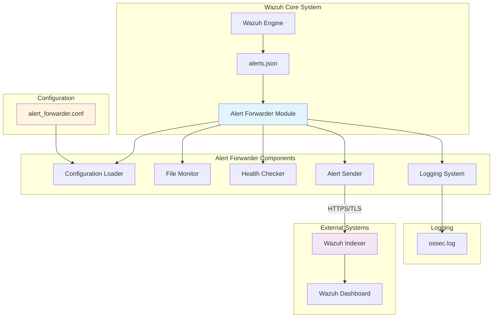
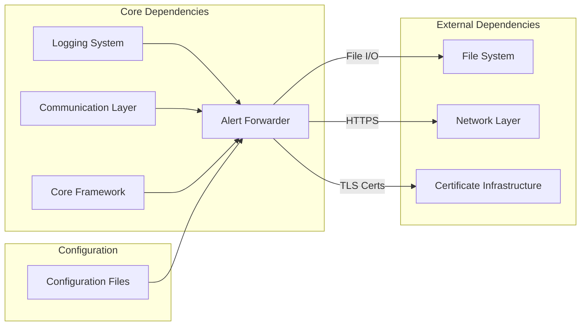
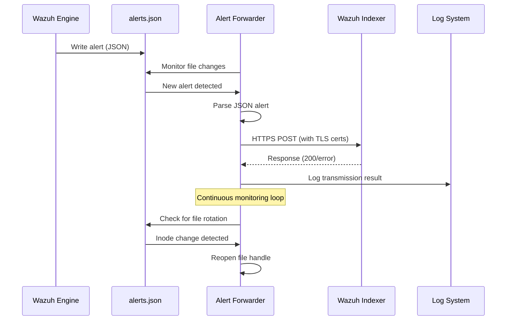
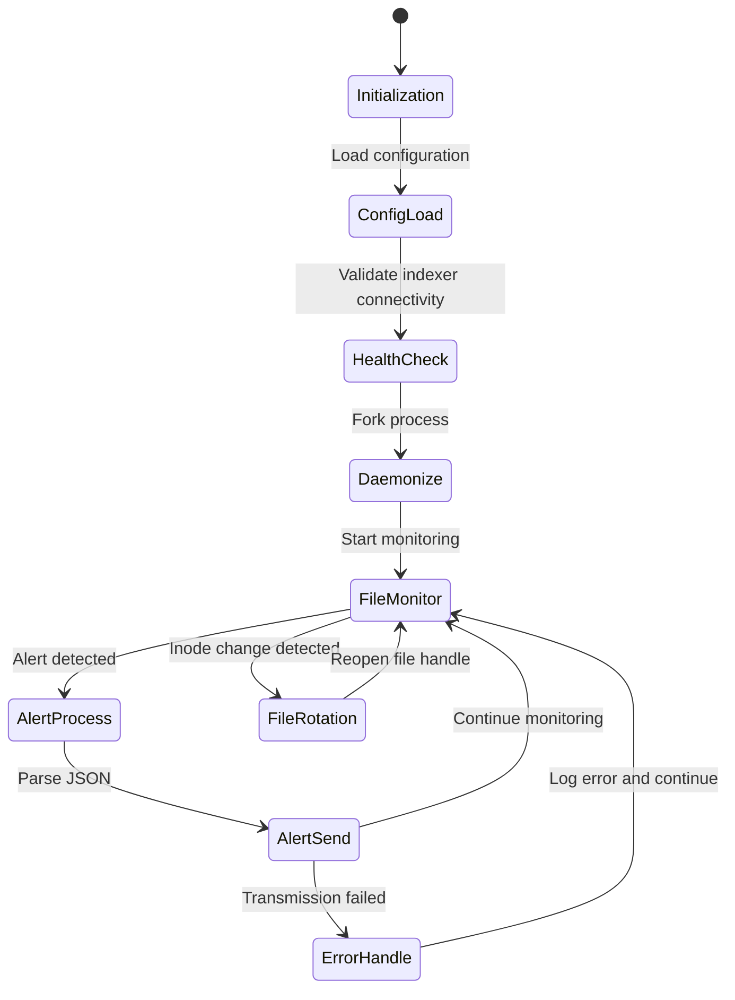
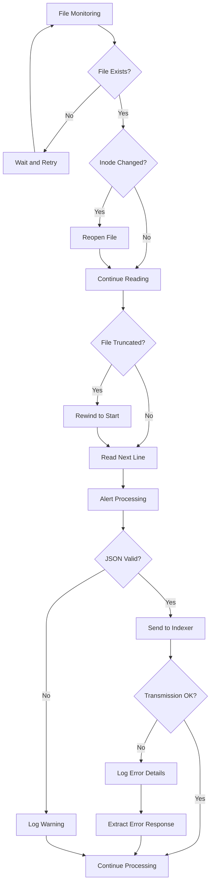
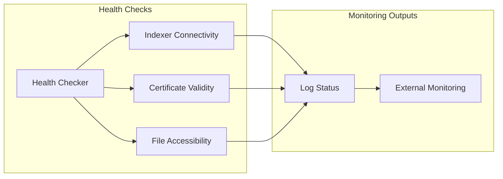

# Alert Forwarder Module

The Alert Forwarder module is a critical component of the Wazuh security platform that provides real-time alert forwarding capabilities from Wazuh to external indexing systems, primarily Wazuh Indexer (OpenSearch). This module ensures that security alerts generated by the Wazuh analysis engine are efficiently transmitted to the indexing layer for storage, analysis, and visualization.

## Architecture Overview

The Alert Forwarder operates as a standalone daemon service that continuously monitors the Wazuh alerts file and forwards alerts to the configured indexer endpoint using secure HTTPS connections with mutual TLS authentication.



## Core Components

### AlertForwarder Class

The main `AlertForwarder` class serves as the central orchestrator for alert processing and forwarding operations.

#### Key Responsibilities
- **File Monitoring**: Continuously monitors the alerts file for new entries
- **Alert Processing**: Parses JSON-formatted alerts from the file stream
- **Secure Transmission**: Forwards alerts to the indexer using HTTPS with client certificate authentication
- **Error Handling**: Implements robust error handling and retry mechanisms
- **Resource Management**: Manages file handles and handles file rotation scenarios

#### Core Methods

**`__init__(self, config)`**
- Initializes the forwarder with configuration parameters
- Sets up internal state for file monitoring and alert processing

**`send_alert(self, alert)`**
- Transmits individual alerts to the configured indexer endpoint
- Implements secure HTTPS communication with mutual TLS
- Provides detailed error logging for failed transmissions

**`run(self)`**
- Main execution loop for continuous alert monitoring
- Handles file rotation and inode changes
- Implements efficient file tailing with minimal resource usage

## System Integration

### Dependencies

The Alert Forwarder integrates with several core Wazuh components:



For detailed information about these dependencies, refer to:
- [Logging System](Logging%20System.md) - For logging infrastructure and log management
- [Communication Layer](Communication%20Layer.md) - For network communication protocols
- [Core Framework](Core%20Framework.md) - For base utilities and common functionality

### Data Flow



## Configuration Management

### Configuration File Structure

The Alert Forwarder uses a simple key-value configuration format in `/var/ossec/etc/alert_forwarder.conf`:

```ini
# Alert source configuration
ALERTS_FILE=/var/ossec/logs/alerts/alerts.json

# Indexer connection settings
INDEXER_IP=127.0.0.1
INDEX_NAME=wazuh-alerts

# TLS certificate configuration
CERT_FILE=/etc/wazuh-indexer/certs/admin.pem
KEY_FILE=/etc/wazuh-indexer/certs/admin-key.pem
CA_CERT=/etc/wazuh-indexer/certs/root-ca.pem
```

### Configuration Parameters

| Parameter | Default Value | Description |
|-----------|---------------|-------------|
| `ALERTS_FILE` | `/var/ossec/logs/alerts/alerts.json` | Path to the alerts file to monitor |
| `INDEXER_IP` | `127.0.0.1` | IP address of the Wazuh Indexer |
| `INDEX_NAME` | `wazuh-alerts` | Target index name in the indexer |
| `CERT_FILE` | `/etc/wazuh-indexer/certs/admin.pem` | Client certificate for TLS authentication |
| `KEY_FILE` | `/etc/wazuh-indexer/certs/admin-key.pem` | Private key for TLS authentication |
| `CA_CERT` | `/etc/wazuh-indexer/certs/root-ca.pem` | Certificate Authority certificate |

## Process Management

### Daemon Operation

The Alert Forwarder operates as a system daemon with the following characteristics:



### Process Lifecycle

1. **Initialization Phase**
   - Load configuration from file
   - Validate required parameters
   - Set up logging infrastructure

2. **Health Check Phase**
   - Verify indexer connectivity
   - Validate TLS certificates
   - Ensure target index accessibility

3. **Daemonization Phase**
   - Fork background process
   - Redirect standard I/O streams
   - Create PID file for process management

4. **Monitoring Phase**
   - Continuous file monitoring
   - Alert processing and forwarding
   - Error handling and recovery

## Security Features

### Transport Security

The Alert Forwarder implements comprehensive security measures:

- **Mutual TLS Authentication**: Uses client certificates for secure authentication
- **Certificate Validation**: Verifies server certificates against trusted CA
- **Encrypted Communication**: All data transmission occurs over HTTPS
- **Timeout Protection**: Implements connection timeouts to prevent hanging connections

### Error Handling and Resilience



## Performance Characteristics

### Resource Utilization

- **Memory Footprint**: Minimal memory usage with efficient file handling
- **CPU Usage**: Low CPU overhead with optimized polling intervals
- **I/O Operations**: Efficient file tailing with minimal disk I/O
- **Network Usage**: Batched alert transmission with connection reuse

### Scalability Considerations

- **Alert Volume**: Handles high-volume alert streams efficiently
- **File Rotation**: Seamless handling of log rotation scenarios
- **Connection Management**: Robust connection handling with automatic recovery
- **Error Recovery**: Graceful degradation during indexer unavailability

## Monitoring and Observability

### Logging Integration

The Alert Forwarder integrates with the [Logging System](Logging%20System.md) to provide comprehensive operational visibility:

- **Operational Logs**: Process lifecycle and configuration events
- **Error Logs**: Detailed error information with context
- **Debug Logs**: Verbose debugging information for troubleshooting
- **Performance Metrics**: Alert processing rates and transmission statistics

### Health Monitoring



## Operational Procedures

### Deployment

1. **Configuration Setup**
   - Create configuration file with appropriate parameters
   - Ensure TLS certificates are properly configured
   - Validate indexer connectivity

2. **Service Installation**
   - Deploy the Alert Forwarder binary
   - Configure system service management
   - Set appropriate file permissions

3. **Validation**
   - Test configuration with `-t` flag
   - Verify alert forwarding functionality
   - Monitor logs for proper operation

### Maintenance

- **Certificate Renewal**: Regular TLS certificate updates
- **Configuration Updates**: Dynamic configuration reloading
- **Log Rotation**: Coordination with system log rotation
- **Performance Monitoring**: Regular performance assessment

## Integration Points

### Upstream Integration

The Alert Forwarder receives alerts from the Wazuh analysis engine through the standard alerts file interface, ensuring compatibility with all Wazuh detection capabilities including:

- Rule-based detection
- Anomaly detection
- Threat intelligence correlation
- Custom rule processing

### Downstream Integration

Forwarded alerts integrate with the broader Wazuh ecosystem:

- **Wazuh Indexer**: Primary storage and indexing
- **Wazuh Dashboard**: Visualization and analysis
- **External SIEM**: Third-party security platforms
- **Alerting Systems**: Notification and response platforms

## Troubleshooting

### Common Issues

1. **Connection Failures**
   - Verify indexer accessibility
   - Check certificate configuration
   - Validate network connectivity

2. **File Access Issues**
   - Confirm alerts file permissions
   - Verify file path configuration
   - Check disk space availability

3. **Performance Issues**
   - Monitor alert processing rates
   - Check indexer performance
   - Analyze network latency

### Diagnostic Tools

- Configuration validation mode (`-t` flag)
- Detailed error logging with context
- Health check endpoints
- Process monitoring capabilities

For additional troubleshooting resources, refer to the [Logging System](Logging%20System.md) documentation for log analysis techniques and the [Core Framework](Core%20Framework.md) for general diagnostic procedures.