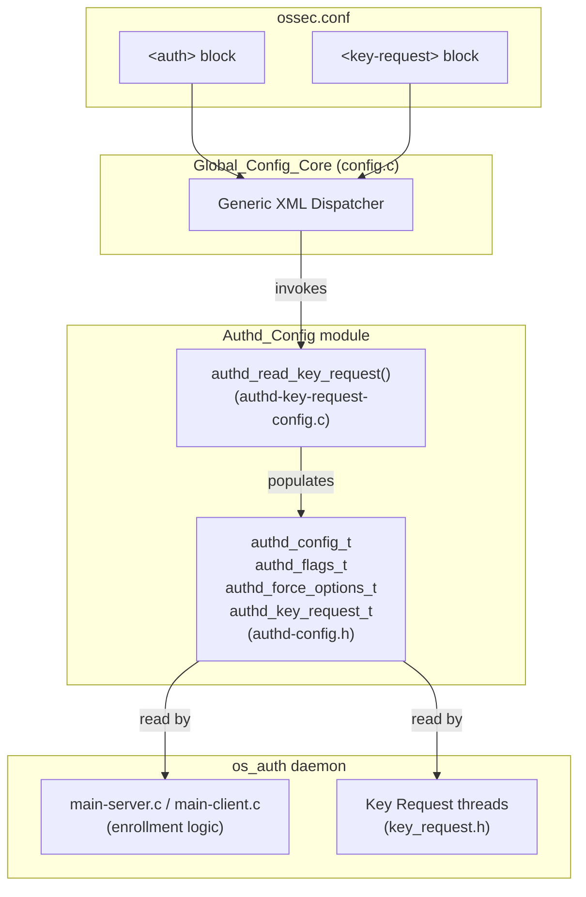
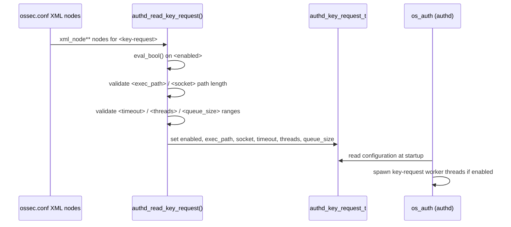

# Authd_Config Module

## 1. Introduction and Purpose

The **Authd_Config** module defines and parses the configuration settings used by **`authd`** (also known as `wazuh-authd`), the Wazuh manager daemon responsible for agent enrollment (issuing cryptographic keys to new agents) and, optionally, for **agent key polling / key requests** to external sources (e.g. cloud provider APIs, CMDBs) during the enrollment or re-key process.

This module is intentionally small and self-contained. It is part of the larger **Configuration Data Structures (C Headers)** family of modules (see sibling modules such as [Client_Config](Client_Config.md), [Global_Config_Core](Global_Config_Core.md), [Remote_Config](Remote_Config.md), and [Syscheck_Config](Syscheck_Config.md)), each of which owns the configuration schema for one Wazuh daemon.

Concretely, Authd_Config provides:

1. **Data structures** (`authd_config_t`, `authd_flags_t`, `authd_force_options_t`, `authd_key_request_t`) that hold the fully-parsed, in-memory representation of `authd`'s configuration (both the `<auth>` block and the `<key-request>` sub-block found in `ossec.conf`).
2. **Parsing logic** (`authd_read_key_request` in `authd-key-request-config.c`) that reads the `<key-request>` XML block and populates an `authd_key_request_t` structure, including validation of each field and sensible defaults.

This configuration is consumed at manager startup by the **`os_auth`** daemon (see [Agent_&_Manager_Native_Daemons_(C)](Agent_%26_Manager_Native_Daemons_%28C%29.md), specifically the `os_auth` sub-module) to control TLS/enrollment behavior, agent-replacement policy, and the optional external key-request mechanism.

## 2. Architecture Overview

Authd_Config sits between the generic Wazuh XML configuration reader (`src/config/config.c`, part of [Global_Config_Core](Global_Config_Core.md)) and the `os_auth` daemon runtime. The generic reader dispatches XML nodes for the `<auth>`/`<key-request>` elements from `ossec.conf` to the parsing function defined here, which fills a shared `authd_config_t` structure that the daemon reads for the lifetime of the process.



### Data flow for key-request configuration



## 3. Core Components

Since this module consists of only two tightly-coupled files, it is documented as a single unit rather than split into sub-modules.

### 3.1 `src/config/authd-config.h` — Configuration Data Model

This header defines the complete configuration schema for `authd`:

| Type | Purpose |
|---|---|
| `authd_flags_t` | Bit-field flags controlling daemon behavior: whether the daemon is `disabled`, whether to `use_source_ip` for agent identification, `clear_removed` agents, `use_password` authentication, `verify_host` (certificate hostname verification), `auto_negotiate` cipher/protocol, and `remote_enrollment` support. |
| `authd_force_options_t` | Controls the **agent-replacement ("force")** policy: whether forcing is `enabled`, whether a `key_mismatch` alone can trigger replacement, whether a `disconnected_time` threshold applies (and its value), and the `after_registration_time` grace period before an agent can be replaced. |
| `authd_key_request_t` | Configuration for the optional **key-request** feature, which allows `authd` to query an external script/socket for agent metadata (IP, key, ID) during enrollment. Fields: `enabled`, `exec_path`, `socket`, `timeout`, `threads`, `queue_size`, and an internal `compatibility_flag` used to prevent double-configuration when both the legacy `agent-key-polling` module and the newer `<key-request>` block are present. |
| `authd_config_t` | The top-level configuration aggregate, embedding all of the above plus TLS/network settings: `port`, `ciphers`, `agent_ca`, `manager_cert`, `manager_key`, `timeout_sec`/`timeout_usec`, `worker_node` (cluster role awareness), `ipv6`, and `allow_higher_versions` (whether to allow agents with a newer version than the manager to enroll).

It also declares the helper `get_time_interval()`, used to convert human-readable time strings (e.g. `"1h"`, `"30m"`) into a `time_t` value in seconds — used for force-option time thresholds.

### 3.2 `src/config/authd-key-request-config.c` — Key-Request Parser

This file implements `authd_read_key_request()`, the XML-to-struct parser for the `<key-request>` block, plus the local helper:

- **`eval_bool(const char *str)`**: A small utility that maps the strings `"yes"`/`"no"` to `1`/`0`, returning `OS_INVALID` for anything else (including `NULL`). This same idiom (`eval_bool`) reappears identically in several other Wazuh module-configuration files (e.g. `rootcheck-config.c`, `wazuh_db-config.c`, `wmodules-gcp.c`, `wmodules-osquery-monitor.c`, `wmodules-sca.c` — see [Rootcheck_Config](Rootcheck_Config.md), [Wazuh_DB_Config](Wazuh_DB_Config.md), and [Wmodules_Config](Wmodules_Config.md)), reflecting a shared, lightweight boolean-parsing convention across the Wazuh configuration subsystem rather than a shared library call.

- **`authd_read_key_request(xml_node **nodes, void *config)`**: The main entry point invoked by the generic configuration reader. Behavior:
  1. **Compatibility guard**: if `compatibility_flag` is already set (meaning the legacy `agent-key-polling` block already configured key-request behavior), parsing is skipped to avoid overwriting those settings.
  2. **Defaults**: `enabled = 1`, `timeout = 60`, `threads = 1`, `queue_size = 1024`.
  3. **Per-node parsing** of the following XML tags, each validated with specific rules:
     - `<enabled>`: parsed via `eval_bool`; invalid values abort parsing (`OS_INVALID`).
     - `<exec_path>`: local script path; rejected if empty, starts with a space, or exceeds `PATH_MAX`.
     - `<socket>`: local socket path; same validation rules as `exec_path`.
     - `<timeout>`: integer seconds; must be within `[1, UINT_MAX)`.
     - `<threads>`: integer thread count; must be within `[1, 32]`.
     - `<queue_size>`: integer; must be within `[1, 220000]`.
     - `<force_insert>`: deprecated tag, now silently inherited from Authd's global force-options — emits a warning if present.
     - Any unrecognized tag triggers a warning (`mwarn`) but does not abort parsing.
  4. Returns `0` on success or `OS_INVALID` on any validation failure.

## 4. Relationship to Other Modules

- **[Global_Config_Core](Global_Config_Core.md)**: Owns the generic XML configuration dispatcher (`config.c`) and the top-level `_Config`/`__Config` structures that route parsed blocks (including `<auth>`/`<key-request>`) to module-specific readers such as `authd_read_key_request`.
- **`os_auth` sub-module of [Agent_&_Manager_Native_Daemons_(C)](Agent_%26_Manager_Native_Daemons_%28C%29.md)**: The runtime consumer of `authd_config_t`. Components such as `main-server.c`, `main-client.c`, `auth.c`, `ssl.c`, and `key_request.h` (`key_request_agent_info`) read the populated configuration to drive TLS enrollment, agent replacement policy, and to spawn key-request worker threads (bounded by `threads`/`queue_size`, guarded by `timeout`).
- **[Rootcheck_Config](Rootcheck_Config.md)**, **[Wazuh_DB_Config](Wazuh_DB_Config.md)**, **[Wmodules_Config](Wmodules_Config.md)**: Sibling configuration modules that follow the same lightweight `eval_bool`-based XML parsing pattern used here, all under the umbrella of the C-header configuration family alongside [Client_Config](Client_Config.md), [Global_Config_Core](Global_Config_Core.md), [Remote_Config](Remote_Config.md), [Syscheck_Config](Syscheck_Config.md), and [Active_Response_Config](Active_Response_Config.md).
- **`security_rbac_module`** (of the API & Management Framework — see the RBAC/authentication documentation for the API layer) is conceptually related in that it also governs authentication/authorization, but operates at the REST API layer (Python) rather than the manager-agent enrollment layer (C) covered by Authd_Config. The two are independent configuration domains.

## 5. Configuration Example

A typical `ossec.conf` snippet parsed by this module:

```xml
<auth>
  <disabled>no</disabled>
  <port>1515</port>
  <use_source_ip>no</use_source_ip>
  <force>
    <enabled>yes</enabled>
    <key_mismatch>yes</key_mismatch>
    <disconnected_time enabled="yes">1h</disconnected_time>
    <after_registration_time>1h</after_registration_time>
  </force>
  <ssl_verify_host>no</ssl_verify_host>
  <ssl_auto_negotiate>no</ssl_auto_negotiate>

  <key-request>
    <enabled>yes</enabled>
    <exec_path>/var/ossec/bin/key_request_script.sh</exec_path>
    <socket>/var/ossec/queue/sockets/krequest</socket>
    <timeout>60</timeout>
    <threads>4</threads>
    <queue_size>1024</queue_size>
  </key-request>
</auth>
```

Parsing of the `<force>` sub-block populates `authd_force_options_t`; parsing of `<key-request>` is handled entirely by `authd_read_key_request()` as documented above and populates `authd_key_request_t`.

## 6. Summary

| Aspect | Detail |
|---|---|
| Language | C |
| Files | `authd-config.h`, `authd-key-request-config.c` |
| Primary consumer | `os_auth` daemon (`wazuh-authd`) |
| Configuration source | `<auth>` and `<key-request>` blocks in `ossec.conf` |
| Key data structure | `authd_config_t` |
| Key parsing function | `authd_read_key_request()` |
| Validation approach | Inline range/format checks per XML tag, returning `OS_INVALID` on error |
