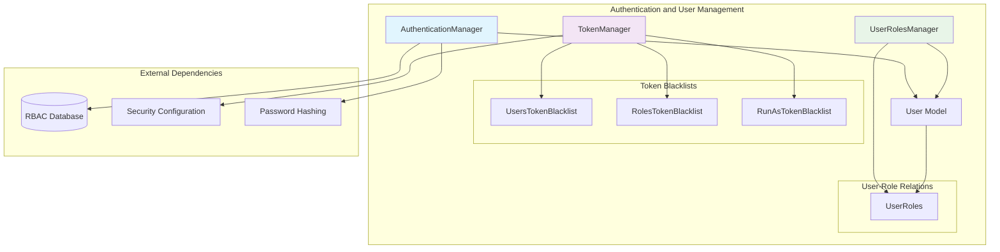
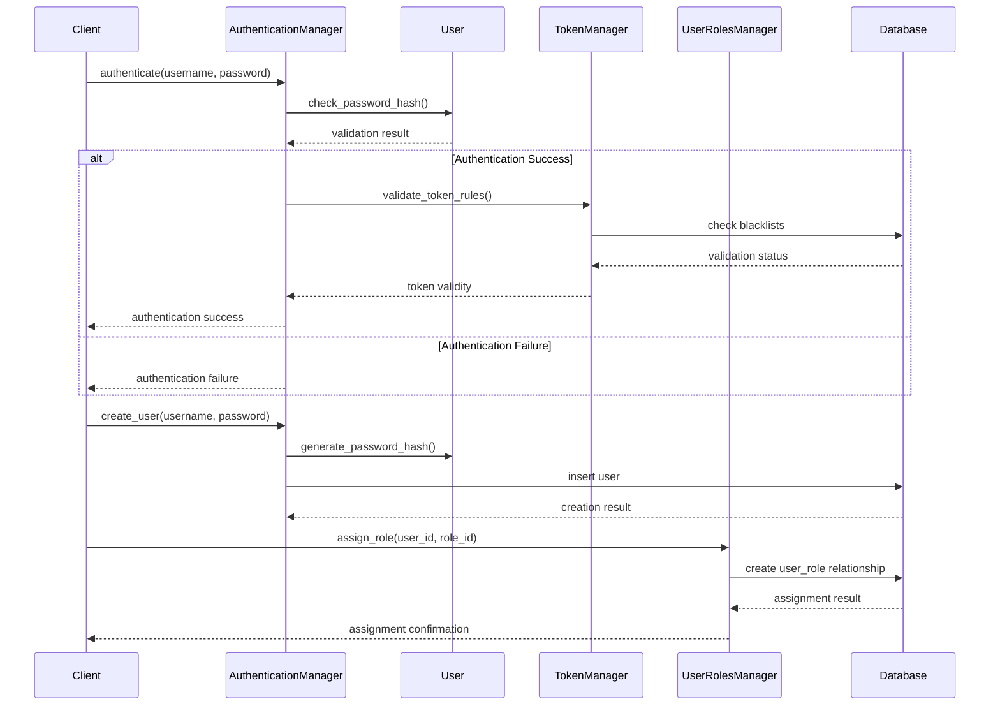
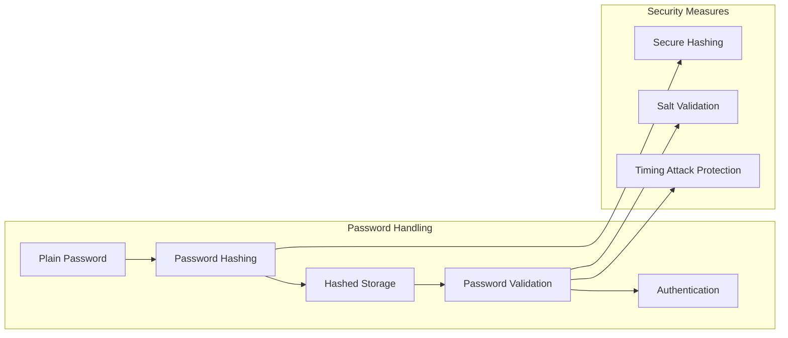
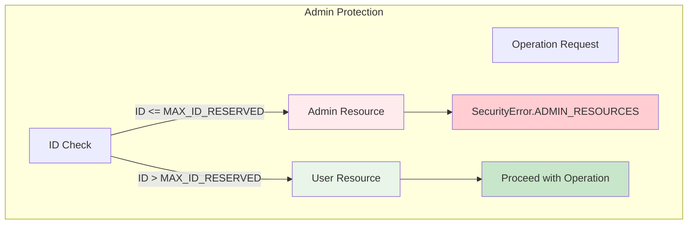
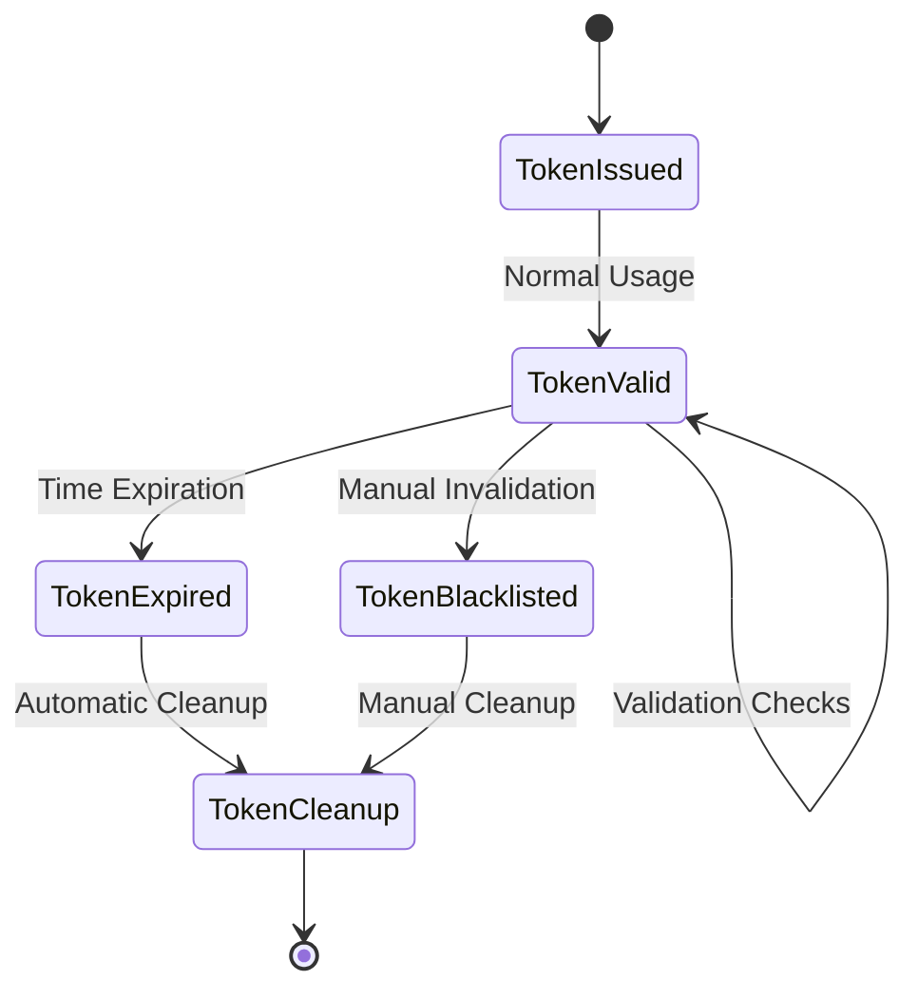
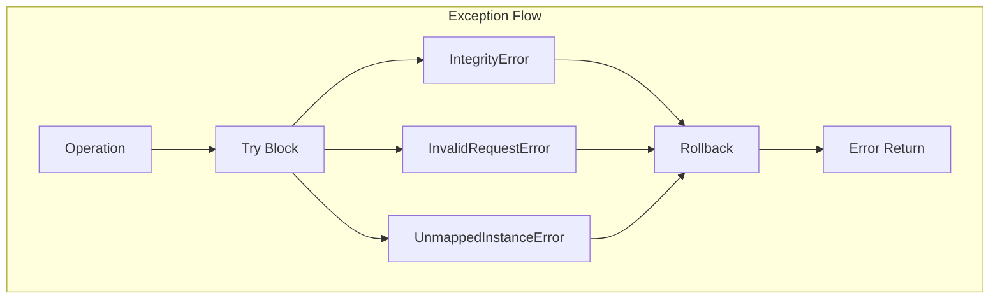
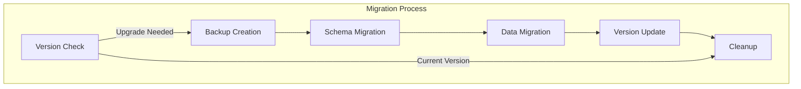

# Authentication and User Management

The Authentication and User Management module is a core component of Wazuh's Role-Based Access Control (RBAC) system, providing comprehensive user authentication, token management, and user lifecycle operations. This module ensures secure access to the Wazuh platform through robust authentication mechanisms and fine-grained user management capabilities.

## Overview

This module handles all aspects of user authentication and management within the Wazuh RBAC framework, including user creation, authentication, password management, token lifecycle, and user-role relationships. It provides the foundational security layer that controls access to Wazuh resources and operations.

### Key Responsibilities

- **User Authentication**: Secure login validation and credential verification
- **User Lifecycle Management**: Creation, modification, and deletion of user accounts
- **Token Management**: JWT token validation, blacklisting, and expiration handling
- **Password Security**: Secure password hashing and validation
- **User-Role Relationships**: Management of user assignments to roles
- **Run-As Authorization**: Support for authorization context switching

## Architecture



## Core Components

### AuthenticationManager

The `AuthenticationManager` class serves as the primary interface for user authentication and management operations.

**Key Features:**
- User creation and modification
- Password validation and updates
- User deletion with admin protection
- Run-as permission management
- User retrieval and listing

**Core Methods:**
```python
# User Management
add_user(username, password, user_id=None, hashed_password=False)
update_user(user_id, password=None, name=None, hashed_password=False)
delete_user(user_id)

# Authentication
check_user(username, password)

# User Retrieval
get_user(username)
get_user_id(user_id)
get_users()

# Run-As Management
edit_run_as(user_id, allow_run_as)
user_allow_run_as(username)
```

### User Model

The `User` class represents the core user entity with comprehensive user information and relationships.

**Schema:**
- `id`: Unique user identifier
- `username`: User login name (max 32 characters)
- `password`: Hashed password (256 characters)
- `allow_run_as`: Authorization context permission flag
- `created_at`: User creation timestamp

**Relationships:**
- Many-to-many relationship with Roles through UserRoles
- Cascade deletion of role associations

### TokenManager

The `TokenManager` handles JWT token validation and blacklist management for security enforcement.

**Token Validation Features:**
- User-specific token invalidation
- Role-based token invalidation
- Run-as token invalidation
- Automatic expired token cleanup

**Blacklist Management:**
```python
# Token Validation
is_token_valid(token_nbf_time, user_id=None, role_id=None, run_as=False)

# Blacklist Operations
add_user_roles_rules(users=None, roles=None, run_as=False)
delete_rule(user_id=None, role_id=None, run_as=False)
delete_all_expired_rules()
```

### UserRolesManager

Manages the many-to-many relationships between users and roles with priority levels.

**Relationship Management:**
- Role assignment to users with priority levels
- Role removal from users
- Bulk operations for role management
- Relationship validation and existence checks

## Data Flow



## Security Features

### Password Security



**Implementation:**
- Werkzeug secure password hashing
- Salt-based password protection
- Timing attack resistance
- Secure password comparison

### Token Blacklisting

The module implements a comprehensive token blacklisting system:

**UsersTokenBlacklist:**
- User-specific token invalidation
- Automatic expiration handling
- Timestamp-based validation

**RolesTokenBlacklist:**
- Role-based token invalidation
- Cascading invalidation for role changes
- Multi-role token management

**RunAsTokenBlacklist:**
- Authorization context token control
- System-wide run-as invalidation
- Privilege escalation protection

### Admin Protection



## Component Interactions

### User Management Flow

```mermaid
graph TB
    subgraph "User Creation"
        UC[User Creation Request]
        UV[Username Validation]
        PH[Password Hashing]
        DB[Database Insert]
        RA[Role Assignment]
    end
    
    subgraph "User Authentication"
        LR[Login Request]
        CV[Credential Validation]
        TV[Token Validation]
        AS[Authentication Success]
    end
    
    subgraph "User Modification"
        UM[Update Request]
        AP[Admin Protection Check]
        UU[User Update]
        TC[Token Cache Clear]
    end
    
    UC --> UV --> PH --> DB --> RA
    LR --> CV --> TV --> AS
    UM --> AP --> UU --> TC
```



### Token Lifecycle Management



## Integration Points

### Database Connectivity

The module integrates with the [Database Connectivity](Database%20Connectivity.md) module for:
- SQLAlchemy ORM operations
- Transaction management
- Connection pooling
- Database integrity checks

### Authorization and Policy Engine

Collaborates with the [Authorization and Policy Engine](Authorization%20and%20Policy%20Engine.md) for:
- Role-based access control
- Policy enforcement
- Permission validation
- Authorization context management

### API Framework

Provides authentication services to the [API Framework](API%20Framework.md) through:
- JWT token validation
- User credential verification
- Session management
- Security middleware integration

## Configuration

### Security Configuration

```python
# Token expiration settings
auth_token_exp_timeout = 900  # 15 minutes

# Password hashing configuration
password_hash_method = 'pbkdf2:sha256'
password_hash_salt_length = 8

# Admin user protection
MAX_ID_RESERVED = 99
WAZUH_USER_ID = 1
WAZUH_WUI_USER_ID = 2
```

### Database Configuration

```python
# Database settings
DB_FILE = os.path.join(SECURITY_PATH, "rbac.db")
CURRENT_ORM_VERSION = 1

# Connection settings
pool_size = 10
echo = False  # SQL logging
```

## Error Handling

### Security Error Codes

```python
class SecurityError(IntEnum):
    ALREADY_EXIST = 0          # Resource already exists
    INVALID = -1               # Invalid format or property
    ROLE_NOT_EXIST = -2        # Role not found
    POLICY_NOT_EXIST = -3      # Policy not found
    ADMIN_RESOURCES = -4       # Admin resource protection
    USER_NOT_EXIST = -5        # User not found
    TOKEN_RULE_NOT_EXIST = -6  # Token rule not found
    RULE_NOT_EXIST = -7        # Rule not found
    RELATIONSHIP_ERROR = -8    # Relationship operation failed
```

### Exception Handling



## Performance Considerations

### Database Optimization

- **Connection Pooling**: Efficient database connection management
- **Lazy Loading**: Optimized relationship loading
- **Batch Operations**: Atomic flag for bulk operations
- **Index Usage**: Optimized queries with proper indexing

### Caching Strategy

- **Token Cache**: Automatic cache invalidation on token blacklisting
- **Session Management**: Efficient session lifecycle management
- **Query Optimization**: Minimized database round trips

## Monitoring and Logging

### Audit Trail

```python
# User operations logging
logger.info(f"User {user_id} created successfully")
logger.warning(f"User {user_id} ({username}) renamed due to conflict")
logger.error(f"Authentication failed for user {username}")
```

### Security Events

- Failed authentication attempts
- Token invalidation events
- Admin operation attempts
- User privilege changes

## Best Practices

### Security Guidelines

1. **Password Management**:
   - Always hash passwords before storage
   - Use secure random salt generation
   - Implement password complexity requirements

2. **Token Security**:
   - Regular token blacklist cleanup
   - Proper token expiration handling
   - Secure token validation

3. **Admin Protection**:
   - Enforce admin resource protection
   - Validate user permissions before operations
   - Audit admin operations

### Development Guidelines

1. **Error Handling**:
   - Use appropriate SecurityError codes
   - Implement proper rollback mechanisms
   - Log security-relevant events

2. **Database Operations**:
   - Use atomic operations for consistency
   - Implement proper transaction management
   - Handle database integrity constraints

## Migration and Upgrades

### Database Migration

The module includes comprehensive database migration capabilities:

```python
def check_database_integrity():
    """Check RBAC database integrity and perform migrations"""
    # Version checking
    # Schema migration
    # Data migration
    # Integrity validation
```

### Upgrade Process



## Related Documentation

- [Authorization and Policy Engine](Authorization%20and%20Policy%20Engine.md) - Role and policy management
- [Data Management and ORM](Data%20Management%20and%20ORM.md) - Database operations and ORM
- [API Framework](API%20Framework.md) - API authentication integration
- [Database Connectivity](Database%20Connectivity.md) - Database connection management
- [RBAC Security](RBAC%20Security.md) - Complete RBAC system overview