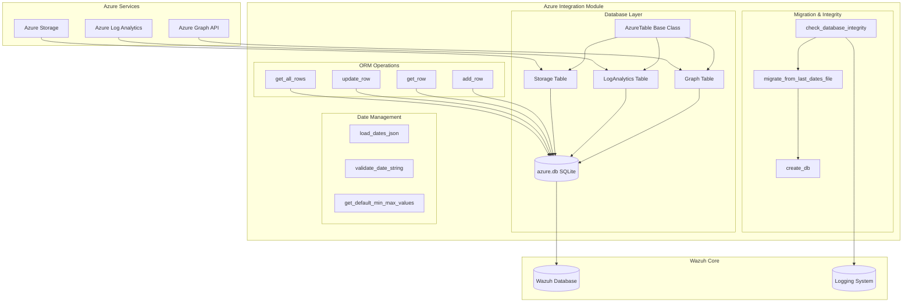
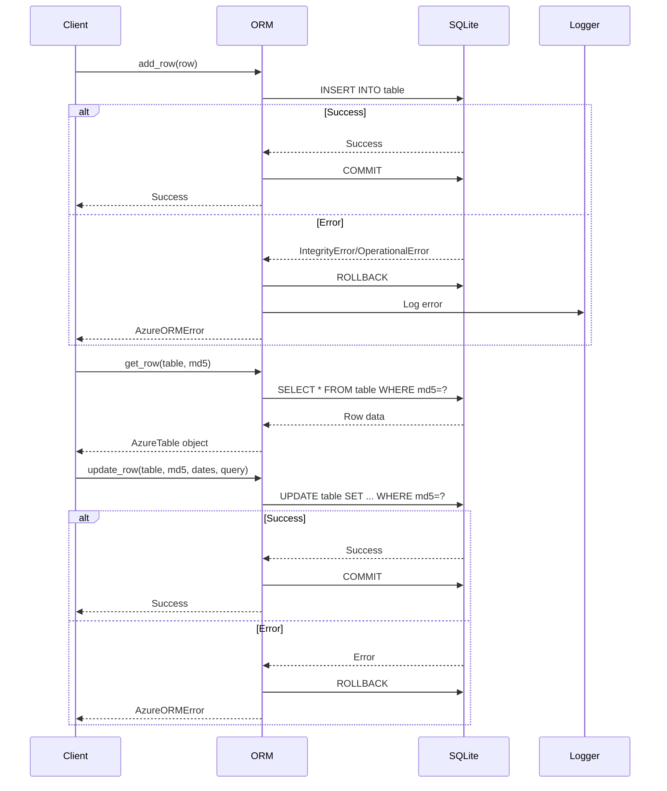
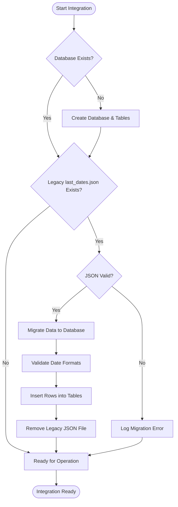
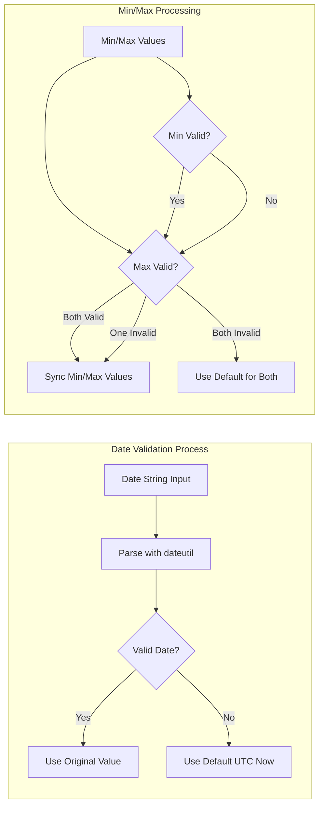

# Azure Integration Module

## Overview

The Azure Integration module provides comprehensive integration capabilities between Wazuh and Microsoft Azure cloud services. This module enables Wazuh to collect, process, and analyze security logs and events from various Azure services including Azure Graph API, Azure Log Analytics, and Azure Storage services. The module implements a robust database-backed tracking system to ensure reliable data collection and prevent data loss or duplication.

## Architecture

The Azure Integration module is built around a centralized database ORM (Object-Relational Mapping) system that manages state persistence and data tracking across different Azure services. The module follows a service-oriented architecture where each Azure service type has its dedicated table and processing logic.



## Core Components

### AzureTable Base Class

The `AzureTable` class serves as the foundational base class for all Azure service-specific tables. It defines the common schema and structure used across all Azure integration services.

**Key Features:**
- **Primary Key**: MD5 hash for unique identification of queries/configurations
- **Query Storage**: Stores the actual query or configuration used for data collection
- **Date Tracking**: Maintains minimum and maximum processed dates for incremental data collection
- **Standardized Schema**: Provides consistent structure across all Azure services

**Schema:**
```python
md5: Text (Primary Key)                    # Unique identifier for the query/configuration
query: Text (Not Null)                    # The query or configuration string
min_processed_date: String(28) (Not Null) # Earliest date processed
max_processed_date: String(28) (Not Null) # Latest date processed
```

### Service-Specific Tables

#### Graph Table
Manages data collection state for Azure Graph API integrations.

**Purpose:**
- Tracks Microsoft Graph API queries and their processing status
- Manages authentication tokens and API call states
- Handles user, group, and security-related data from Azure AD

#### LogAnalytics Table
Handles Azure Log Analytics workspace data collection tracking.

**Purpose:**
- Manages KQL (Kusto Query Language) queries for Log Analytics workspaces
- Tracks log ingestion and processing states
- Handles security events, audit logs, and operational data

#### Storage Table
Manages Azure Storage account data collection and processing.

**Purpose:**
- Tracks blob storage access and processing
- Manages storage account logs and metrics
- Handles file and container-level security events

## Database Operations

### Core ORM Functions



### Database Integrity and Migration

The module implements a comprehensive database integrity checking system that handles:

1. **Database Creation**: Automatically creates the SQLite database if it doesn't exist
2. **Schema Migration**: Migrates from legacy `last_dates.json` files to the new database format
3. **Data Validation**: Validates date formats and handles corrupted data
4. **Cleanup**: Removes legacy files after successful migration



## Data Flow and Processing

### Date Management System

The module implements a sophisticated date management system to ensure reliable incremental data collection:



### Integration with Wazuh Core

The Azure Integration module integrates seamlessly with the broader Wazuh ecosystem:

**Dependencies:**
- **[Database Connectivity](Database Connectivity.md)**: Uses Wazuh's database connection framework for data persistence
- **[Logging System](Logging System.md)**: Leverages Wazuh's centralized logging for operational visibility
- **[Core Framework](Core Framework.md)**: Built on Wazuh's core utilities and validation framework

**Data Flow:**
1. Azure services provide logs and events through their respective APIs
2. The Azure Integration module processes and normalizes the data
3. Processed data is stored in the local SQLite database for state management
4. Clean, structured data is forwarded to the Wazuh analysis engine
5. The [Communication Layer](Communication Layer.md) handles data transmission to Wazuh components

## Configuration and Usage

### Database Configuration

The module uses the following default configurations:

```python
DATABASE_NAME = 'azure.db'                    # SQLite database filename
LAST_DATES_NAME = 'last_dates.json'          # Legacy configuration file
MODULE_ROOT_DIR = dirname(dirname(abspath(__file__)))  # Module root directory
```

### Service Integration Pattern

Each Azure service follows a consistent integration pattern:

1. **Query Definition**: Define the query or configuration for data collection
2. **MD5 Generation**: Generate a unique MD5 hash for the query
3. **State Check**: Check existing processing state in the database
4. **Data Collection**: Collect data from Azure service APIs
5. **State Update**: Update processing dates and status in the database

## Error Handling and Resilience

### Exception Management

The module implements comprehensive error handling through the `AzureORMError` exception class:

```python
class AzureORMError(Exception):
    """Custom exception for Azure ORM operations"""
    pass
```

**Error Scenarios Handled:**
- Database connection failures
- SQL integrity constraint violations
- Malformed date strings
- JSON parsing errors during migration
- File system access issues

### Recovery Mechanisms

1. **Transaction Rollback**: Automatic rollback on database operation failures
2. **Date Validation**: Fallback to default values for invalid dates
3. **Migration Recovery**: Graceful handling of corrupted legacy files
4. **Logging Integration**: Comprehensive error logging for troubleshooting

## Performance Considerations

### Database Optimization

- **Unique Constraints**: MD5-based unique constraints prevent duplicate entries
- **Indexed Primary Keys**: Fast lookups using MD5 hash keys
- **Minimal Schema**: Lightweight table structure for optimal performance
- **SQLite Engine**: Local SQLite database for fast, reliable operations

### Memory Management

- **Session Management**: Proper SQLAlchemy session handling with automatic cleanup
- **Lazy Loading**: On-demand data loading to minimize memory footprint
- **Connection Pooling**: Efficient database connection management

## Security Considerations

### Data Protection

- **Hash-based Keys**: MD5 hashes provide anonymized query identification
- **Local Storage**: Sensitive data stored locally in SQLite database
- **Access Control**: Database access restricted to the Wazuh process
- **Audit Trail**: Complete audit trail of all database operations

### Integration Security

The module integrates with Wazuh's security framework:
- **[RBAC Security](RBAC Security.md)**: Role-based access control for Azure integration features
- **Authentication**: Secure authentication with Azure services
- **Encryption**: Data encryption in transit and at rest

## Monitoring and Observability

### Logging Integration

The module provides comprehensive logging through the [Logging System](Logging System.md):

```python
logging.info('Checking database integrity')
logging.info('Migration from an old last_dates file is necessary')
logging.error(f'Error during last_dates file migration process: {e}')
logging.warning(f'It was not possible to remove the old last_dates file')
```

### Operational Metrics

- Database integrity check status
- Migration success/failure rates
- Query processing statistics
- Error rates and types

## Related Modules

- **[AWS Integration](AWS Integration.md)**: Similar cloud integration patterns and architecture
- **[Google Cloud Integration](Google Cloud Integration.md)**: Comparable cloud service integration approach
- **[Database Connectivity](Database Connectivity.md)**: Core database connection and management
- **[Core Framework](Core Framework.md)**: Foundation utilities and validation framework
- **[Logging System](Logging System.md)**: Centralized logging and monitoring

## Conclusion

The Azure Integration module provides a robust, scalable foundation for integrating Wazuh with Microsoft Azure cloud services. Its database-backed state management, comprehensive error handling, and seamless integration with the Wazuh ecosystem make it a critical component for organizations using Azure infrastructure. The module's architecture supports reliable data collection, processing, and analysis while maintaining high performance and security standards.