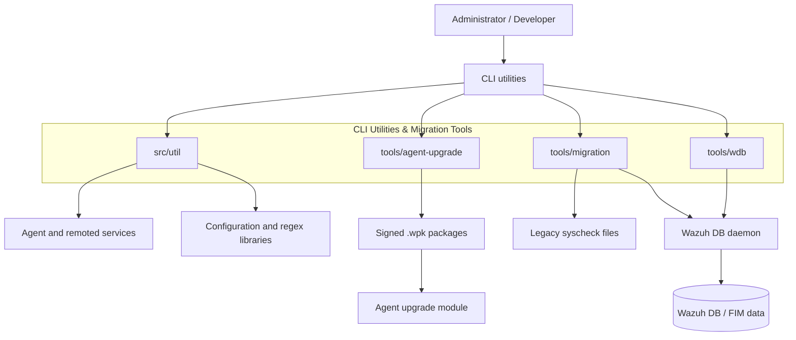
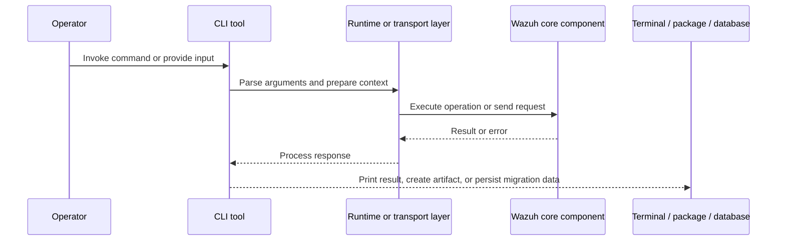
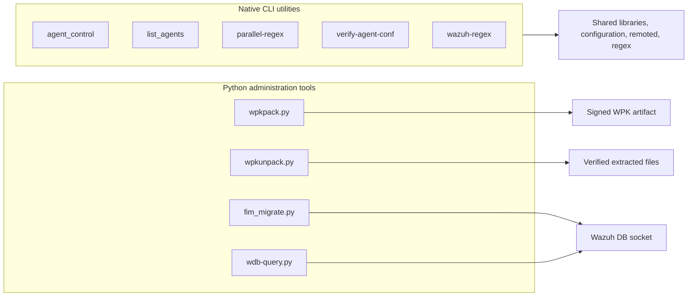

# CLI Utilities & Migration Tools

## Purpose

The `CLI_Utilities_&_Migration_Tools` module provides administrative and diagnostic command-line tools for Wazuh. It covers:

- Native utilities for agent control, configuration validation, and regex testing.
- Python tools for building and unpacking signed agent-upgrade packages.
- Migration of legacy FIM records into Wazuh DB.
- Concurrent querying of the Wazuh DB daemon through its Unix socket.

These tools are intentionally thin interfaces. Core responsibilities such as agent state management, database persistence, upgrade orchestration, FIM scanning, and protocol handling remain in their respective framework or daemon modules.

## Architecture

### Operational flow

### Component organization

## Child modules

| Component | Description | Documentation |
|---|---|---|
| `util_cli_tools` | Native utilities for agent operations, configuration checks, and regex diagnostics | [util_cli_tools.md](util_cli_tools.md) |
| `tools_agent_upgrade` | Builds, signs, verifies, and extracts `.wpk` agent-upgrade packages | [tools_agent_upgrade.md](tools_agent_upgrade.md) |
| `tools_migration` | Migrates legacy syscheck/FIM records and scan metadata into Wazuh DB | [tools_migration.md](tools_migration.md) |
| `tools_wdb` | Concurrent command-line client for framed queries to `wazuh-db` | [tools_wdb.md](tools_wdb.md) |

## Core component references

- [Agent module](agent_module.md) — agent state, metadata, and management operations.
- [Framework communication](framework_core_communication.md) — sockets, queues, and Wazuh inter-process communication.
- [Framework core utilities](framework_core_utils.md) — paths, runtime helpers, and result handling.
- [Wazuh DB engine](wazuh_db_engine.md) — database execution and persistence.
- [Wazuh DB command parser](wazuh_db_command_parser.md) — textual database commands and request dispatch.
- [Syscheck FIM database](syscheckd_db.md) — ownership and persistence of FIM records.
- [Agent upgrade module](agent_upgrade_module.md) — manager-side package transfer and upgrade orchestration.
- [Agent upgrade configuration](Wmodules_Config_agent_upgrade.md) — package repository and upgrade settings.
- [OS crypto](os_crypto.md) — cryptographic primitives relevant to package signing and verification.