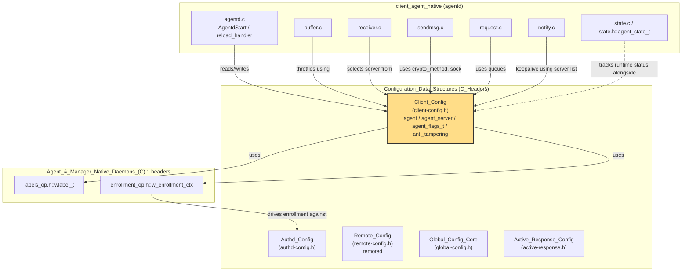
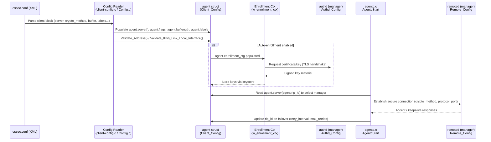
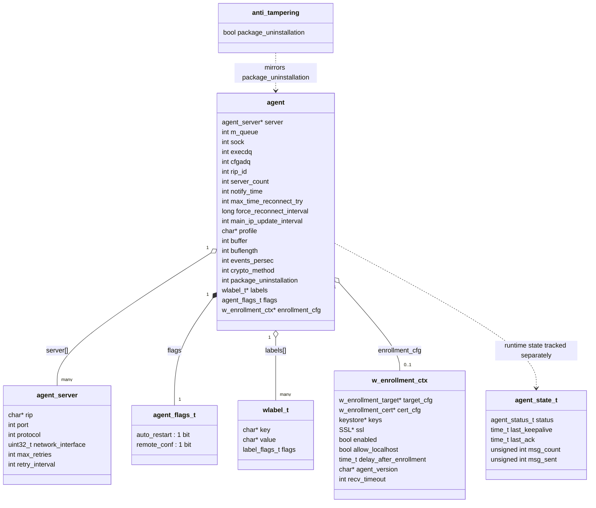
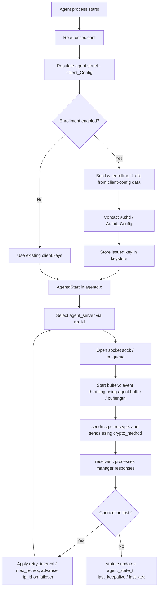

# Client_Config

## Introduction

`Client_Config` is the C configuration model for the **Wazuh Agent** (the `client-agent`/`agentd` process, also referred to historically as *ossec-agentd*). It is defined in a single header — `src/config/client-config.h` — and provides the core in-memory data structures that hold everything the agent needs to know about how to connect to, authenticate with, and communicate with one or more Wazuh managers.

This module is the agent-side counterpart to the manager-side `Remote_Config` (`remoted`) and works closely with the `Authd_Config` (auto-enrollment) and shared low-level structures (`headers`) modules. It does **not** implement any parsing or networking logic itself; instead, it defines the canonical `agent` struct that is populated by the XML configuration reader (`Config.c` / `client-config.c`, part of the native agent daemon) and then consumed throughout the agent's runtime (connection management, buffering, enrollment, anti-tampering checks, etc.).

Because `Client_Config` is a pure data-structure module, this document focuses on:
1. What each structure represents and how the fields relate to one another.
2. How the configuration flows from disk (`ossec.conf`) into the running agent process.
3. How other modules (enrollment, remoted, logcollector, shared headers) interact with these structures.

---

## Module Purpose and Scope

| Aspect | Description |
|---|---|
| **Language** | C (header-only definitions) |
| **File** | `src/config/client-config.h` |
| **Owning subsystem** | [Agent_&_Manager_Native_Daemons_(C)](Agent_&_Manager_Native_Daemons_(C).md) → `client_agent_native` |
| **Consumers** | `client-agent/*.c` (agentd, buffer, sendmsg, receiver, request, state, notify), enrollment subsystem, shared queue/socket helpers |
| **Related config modules** | [Authd_Config](Authd_Config.md), [Remote_Config](Remote_Config.md), [Global_Config_Core](Global_Config_Core.md), [Active_Response_Config](Active_Response_Config.md) |

The header exposes:
- `agent_flags_t` — bit-field flags controlling agent behavior (auto-restart, remote configuration management).
- `agent_server` — a single `<server>` block (IP/hostname, port, protocol, retry policy).
- `agent` (`_agent`) — the top-level configuration object for the whole agent process (list of servers, queues, sockets, buffering, crypto, labels, enrollment context, anti-tampering, etc.).
- `anti_tampering` (`_anti_tampering`) — a small structure guarding package-uninstallation protection.
- Two validation helper function prototypes: `Validate_Address()` and `Validate_IPv6_Link_Local_Interface()`, plus `Free_Client()` for teardown.

---

## Core Data Structures

### `agent_flags_t`

```c
typedef struct agent_flags_t {
    unsigned int auto_restart:1;
    unsigned int remote_conf:1;
} agent_flags_t;
```

A compact bit-field used to toggle two independent agent behaviors:
- `auto_restart`: whether the agent should restart itself automatically (e.g., after configuration changes pushed from the manager).
- `remote_conf`: whether the agent accepts and applies centralized/remote configuration from the manager (shared configuration files).

### `agent_server`

```c
typedef struct agent_server {
    char * rip;
    int port;
    int protocol;
    uint32_t network_interface;
    int max_retries;
    int retry_interval;
} agent_server;
```

Represents one manager endpoint the agent may connect to (a single `<server>` entry inside `<client>`). The agent configuration (`agent.server`) holds an **array** of these, allowing multi-manager/failover setups; `agent.server_count` tracks the array length and `agent.rip_id` tracks which server is currently active.

- `rip`: resolved/raw IP or hostname string of the manager.
- `port` / `protocol`: transport port and protocol (UDP/TCP), mirroring the protocol enums used by `Remote_Config`'s `remoted` struct on the manager side.
- `network_interface`: used together with `Validate_IPv6_Link_Local_Interface()` to bind link-local IPv6 addresses to a specific interface.
- `max_retries` / `retry_interval`: connection retry policy per server (defaults: `DEFAULT_MAX_RETRIES = 5`, `DEFAULT_RETRY_INTERVAL = 10`).

### `agent` (`_agent`)

```c
typedef struct _agent {
    agent_server * server;
    int m_queue;
    int sock;
    int execdq;
    int cfgadq;
    int rip_id;
    int server_count;
    int notify_time;
    int max_time_reconnect_try;
    long force_reconnect_interval;
    int main_ip_update_interval;
    char *profile;
    volatile int buffer;
    int buflength;
    int events_persec;
    int crypto_method;
    int package_uninstallation;
    wlabel_t *labels;
    agent_flags_t flags;
    w_enrollment_ctx *enrollment_cfg;
} agent;
```

This is the central configuration object, typically instantiated once per agent process and passed by reference throughout `client-agent/*.c` source files. Key field groups:

| Group | Fields | Purpose |
|---|---|---|
| **Manager connectivity** | `server`, `server_count`, `rip_id` | Failover list of managers and the currently-selected one. |
| **IPC/queues** | `m_queue`, `sock`, `execdq`, `cfgadq` | File descriptors for the internal message queue, the active manager socket, the `execd` (active-response) queue, and the shared-config-assessment queue. |
| **Timing/reconnection** | `notify_time`, `max_time_reconnect_try`, `force_reconnect_interval`, `main_ip_update_interval` | Controls keepalive cadence and reconnection/failover timing logic (used in `agentd.c`, `receiver.c`, `request.c`). |
| **Buffering** | `buffer`, `buflength`, `events_persec` | Controls the internal event buffer (see `buffer.c`) used to throttle outgoing events and avoid flooding the manager. |
| **Security** | `crypto_method` | Selects the message encryption/signature scheme used when talking to the manager (shared with `os_crypto`). |
| **Anti-tampering** | `package_uninstallation` | Simple integer flag mirrored by the dedicated `anti_tampering` struct. |
| **Metadata** | `profile`, `labels` | Agent profile string and a null-terminated array of `wlabel_t` labels (defined in the shared `headers/labels_op.h` low-level `headers` module) attached to outgoing events. |
| **Behavior flags** | `flags` | Embeds `agent_flags_t`. |
| **Enrollment** | `enrollment_cfg` | Pointer to a `w_enrollment_ctx` (defined in `headers/enrollment_op.h`) driving the auto-enrollment handshake with `authd`; see [Authd_Config](Authd_Config.md). |

### `anti_tampering` (`_anti_tampering`)

```c
typedef struct _anti_tampering {
    bool package_uninstallation;
} anti_tampering;
```

A minimal, standalone structure used in code paths that only need the anti-tampering/uninstall-protection flag without requiring the full `agent` context (e.g., installer/uninstaller integration points).

---

## Validation & Lifecycle Functions

| Function | Purpose |
|---|---|
| `bool Validate_Address(agent_server *servers)` | Confirms that at least one configured server does not use default/placeholder values, preventing an agent from running with an unconfigured manager address. |
| `bool Validate_IPv6_Link_Local_Interface(agent_server *servers)` | Ensures that any link-local IPv6 server address has an associated network interface (or that at least one non-link-local server exists), since link-local addresses are ambiguous without a scope/interface. Exercised extensively by the `config_validate_ipv6_link_local_interface_tests` in [Unit_Tests_-_Configuration](Unit_Tests_-_Configuration.md). |
| `void Free_Client(agent * config)` | Releases all dynamically-allocated memory owned by an `agent` structure (server array, labels, enrollment context, profile string), used during configuration reload/restart. |

---

## Architecture: Where Client_Config Fits



---

## Data Flow: From `ossec.conf` to Runtime Connection



---

## Component Relationship Diagram



---

## Process/Startup Flow Involving Client_Config



---

## Interaction with Other Modules

- **[Authd_Config](Authd_Config.md)**: The `enrollment_cfg` field (`w_enrollment_ctx`) bridges `Client_Config` with the manager's enrollment daemon (`authd`) configuration. The agent's enrollment context defines target/cert settings that must be compatible with what `authd_config_t` expects on the server side.
- **[Remote_Config](Remote_Config.md)**: `agent_server.protocol`/`port` values must align with the manager's `remoted` listener configuration (`_remoted` struct) — both sides negotiate protocol (TCP/UDP) and rely on the same crypto method conventions.
- **[Agent_&_Manager_Native_Daemons_(C)](Agent_&_Manager_Native_Daemons_(C).md) → `client_agent_native`**: This is the primary consumer subsystem. Files such as `agentd.c`, `buffer.c`, `receiver.c`, `sendmsg.c`, `request.c`, `rotate_log.c`, `notify.c`, and `state.c`/`state.h` (`agent_state_t`) all operate directly on an `agent*` instance defined here.
- **`headers` (shared low-level structures)**: `wlabel_t` (`labels_op.h`) and `w_enrollment_ctx` (`enrollment_op.h`) are shared, reusable structures also referenced by other daemons (e.g., `os_auth`), avoiding duplication across the codebase.
- **[Active_Response_Config](Active_Response_Config.md)**: The `execdq` file descriptor in `agent` connects the client configuration to the active-response execution queue, tying into `active-response.h` definitions used by `os_execd`.
- **[Global_Config_Core](Global_Config_Core.md)**: While `Client_Config` is agent-specific, the overall XML parsing pipeline (`config.c`) that populates it is shared infrastructure also used to load `global-config.h` (`_Config`) on the manager.
- **[Unit_Tests_-_Configuration](Unit_Tests_-_Configuration.md)**: Validation logic (`Validate_IPv6_Link_Local_Interface`) is directly covered by `config_validate_ipv6_link_local_interface_tests`, which exercises single/multiple server, IPv4/IPv6, and interface-binding scenarios.

---

## Summary

`Client_Config` is a lightweight but pivotal header defining the runtime configuration contract for the Wazuh agent. It centralizes:
- Manager connectivity and failover (`agent_server[]`),
- Operational behavior flags (`agent_flags_t`),
- Security/anti-tampering settings (`anti_tampering`, `crypto_method`),
- Buffering and timing parameters for reliable event delivery,
- Integration points with enrollment (`w_enrollment_ctx`) and labeling (`wlabel_t`).

Because it is purely declarative (no `.c` implementation of its own beyond the two validators and the destructor), understanding this module mainly means understanding **how its fields are consumed** by the `client_agent_native` daemon code and **how it interoperates** with the manager-side `Remote_Config` and `Authd_Config` modules documented separately.
