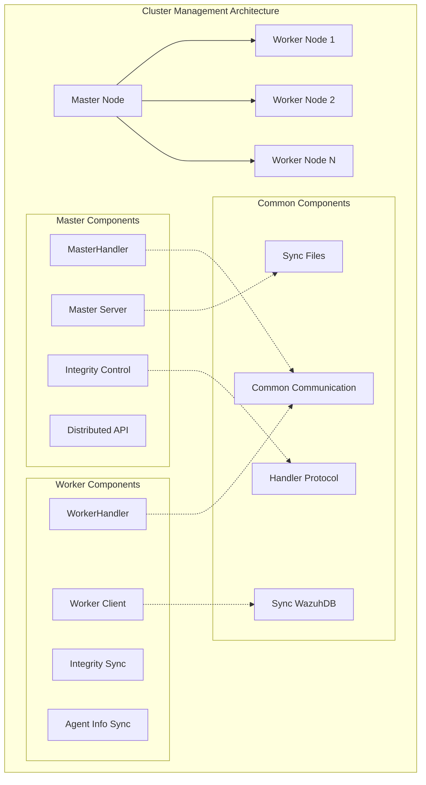
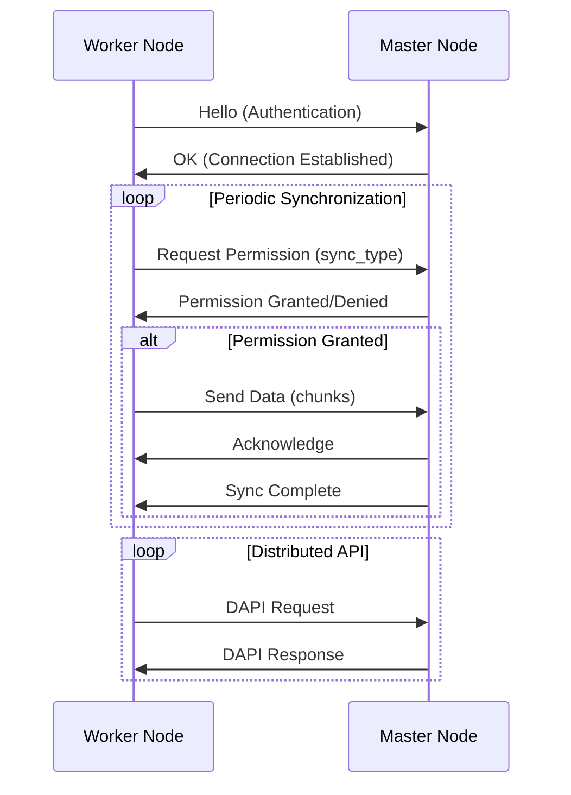

# Cluster Management

## Overview

The Cluster Management module is a critical component of the Wazuh security platform that enables distributed deployment and high availability through master-worker node architecture. This module provides comprehensive cluster orchestration, data synchronization, and distributed API capabilities to ensure seamless operation across multiple nodes.

## Purpose

The Cluster Management module serves several key purposes:

- **Distributed Architecture**: Enables horizontal scaling through master-worker node topology
- **Data Synchronization**: Maintains consistency across cluster nodes through integrity checks and data replication
- **High Availability**: Provides fault tolerance and load distribution across cluster nodes
- **Distributed API**: Facilitates API request distribution and response aggregation across the cluster
- **Real-time Communication**: Establishes secure, encrypted communication channels between cluster nodes

## Architecture Overview

The Cluster Management module follows a hierarchical master-worker architecture with specialized communication protocols and synchronization mechanisms.

## Sub-modules

The Cluster Management module is organized into three main sub-modules, each handling specific aspects of cluster operations:

### [Common Communication Framework](Common Communication Framework.md)
Provides the foundational communication infrastructure, protocol handling, and data transfer mechanisms shared across all cluster nodes.

### [Master Node Management](Master Node Management.md)
Implements master node functionality including worker coordination, integrity validation, distributed API orchestration, and cluster-wide synchronization control.

### [Worker Node Management](Worker Node Management.md)
Handles worker node operations including master connection management, data synchronization, integrity checking, and local agent information management.

## Core Functionality

### Cluster Communication Protocol

The module implements a sophisticated binary protocol for inter-node communication:

### Data Synchronization Types

The cluster supports multiple synchronization mechanisms:

1. **Integrity Synchronization**: File-level consistency checks and updates
2. **Agent Information Sync**: Real-time agent status and metadata synchronization
3. **Agent Groups Sync**: Group membership and configuration synchronization
4. **Database Synchronization**: Wazuh database state consistency

### Security Features

- **Encrypted Communication**: All inter-node communication uses Fernet encryption
- **Authentication**: Node identity verification during connection establishment
- **Authorization**: Permission-based synchronization control
- **Integrity Validation**: Cryptographic checksums for data integrity

## Integration Points

The Cluster Management module integrates with several other system components:

- **[Database Connectivity](Database Connectivity.md)**: For persistent data storage and retrieval
- **[Communication Layer](Communication Layer.md)**: For low-level network communication
- **[Agent Management](Agent Management.md)**: For agent status and configuration synchronization
- **[Distributed API](Distributed API.md)**: For API request distribution and load balancing

## Related Documentation

For detailed information about specific cluster components, refer to:

- **[Common Communication Framework](Common Communication Framework.md)**: Core communication protocols and message handling
- **[Master Node Management](Master Node Management.md)**: Master node coordination and synchronization control
- **[Worker Node Management](Worker Node Management.md)**: Worker node operations and master connectivity

## Configuration

Cluster behavior is controlled through the `cluster.json` configuration file, which defines:

- Node roles and network topology
- Synchronization intervals and timeouts
- Communication parameters and security settings
- File synchronization rules and permissions

## Performance Characteristics

The module is designed for high performance and scalability:

- **Asynchronous Operations**: Non-blocking I/O for concurrent request handling
- **Chunked Data Transfer**: Large data sets are split into manageable chunks
- **Compression**: Data compression for efficient network utilization
- **Process Pooling**: CPU-intensive operations are distributed across worker processes

## Error Handling and Recovery

Robust error handling ensures cluster stability:

- **Connection Recovery**: Automatic reconnection on network failures
- **Timeout Management**: Configurable timeouts prevent hanging operations
- **Graceful Degradation**: Partial functionality during node failures
- **Comprehensive Logging**: Detailed logging for troubleshooting and monitoring

## Monitoring and Health Checks

The module provides extensive monitoring capabilities:

- **Node Health Status**: Real-time health information for all cluster nodes
- **Synchronization Status**: Detailed status of ongoing sync operations
- **Performance Metrics**: Timing and throughput statistics
- **Error Tracking**: Comprehensive error reporting and alerting

This cluster management system ensures that Wazuh can scale horizontally while maintaining data consistency, security, and high availability across distributed deployments.