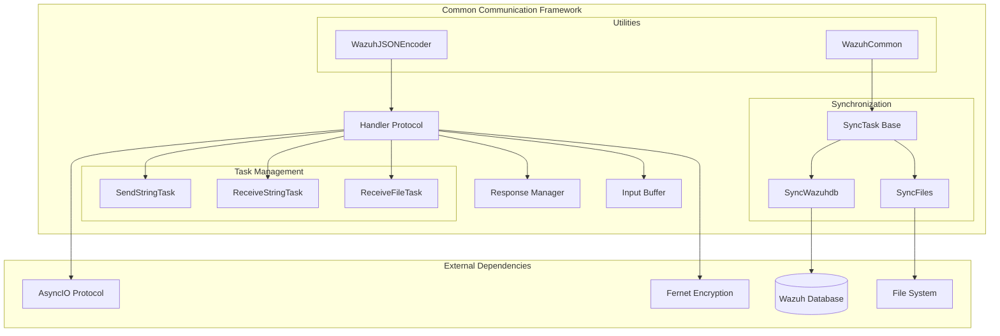
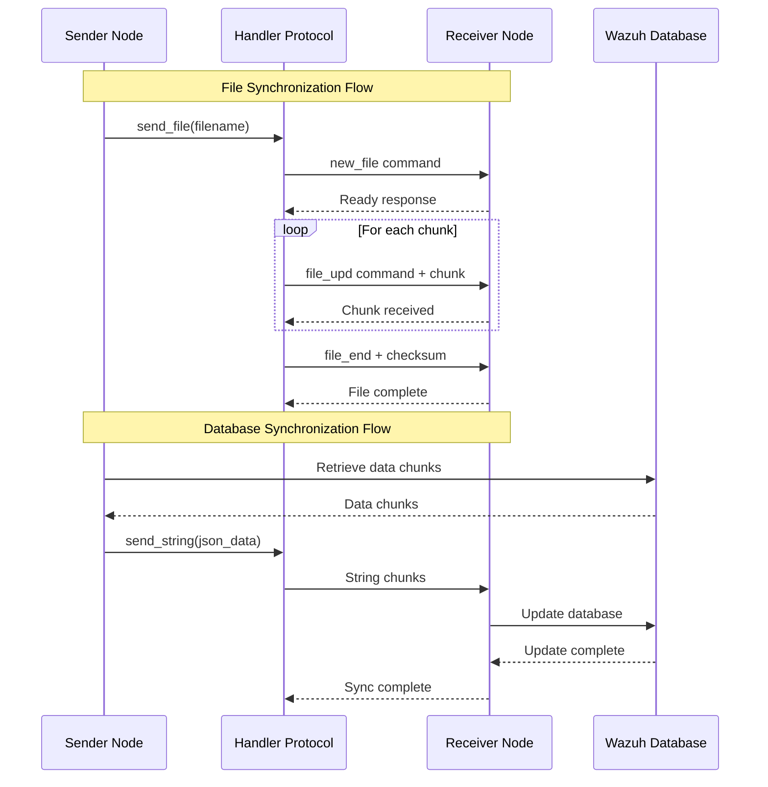
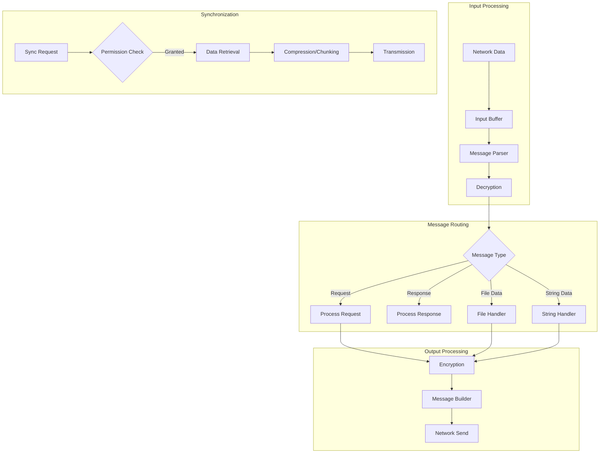

# Common Communication Framework

## Overview

The Common Communication Framework is a foundational module within the Wazuh cluster architecture that provides essential communication primitives, message handling, and synchronization capabilities for distributed cluster operations. This module serves as the backbone for inter-node communication in Wazuh's cluster environment, enabling secure, reliable, and efficient data exchange between master and worker nodes.

## Purpose and Core Functionality

The Common Communication Framework provides:

- **Asynchronous Communication Protocol**: Implements asyncio-based protocols for non-blocking communication between cluster nodes
- **Message Serialization and Encryption**: Handles secure message encoding, encryption, and transmission using Fernet encryption
- **File and String Synchronization**: Provides mechanisms for transferring large files and strings between nodes in chunks
- **Task Management**: Manages long-running synchronization tasks with proper lifecycle handling
- **Error Handling and Recovery**: Implements robust error handling with timeout management and graceful degradation
- **Database Synchronization**: Facilitates synchronization of Wazuh database information across cluster nodes

## Architecture Overview



## Core Components

### Handler Protocol (`Handler`)

The central communication protocol that manages all cluster communication:

**Key Responsibilities:**
- Implements asyncio.Protocol for network communication
- Manages message encryption/decryption using Fernet
- Handles message chunking for large payloads
- Processes incoming requests and generates responses
- Manages connection lifecycle and error handling

**Message Format:**
- Header: 20 bytes (4 bytes counter + 4 bytes size + 12 bytes command)
- Payload: Encrypted data (when encryption is enabled)
- Support for message division when exceeding chunk size limits

### Response Management (`Response`)

Manages asynchronous response handling for request-response patterns:

**Features:**
- Event-driven response notification
- Thread-safe response storage
- Timeout handling for pending requests

### Input Buffer Management (`InBuffer`)

Handles incoming message buffering and parsing:

**Capabilities:**
- Progressive message assembly from network chunks
- Header parsing and validation
- Support for divided messages
- Payload reconstruction

### Task Management System

#### SendStringTask
Manages outbound string transmission tasks:
- Asynchronous string sending with chunking
- Task lifecycle management
- Error handling and cleanup

#### ReceiveStringTask
Handles inbound string reception:
- Progressive string assembly
- Task identification and tracking
- Completion notification

#### ReceiveFileTask
Manages file reception operations:
- File descriptor management
- Checksum validation
- Atomic file operations

### Synchronization Framework

#### SyncTask (Base Class)
Provides common synchronization functionality:
- Permission-based synchronization
- Abstract sync method definition
- Error handling patterns

#### SyncFiles
Specialized file synchronization:
- Multi-file compression and transmission
- Metadata handling
- Bandwidth optimization with dynamic chunk sizing
- Progress tracking and error recovery

#### SyncWazuhdb
Database synchronization capabilities:
- Chunk-based data retrieval from local database
- Efficient data transmission to remote nodes
- Support for large dataset synchronization
- Pivot-based pagination for large queries

### Utility Components

#### WazuhCommon
Common functionality for cluster operations:
- Task management utilities
- File reception coordination
- Node information retrieval
- Agent-group hash recalculation

#### WazuhJSONEncoder
Specialized JSON encoder for Wazuh objects:
- Custom serialization for Wazuh exceptions
- DateTime handling
- Callable object encoding
- Result object serialization

## Communication Flow



## Data Flow Architecture



## Integration Points

### Master Node Management
- Integrates with [Master Node Management](Master%20Node%20Management.md) for cluster coordination
- Provides communication primitives for master-worker interactions
- Supports distributed API request routing

### Worker Node Management
- Works with [Worker Node Management](Worker%20Node%20Management.md) for worker operations
- Enables worker-to-master synchronization
- Handles worker registration and status reporting

### Database Connectivity
- Leverages [Database Connectivity](Database%20Connectivity.md) for data synchronization
- Provides efficient database update mechanisms
- Supports both HTTP and socket-based database communication

### Communication Layer
- Built upon [Communication Layer](Communication%20Layer.md) socket and queue abstractions
- Extends basic communication with cluster-specific protocols
- Adds encryption and reliability features

## Security Features

### Encryption
- **Fernet Symmetric Encryption**: All messages encrypted using cryptography.fernet
- **Key Management**: Cluster-wide shared encryption keys
- **Message Integrity**: Built-in message authentication

### Access Control
- **Permission-based Synchronization**: Nodes must request permission before sync operations
- **Task Isolation**: Each synchronization task has unique identifiers
- **Timeout Protection**: All operations have configurable timeouts

## Performance Optimizations

### Dynamic Chunk Sizing
- Adaptive chunk size based on network performance
- Automatic size reduction on memory pressure
- Bandwidth optimization for large transfers

### Compression
- File compression before transmission
- Metadata optimization
- Efficient binary encoding

### Asynchronous Operations
- Non-blocking I/O for all network operations
- Concurrent task execution
- Event-driven response handling

## Error Handling and Recovery

### Timeout Management
- Configurable timeouts for all operations
- Graceful degradation on timeout
- Automatic cleanup of expired requests

### Connection Recovery
- Automatic reconnection on connection loss
- State preservation during reconnections
- Graceful handling of partial transfers

### Data Integrity
- Checksum validation for file transfers
- Message sequence validation
- Duplicate detection and handling

## Configuration

The framework uses cluster configuration items for:

- **Communication Timeouts**: Request and file transfer timeouts
- **Chunk Sizes**: Minimum and maximum chunk sizes for transfers
- **Compression Settings**: Zip limits and tolerance values
- **Encryption**: Fernet key configuration

## Usage Patterns

### File Synchronization
```python
# Typical file sync pattern
sync_task = SyncFiles(cmd=b'sync_files', logger=logger, manager=handler)
await sync_task.sync(files=file_list, files_metadata=metadata, 
                    metadata_len=len(metadata))
```

### Database Synchronization
```python
# Database sync pattern
sync_task = SyncWazuhdb(manager=handler, logger=logger, 
                       data_retriever=db_retriever, cmd=b'sync_db')
chunks = await sync_task.retrieve_information()
await sync_task.sync(start_time=time.time(), chunks=chunks)
```

### String Transmission
```python
# Large string transmission
task_id = await handler.send_string(large_data_bytes)
# String is automatically chunked and transmitted
```

## Monitoring and Logging

The framework provides comprehensive logging for:
- Message transmission statistics
- Synchronization progress
- Error conditions and recovery
- Performance metrics
- Security events

## Dependencies

- **Python asyncio**: Asynchronous I/O framework
- **cryptography**: Fernet encryption implementation
- **Wazuh Core**: Exception handling and utilities
- **Wazuh Database**: Data persistence and retrieval
- **JSON**: Message serialization

## Thread Safety

The framework is designed for single-threaded asyncio operation but provides:
- Thread-safe response objects
- Proper task cleanup mechanisms
- Safe concurrent access to shared resources

This Common Communication Framework serves as the foundation for all cluster communication in Wazuh, providing the reliability, security, and performance required for enterprise-scale deployments.