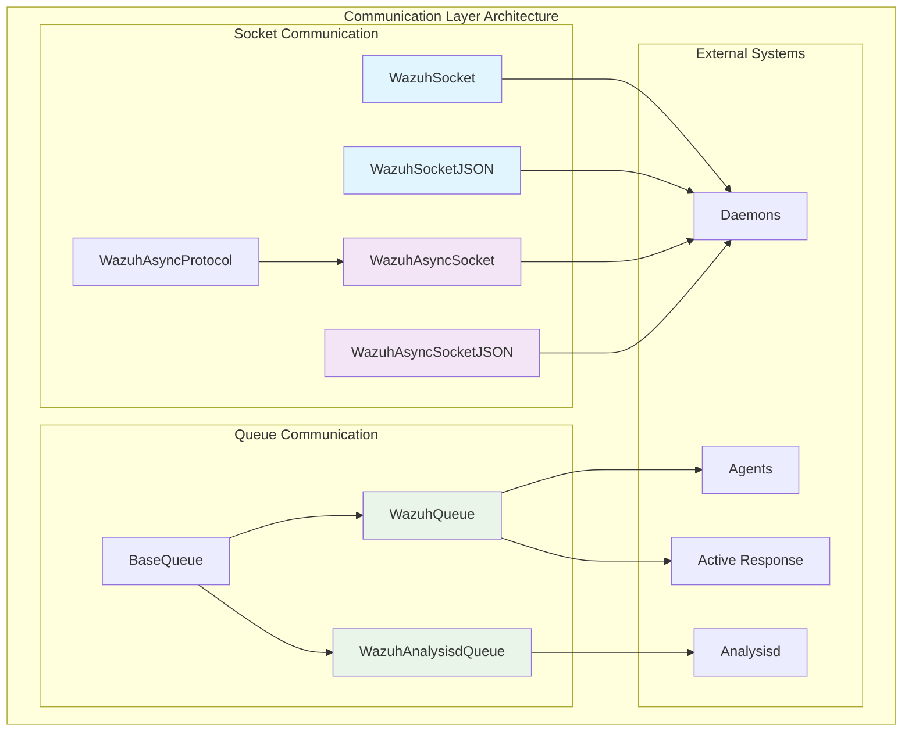
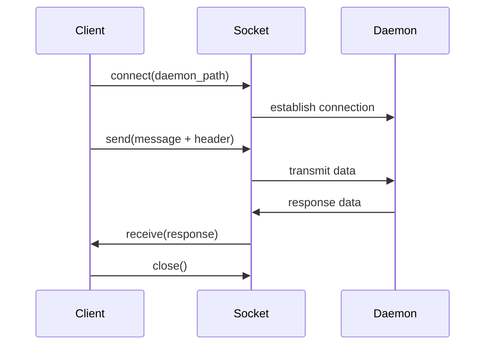
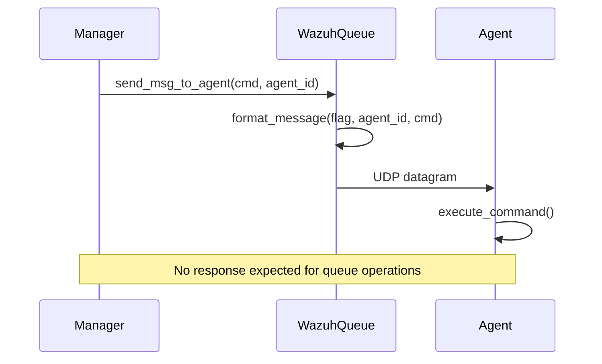
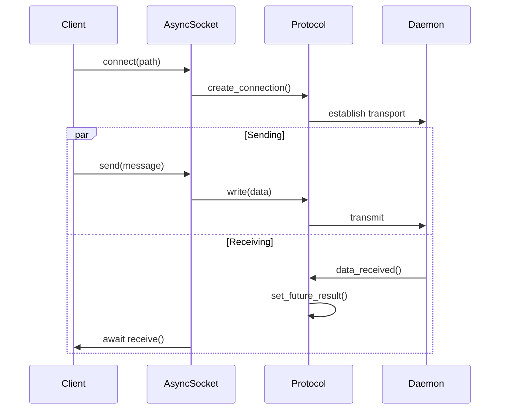

# Communication Layer

The Communication Layer module provides the foundational infrastructure for inter-process communication within the Wazuh security platform. It implements both synchronous and asynchronous socket-based communication patterns, queue-based messaging systems, and protocol handlers that enable seamless data exchange between Wazuh components, agents, and daemons.

## Architecture Overview

The Communication Layer is built around two primary communication paradigms:

1. **Socket-based Communication**: Direct TCP/UDP socket connections for real-time bidirectional communication
2. **Queue-based Messaging**: Unidirectional message queuing for command distribution and event processing



## Core Components

### Socket Communication Framework

#### WazuhSocket
The base synchronous socket handler that provides fundamental TCP socket operations with Unix domain sockets.

**Key Features:**
- Synchronous TCP socket communication
- Binary message transmission with length headers
- Context manager support for automatic resource cleanup
- Error handling with Wazuh-specific exceptions

**Usage Pattern:**
```python
with WazuhSocket('/path/to/socket') as sock:
    sock.send(message_bytes)
    response = sock.receive()
```

#### WazuhSocketJSON
Extends `WazuhSocket` to provide JSON message serialization and automatic error response handling.

**Key Features:**
- Automatic JSON serialization/deserialization
- Built-in error response parsing
- Transparent exception handling from daemon responses

#### WazuhAsyncSocket
Asynchronous socket handler built on Python's asyncio framework for high-performance concurrent operations.

**Key Features:**
- Asyncio-based asynchronous communication
- Non-blocking I/O operations
- Connection state monitoring
- Transport and protocol abstraction

#### WazuhAsyncSocketJSON
Combines asynchronous socket operations with JSON message handling for modern async/await patterns.

#### WazuhAsyncProtocol
Custom asyncio.Protocol implementation that manages the low-level socket data handling for asynchronous operations.

**Key Features:**
- Future-based data reception signaling
- Connection state tracking
- Buffer management for incoming data

### Queue Communication Framework

#### BaseQueue
Abstract base class providing common queue functionality for Unix domain socket datagram communication.

**Key Features:**
- UDP socket-based messaging
- Configurable send buffer sizing
- Context manager support
- Base error handling

#### WazuhQueue
Specialized queue for agent command distribution and management operations.

**Supported Operations:**
- Active Response command distribution
- Agent restart commands
- Syscheck restart operations
- Force reconnection commands

**Message Types:**
- `ar-message`: Active Response commands
- System commands: syscheck restart, force reconnect, agent restart

#### WazuhAnalysisdQueue
Dedicated queue for sending events and data to the Wazuh analysis daemon (analysisd).

**Key Features:**
- Large message support (up to 65KB)
- Header-based message formatting
- Direct analysisd integration

## Communication Patterns

### Daemon Communication Pattern



### Agent Command Distribution Pattern



### Asynchronous Communication Flow



## Integration Points

### Cluster Management Integration
The Communication Layer serves as the foundation for [Cluster Management](Cluster Management.md) operations:
- Master-worker node communication
- File synchronization protocols
- Integrity checking mechanisms

### Agent Management Integration
Provides communication infrastructure for [Agent Management](Agent Management.md):
- Agent command distribution
- Status monitoring
- Configuration updates

### Active Response Integration
Enables [Active Response](Active Response.md) command execution:
- Real-time response command delivery
- Multi-agent command broadcasting
- Custom script execution coordination

### Database Connectivity Integration
Works with [Database Connectivity](Database Connectivity.md) for:
- Wazuh-DB daemon communication
- Query result transmission
- Database operation coordination

## Daemon Communication Registry

The module maintains a registry of supported daemons with their communication parameters:

| Daemon | Protocol | Socket Path | Header Format | Header Size |
|--------|----------|-------------|---------------|-------------|
| authd | TCP | `/var/ossec/queue/sockets/auth` | `<I` | 4 bytes |
| task-manager | TCP | `/var/ossec/queue/sockets/task` | `<I` | 4 bytes |
| wazuh-db | TCP | `/var/ossec/queue/sockets/wdb` | `<I` | 4 bytes |
| remoted | TCP | `/var/ossec/queue/sockets/remote` | `<I` | 4 bytes |

## Message Protocol Specifications

### Socket Message Format
```
[4-byte length header][message payload]
```

### Queue Message Format
```
(msg_to_agent) [] [FLAG] [AGENT_ID] [COMMAND] [ARGUMENTS]
```

**Flags:**
- `NNS`: Normal message to specific agent
- `ANN`: Normal message to all agents
- `N!S`: Non-AR message to specific agent
- `A!N`: Non-AR message to all agents

### JSON Communication Protocol
```json
{
  "version": 1,
  "origin": {
    "module": "module_name"
  },
  "command": "command_name",
  "parameters": {
    "key": "value"
  }
}
```

## Error Handling

The Communication Layer implements comprehensive error handling:

- **WazuhInternalError(1010)**: Socket connection failure
- **WazuhInternalError(1011)**: Message transmission failure
- **WazuhInternalError(1012)**: Invalid message format or size
- **WazuhInternalError(1013)**: Socket not found or connection refused
- **WazuhError(1014)**: General communication error
- **WazuhException(1105)**: Invalid message type
- **WazuhInternalError(1121)**: Socket cannot receive connections

## Performance Considerations

### Buffer Management
- **BaseQueue**: 6400 bytes default buffer (6144 + 256)
- **WazuhAnalysisdQueue**: 65535 bytes maximum message size
- **WazuhSocket**: 65536 bytes maximum message size
- Automatic buffer size adjustment for optimal performance

### Asynchronous Operations
- Non-blocking I/O for high concurrency
- Future-based result handling
- Connection pooling capabilities
- Automatic connection state monitoring

## Security Features

### Socket Security
- Unix domain sockets for local communication only
- Path-based access control
- Connection validation and error handling
- Secure message formatting to prevent injection

### Message Validation
- Type checking for all message parameters
- Size limits to prevent buffer overflow
- Format validation for queue messages
- JSON schema validation for structured messages

## Usage Examples

### Synchronous Daemon Communication
```python
# Send command to wazuh-db daemon
with WazuhSocketJSON('/var/ossec/queue/sockets/wdb') as sock:
    response = sock.send({'command': 'agent', 'parameters': {'id': '001'}})
    data = sock.receive()
```

### Asynchronous Daemon Communication
```python
# Async communication with task manager
async def communicate_with_daemon():
    sock = WazuhAsyncSocketJSON()
    await sock.connect('/var/ossec/queue/sockets/task')
    await sock.send({'command': 'status'})
    response = await sock.receive()
    await sock.close()
    return response
```

### Agent Command Distribution
```python
# Send restart command to specific agent
with WazuhQueue('/var/ossec/queue/alerts/ar') as queue:
    result = queue.send_msg_to_agent(
        msg='restart-ossec0',
        agent_id='001',
        msg_type=''
    )
```

### Event Injection to Analysisd
```python
# Send custom event to analysis daemon
with WazuhAnalysisdQueue('/var/ossec/queue/sockets/queue') as queue:
    queue.send_msg(
        msg_header='1:wazuh-api:',
        msg='{"timestamp":"2023-01-01T00:00:00","event":"custom"}'
    )
```

The Communication Layer serves as the critical foundation that enables all inter-component communication within the Wazuh ecosystem, providing both the reliability needed for production environments and the performance required for high-throughput security operations.