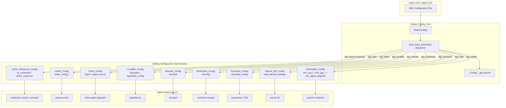
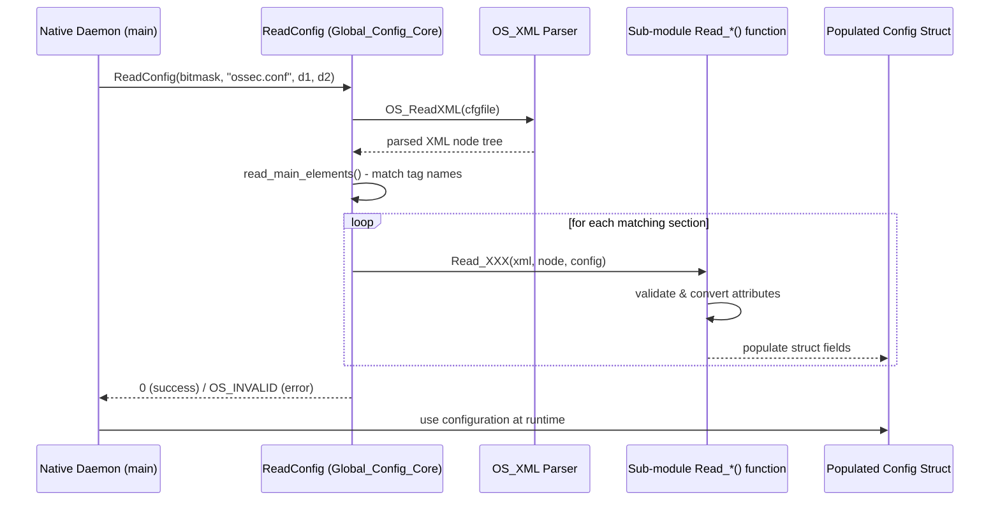
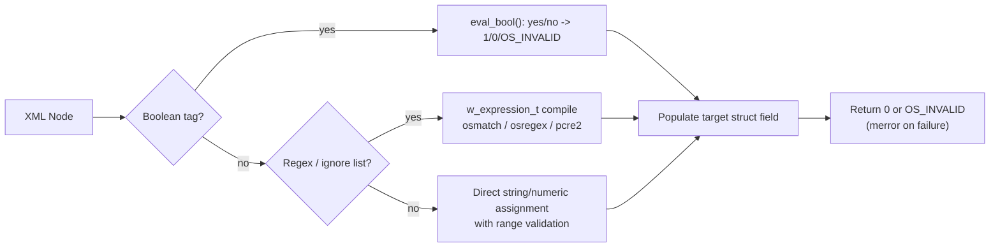

# Configuration_Data_Structures_(C_Headers)

## 1. Purpose and Overview

The **Configuration_Data_Structures_(C_Headers)** module is the foundational configuration layer for all native (C-language) Wazuh daemons — both on the **manager** and the **agent**. Located under `src/config`, it provides the canonical, in-memory data structures and XML-parsing routines that translate `ossec.conf` (and `agent.conf`) declarations into strongly-typed C structs consumed at runtime by daemons such as `syscheckd`, `remoted`, `logcollector`, `wazuh-authd`, `wazuh-db`, and the various `wodles` (Wazuh modules).

Each sub-module in this package owns the configuration schema for **one specific subsystem**:

| Sub-module | XML Section | Consuming Daemon |
|---|---|---|
| Active_Response_Config | `<active-response>` | analysisd / remoted / execd |
| Authd_Config | `<auth>` | wazuh-authd |
| Client_Config | `<client>` | client-agent (agentd) |
| Global_Config_Core | `<global>` (+ dispatcher) | all manager daemons |
| Localfile_Config | `<localfile>` | logcollector |
| Remote_Config | `<remote>` | remoted |
| Rootcheck_Config | `<rootcheck>` | rootcheck engine |
| Syscheck_Config | `<syscheck>` | syscheckd / FIM |
| Wazuh_DB_Config | `<wdb>` (backup) | wazuh-db |
| Wmodules_Config | `<wodle>` (SCA, GCP, osquery, agent-upgrade, etc.) | wazuh-modulesd |

This module is **purely declarative and parsing-oriented**: it does not implement scanning, networking, or event processing logic itself. Instead, it defines the shared "vocabulary" (structs) and the "grammar" (XML readers) that every downstream native daemon relies upon, making it the backbone that connects `ossec.conf` to actual runtime behavior across the entire Wazuh C codebase.

## 2. Architecture

The module follows a consistent design pattern across all sub-modules: a generic XML dispatcher (`Global_Config_Core`) walks the parsed configuration tree and, based on a bitmask of requested sections, delegates each top-level XML tag to a dedicated `Read_*()` function defined in the corresponding sub-module. Each reader populates a struct that is later consumed directly by its owning daemon.

### Data Flow: Configuration Parsing Sequence

### Shared Design Conventions

Across nearly every sub-module (Authd_Config, Rootcheck_Config, Wazuh_DB_Config, Wmodules_Config), a lightweight `eval_bool()` helper is independently reimplemented to map `"yes"/"no"` XML values to `1/0`, reflecting a shared, low-overhead convention rather than a shared library dependency. Similarly, ignore/restrict/nodiff lists across `Syscheck_Config` and `Localfile_Config` reuse the common `w_expression_t` abstraction (from the `headers` shared library) to support `osmatch`, `osregex`, and `pcre2` interchangeably.

## 3. Core Component Documentation

| Sub-module | Description | Documentation |
|---|---|---|
| **Active_Response_Config** | Defines `ar_command` and `active_response` structs modeling `<active-response>` blocks: command bindings, rule/level triggers, agent targeting, and timeout behavior. Bridges rule-based (analysisd) and API-based (Python `active_response_module`) triggering paths. | [Active_Response_Config.md](Active_Response_Config.md) |
| **Authd_Config** | Configuration model (`authd_config_t`, `authd_flags_t`, `authd_force_options_t`, `authd_key_request_t`) and parser for `wazuh-authd`'s `<auth>`/`<key-request>` blocks, controlling TLS enrollment, agent-replacement policy, and external key-request scripts. | [Authd_Config.md](Authd_Config.md) |
| **Client_Config** | Agent-side configuration (`agent`, `agent_server`, `agent_flags_t`, `anti_tampering`) defining manager connectivity, failover, buffering, crypto method, labels, and enrollment context for `client-agent` (agentd). | [Client_Config.md](Client_Config.md) |
| **Global_Config_Core** | The central `ReadConfig()`/dispatcher plus the top-level `_Config`/`_eps` structs holding manager-wide settings (EPS limiting, agent disconnection timers, allow-lists, cluster identity, labels). Routes XML sections to sibling readers. | [Global_Config_Core.md](Global_Config_Core.md) |
| **Localfile_Config** | Parses `<localfile>` blocks for `logcollector`: core `logreader`/`logreader_config`/`logreader_glob` structures plus specialized formats — multiline regex, macOS Unified Logging, and systemd journald (with multi-block merging). | [Localfile_Config.md](Localfile_Config.md) |
| **Remote_Config** | Manager-side `remoted` struct modeling one or more `<remote>` listeners (protocol, port, connection type, IP allow/deny lists, cluster worker awareness), the counterpart to `Client_Config` on the agent side. | [Remote_Config.md](Remote_Config.md) |
| **Rootcheck_Config** | `rkconfig` and nested `_checks` structures for the Rootcheck policy-monitoring engine, controlling scan scope, scheduling, and ignore lists via `Read_Rootcheck()`. | [Rootcheck_Config.md](Rootcheck_Config.md) |
| **Syscheck_Config** | The largest sub-module: `syscheck_config`, `directory_t`, `registry_t`, whodata/realtime structures, and FIM database row models (`fim_entry`, `fim_file_data`) driving the File Integrity Monitoring daemon. | [Syscheck_Config.md](Syscheck_Config.md) |
| **Wazuh_DB_Config** | Small, focused parser (`Read_WazuhDB`) for the `<wdb><backup>` block, populating `wdb_backup_settings_node` to control automatic `global.db` backup scheduling and retention. | [Wazuh_DB_Config.md](Wazuh_DB_Config.md) |
| **Wmodules_Config** | Collection of XML readers for optional `wazuh-modulesd` modules: agent-upgrade, GCP (Pub/Sub & Bucket), osquery monitor, and SCA (Security Configuration Assessment), each populating its own `wmodule`-compatible config struct. | [Wmodules_Config.md](Wmodules_Config.md) |

## 4. Relationship to the Broader System

This module sits at the boundary between raw configuration files and native daemon behavior, and interacts with several other module families:

- **Agent_&_Manager_Native_Daemons_(C)**: The primary consumers — `remoted`, `client-agent`, `logcollector`, `rootcheck`, `os_auth`, `os_execd` all read structs defined here to drive their runtime logic.
- **Syscheck_/_FIM_Daemon_(C/C++)**: Directly consumes `syscheck_config` and shares FIM data-model types (`fim_entry`, `fim_file_data`) declared in `Syscheck_Config`.
- **Wazuh_Modules_Daemon_(C)**: Consumes the structs produced by `Wmodules_Config` (and dispatches via `Global_Config_Core`) to configure AWS, Azure, GCP, SCA, CIS-CAT, agent-upgrade, and task-manager wodules.
- **cluster_module**: `Remote_Config`'s `worker_node`/`nocmerged` fields are set via cluster-role detection (`w_is_worker()`), tying shared-configuration distribution behavior to cluster topology.
- **API_&_Management_Framework_(Python)**: Higher-level modules such as `manager_module` and `security_rbac_module` expose read/update access to the rendered configuration (via socket queries or file parsing) without linking directly against these C headers.
- **Unit_Tests_-_Configuration**: Dedicated test suites validate parsing correctness (e.g., IPv6 link-local interface validation in `Client_Config`, indexer configuration parsing) against this module's public API.