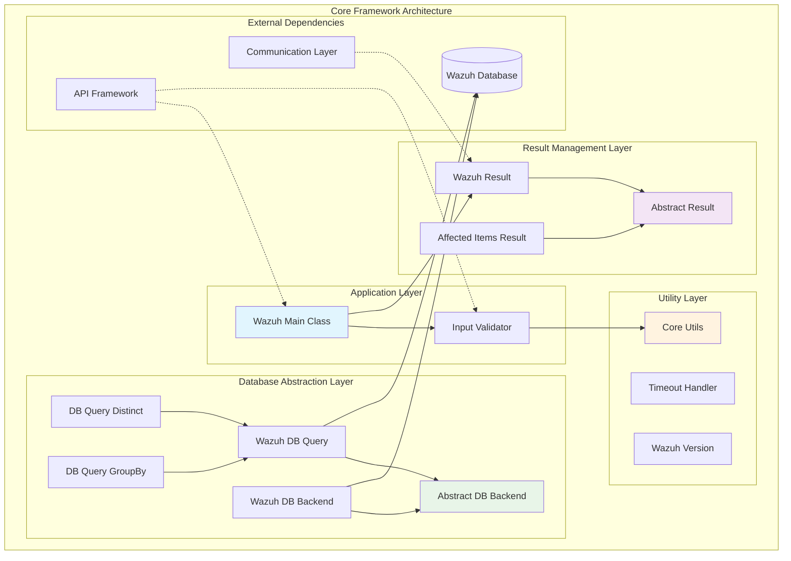
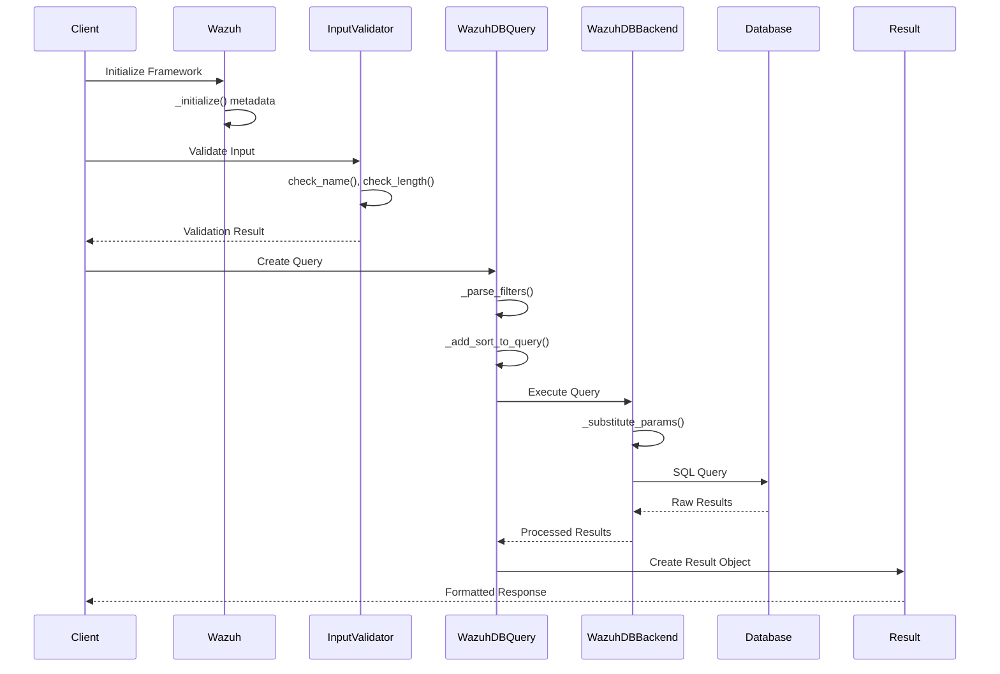
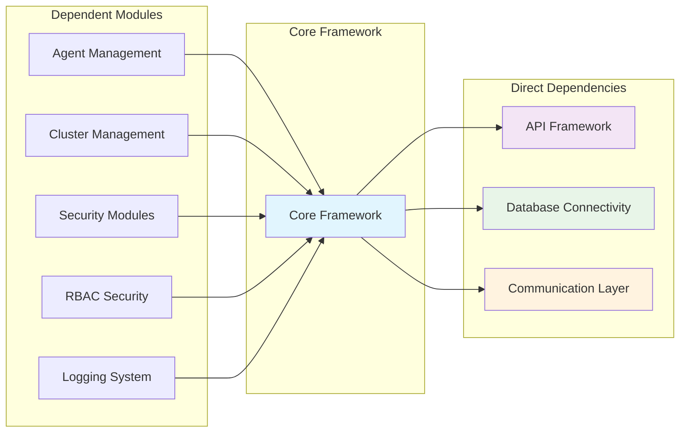
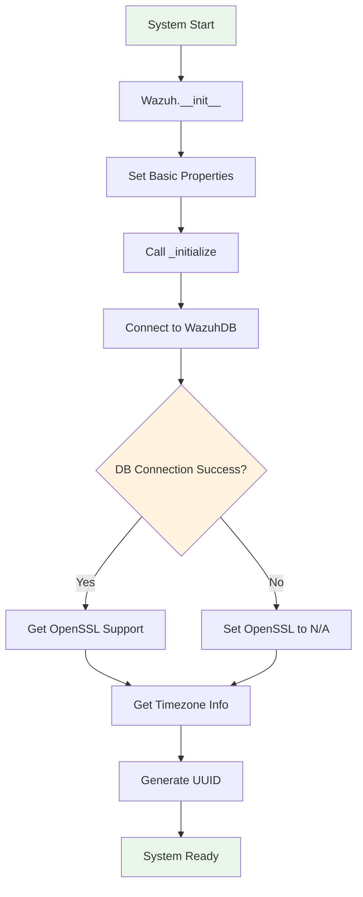

# Core Framework

## Overview

The Core Framework module serves as the foundational layer of the Wazuh security platform, providing essential infrastructure components, utilities, and abstractions that enable the entire system's functionality. This module acts as the central nervous system, offering core services including input validation, result handling, database abstraction, utility functions, and version management that are utilized across all other Wazuh modules.

## Architecture

The Core Framework is organized into several key architectural layers that provide different levels of abstraction and functionality:



## Core Components

### 1. Wazuh Main Class (`framework.wazuh.__init__.Wazuh`)

The primary entry point and configuration manager for the Wazuh framework.

**Key Responsibilities:**
- System initialization and metadata collection
- Installation path and version management
- OpenSSL support detection
- Timezone configuration
- UUID generation and management

**Key Methods:**
- `__init__()`: Initialize basic information and directories
- `to_dict()`: Convert instance to dictionary representation
- `_initialize()`: Calculate all Wazuh installation metadata

### 2. Input Validation (`framework.wazuh.core.InputValidator.InputValidator`)

Provides comprehensive input validation capabilities across the framework.

**Key Responsibilities:**
- Name validation using regex patterns
- Length validation with configurable limits
- Group name validation with special handling
- Security-focused input sanitization

**Key Methods:**
- `check_name(name, regex_str)`: Validate names against regex patterns
- `check_length(name, length, func)`: Compare string lengths
- `group(group_name)`: Validate group names with special rules

### 3. Result Management System

#### Abstract Result Base (`framework.wazuh.core.results.AbstractWazuhResult`)

Base class for all framework results with advanced merging capabilities.

**Key Features:**
- Dictionary-like interface with MutableMapping
- Advanced result merging with `|` operator
- Deep copy support
- JSON encoding/decoding capabilities

#### Wazuh Result (`framework.wazuh.core.results.WazuhResult`)

Standard result container for framework operations.

**Key Features:**
- String priority handling for conflict resolution
- Flexible data structure support
- Error code management

#### Affected Items Result (`framework.wazuh.core.results.AffectedItemsWazuhResult`)

Specialized result container for operations affecting multiple items.

**Key Features:**
- Separate tracking of successful and failed items
- Detailed error reporting with item-specific failures
- Sorting and filtering capabilities
- Message generation based on operation outcomes

### 4. Database Abstraction Layer

#### Abstract Database Backend (`framework.wazuh.core.utils.AbstractDatabaseBackend`)

Base abstraction for database operations.

#### Wazuh Database Backend (`framework.wazuh.core.utils.WazuhDBBackend`)

Concrete implementation for Wazuh database connectivity.

**Key Features:**
- Agent-specific database connections
- Query format handling (agent, mitre, task, global)
- Parameter substitution and query rendering
- Connection management and cleanup

#### Database Query System

**WazuhDBQuery (`framework.wazuh.core.utils.WazuhDBQuery`)**
- Comprehensive SQL query builder
- Advanced filtering, sorting, and pagination
- Search functionality with field-specific targeting
- RBAC integration support

**WazuhDBQueryDistinct (`framework.wazuh.core.utils.WazuhDBQueryDistinct`)**
- Specialized for unique value retrieval
- Optimized distinct queries

**WazuhDBQueryGroupBy (`framework.wazuh.core.utils.WazuhDBQueryGroupBy`)**
- Group-based aggregation queries
- Count functionality with grouping

### 5. Utility Functions (`framework.wazuh.core.utils`)

Comprehensive utility library providing:

**Data Processing:**
- Array processing with filtering, sorting, pagination
- Search functionality across complex data structures
- Field selection and projection
- Query-based filtering with SQL-like syntax

**File Operations:**
- Safe file operations with atomic moves
- Permission and ownership management
- XML validation and processing
- Backup and recovery operations

**Security Features:**
- Remote command validation
- Configuration limit enforcement
- Input sanitization and validation

**Version Management (`framework.wazuh.core.utils.WazuhVersion`)**
- Semantic version parsing and comparison
- Development version handling (alpha, beta, rc)
- Version compatibility checking

**Timeout Management (`framework.wazuh.core.utils.Timeout`)**
- Context manager for operation timeouts
- Signal-based timeout implementation
- Configurable timeout handling

## Data Flow



## Integration Points

The Core Framework integrates with multiple system modules:



### Key Integration Relationships

1. **[API Framework](API Framework.md)**: Provides input validation and result formatting
2. **[Database Connectivity](Database Connectivity.md)**: Utilizes database abstraction layer
3. **[Agent Management](Agent Management.md)**: Uses query system and result handling
4. **[Cluster Management](Cluster Management.md)**: Leverages utility functions and validation
5. **[Security Modules](Security Modules.md)**: Employs database queries and result processing
6. **[RBAC Security](RBAC Security.md)**: Integrates with query filtering and validation

## Configuration and Initialization

### System Initialization Process



### Key Configuration Parameters

- **Installation Path**: `common.WAZUH_PATH`
- **Database Limits**: `common.DATABASE_LIMIT`, `common.MAXIMUM_DATABASE_LIMIT`
- **Query Limits**: `common.MAX_QUERY_FILTERS_RESERVED_SIZE`
- **Temporary Paths**: `common.OSSEC_TMP_PATH`

## Error Handling

The Core Framework implements comprehensive error handling:

### Exception Hierarchy
- **WazuhError**: User-facing errors with remediation
- **WazuhInternalError**: Internal system errors
- **TimeoutError**: Operation timeout handling

### Common Error Codes
- **1000**: Invalid object type for operations
- **1400-1412**: Input validation and parameter errors
- **1403**: Invalid sort fields
- **1405-1406**: Database limit violations
- **1407-1409**: Query parsing and validation errors

## Performance Considerations

### Optimization Features

1. **Query Optimization**
   - Prepared statement parameter substitution
   - Efficient pagination with LIMIT/OFFSET
   - Index-aware sorting strategies

2. **Caching System**
   - TTL-based temporary caching (`t_cache`)
   - Configurable cache decorators
   - Memory-efficient cache management

3. **Resource Management**
   - Connection pooling for database operations
   - Automatic connection cleanup
   - Memory-efficient result processing

### Scalability Features

1. **Oversized Query Handling**
   - Automatic query size detection
   - Chunked processing for large result sets
   - RBAC-aware result filtering

2. **Batch Processing**
   - Efficient array processing utilities
   - Streaming result handling
   - Memory-conscious data structures

## Security Features

### Input Validation
- Regex-based name validation
- SQL injection prevention
- Path traversal protection
- Special character sanitization

### Access Control Integration
- RBAC query filtering
- Resource-based access control
- Secure parameter handling

### Configuration Security
- Remote command validation
- Configuration limit enforcement
- XML security validation
- Formula injection prevention

## Best Practices

### Development Guidelines

1. **Result Handling**
   ```python
   # Use appropriate result types
   result = AffectedItemsWazuhResult()
   result.affected_items = processed_items
   result.add_failed_item(id_='item1', error=WazuhError(1001))
   ```

2. **Database Queries**
   ```python
   # Use parameterized queries
   with WazuhDBQuery(offset=0, limit=100, table='agents', 
                     sort={'fields': ['name'], 'order': 'asc'}) as query:
       result = query.run()
   ```

3. **Input Validation**
   ```python
   # Always validate inputs
   validator = InputValidator()
   if not validator.check_name(name) or not validator.check_length(name):
       raise WazuhError(1400)
   ```

### Performance Optimization

1. **Use appropriate query types** for specific use cases
2. **Implement proper pagination** for large datasets
3. **Leverage caching** for frequently accessed data
4. **Monitor query complexity** and optimize as needed

## Monitoring and Debugging

### Logging Integration
- Structured logging through [Logging System](Logging System.md)
- Query performance monitoring
- Error tracking and reporting

### Debug Features
- Query execution tracing
- Result object inspection
- Performance metrics collection

The Core Framework provides the essential foundation that enables all other Wazuh modules to function effectively, offering robust, secure, and scalable infrastructure services that maintain consistency and reliability across the entire platform.