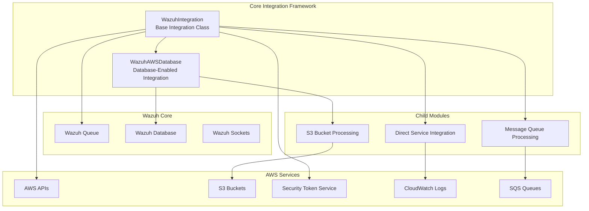
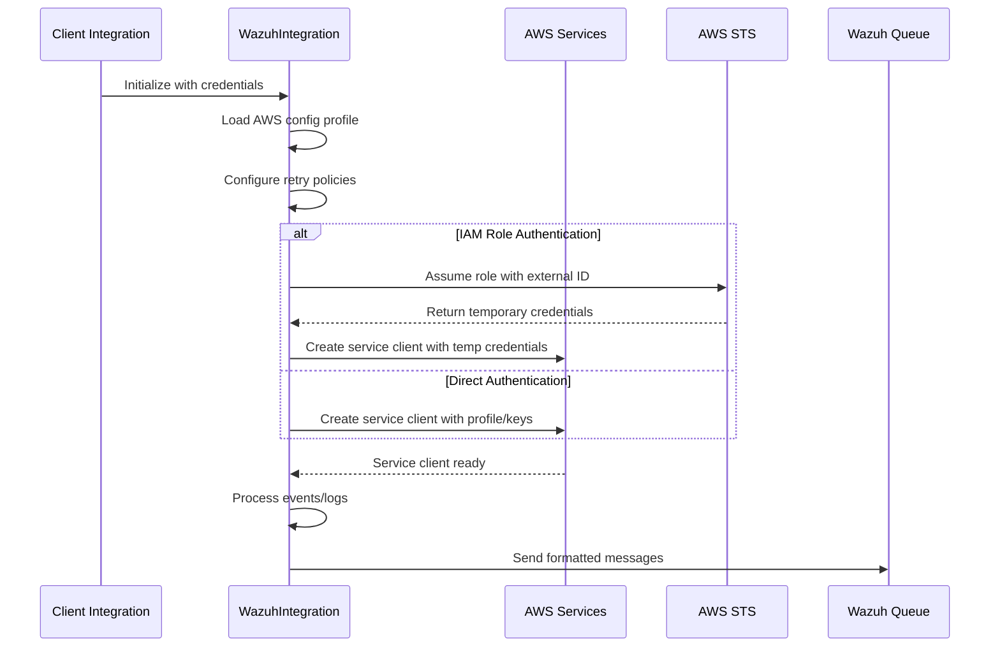
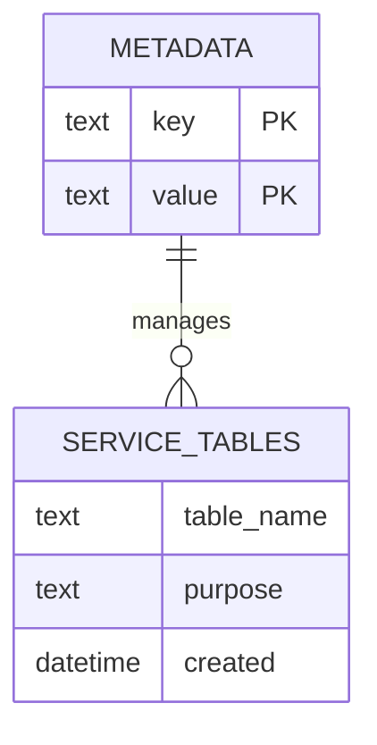
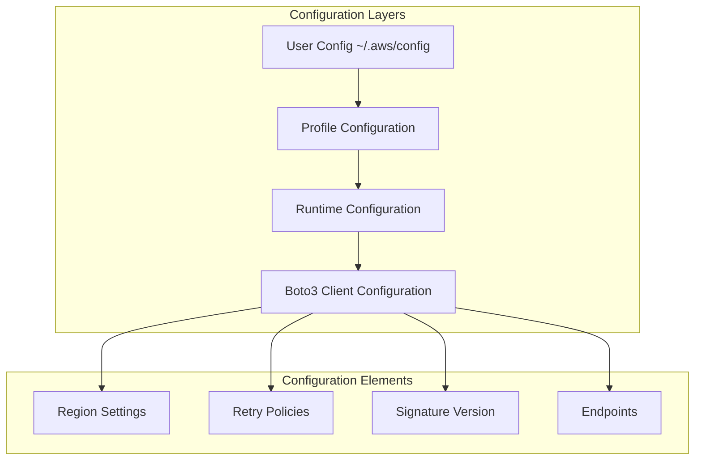
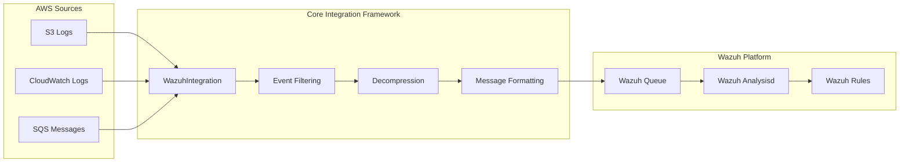
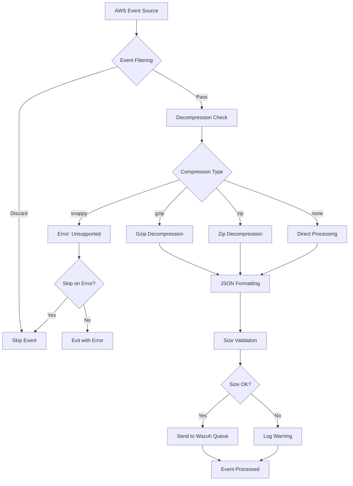
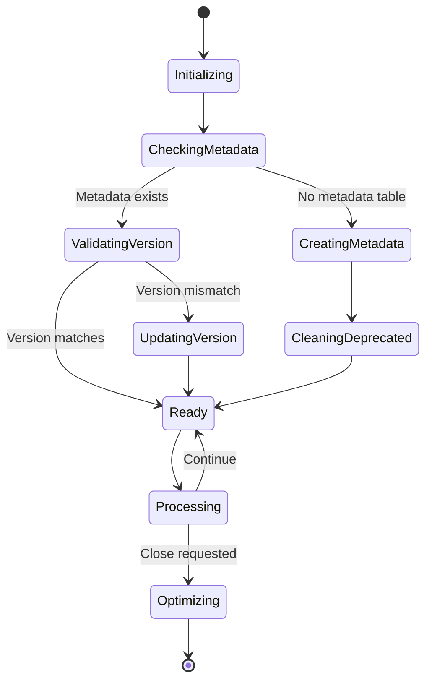

# Core Integration Framework

The Core Integration Framework serves as the foundational layer for AWS cloud service integrations within the Wazuh security platform. This module provides essential base classes and infrastructure for establishing secure connections, managing authentication, handling data persistence, and facilitating communication between AWS services and the Wazuh ecosystem.

## Architecture Overview

The Core Integration Framework consists of two primary components that work together to provide a robust foundation for AWS integrations:

## Core Components

### WazuhIntegration

The `WazuhIntegration` class serves as the base class for all AWS service integrations, providing:

#### Key Responsibilities
- **AWS Authentication Management**: Handles multiple authentication methods including IAM roles, profiles, and access keys
- **Client Configuration**: Manages boto3 client configuration with retry policies and regional settings
- **Message Processing**: Provides event filtering and message forwarding to Wazuh queues
- **File Decompression**: Supports multiple compression formats (gzip, zip) for log file processing
- **Error Handling**: Implements configurable error handling with skip-on-error functionality

#### Authentication Flow

### WazuhAWSDatabase

The `WazuhAWSDatabase` class extends `WazuhIntegration` to add persistent storage capabilities:

#### Key Responsibilities
- **SQLite Database Management**: Creates and manages local SQLite databases for state persistence
- **Metadata Versioning**: Tracks Wazuh version compatibility and handles database migrations
- **Table Lifecycle Management**: Handles table creation, optimization, and deprecated table cleanup
- **Transaction Management**: Ensures data consistency through proper transaction handling

#### Database Schema Management

## Integration Patterns

### Configuration Management

The framework implements a sophisticated configuration hierarchy:

### Message Flow Architecture

## Data Flow Patterns

### Event Processing Pipeline

### Database State Management

## Integration with Other Modules

### S3 Bucket Processing Integration
The Core Integration Framework provides the foundation for the [S3 Bucket Processing](S3%20Bucket%20Processing.md) module, which extends `WazuhAWSDatabase` to implement specific S3 bucket monitoring and log processing capabilities.

### Direct Service Integration
The [Direct Service Integration](Direct%20Service%20Integration.md) module leverages `WazuhIntegration` as its base class to provide direct connections to AWS services like CloudWatch Logs and Inspector.

### Message Queue Processing
The [Message Queue Processing](Message%20Queue%20Processing.md) module utilizes the authentication and message handling capabilities of `WazuhIntegration` to process SQS messages.

### Communication Layer Integration
The framework integrates with the [Communication Layer](Communication%20Layer.md) through the Wazuh queue system, ensuring reliable message delivery to the Wazuh analysis engine.

### Database Connectivity
While the Core Integration Framework manages its own SQLite databases, it coordinates with the [Database Connectivity](Database%20Connectivity.md) module for integration with the broader Wazuh database ecosystem.

## Security Considerations

### Authentication Security
- **IAM Role Assumption**: Supports secure role-based authentication with external ID validation
- **Credential Management**: Implements secure credential handling with deprecation warnings for legacy methods
- **Session Management**: Manages temporary credentials with configurable duration limits

### Data Protection
- **Event Filtering**: Provides regex-based filtering to prevent sensitive data ingestion
- **Size Validation**: Implements message size limits to prevent buffer overflow attacks
- **Error Isolation**: Configurable error handling prevents cascading failures

### Network Security
- **Endpoint Configuration**: Supports custom endpoints for VPC and private network configurations
- **Retry Policies**: Implements exponential backoff to prevent service abuse
- **Regional Compliance**: Supports government cloud regions with appropriate configurations

## Performance Optimization

### Connection Management
- **Connection Pooling**: Leverages boto3's built-in connection pooling
- **Retry Configuration**: Implements intelligent retry policies to handle transient failures
- **Regional Optimization**: Automatically configures regional endpoints for optimal performance

### Database Optimization
- **SQLite Optimization**: Implements PRAGMA optimize for database performance
- **Transaction Batching**: Groups database operations for improved throughput
- **Metadata Caching**: Caches version information to reduce database queries

### Memory Management
- **Streaming Processing**: Uses streaming I/O for large file processing
- **Compression Handling**: Efficient decompression with minimal memory footprint
- **Resource Cleanup**: Proper resource disposal to prevent memory leaks

## Error Handling and Recovery

### Error Categories
1. **Authentication Errors**: Invalid credentials or insufficient permissions
2. **Network Errors**: Connection timeouts or service unavailability
3. **Data Errors**: Malformed logs or unsupported compression formats
4. **Database Errors**: SQLite corruption or disk space issues

### Recovery Strategies
- **Graceful Degradation**: Continue processing when skip_on_error is enabled
- **Automatic Retry**: Configurable retry policies for transient failures
- **State Recovery**: Database-backed state management for resumable operations
- **Error Reporting**: Comprehensive error logging with debug levels

## Configuration Reference

### Authentication Parameters
- `access_key`: AWS access key ID (deprecated)
- `secret_key`: AWS secret access key (deprecated)
- `profile`: AWS profile name for credential management
- `iam_role_arn`: IAM role ARN for role assumption
- `external_id`: External ID for enhanced security
- `iam_role_duration`: Session duration for assumed roles

### Service Configuration
- `service_name`: Target AWS service identifier
- `region`: AWS region for service operations
- `sts_endpoint`: Custom STS endpoint URL
- `service_endpoint`: Custom service endpoint URL

### Processing Options
- `discard_field`: JSON field path for event filtering
- `discard_regex`: Regular expression for field-based filtering
- `skip_on_error`: Continue processing on non-fatal errors

### Database Configuration
- `db_name`: SQLite database filename
- Automatic path resolution to Wazuh wodles directory
- Version-based metadata management

## Monitoring and Debugging

### Debug Levels
1. **Level 1**: Basic operation status and warnings
2. **Level 2**: Configuration details and connection information
3. **Level 3**: Full event content and detailed processing information

### Key Metrics
- **Authentication Success Rate**: Monitor credential validation
- **Message Processing Rate**: Track event throughput
- **Database Performance**: Monitor query execution times
- **Error Rates**: Track different error categories

### Troubleshooting
- **Connection Issues**: Verify AWS credentials and network connectivity
- **Database Problems**: Check disk space and file permissions
- **Performance Issues**: Review retry configuration and regional settings
- **Message Delivery**: Verify Wazuh queue connectivity and permissions

This Core Integration Framework provides the essential foundation for all AWS integrations within Wazuh, ensuring secure, reliable, and scalable cloud service connectivity while maintaining consistency across all AWS-based modules.